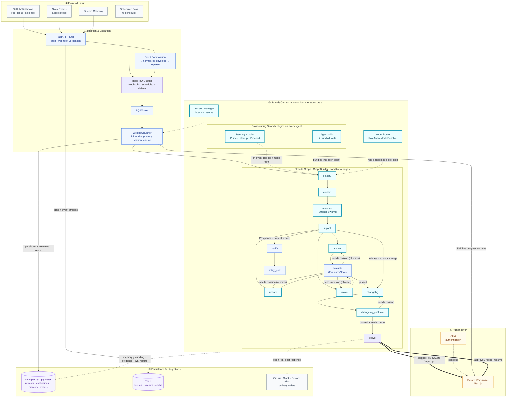

# Draftly Architecture Diagram

## Legend

| Color      | Meaning                                                      | Examples                                                |
| ---------- | ------------------------------------------------------------ | ------------------------------------------------------- |
| **Teal**   | Strands Agents SDK constructs (Technological Implementation) | Graph, Agent nodes, Steering, Skills, Model Router      |
| **Blue**   | Draftly-owned application code                               | FastAPI, WorkflowRunner, EvaluatorNode, tool registries |
| **Purple** | State / persistence                                          | PostgreSQL · pgvector, Redis                            |
| **Gray**   | External systems & webhooks                                  | GitHub, Slack, Discord                                  |
| **Amber**  | Human-in-the-loop surface                                    | Review Workspace, Clerk auth                            |

## How to read the architecture

1. **Events start the work.** GitHub webhooks, Slack events, Discord messages, and scheduled jobs provide the triggers that Draftly handles in the background.
2. **Ingestion makes execution durable.** FastAPI verifies and normalizes incoming events before Redis-backed RQ queues hand them to a worker and `WorkflowRunner`.
3. **Strands performs the reasoning.** A conditional agent graph classifies the request, gathers context, delegates research to a Swarm, assesses documentation impact, and chooses whether to answer, update, or create content.
4. **Evaluation governs quality.** Drafts must pass groundedness and completeness evaluation. Failed work loops back to the responsible writer; successful work advances toward delivery.
5. **A human controls publication.** `ReviewGate` interrupts the graph before delivery. Approval or rejection in the review workspace resumes the persisted run with the human decision intact.

The solid arrows show execution flow, dotted arrows show cross-cutting services or external actions, and the thick arrows mark the human interrupt-and-resume boundary.
