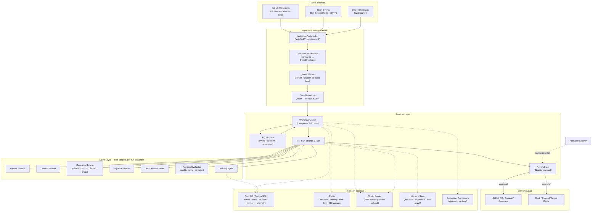
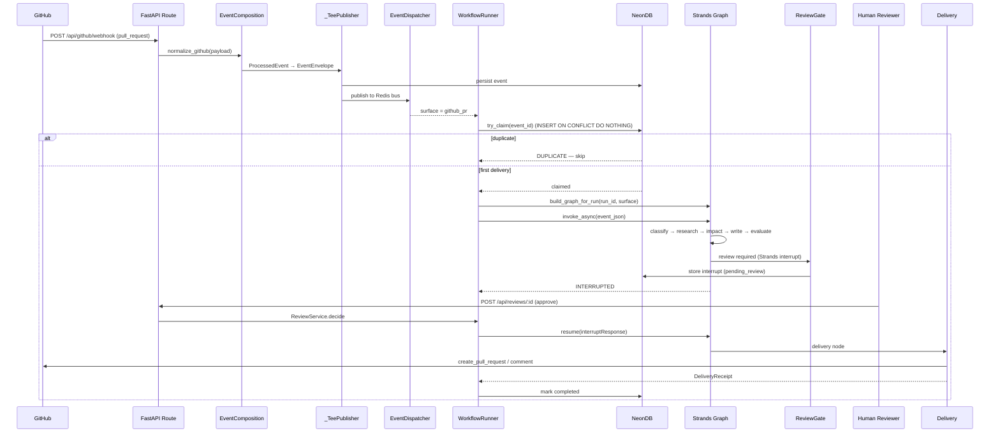

# Draftly — Architecture

> **Submission artifact:** Agents for Humans Hackathon — Professional Agents track
> **What Draftly is:** an autonomous documentation-engineering agent for SDK maintainers and developer teams.
> It watches GitHub pull requests, releases, and issues plus Slack/Discord developer questions, researches the
> project's source of truth, detects documentation gaps and drift, prepares grounded documentation updates,
> evaluates them, holds them for human approval where required, and delivers them as pull requests and replies.
> It runs in the background and only surfaces to a person when a real decision is required.

---

## 1. High-Level System Architecture

Draftly is an event-driven, multi-agent system built on the **Strands Agents SDK**. Events from GitHub,
Slack, and Discord are normalized, routed to a per-run Strands graph, executed by role-scoped agents, gated
by a human review interrupt, and delivered back as pull requests, commits, comments, or messages.



---

## 2. Agent Graph — The Strands Orchestration Spine

Every run constructs a fresh Strands graph from role factories. Agents are **not singletons** — each run gets
instances scoped to the resolved model and surface-specific tools. This is the flow for a documentation
change (e.g. a merged GitHub PR that introduces a new API):

```mermaid
flowchart TD
    EVT["Normalized Event<br/>(run_id + surface + event payload)"] --> CLS["Classify Event"]
    CLS --> CTX["Build Context<br/>(evidence collection)"]
    CTX --> RES["Research Swarm<br/>(parallel channel-scoped researchers)"]
    RES --> IMP["Analyze Impact<br/>(answer vs update vs create vs none)"]

    IMP -->|update / create| WRT["Documentation Writer<br/>(structured file-change plan)"]
    IMP -->|answer| AWR["Answer Writer"]

    WRT --> EVAL["Evaluate<br/>(runtime quality checks)"]
    AWR --> EVAL

    EVAL -->|fail| FAIL["Failure Analysis"]
    FAIL --> WRT

    EVAL -->|pass| GATE{"ReviewGate<br/>review required?"}
    GATE -->|yes| HOLD["Interrupt → Pending Review\n(Strands interrupt)"]
    HOLD --> DEC{"Human decides"}
    DEC -->|approve| DEL["Delivery Agent<br/>(github_delivery tools)"]
    DEC -->|reject| CANCEL["Cancel Delivery"]
    DEL --> REC["DeliveryReceipt"] --> DB["(NeonDB)"]

    GATE -->|no (auto-approve)| DEL
```

---

## 3. End-to-End Sequence — GitHub PR → Reviewed Documentation



---

## 4. Component Responsibilities — Strands vs Draftly

Draftly composes the **Strands Agents SDK** (agents, graph orchestration, interrupt hooks) with its own
domain layer (tools, routing, review policy, persistence, delivery integrations).

| Responsibility | Implementation | Why it matters |
|---|---|---|
| Research project evidence | Strands agents with source-scoped tools (`github_intelligence`, `semantic_search`, `slack_search`, `discord_search`) | Grounded answers and updates with cited evidence |
| Coordinate documentation work | Strands `GraphBuilder` — research → impact → write → evaluate → conditional revision | Deterministic agent dependencies and conditional routing in one runnable graph |
| Check outputs | Runtime evaluator nodes + evaluation framework (dataset + runtime) | Quality gates before anything reaches a human or external platform |
| Pause for a person | Strands `BeforeNodeCallEvent` interrupt in the ReviewGate hook | Human-in-the-loop approval is a first-class control-flow primitive |
| Route models | `ModelRouter` with EMA-scored cross-provider fallback (fast / reasoning / research / review / grader) | Cost-latency trade-offs and provider resilience per task type |
| Deliver results | Delivery agents with publication tools (`create_branch`, `create_commit`, `create_pull_request`, `create_comment`, Slack/Discord reply) | Publication tools are only granted *after* the review boundary |
| Remember | Memory store — episodic, procedural, document-graph; curated on a schedule | Repeat questions stop being re-researched from scratch |
| Persist & coordinate | NeonDB (PostgreSQL) + Redis (streams, caching, rate-limit, RQ job queues) | Idempotent event processing and background execution |

---

## 5. Key Design Properties

| Property | Implementation |
|---|---|
| Agents as per-run instances | `AgentRegistry` holds factories `(model, tools) -> Agent`; no shared singletons |
| Idempotency | Atomic DB `try_claim` prevents duplicate graph executions on webhook retries |
| Event-driven | Webhooks normalize into a common `EventEnvelope`; dual-mode Redis bus (pub/sub + streams) with DB fallback |
| Human-in-the-loop | ReviewGate interrupts before delivery; approve resumes the graph, reject cancels delivery |
| Reliability | RQ worker queues (`scheduled`, `webhooks`, `default`) with 3-attempt exponential-backoff retries and 1-hour TTL |
| Observability | Per-run telemetry, token usage, time-to-first-token, routing outcomes, review audit trail |
| Failure handling | Graph node failures surface as run status (`FAILED`) with node IDs; interrupts stored for later resume |

---

## 6. Repository Layout

| Path | Role |
|---|---|
| `draftly-agent-backend/` | Python + FastAPI + Strands backend; `main.py` entrypoint, `src/draftly/` package |
| `draftly-agent-frontend/` | Next.js review workspace — onboarding, workflow inspection, human review |
| `draftly-agent-ui/` | Next.js dashboard UI (landing, dashboard, onboarding) |
| `draftly-agent-backend/docs/architecture/` | Detailed design docs (overview, system-design, multi-agent, review, event-driven, memory, etc.) |
| `draftly-agent-backend/infra/aws/` | Terraform / IAM / ECS / Lambda / RDS definitions for deployment |

---

*Architecture described from the implemented system in `draftly-agent-backend`. See
[`draftly-agent-backend/docs/architecture/overview.md`](draftly-agent-backend/docs/architecture/overview.md)
for the full design documentation.*