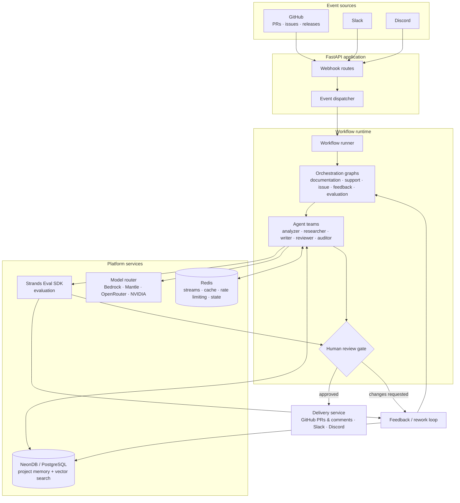
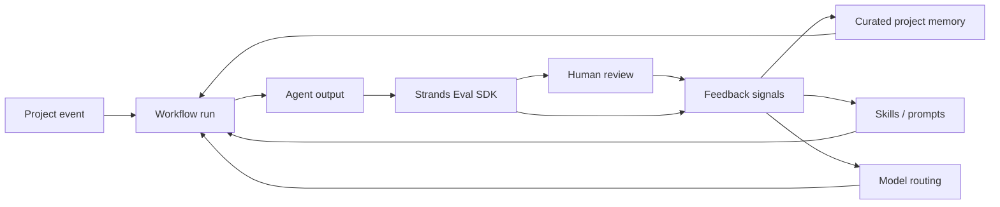

# Draftly

**Autonomous documentation engineering platform.**

Draftly is an event-driven, multi-agent documentation engineering platform that continuously keeps software documentation aligned with a changing codebase and the people using it.

Draftly watches signals from GitHub, Slack, and Discord, understands what changed, researches the project’s existing knowledge, generates documentation or support responses, evaluates the result, routes it through human review when required, and delivers approved changes. Feedback from evaluations, reviewers, and users feeds back into project memory and future workflows.

> **Draftly turns documentation from a manually maintained artifact into a continuous engineering process.**

---

## Why Draftly?

Software changes faster than documentation.

A pull request can introduce a new API, change authentication behavior, deprecate a feature, or alter an SDK without anyone remembering to update the relevant documentation. Meanwhile, users ask questions in Slack, Discord, and GitHub issues that reveal gaps in the existing docs.

Traditional documentation workflows usually depend on someone noticing these changes and manually connecting them to the right documentation.

Draftly automates that loop.

| Traditional documentation | Draftly |
| --- | --- |
| Manually maintained | Event-driven |
| Updated after the fact | Continuously monitored |
| Author searches for context | Agents research project context |
| One-off generation | Workflow-based documentation engineering |
| Static knowledge | Persistent, curated project memory |
| Quality checked manually | Evaluated against evidence |
| Human does the entire task | Agents perform the work, humans control publication |
| Feedback is often lost | Feedback becomes a signal for future improvements |

---

## The Documentation Engineering Loop

Draftly is built around a continuous documentation engineering loop:

```text
┌──────────────────────┐
│   Software Project   │
│ GitHub · Slack ·     │
│ Discord · Docs       │
└──────────┬───────────┘
           │
           ▼
        OBSERVE
           │
           ▼
       UNDERSTAND
           │
           ▼
         RESEARCH
           │
           ▼
        GENERATE
           │
           ▼
        EVALUATE
           │
           ▼
     HUMAN REVIEW
        /       \
   changes      approve
    requested      │
       │           ▼
       └──────►  DELIVER
                   │
                   ▼
                FEEDBACK
                   │
                   ▼
          CURATE PROJECT MEMORY
                   │
                   ▼
            FUTURE WORKFLOWS
```

The important distinction is that Draftly does not stop after generating documentation.

Every workflow can produce useful signals:

- evaluation failures
- reviewer corrections
- recurring support questions
- documentation gaps
- rejected changes
- grounding failures
- successful outcomes

Those signals can improve project memory, prioritization, skills, prompts, retrieval, and model routing.

---

## What Draftly Does

### GitHub change analysis

Draftly analyzes GitHub pull requests, issues, and releases to determine what changed and whether the change has documentation impact.

### Documentation generation and synchronization

Draftly researches the repository and project knowledge before generating:

- conceptual documentation
- how-to guides
- tutorials
- API references
- release documentation
- documentation updates

Generated changes can be delivered as GitHub pull requests for review.

### Developer support

Draftly can respond to questions from GitHub issues, Slack, and Discord using indexed project documentation and project knowledge as grounding context.

### Feedback loop

Support questions, reviewer feedback, evaluation failures, and other signals can reveal documentation gaps and recurring problems. Draftly turns those signals into future documentation work.

### Human-in-the-loop review

Draftly supports configurable review policies. Agent output can be held at a review gate until a human approves it.

The principle is:

> **Agents perform documentation engineering; humans retain control over externally visible changes.**

### Persistent project memory

Draftly maintains searchable project knowledge that can be retrieved by agents and curated over time. Memory supports grounding, deduplication, and future workflow execution.

### Evaluation

Draftly evaluates agent outputs for qualities such as:

- groundedness
- correctness
- completeness
- relevance
- documentation quality
- expected review behavior

Draftly uses the **Strands Eval SDK** as its evaluation framework.

### Multi-provider model routing

Draftly uses a pluggable model registry and router supporting providers including Amazon Bedrock, Bedrock Mantle, OpenRouter, NVIDIA, Requesty, and Orcarouter.

---

## How Draftly Works

A typical documentation workflow looks like this:

```text
GitHub PR
   │
   ▼
Webhook
   │
   ▼
Event normalization
   │
   ▼
Workflow selection
   │
   ▼
Documentation impact analysis
   │
   ▼
Repository + project research
   │
   ▼
Documentation generation
   │
   ▼
Evaluation
   │
   ▼
Human review
   │
   ├─────────────── changes requested ──────┐
   │                                        │
   ▼                                        │
Delivery                                    │
   │                                        │
   ▼                                        │
GitHub PR / Slack / Discord                 │
                                            │
                                            └──► Rework → Evaluation
```

The exact workflow depends on the event and configured workflow policy.

---

## Architecture



### Runtime flow

1. **Event sources** produce project or user events.
2. **Webhook routes** receive and authenticate incoming events.
3. **Event dispatcher** normalizes them into Draftly events.
4. **Workflow runner** selects and starts the appropriate workflow.
5. **Orchestration graphs** coordinate specialized agents.
6. **Agents** research, reason, write, review, and curate project knowledge.
7. **Memory** provides persistent project context and retrieval.
8. **Model routing** selects an appropriate model for each task.
9. **Strands Eval SDK** evaluates generated outputs.
10. **Human review** controls publication when required.
11. **Delivery** publishes approved results.
12. **Feedback** becomes input to rework, memory curation, prioritization, and future workflows.

---

## Continuous Learning Architecture

Draftly's evaluation and feedback systems are not isolated from the runtime. They form a feedback loop around agent execution.



This enables the broader Draftly loop:

```text
Execute
  ↓
Evaluate
  ↓
Observe failure or success
  ↓
Understand the cause
  ↓
Improve context / skills / prompts / routing
  ↓
Execute again
  ↓
Compare results
```

---

## Core Concepts

### Events

Events are normalized signals representing changes or interactions from GitHub, Slack, and Discord.

### Workflows

Workflows define the business process Draftly should execute for an event.

Examples include:

- documentation synchronization
- GitHub issue handling
- support
- release authoring
- feedback processing
- evaluation

### Agents

Agents perform specialized reasoning within workflows.

Examples include:

- change analyzers
- repository researchers
- documentation writers
- support agents
- reviewers
- auditors
- memory curators

### Skills

Skills package reusable agent capabilities as self-contained definitions.

A skill can provide:

- instructions
- rules
- resources
- templates
- examples
- domain-specific guidance

The relationship is:

```text
Workflow
   │
   ├── decides what happens
   │
   ├── invokes Agents
   │       │
   │       └── perform reasoning
   │
   └── uses Skills
           │
           └── provide reusable capabilities
```

> **Workflows decide what happens. Agents perform reasoning. Skills define reusable capabilities.**

### Memory

Memory stores durable project knowledge that agents can retrieve during future workflows.

Draftly treats memory as a curated knowledge layer rather than simply an append-only store.

### Evaluation

Evaluation determines whether agent behavior and outputs meet the quality requirements of a workflow.

Draftly uses the **Strands Eval SDK** for this layer.

### Review gates

Review gates provide explicit human control over agent-generated changes.

### Delivery

Delivery publishes approved results back to project communication and development systems.

---

## Example: Existing Repository Onboarding

Draftly can bootstrap its project knowledge from an existing software repository.

For example:

```text
Connect GitHub repository
        ↓
Discover repository structure
        ↓
Index existing documentation
        ↓
Analyze codebase
        ↓
Build initial project knowledge
        ↓
Identify documentation coverage and gaps
        ↓
Generate documentation plan
        ↓
Generate initial documentation
        ↓
Evaluate
        ↓
Human review
        ↓
Open documentation PR
```

This means Draftly does not require a project to start with a perfect documentation system.

It can begin by understanding the repository that already exists.

---

## Example: Pull Request → Documentation

Suppose a pull request changes authentication behavior.

```text
PR changes authentication
        ↓
GitHub webhook
        ↓
Event normalization
        ↓
Documentation workflow
        ↓
Impact analysis
        ↓
Find affected documentation
        ↓
Research repository + existing docs
        ↓
Generate documentation update
        ↓
Strands evaluation
        ↓
Human review
        ↓
Approved
        ↓
Documentation PR
```

If the reviewer requests changes:

```text
Reviewer feedback
        ↓
Rework
        ↓
Re-evaluation
        ↓
Human review
        ↓
Approval
```

---

## Evaluation

Draftly uses the **Strands Eval SDK** to evaluate agent behavior and generated outputs.

Evaluation datasets cover the major Draftly surfaces, including:

- documentation workflows
- GitHub issues
- Slack/Discord support
- feedback processing
- release authoring

### Evaluation dimensions

| Metric | Description |
| --- | --- |
| `groundedness` | Claims are traceable to available evidence |
| `correctness` | Output is factually accurate |
| `completeness` | Essential information is covered |
| `relevance` | Output directly addresses the task |
| `documentation_quality` | Citation coverage, topic coverage, and adequate detail |
| `expected_interrupt` | Workflow correctly stops at the configured review gate |
| `expected_passthrough` | Workflow correctly passes through when review is disabled |

### Evaluation as a build loop

Evaluation is also used during agent development:

```text
Change agent / skill / workflow
        ↓
Run evaluation
        ↓
Inspect failures and traces
        ↓
Identify failure cause
        ↓
Improve implementation
        ↓
Run evaluation again
        ↓
Compare results
```

The objective is not simply to prove that an agent works once, but to continuously improve agent behavior against representative scenarios.

---

## Adaptive Model Routing

Draftly supports multiple model providers through a pluggable model registry and routing layer.

The router can select models based on task requirements such as:

- reasoning requirements
- context requirements
- latency
- cost
- provider availability
- historical evaluation performance

Conceptually:

```text
Task
 │
 ▼
Candidate models
 │
 ├── capability
 ├── cost
 ├── latency
 ├── context requirements
 └── historical performance
 │
 ▼
Selected model
 │
 ▼
Agent execution
 │
 ▼
Evaluation
 │
 ▼
Routing feedback
```

This allows model selection to become task-aware rather than relying on one model for every workflow.

---

## Integrations

### GitHub

Draftly uses GitHub events and repository context to:

- analyze pull requests
- process issues
- analyze releases
- identify documentation impact
- create documentation pull requests
- respond to issues and comments

### Slack

Draftly can consume support and engineering signals from Slack and provide grounded responses.

### Discord

Draftly can consume developer/community questions from Discord and respond using project documentation and persistent project knowledge.

### Clerk

Clerk provides application authentication through JWT-based authentication.

---

## Tech Stack

| Layer | Technology |
| --- | --- |
| Language | Python 3.11 |
| Package management | [uv](https://docs.astral.sh/uv/) |
| API | FastAPI + Uvicorn |
| Agents | [Strands Agents](https://github.com/strands-agents) |
| Evaluation | Strands Eval SDK |
| Database | PostgreSQL / NeonDB |
| Vector search | PostgreSQL vector search |
| Event streaming | Redis Streams |
| Cache | Redis |
| Background jobs | RQ workers where configured |
| Authentication | Clerk + GitHub / Slack / Discord application authentication |
| Observability | structlog, tracing, metrics, audit logging |

---

## Getting Started

### Prerequisites

- Python 3.11+
- [uv](https://docs.astral.sh/uv/getting-started/installation/)
- PostgreSQL database
- Redis
- AWS credentials with access to Amazon Bedrock

NeonDB works as the PostgreSQL backend.

### Install

```bash
uv sync
```

### Configure

```bash
cp .env.example .env
```

At minimum, configure your database and AWS access:

```text
DATABASE_URL=...
AWS_REGION=...
```

Other model providers are optional.

### Run the API

```bash
python main.py
```

The FastAPI application starts on the configured host and port.

Interactive API documentation is available at:

```text
http://localhost:8000/docs
```

### Start Redis

For local development:

```bash
docker compose -f docker-compose.redis.yml up -d redis
```

### Start Redis and the RQ worker

```bash
docker compose -f docker-compose.redis.yml up -d
```

The compose configuration provides Redis and the RQ worker required for queue-backed background execution.

---

## Docker

### API

```bash
docker build -f docker/Dockerfile.api -t draftly-api .

docker run --rm \
  -p 8000:8000 \
  -e "REDIS_URL=redis://host.docker.internal:6379/0" \
  draftly-api
```

### Worker

```bash
docker build -f docker/Dockerfile.worker -t draftly-worker .

docker run --rm \
  -e REDIS_URL=redis://host.docker.internal:6379/0 \
  -e DATABASE_URL="$DATABASE_URL" \
  draftly-worker
```

The worker consumes configured Draftly queues.

When Redis runs on the host and the worker runs in Docker on macOS or Windows, use:

```text
host.docker.internal
```

rather than `localhost`.

The RQ worker compose configuration expects the GitHub private key referenced by `GITHUB_PRIVATE_KEY_PATH` to be available under the configured secrets path.

---

## Background Workers

Draftly separates long-running work from the API process through background workers.

| Worker | Purpose |
| --- | --- |
| `rq_worker` | Consumes scheduled, webhook, and default queues |
| `event_worker` | Legacy/in-process event processing scenarios |
| `workflow_worker` | Periodic workflow retries and review-expiry processing |

The primary queue-backed entrypoint is:

```bash
python -m workers.rq_worker
```

Environment-specific defaults live in:

```text
config/
├── development.yaml
├── staging.yaml
└── production.yaml
```

---

## Configuration

See `.env.example` for the complete configuration.

### Required

| Variable | Description |
| --- | --- |
| `DATABASE_URL` | PostgreSQL / NeonDB connection string |
| `AWS_REGION` | Amazon Bedrock region |
| AWS credentials | Credentials or IAM role for Bedrock |

### Infrastructure

| Variable | Description |
| --- | --- |
| `REDIS_URL` | Redis connection string |
| `VECTOR_SEARCH_BACKEND` | Configured vector-search backend |
| `EVENT_BUS_BACKEND` | Configured event-bus backend |
| `SEMANTIC_CACHE_ENABLED` | Enables semantic caching when configured |

### Models

| Variable | Description |
| --- | --- |
| `BEDROCK_CLAUDE_REASONING_MODEL` | Reasoning model override |
| `BEDROCK_CLAUDE_FAST_MODEL` | Fast model override |
| `EMBEDDING_MODEL_ID` | Embedding model used for retrieval |

### Optional providers

```text
MANTLE_API_KEY
MANTLE_ENDPOINT_URL
OPENROUTER_API_KEY
NVIDIA_API_KEY
REQUESTY_API_KEY
ORCAROUTER_API_KEY
```

---

## Development

### Code quality

```bash
uv run ruff check .
uv run ruff format --check .
uv run mypy src
```

### Tests

```bash
uv run pytest
```

Run integration tests:

```bash
uv run pytest -m integration
```

Integration tests may use a live database and model endpoints. Configure the required credentials and enable the project's live-test configuration before running them.

---

## Running Evaluations

Draftly's evaluation datasets are used to exercise the major agent and workflow surfaces.

The exact evaluation commands and dataset configuration should be kept aligned with the current Strands Eval SDK integration.

A typical evaluation workflow is:

```text
Dataset
   ↓
Draftly workflow
   ↓
Agent execution
   ↓
Strands Eval SDK
   ↓
Evaluation results
   ↓
Failure analysis
```

Evaluation datasets live under:

```text
src/draftly/evaluation/datasets/
```

Representative surfaces include:

```text
documentation
github issues
support
discord
feedback
release authoring
```

---

## Project Structure

```text
draftly-agent-backend/
├── src/draftly/
│   ├── agents/          # Agent definitions and prompts
│   ├── evaluation/      # Evaluation framework and datasets
│   ├── integrations/    # Slack, Discord, GitHub, database
│   ├── models/          # Model router and providers
│   ├── orchestration/   # Graphs, nodes, and routing
│   ├── skills/          # Self-contained agent capabilities
│   └── workflows/       # Workflow definitions
│
├── scripts/             # CLI and evaluation utilities
├── workers/             # Background worker processes
├── config/              # Environment-specific configuration
├── simulation/          # End-to-end test scenarios
└── docs/                # Architecture and engineering documentation
```

### Where the pieces fit

```text
Event
  ↓
Integration
  ↓
Orchestration
  ↓
Workflow
  ↓
Agents
  ↓
Skills + Tools + Memory
  ↓
Model Router
  ↓
Evaluation
  ↓
Review
  ↓
Delivery
```

---

## Security Model

Draftly connects to source-control and communication systems and can publish externally visible changes. Security therefore applies throughout the workflow.

The intended security boundary is:

```text
Incoming event
      ↓
Webhook authentication
      ↓
Event validation
      ↓
Project / tenant authorization
      ↓
Agent execution
      ↓
Human review policy
      ↓
Scoped delivery credentials
      ↓
Audit trail
```

Important security areas include:

- webhook signature verification
- scoped GitHub App permissions
- Slack and Discord permissions
- Clerk authentication
- secret management
- project/tenant isolation
- delivery authorization
- audit logging

---

## Observability

Agentic workflows can be difficult to debug without end-to-end traceability.

Draftly should make each workflow traceable through its lifecycle:

```text
Event
  ↓
Workflow run ID
  ↓
Workflow / graph
  ↓
Agent execution
  ↓
Tool calls
  ↓
Retrieved context
  ↓
Model invocation
  ↓
Evaluation
  ↓
Human decision
  ↓
Delivery
```

This allows failures such as incorrect retrieval, unsupported claims, poor model selection, or review-policy errors to be investigated using the complete execution context.

---

## Documentation

Detailed engineering documentation lives under `docs/`.

The documentation covers areas including:

- architecture
- event-driven design
- multi-agent topology
- orchestration
- memory
- feedback loops
- documentation workflows
- persistence
- integrations
- security
- delivery
- evaluation
- review
- observability
- support
- tools
- Redis
- model routing
- deployment

### Agents and skills

Agent architecture, research swarms, and packaged skills are documented separately from the top-level architecture.

### API

API documentation covers:

- FastAPI routes
- GitHub webhooks
- Slack webhooks
- Discord webhooks
- Clerk authentication

### Workflows

Workflow documentation covers:

- documentation synchronization
- GitHub PR and issue workflows
- support
- feedback
- release authoring

### Deployment

Deployment documentation covers:

- AWS
- production configuration
- database deployment
- Redis operations
- production readiness

---

## Simulation

The `simulation/` directory contains end-to-end scenarios for exercising Draftly against realistic software-project events.

Current scenarios include areas such as:

- OAuth
- PKCE
- RBAC
- token rotation
- API key deprecation
- SDK breaking changes

The simulation environment is intended to make agent workflows testable against repeatable project changes and support interactions.

---

## Roadmap

The long-term direction for Draftly is to move toward increasingly autonomous documentation engineering while preserving evaluation and human control.

Key areas include:

- richer repository understanding
- stronger documentation impact analysis
- more capable research swarms
- improved project memory curation
- adaptive model routing
- continuous evaluation
- better support automation
- stronger feedback-driven prioritization
- richer workflow observability
- broader integration coverage

---

## Contributing

When contributing to Draftly:

1. Keep workflows deterministic where possible.
2. Ground agent outputs in project evidence.
3. Add or update evaluation cases when changing agent behavior.
4. Preserve human-review boundaries.
5. Add tests for workflow and integration changes.
6. Keep skills self-contained and reusable.
7. Document architectural changes under `docs/`.

For agent changes, prefer the loop:

```text
Change
  ↓
Evaluate
  ↓
Inspect failure
  ↓
Improve
  ↓
Evaluate again
```

---

## Project Status

Draftly is an actively evolving agentic documentation engineering platform.

The architecture intentionally separates:

- event ingestion
- orchestration
- agent reasoning
- reusable skills
- persistent memory
- model routing
- evaluation
- human review
- delivery

This separation allows individual components to evolve without turning the entire platform into one monolithic agent.

### Content production MVP

Draftly can generate reviewable blog, LinkedIn, and X drafts from published
releases, content-relevant merged pull requests, documentation, manual briefs,
and feedback-gap opportunities. Packages remain organization-scoped and retain
evidence, evaluation scores, revisions, and reviewer decisions. The MVP never
publishes externally; future publishing adapters must consume approved packages
only. See `docs/content-production.md` for the lifecycle and boundaries.

---

## License

See the repository license for licensing terms.
