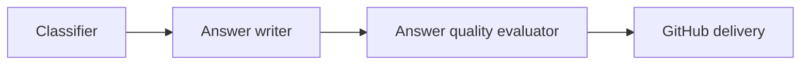
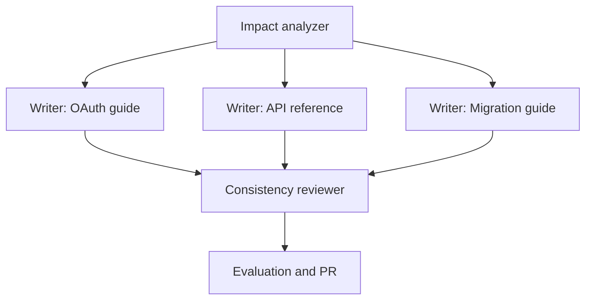
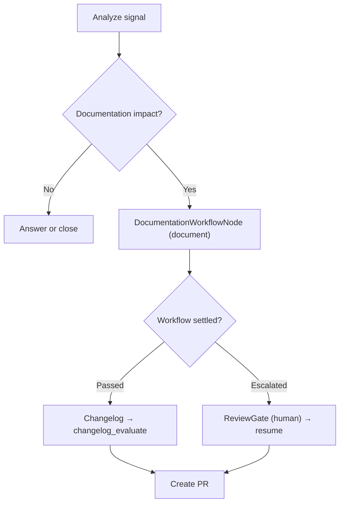

Yes. Strands Agents supports both sequential and parallel agent execution through its Graph and Workflow multi-agent patterns.

The important distinction is that Strands does not expose one universal “parallel mode.” Execution order is determined by the orchestration pattern and the dependencies you define.

## Execution options

| Pattern            |                    Sequential |                          Parallel | Best use                                          |
| ------------------ | ----------------------------: | --------------------------------: | ------------------------------------------------- |
| Graph              |                           Yes |                               Yes | Conditional, branching or iterative agent systems |
| Workflow           |                           Yes |                               Yes | Predictable task pipelines and DAGs               |
| Swarm              | Primarily sequential handoffs |             Not its primary model | Autonomous collaboration and exploration          |
| Direct agent calls |                           Yes | Only if you implement concurrency | Simple pipelines                                  |

The official Strands documentation describes Workflow as deterministic and parallel: tasks with dependencies wait, while independent tasks run simultaneously. Graph supports sequential pipelines, parallel fan-out/fan-in, branching and feedback loops. [Strands multi-agent patterns](https://strandsagents.com/docs/user-guide/concepts/multi-agent/multi-agent-patterns/)

## 1. Sequential execution

Sequential execution means one agent must finish before the next starts.



With a Strands Graph, edges define the dependencies:

```python
from strands import Agent
from strands.multiagent import GraphBuilder

classifier = Agent(
    name="classifier",
    system_prompt="Classify the incoming signal.",
)

answer_writer = Agent(
    name="answer_writer",
    system_prompt="Create a grounded answer.",
)

answer_evaluator = Agent(
    name="answer_evaluator",
    system_prompt="Evaluate the proposed answer.",
)

builder = GraphBuilder()

builder.add_node(classifier, "classify")
builder.add_node(answer_writer, "answer")
builder.add_node(answer_evaluator, "answer_evaluate")

builder.add_edge("classify", "answer")
builder.add_edge("answer", "answer_evaluate")

builder.set_entry_point("classify")

graph = builder.build()
result = graph("Answer this support signal.")
```

The execution order is:

```text
classify → answer → answer_evaluate
```

The output of each completed node becomes context for its dependent node. Strands documents this as a standard Graph sequential pipeline. [Strands Graph pattern](https://strandsagents.com/docs/user-guide/concepts/multi-agent/graph/)

> The **documentation** surface does not use a writer → reviewer → evaluator Strands chain. Its generation path is one `DocumentationWorkflowNode` that delegates to a Draftly-owned durable page DAG (see [Why Draftly owns the DAG adapter](#5-graph-versus-workflow-for-draftly)). Only the answer/support branch runs a bounded Strands evaluation loop.

You can also implement a basic sequential workflow through normal Python calls:

```python
classification = classifier(signal)
answer = answer_writer(f"Answer this signal:\n{classification}")
evaluation = answer_evaluator(f"Evaluate this answer:\n{answer}")
```

This is simple but lacks the richer graph execution state, branching, streaming events and dependency tracking.

## 2. Parallel execution

Parallel execution happens when multiple nodes have satisfied dependencies and do not depend on one another.

For Draftly, the most valuable use is parallel document generation:



After impact analysis:

- The three writers can run concurrently.
- The consistency reviewer waits for all three.
- Evaluation and GitHub delivery run sequentially afterward.

The Graph documentation calls this topology “parallel processing with aggregation.” [Strands Graph parallel topology](https://strandsagents.com/docs/user-guide/concepts/multi-agent/graph/)

A simplified static Graph looks like this:

```python
from strands import Agent
from strands.multiagent import GraphBuilder
from strands.multiagent.graph import GraphState
from strands.multiagent.base import Status

coordinator = Agent(
    name="coordinator",
    system_prompt="Create focused documentation assignments.",
)

oauth_writer = Agent(
    name="oauth_writer",
    system_prompt="Update the OAuth documentation.",
)

api_writer = Agent(
    name="api_writer",
    system_prompt="Update the API reference.",
)

migration_writer = Agent(
    name="migration_writer",
    system_prompt="Update the migration guide.",
)

reviewer = Agent(
    name="reviewer",
    system_prompt="Review all documentation changes together.",
)

builder = GraphBuilder()

builder.add_node(coordinator, "coordinator")
builder.add_node(oauth_writer, "oauth_writer")
builder.add_node(api_writer, "api_writer")
builder.add_node(migration_writer, "migration_writer")
builder.add_node(reviewer, "reviewer")

builder.add_edge("coordinator", "oauth_writer")
builder.add_edge("coordinator", "api_writer")
builder.add_edge("coordinator", "migration_writer")
```

The three writer nodes become eligible to execute concurrently when the coordinator completes.

## 3. Important Python Graph join behavior

There is an important SDK-specific issue for Draftly.

According to the current documentation, Python Graph uses OR semantics by default when a node has several incoming edges. That means the reviewer may start when any one writer completes—not necessarily after every writer completes.

For a proper fan-in join, explicitly require all dependencies:

```python
def all_dependencies_complete(required_nodes: list[str]):
    def condition(state: GraphState) -> bool:
        return all(
            node_id in state.results
            and state.results[node_id].status == Status.COMPLETED
            for node_id in required_nodes
        )

    return condition


writers = [
    "oauth_writer",
    "api_writer",
    "migration_writer",
]

wait_for_all = all_dependencies_complete(writers)

builder.add_edge("oauth_writer", "reviewer", condition=wait_for_all)
builder.add_edge("api_writer", "reviewer", condition=wait_for_all)
builder.add_edge("migration_writer", "reviewer", condition=wait_for_all)

builder.set_entry_point("coordinator")

graph = builder.build()
```

This ensures:

```text
oauth_writer ───────┐
api_writer ─────────┼── all finished → reviewer
migration_writer ───┘
```

The TypeScript SDK uses AND semantics by default for this situation, so this is especially important if Draftly uses the Python SDK. [Strands Graph dependency behavior](https://strandsagents.com/docs/user-guide/concepts/multi-agent/graph/)

## 4. Workflow pattern

Strands also provides a `workflow` tool through `strands-agents-tools`.

The workflow tool manages:

- Task creation
- Dependencies
- Execution order
- Parallel execution
- Priorities
- Status reporting
- Retries
- Pause and resume
- Intermediate results

A dependent task runs sequentially:

```python
{
    "task_id": "review",
    "description": "Review all proposed documentation changes",
    "dependencies": [
        "write_oauth",
        "write_api_reference",
        "write_migration"
    ]
}
```

Independent tasks have the same dependency and can run concurrently:

```python
tasks = [
    {
        "task_id": "analyze_impact",
        "description": "Analyze the PR for documentation impact",
    },
    {
        "task_id": "write_oauth",
        "description": "Update docs/oauth.md",
        "dependencies": ["analyze_impact"],
    },
    {
        "task_id": "write_api_reference",
        "description": "Update docs/api-reference.md",
        "dependencies": ["analyze_impact"],
    },
    {
        "task_id": "write_migration",
        "description": "Update docs/migration.md",
        "dependencies": ["analyze_impact"],
    },
    {
        "task_id": "review",
        "description": "Review all documentation changes together",
        "dependencies": [
            "write_oauth",
            "write_api_reference",
            "write_migration",
        ],
    },
]
```

The workflow engine can infer:

```text
analyze_impact
      ↓
write_oauth ────────┐
write_api_reference ├── review
write_migration ────┘
```

The official documentation says the Workflow tool resolves task dependencies and performs parallel processing where possible. [Strands Workflow documentation](https://strandsagents.com/docs/user-guide/concepts/multi-agent/workflow/)

## 5. Graph versus Workflow for Draftly

Draftly uses both concepts at different levels.

### Use Graph for the overall documentation lifecycle

Graph is appropriate for the top-level lifecycle because Draftly needs:

- Conditional paths
- Support-versus-GitHub routing
- Documentation gap decisions
- Changelog generation and validation
- Human approval interrupts
- Escalation paths

For example:



The answer surface keeps a bounded Strands evaluation loop (`answer → answer_evaluate`); the documentation surface does **not** — every write/evaluate/review cycle runs inside the page workflow's own durable DAG (see [page-level-eval.md](./page-level-eval.md)).

### Draftly owns the authoring DAG adapter

The authoring portion is a predictable DAG, but Draftly builds and executes it itself (`PageWorkflowExecutor` + `PageWorkflowRepository`) rather than delegating to `strands_tools.workflow` or a nested Graph loop:

```text
prepare context
    ↓
parallel per-page write/evaluate pairs (bounded concurrency)
    ↓
per-page revision loops (max 3 attempts)
    ↓
cross-page review (only after every page passes)
    ↓
pass or escalate to human review
```

Draftly owns the adapter because the requirements are persistence-shaped:

- **Lease-based durability.** Tasks, page states, and evaluations live in PostgreSQL with `FOR UPDATE SKIP LOCKED` claims and expiring leases, so a restarted worker reclaims orphaned tasks and the DAG resumes where it stopped. Strands' in-memory Workflow manager cannot survive process death.
- **Sealed-artifact accounting.** Tasks are versioned writes against `DraftRepository`, which enforces `next_version` allocation and rejects stale artifacts. The DAG must coordinate with Draftly's own store, not a generic task runner.
- **Separate concurrency budgets.** Writers and evaluators claim through different semaphores, so distinct provider limits are a first-class scheduling concern.
- **Deterministic gates stay deterministic.** The quality gate is Draftly's own rubric logic (`compute_page_metrics`); the DAG schedules it per page rather than letting a general flow runner reinterpret verdicts.
- **Deadlock detection.** Draftly raises `DeadlockedWorkflowError` when pending tasks are not reachable from completed dependencies — a property the Strands Workflow tool does not surface.

This separation gives Draftly:

- Flexible decision-making at the top level
- Deterministic, durable parallelism inside document generation
- Page-precise retries instead of batch-wide restarts
- Better latency
- More precise progress reporting

## 6. Solving Draftly's eleven-page generation delay

The durable page workflow directly addresses the large generation problem you encountered.

Instead of:

```text
one writer → generate changes for 11 pages → one workflow-level evaluation → restart everything on one failure
```

Use:

```text
impact analyzer
    ↓
seed 11 write/evaluate task pairs (v1)
    ↓
run writers and evaluators under bounded concurrency
    ↓
revise only failed pages (max 3 automatic attempts)
    ↓
cross-page review after every page passes
    ↓
escalate unruly pages to human review (never restart the batch)
```

Use bounded concurrency rather than launching eleven model calls simultaneously:

```python
MAX_PARALLEL_WRITERS = 3
MAX_EVALUATION_CONCURRENCY = 6
```

The ideal execution forms waves:

| Wave  | Concurrent tasks                     |
| ----- | ------------------------------------ |
| 1     | write pages 1–3                      |
| 2     | write pages 4–6                      |
| 3     | write pages 7–9                      |
| 4     | write pages 10–11                    |
| Final | evaluate pages → cross-page review   |

This reduces wall-clock latency substantially while avoiding:

- Model-provider rate limits
- Excessive token spikes
- Connection exhaustion
- Eleven simultaneous cold starts
- Difficult-to-control costs

Each writer receives only:

- Its assigned file
- Relevant source-code diff
- Relevant path-scoped evidence
- Existing page content
- Style instructions
- Shared change summary

It does not receive the contents of all eleven documentation pages.

## Recommendation

Use this Draftly execution model:

```text
Sequential (top-level Graph):
ingestion → impact analysis → DocumentationWorkflowNode

Inside the page workflow (Draftly-owned durable DAG):
parallel per-file research + bounded writes → per-page evaluation
    → per-page revision loops (max 3 attempts, only failed pages)
    → cross-page review → pass or escalate

Sequential (top-level Graph):
changelog → changelog evaluation (passed) or human ReviewGate resume (escalated)

Sequential:
GitHub branch → commit → pull request
```

The top-level Strands Graph owns the complete lifecycle; per-document generation runs in a Draftly-owned durable DAG adapter backed by PostgreSQL, with a hard cutover from the legacy `document → review → evaluate` loop (see [documentation-workflow-cutover.md](./documentation-workflow-cutover.md)).
