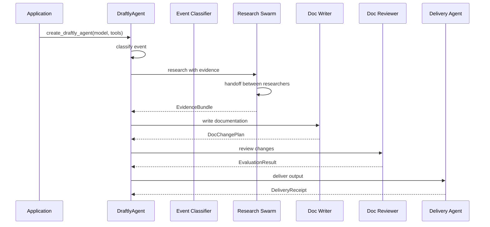

# Agent Overview

> **Status:** Implemented
> **Date:** 2026-08-25
> **Scope:** Root DraftlyAgent class, agent configuration, model routing, skill system, and prompt structure

## 1. Overview

The Draftly agent system is built on the Strands framework, with a root `DraftlyAgent` that coordinates specialized subagents. Each agent is configured with a system prompt, model, tools, and optional structured output schema. Agents use a shared prompt building system that assembles prompts from templates, policies, and output contracts.

The root agent acts as the entry point, classifying incoming events and routing them to the appropriate workflow. Subagents handle specific tasks (research, analysis, writing, evaluation, delivery) and produce structured output that downstream agents consume.

## 2. Root DraftlyAgent

The root agent is created by `create_draftly_agent()` in `draftly_agent.py`. It combines a base identity prompt with the classifier prompt to handle event classification.

```python
Agent(
    name="draftly",
    system_prompt="You are Draftly, an autonomous documentation-engineering agent. " + CLASSIFIER_PROMPT,
    model=model,
    tools=tools or [],
    description="Root Draftly documentation-intelligence agent.",
)
```

The root agent's primary role is to receive developer events and produce an `EventClassification` that determines the downstream workflow.

## 3. Agent Configuration

Every agent follows a consistent configuration pattern:

| Property | Description |
|----------|-------------|
| `name` | Unique agent identifier |
| `system_prompt` | Assembled from templates, policies, and output contracts |
| `model` | The LLM model to use |
| `tools` | Available tools for the agent |
| `structured_output_model` | Pydantic model for structured output (optional) |
| `description` | Human-readable description |
| `interventions` | HITL or other intervention mechanisms (optional) |

### 3.1 Structured Output Models

Agents that produce structured output specify a `structured_output_model` using Pydantic schemas from `schemas.py`:

| Agent | Output Model |
|-------|--------------|
| `event_classifier` | `EventClassification` |
| `context` | `EvidenceBundle` |
| `impact` | `ImpactAnalysis` |
| `doc_writer` | `DocChangePlan` |
| `doc_reviewer` | `EvaluationResult` |
| `delivery` | `DeliveryReceipt` |
| `support_writer` | `AnswerDraft` |
| `issue_analyzer` | `ImpactAnalysis` |
| `issue_responder` | `AnswerDraft` |

## 4. Model Router

Agents receive a `model` parameter that is passed down from the application layer. The model is configured at the application level and shared across agents. Each agent can use the same model or a different model depending on the task requirements.



## 5. Agent Skill System

Draftly includes 20 skills that provide domain-specific guidance for agent workflows. Each skill is defined as a `SKILL.md` file with metadata, steps, guidelines, and references.

### 5.1 Documentation Skills

| Skill | Purpose |
|-------|---------|
| `documentation-audit` | Periodic health checks for documentation stores |
| `documentation-evaluation` | Score generated docs against quality rubrics |
| `documentation-feedback-loop` | Convert support questions into documentation work |
| `documentation-gap-detection` | Identify gaps from recurring questions and feedback |
| `documentation-generation` | Create new documentation pages with templates |
| `documentation-research` | Determine existing coverage and gaps |
| `documentation-update` | Surgically update existing documentation |
| `evaluation-failure-analysis` | Diagnose why drafts fail evaluation |

### 5.2 GitHub Skills

| Skill | Purpose |
|-------|---------|
| `github-delivery` | Open branches, commits, and PRs for doc changes |
| `github-issue-analysis` | Route issues to docs or support workflows |
| `github-pr-analysis` | Analyze PRs for documentation impact |
| `github-release-analysis` | Process releases for breaking changes |

### 5.3 Support Skills

| Skill | Purpose |
|-------|---------|
| `support-answering` | Write accurate, evidence-grounded answers |
| `support-delivery` | Post answers to Slack/Discord threads |
| `support-evaluation` | Score answers for correctness and helpfulness |
| `support-feedback-analysis` | Mine support history for documentation signals |
| `support-triage` | Classify and route incoming support questions |

### 5.4 Memory Skills

| Skill | Purpose |
|-------|---------|
| `memory-curation` | Consolidate, deduplicate, and re-rank memory |
| `memory-retrieval` | Retrieve relevant memory for task grounding |

### 5.5 Repository Skills

| Skill | Purpose |
|-------|---------|
| `repository-analysis` | Explore repository structure for documentation work |

## 6. Prompt Structure

Prompts are assembled from ordered sections using the `build_prompt()` function in `prompts.py`. Each prompt combines:

1. **Role/Task Template** — Defines the agent's purpose
2. **Output Contract** — Rendered from Pydantic schemas
3. **Policies** — Loaded from `context/*.md` files
4. **Guardrails** — Composable snippets for citations, paths, refusal, brevity

### 6.1 Prompt Templates

| Template | Used By |
|----------|---------|
| `CLASSIFIER_PROMPT` | Root agent, event classifier |
| `CONTEXT_PROMPT` | Context builder |
| `RESEARCH_PROMPT` | Documentation researcher, issue researcher, solution researcher |
| `IMPACT_PROMPT` | Impact analyzer |
| `WRITER_PROMPT` | Documentation writer |
| `ANSWER_WRITER_PROMPT` | Support answer writer |
| `REVIEWER_PROMPT` | Documentation reviewer, support reviewer |
| `ISSUE_ANALYZER_PROMPT` | Issue analyzer, question analyzer |
| `ISSUE_RESPONDER_PROMPT` | Issue responder |
| `DELIVERY_PROMPT` | Delivery agent, GitHub delivery agent |
| `MEMORY_CURATOR_PROMPT` | Memory curator |

### 6.2 Guardrails

Shared guardrail snippets are appended to prompts as needed:

| Guardrail | Purpose |
|-----------|---------|
| `GUARDRAIL_CITATIONS` | Require citing source IDs, never invent sources |
| `GUARDRAIL_PATHS` | Only modify paths present in evidence |
| `GUARDRAIL_REFUSAL` | Choose "none" when evidence is insufficient |
| `GUARDRAIL_BREVity` | Keep responses under 200 words |

### 6.3 Policy Loading

Policies are loaded lazily from `context/*.md` files. Missing policies log a warning instead of degrading the prompt silently.

## 7. File Reference

| Path | Description |
|------|-------------|
| `src/draftly/agents/draftly_agent.py` | Root DraftlyAgent factory |
| `src/draftly/agents/prompts.py` | Prompt templates and builder |
| `src/draftly/agents/schemas.py` | Pydantic output models |
| `src/draftly/agents/subagents.py` | Research Swarm builder |
| `src/draftly/skills/*/SKILL.md` | Agent skill definitions |
