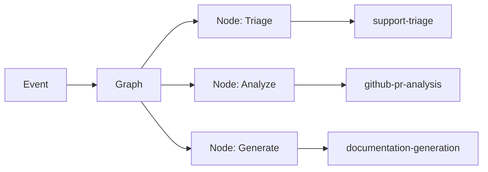
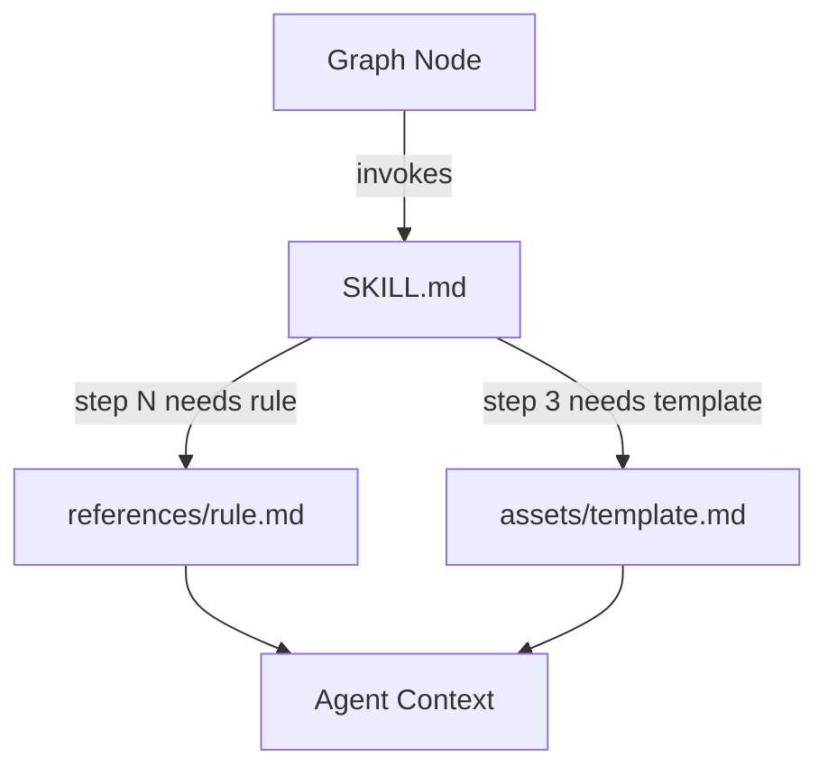

# Agent Skills

> **Status:** Implemented
> **Date:** 2026-08-25
> **Scope:** The Draftly agent skills system — self-contained rule sets that teach agents how to perform specialized tasks.

## 1. Overview

Draftly agents operate by loading **skills** — self-contained packages of instructions, rules, and reference materials that define how an agent should perform a specific task. Each skill is a directory containing a `SKILL.md` manifest, an `__init__.py` module, and optional `references/` and `assets/` subdirectories.

Skills are the atomic unit of agent expertise. An agent graph (a multi-agent workflow) invokes skills at specific nodes to perform tasks like analyzing a pull request, generating documentation, or answering a support question. Skills do not execute code directly — they provide structured instructions that the agent runtime interprets.



## 2. Skill Structure

Every skill follows a consistent directory layout:

```
skills/
  skill-name/
    SKILL.md          # Manifest: name, description, steps, output schema
    __init__.py       # Python module (empty or utility functions)
    references/       # Rule files loaded on demand by the agent
    assets/           # Templates, checklists, or sample outputs
```

### SKILL.md Format

Each `SKILL.md` uses YAML frontmatter followed by structured markdown:

| Section | Purpose |
|---------|---------|
| `name` | Unique identifier (kebab-case) |
| `description` | One-line trigger description for the agent runtime |
| `allowed-tools` | Tools the skill may invoke |
| `metadata.references` | Number of reference files available |
| `metadata.assets` | Number of asset files available |
| **Purpose** | What the skill accomplishes |
| **Steps** | Ordered procedure the agent follows |
| **Guidelines** | Rules, constraints, and quality standards |
| **Output** | Typed output schema the skill produces |
| **References** | Lazy-loaded rule files with load triggers |
| **Assets** | Templates to copy and fill during execution |

### References vs Assets

- **References** are rule files the agent reads on demand. They contain classification tables, scoring rubrics, and decision rules. The agent loads only the reference needed for the current step.
- **Assets** are templates or scaffolds. The agent copies them at the start of execution and fills in content.

## 3. Skill Categories

Skills are organized into five domains that map to the Draftly workflow graph.

### 3.1 Documentation Skills

These skills handle the documentation lifecycle — from research and generation through evaluation and delivery.

| Skill | Directory | Purpose |
|-------|-----------|---------|
| `documentation-research` | `skills/documentation-research/` | Researches existing documentation coverage using semantic and keyword search |
| `documentation-generation` | `skills/documentation-generation/` | Generates new documentation pages with proper structure and frontmatter |
| `documentation-update` | `skills/documentation-update/` | Updates existing docs to reflect code changes with minimal diffs |
| `documentation-audit` | `skills/documentation-audit/` | Audits doc store for staleness, broken links, and coverage gaps |
| `documentation-evaluation` | `skills/documentation-evaluation/` | Evaluates generated docs for correctness, completeness, and groundedness |
| `documentation-gap-detection` | `skills/documentation-gap-detection/` | Detects documentation gaps from support questions and feedback clusters |
| `documentation-feedback-loop` | `skills/documentation-feedback-loop/` | Converts recurring unanswered questions into queued documentation work |

### 3.2 GitHub Skills

These skills handle GitHub webhook events — issues, pull requests, releases, and delivery of documentation changes.

| Skill | Directory | Purpose |
|-------|-----------|---------|
| `github-pr-analysis` | `skills/github-pr-analysis/` | Analyzes pull requests for documentation impact and change type |
| `github-issue-analysis` | `skills/github-issue-analysis/` | Analyzes issues to determine if they signal doc gaps or need answers |
| `github-release-analysis` | `skills/github-release-analysis/` | Analyzes releases for breaking changes, new features, and deprecations |
| `github-delivery` | `skills/github-delivery/` | Delivers approved doc changes as GitHub branches, commits, and PRs |
| `repository-analysis` | `skills/repository-analysis/` | Explores repo structure and git history to ground doc work in reality |

### 3.3 Support Skills

These skills handle inbound developer support questions from Slack and Discord.

| Skill | Directory | Purpose |
|-------|-----------|---------|
| `support-triage` | `skills/support-triage/` | Classifies and routes incoming support questions to the right workflow |
| `support-answering` | `skills/support-answering/` | Writes evidence-grounded answers to developer questions |
| `support-delivery` | `skills/support-delivery/` | Posts approved answers back to the originating thread |
| `support-evaluation` | `skills/support-evaluation/` | Scores support answers for accuracy, completeness, and helpfulness |
| `support-feedback-analysis` | `skills/support-feedback-analysis/` | Mines support history for patterns indicating documentation problems |

### 3.4 Memory Skills

These skills manage the agentic memory subsystem — retrieval and curation of organizational knowledge.

| Skill | Directory | Purpose |
|-------|-----------|---------|
| `memory-retrieval` | `skills/memory-retrieval/` | Retrieves relevant memory items to ground answers and documentation |
| `memory-curation` | `skills/memory-curation/` | Consolidates, deduplicates, and re-ranks memory items |

### 3.5 Evaluation Skills

These skills handle quality evaluation and failure analysis across all surfaces.

| Skill | Directory | Purpose |
|-------|-----------|---------|
| `evaluation-failure-analysis` | `skills/evaluation-failure-analysis/` | Analyzes evaluation failures to identify root causes and drive revision |

## 4. Skill Loading

Skills are loaded by the agent runtime when a graph node invokes them. The loading process:

1. The graph node specifies which skill to use (by name).
2. The runtime reads `SKILL.md` and parses the frontmatter and sections.
3. When the agent reaches a step that requires a reference, the runtime loads only that specific reference file from `references/`.
4. When the agent needs a template, it copies the appropriate asset from `assets/`.

This lazy-loading approach keeps agent context windows small — only the rules needed for the current step are loaded.



## 5. Skill Output Schemas

Each skill produces a typed output that downstream nodes consume. Common output types:

| Output Type | Used By | Description |
|-------------|---------|-------------|
| `EventClassification` | GitHub/support analysis | Surface, change type, urgency, reason |
| `ImpactAnalysis` | GitHub analysis | Action (create/update/answer/none), affected docs, rationale, evidence |
| `DocChangePlan` | Documentation skills | Repository, branch, files, commit message, summary |
| `EvaluationResult` | Evaluation skills | Pass/fail, score, reasons |
| `SupportAnswer` | Support answering | Content, confidence, citations, grounded flag |
| `EvidenceBundle` | Research/analysis | Items with doc ids, paths, excerpts; summary |
| `MemoryItem` | Memory skills | Id, namespace, content, importance, confidence |
| `FailureAnalysis` | Failure analysis | Case, category, reason, revision directive |

## 6. File Reference

All source files for the skills system:

- `src/draftly/skills/__init__.py` — Skills package init
- `src/draftly/skills/documentation-research/SKILL.md`
- `src/draftly/skills/documentation-generation/SKILL.md`
- `src/draftly/skills/documentation-update/SKILL.md`
- `src/draftly/skills/documentation-audit/SKILL.md`
- `src/draftly/skills/documentation-evaluation/SKILL.md`
- `src/draftly/skills/documentation-gap-detection/SKILL.md`
- `src/draftly/skills/documentation-feedback-loop/SKILL.md`
- `src/draftly/skills/github-pr-analysis/SKILL.md`
- `src/draftly/skills/github-issue-analysis/SKILL.md`
- `src/draftly/skills/github-release-analysis/SKILL.md`
- `src/draftly/skills/github-delivery/SKILL.md`
- `src/draftly/skills/repository-analysis/SKILL.md`
- `src/draftly/skills/support-triage/SKILL.md`
- `src/draftly/skills/support-answering/SKILL.md`
- `src/draftly/skills/support-delivery/SKILL.md`
- `src/draftly/skills/support-evaluation/SKILL.md`
- `src/draftly/skills/support-feedback-analysis/SKILL.md`
- `src/draftly/skills/memory-retrieval/SKILL.md`
- `src/draftly/skills/memory-curation/SKILL.md`
- `src/draftly/skills/evaluation-failure-analysis/SKILL.md`
