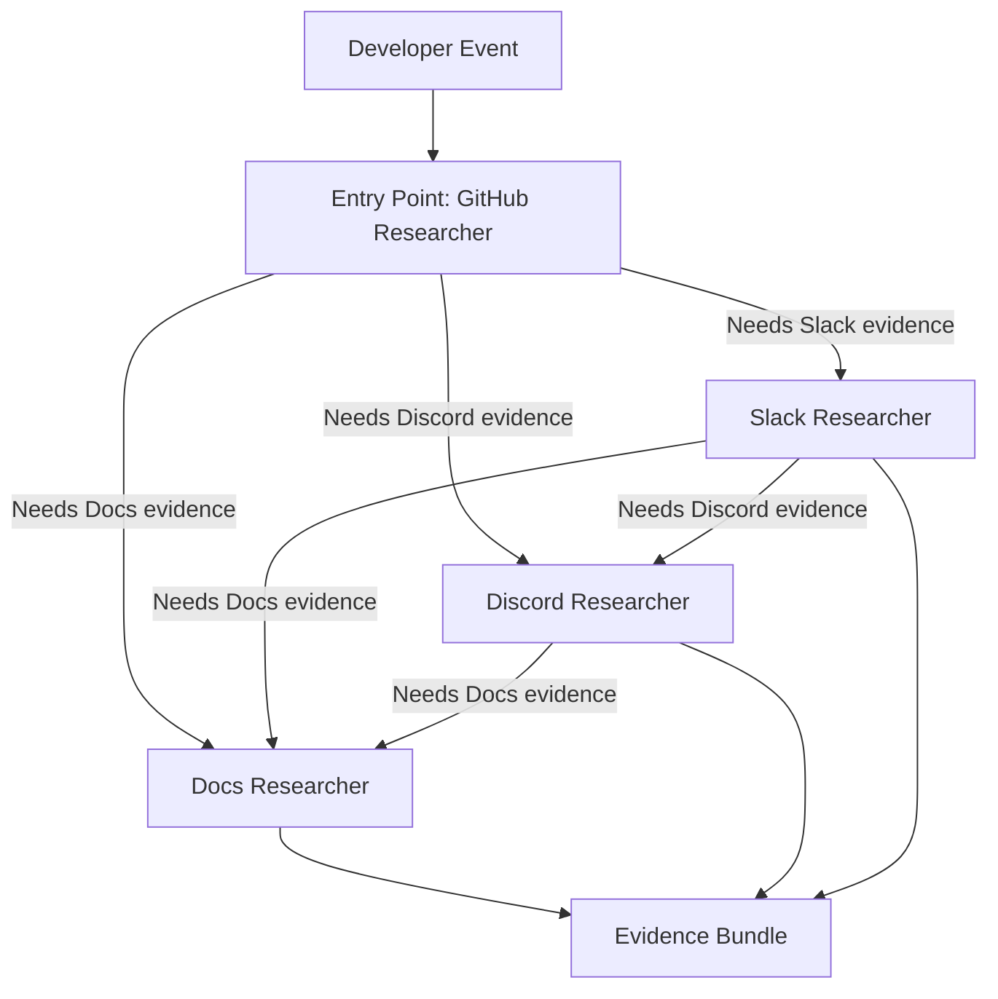
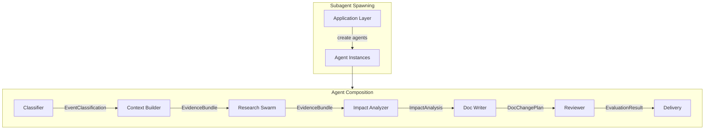
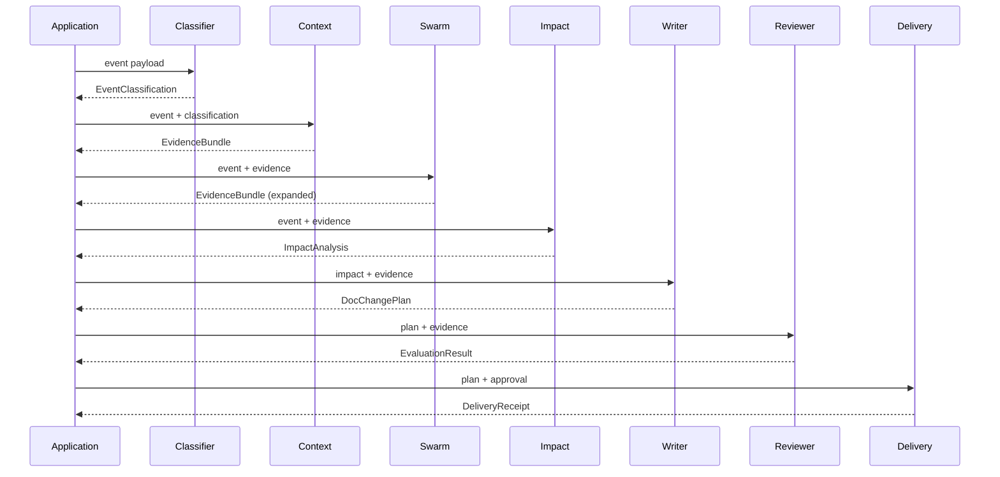

# Subagents

> **Status:** Implemented
> **Date:** 2026-08-25
> **Scope:** Research Swarm architecture, shared agents, subagent spawning, and context passing

## 1. Overview

Draftly's subagent system enables parallel and sequential agent execution through two mechanisms: the Research Swarm for parallel evidence collection, and shared agents for cross-cutting concerns (classification, context building, delivery, memory). Subagents are spawned by the application layer and receive shared context through the `invocation_state` dictionary and task payloads.

## 2. Research Swarm Architecture

The Research Swarm is a Strands `Swarm` of four channel-scoped researchers that collaborate to gather evidence across multiple sources. The swarm uses automatic handoffs to route research tasks to the most appropriate researcher based on the evidence needed.



### 2.1 Researcher Specifications

| Researcher | Name | Tools | Scope |
|------------|------|-------|-------|
| `github_researcher` | `github_researcher` | `github_intelligence` | GitHub issues, PRs, diffs, code |
| `slack_researcher` | `slack_researcher` | `slack_search`, `slack_get_thread` | Slack conversation history |
| `discord_researcher` | `discord_researcher` | `discord_search`, `discord_get_thread` | Discord conversation history |
| `docs_researcher` | `docs_researcher` | `semantic_search`, `keyword_search`, `hybrid_search` | Documentation store coverage |

### 2.2 Swarm Configuration

The swarm is configured with safety limits and handoff detection:

```python
Swarm(
    [github_agent, slack_agent, discord_agent, docs_agent],
    entry_point=github_agent,
    max_handoffs=20,
    max_iterations=20,
    execution_timeout=900.0,
    node_timeout=300.0,
    repetitive_handoff_detection_window=8,
    repetitive_handoff_min_unique_agents=3,
)
```

| Parameter | Value | Purpose |
|-----------|-------|---------|
| `entry_point` | `github_agent` | Initial researcher for all events |
| `max_handoffs` | 20 | Maximum agent-to-agent handoffs |
| `max_iterations` | 20 | Maximum total iterations |
| `execution_timeout` | 900s | Total swarm execution timeout |
| `node_timeout` | 300s | Per-researcher timeout |
| `repetitive_handoff_detection_window` | 8 | Window for detecting repetitive handoffs |
| `repetitive_handoff_min_unique_agents` | 3 | Minimum unique agents before triggering detection |

### 2.3 Handoff Behavior

Researchers hand off to each other when they need evidence from a different source. The entry point (`github_researcher`) always runs first, then hands off to other researchers as needed. The swarm tracks handoffs to prevent infinite loops through repetitive handoff detection.

## 3. Shared Agents

Shared agents provide cross-cutting functionality used by all agent families. They are spawned independently and produce structured output consumed by downstream agents.

### 3.1 Classifier Agent

| Property | Value |
|----------|-------|
| Name | `event_classifier` |
| File | `shared/classifier.py` |
| Tools | None (pure reasoning) |
| Output | `EventClassification` |

Classifies incoming events by surface (pull_request, issue, support_question) and determines change type and urgency.

### 3.2 Context Builder Agent

| Property | Value |
|----------|-------|
| Name | `context` |
| File | `shared/context.py` |
| Tools | GitHub, search, docs tools |
| Output | `EvidenceBundle` |

Gathers evidence from GitHub, search, and documentation stores. Produces a bundle of items with source references.

### 3.3 Delivery Agent

| Property | Value |
|----------|-------|
| Name | `delivery` |
| File | `shared/delivery.py` |
| Tools | Delivery tools |
| Output | `DeliveryReceipt` |
| Interventions | `HumanInTheLoop` |

Delivers the final output (PR, reply, or message) with Human-in-the-Loop defense-in-depth. The HITL intervention requires explicit approval before delivery.

### 3.4 GitHub Delivery Agent

| Property | Value |
|----------|-------|
| Name | `github_delivery` |
| File | `shared/github_delivery.py` |
| Tools | GitHub delivery tools |
| Output | `DeliveryReceipt` |

Opens documentation pull requests on GitHub. Handles branch creation, commits, and PR opening.

### 3.5 Memory Curator Agent

| Property | Value |
|----------|-------|
| Name | `memory_curator` |
| File | `shared/memory_curator.py` |
| Tools | Memory tools |
| Output | JSON decisions |

Curates long-term memory candidates into durable knowledge. Decides actions: CREATE, UPDATE, MERGE, SUPERSEDE, REJECT, or ARCHIVE.

### 3.6 Memory Grounding Wrapper

| Property | Value |
|----------|-------|
| Name | `grounded` |
| File | `shared/memory_grounding.py` |
| Type | `MultiAgentBase` wrapper |

Wraps any agent or node to prepend recalled memory as grounding context. Merges knowledge, episodes, and procedures into a single grounding block. Degrades silently when memory is unavailable.

**Grounding Limits:**
- `MAX_GROUNDING_ITEMS`: 5 total items
- `MAX_EPISODE_ITEMS`: 2 episodes
- `MAX_PROCEDURE_ITEMS`: 1 procedure

## 4. Subagent Spawning and Composition

Subagents are spawned by the application layer and composed into workflows. The typical composition follows a directed graph where each agent's output becomes the next agent's input.



### 4.1 Spawning Pattern

Agents are spawned using factory functions that accept a model and optional tools:

```python
# Shared agents
classifier = build_classifier(model)
context = build_context_agent(model, tools)
delivery = build_delivery_agent(model, tools, hitl=True)

# Documentation agents
impact = build_impact_agent(model, tools)
writer = build_writer_agent(model, tools)
reviewer = build_reviewer_agent(model, tools)

# Research swarm
swarm = build_research_swarm(model, tools)
```

### 4.2 Composition Pattern

Agents are composed sequentially, with each agent's output passed as input to the next:



## 5. Shared Context Passing

Context is passed between agents through two mechanisms: the `invocation_state` dictionary and task payloads.

### 5.1 Invocation State

The `invocation_state` dictionary carries cross-cutting context like repository configuration, database handles, and policy references. It is passed to each agent's `invoke_async()` method.

### 5.2 Task Payloads

Agents communicate through task payloads that carry structured output from one agent to the next. The typical flow:

1. **Classifier** → `EventClassification` (surface, change_type, urgency)
2. **Context** → `EvidenceBundle` (items, summary)
3. **Research Swarm** → `EvidenceBundle` (expanded with cross-source evidence)
4. **Impact Analyzer** → `ImpactAnalysis` (action, affected_documents, rationale)
5. **Writer** → `DocChangePlan` (files, commit_message, summary)
6. **Reviewer** → `EvaluationResult` (passed, score, reasons)
7. **Delivery** → `DeliveryReceipt` (delivered_to, surface, reference, status)

### 5.3 Memory Grounding

The `MemoryGroundedNode` wrapper adds memory context to any agent's task. It recalls knowledge, episodes, and procedures and prepends them as grounding context:

```
Relevant organizational knowledge:
- [knowledge item 1]
- [knowledge item 2]
Similar past episode:
- [episode summary]
Applicable procedure: [procedure description]

[original task]
```

## 6. File Reference

| Path | Description |
|------|-------------|
| `src/draftly/agents/subagents.py` | Research Swarm builder |
| `src/draftly/agents/shared/classifier.py` | Event classifier agent |
| `src/draftly/agents/shared/context.py` | Context builder agent |
| `src/draftly/agents/shared/research.py` | Channel-scoped researchers |
| `src/draftly/agents/shared/delivery.py` | Delivery agent with HITL |
| `src/draftly/agents/shared/github_delivery.py` | GitHub PR delivery agent |
| `src/draftly/agents/shared/memory_curator.py` | Memory curator agent |
| `src/draftly/agents/shared/memory_grounding.py` | Memory grounding wrapper |
