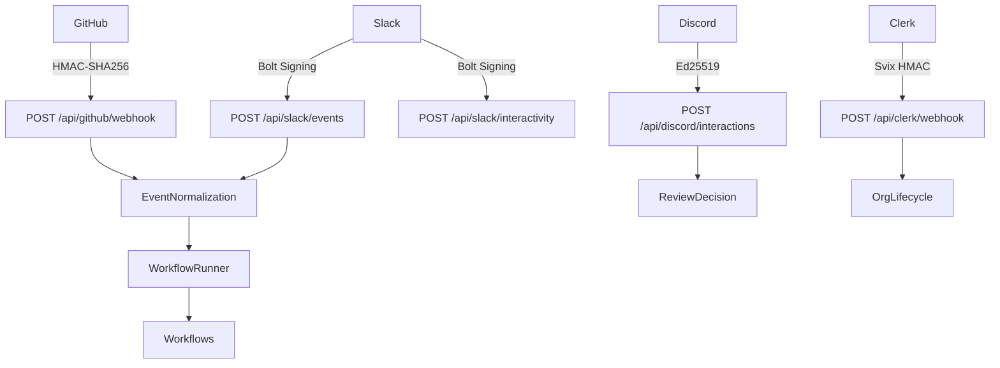

# Webhook Endpoints

> **Status:** Implemented
> **Date:** 2026-08-25
> **Scope:** Webhook endpoints for GitHub, Slack, Discord, and Clerk — verification, event handling, and normalization

## 1. Overview

Draftly receives webhook events from four platforms — GitHub, Slack, Discord, and Clerk — to trigger documentation workflows, support responses, and organization lifecycle management. Each platform uses a distinct signature verification scheme before events are normalized into a common envelope and dispatched to the workflow runner.

Webhook endpoints are the primary entry point for event-driven automation. They do not require Clerk JWT authentication — instead, they verify platform-specific cryptographic signatures to prove authenticity.

## 2. GitHub Webhooks

**Endpoint:** `POST /api/github/webhook`

### 2.1 Signature Verification

GitHub signs every webhook payload with HMAC-SHA256 using the configured `github_webhook_secret`. The signature arrives in the `X-Hub-Signature-256` header as `sha256=<hex-digest>`. Verification is performed by `verify_webhook_signature` from the GitHub integration module before the body is parsed.

### 2.2 Supported Events

| Event Type | Header | Actions Handled | Workflow |
|------------|--------|----------------|----------|
| `installation` | `X-GitHub-Event: installation` | `created`, `deleted` | GitHub App lifecycle — stores or removes installation records |
| `pull_request` | `X-GitHub-Event: pull_request` | `opened`, `closed`, `synchronize`, `reopened` | Documentation update workflow |
| `issue` | `X-GitHub-Event: issue` | `opened`, `closed`, `reopened`, `edited` | GitHub issue response workflow |
| `issue_comment` | `X-GitHub-Event: issue_comment` | `created`, `edited` | Issue comment processing |
| `pull_request_review` | `X-GitHub-Event: pull_request_review` | `submitted`, `edited`, `dismissed` | PR review activity |
| `release` | `X-GitHub-Event: release` | `published`, `created`, `edited` | Release documentation workflow |
| `push` | `X-GitHub-Event: push` | Any branch push with commits | Incremental documentation sync |
| `repository` | `X-GitHub-Event: repository` | `created`, `updated` | Repository configuration |

### 2.3 Event Flow

1. Raw body and `X-Hub-Signature-256` header are extracted
2. Signature is verified against `github_webhook_secret`
3. Body is parsed as JSON
4. `X-GitHub-Event` header determines the event type
5. `X-GitHub-Delivery` header provides the delivery ID for idempotency
6. `installation` events are handled inline (not dispatched to workflow runner)
7. All other events are normalized via `EventComposition.normalize_github(payload)` into a common event envelope
8. The normalized event is dispatched to `WorkflowRunner.run()` as a background task

### 2.4 Installation Events

Installation events manage the Draftly ↔ GitHub App relationship:

- **`created`**: Looks up the org by `github_org` login, stores the installation record with repository list
- **`deleted`**: Removes the installation record from the database

These events bypass the workflow runner because they affect infrastructure state, not documentation content.

### 2.5 GitHub App OAuth Flow

The GitHub integration includes several endpoints for the installation lifecycle:

| Endpoint | Method | Purpose |
|----------|--------|---------|
| `/api/github/install-url` | GET | Returns the GitHub App installation URL |
| `/api/github/setup-callback` | GET | Redirect handler after GitHub App installation |
| `/api/github/link` | POST | Links an installation to a Clerk organization |
| `/api/github/installations` | GET | Lists installations for the current org |
| `/api/github/installations/{id}` | DELETE | Removes an installation link |

## 3. Slack Webhooks

### 3.1 Endpoints

| Endpoint | Method | Purpose |
|----------|--------|---------|
| `/api/slack/events` | POST | Slack Events API (messages, app mentions) |
| `/api/slack/interactivity` | POST | Slack interactivity webhooks (button clicks, dropdowns) |
| `/api/slack/oauth/callback` | GET | OAuth callback after Slack app installation |
| `/api/slack/install-url` | GET | Returns the Slack OAuth authorize URL |
| `/api/slack/link` | POST | Links a Slack workspace to a Clerk organization |
| `/api/slack/installations` | GET | Lists Slack installations |
| `/api/slack/installations/{team_id}` | DELETE | Removes a Slack installation link |

### 3.2 Verification

Slack verification is handled by the Bolt framework's `AsyncSlackRequestHandler`, which validates the signing secret automatically. The `WebhookVerifier.verify_slack` method provides an additional verification path:

- Constructs the base string: `v0:<timestamp>:<body>`
- Computes HMAC-SHA256 with the signing secret
- Compares against `v0=<hex>` in the `X-Slack-Signature` header
- Enforces a 300-second replay window via `X-Slack-Request-Timestamp`

### 3.3 Event Handling

The Bolt app is lazily initialized with:

- `SlackInstallationStore` for OAuth token persistence
- `SlackAppDeps` providing database access to handlers
- Registered event and interaction handlers via `register_handlers()`

Events are processed by Bolt's built-in middleware chain (signature verification, url verification challenge handling) before reaching Draftly's custom handlers.

### 3.4 OAuth Flow

1. Frontend redirects to `/api/slack/install-url` to get the authorize URL
2. User authorizes the Slack app
3. Slack redirects to `/api/slack/oauth/callback` with an authorization code
4. Code is exchanged for bot token and user token via `oauth.v2.access`
5. `Installation` object is persisted via `SlackInstallationStore`
6. User is redirected to the frontend integration page

## 4. Discord Webhooks

**Endpoint:** `POST /api/discord/interactions`

### 4.1 Signature Verification

Discord uses Ed25519 digital signatures. The `WebhookVerifier.verify_discord` method:

1. Reads `X-Signature-Timestamp` and `X-Signature-Ed25519` headers
2. Constructs the message: `<timestamp><body>`
3. Verifies using the configured `discord_public_key` via PyNaCl's `VerifyKey`

### 4.2 Interaction Types

| Type | Code | Behavior |
|------|------|----------|
| PING | `1` | Returns `{"type": 1}` to confirm the endpoint is alive |
| Component | `3` | Processes button clicks for documentation review decisions |

### 4.3 Review Decision Handling

Component interactions map `custom_id` prefixes to review actions:

| Custom ID Prefix | Action | Result Status |
|------------------|--------|---------------|
| `discord_approve` | Approve | Approved |
| `discord_reject` | Reject | Rejected |
| `discord_revise` | Request changes | Changes Requested |
| `discord_feedback` | Request changes | Changes Requested |

The handler:
1. Parses `custom_id` as `action_prefix:short_key`
2. Resolves the `short_key` to a full review UUID via `resolve_interaction_token`
3. Extracts the reviewer's Discord user ID from the payload
4. Calls `ReviewDecisionService.decide()` to record the decision
5. Returns an `UPDATE_MESSAGE` response (type 7) with an updated embed showing the decision

### 4.4 Discord Integration Endpoints

| Endpoint | Method | Purpose |
|----------|--------|---------|
| `/api/discord/invite-url` | GET | Returns the bot invite URL with required permissions |
| `/api/discord/link` | POST | Links a Discord guild to a Clerk organization |
| `/api/discord/status` | GET | Returns Discord connection status for the current org |
| `/api/discord/channels` | GET | Fetches text channels from the linked guild |
| `/api/discord/trigger-channels` | GET | Returns configured trigger channels |
| `/api/discord/trigger-channels` | POST | Sets trigger channels for the current org |
| `/api/discord/link` | DELETE | Removes the Discord guild link |

## 5. Clerk Webhooks

**Endpoint:** `POST /api/clerk/webhook`

### 5.1 Signature Verification

Clerk uses Svix for webhook delivery. The `verify_svix_signature` function:

1. Reads `svix-id`, `svix-timestamp`, and `svix-signature` headers
2. Decodes the `whsec_`-prefixed signing secret from `CLERK_SIGNING_SECRET`
3. Constructs the signed content: `{svix_id}.{svix_timestamp}.{body}`
4. Computes HMAC-SHA256 and compares against `v1,<signature>` tokens

### 5.2 Supported Events

| Event Type | Action |
|------------|--------|
| `organization.created` | Creates or retrieves the organization record via `get_or_create_org_by_clerk` |
| `organization.deleted` | Deletes the organization from the database |
| `organization.updated` | Updates the organization name in the database |

### 5.3 Event Flow

1. Raw body and all Svix headers are extracted
2. Signature is verified against `CLERK_SIGNING_SECRET`
3. Payload is parsed as JSON
4. `type` field determines the event type
5. `data` field contains the organization details
6. Event is processed inline (no workflow dispatch)

## 6. Event Normalization and Dispatch

All platform-specific events (except Clerk and GitHub installation events) flow through the `EventComposition` normalization pipeline:

1. **Platform Processor**: Extracts relevant fields from the raw payload (PR details, issue title, message text, etc.)
2. **Event Envelope**: Wraps normalized data in a common structure with `event_id`, `source`, `event_type`, `surface`, and `payload`
3. **Event Dispatcher**: Routes the envelope to the correct workflow surface based on the event type
4. **Workflow Runner**: Claims the event (idempotency check), builds the execution graph, and invokes the workflow

| Platform | Processor | Surfaces |
|----------|-----------|----------|
| GitHub | `PullRequestProcessor`, `IssueProcessor`, `ReleaseProcessor`, `PushProcessor` | `github_pr`, `github_issue`, `github_release` |
| Slack | `SlackProcessor` | `slack_support` |
| Discord | `DiscordProcessor` | `discord_support` |

## 7. File Reference

| File | Lines | Role |
|------|-------|------|
| `src/draftly/app/api/routes/github.py` | 439 | GitHub webhook + installation management |
| `src/draftly/app/api/routes/slack.py` | 164 | Slack events, interactivity, OAuth |
| `src/draftly/app/api/routes/discord.py` | 394 | Discord interactions, guild management |
| `src/draftly/app/api/routes/clerk.py` | 100 | Clerk organization lifecycle webhooks |
| `src/draftly/security/webhook_verification.py` | 107 | `WebhookVerifier` (GitHub HMAC, Slack v0, Discord Ed25519) |
| `src/draftly/integrations/slack/app.py` | — | Bolt app construction and handler registration |
| `src/draftly/integrations/discord/interactions.py` | — | Discord interaction token resolution |
| `src/draftly/integrations/github/app_auth.py` | — | GitHub App JWT auth, installation tokens |
| `src/draftly/app/composition/events.py` | 73 | `EventComposition`, platform processors |
