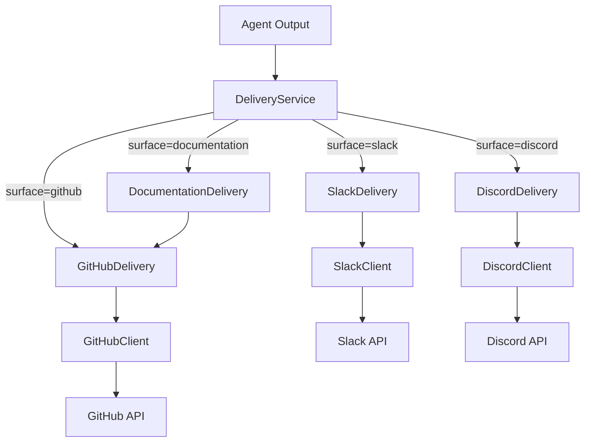
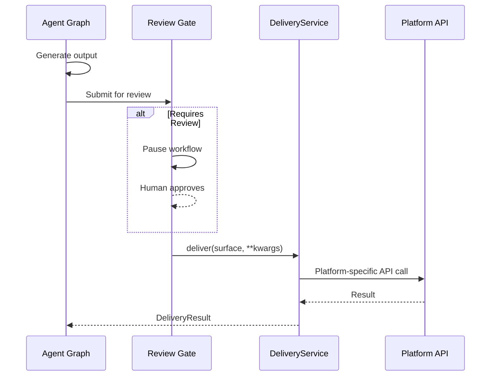

# Delivery Subsystem

> **Status:** Implemented
> **Date:** 2026-08-25
> **Scope:** Routing agent output to platform surfaces via the DeliveryService facade

## 1. Overview

The delivery subsystem is responsible for taking agent-generated output — documentation changes, support responses, analysis results — and routing them to the correct external platform. It acts as the final output stage in Draftly's pipeline: after an event has been classified, processed by specialized agents, and (optionally) reviewed by a human, the delivery service dispatches the result to GitHub, Slack, Discord, or documentation-specific surfaces.

The subsystem follows a facade pattern. `DeliveryService` provides a single `deliver()` entry point that routes to the appropriate surface handler based on a `surface` string parameter. Each surface handler (GitHub, Slack, Discord, Documentation) is a standalone class that wraps the corresponding integration client and translates Draftly's domain models into platform API calls.

## 2. DeliveryService Facade

`DeliveryService` (`delivery/service.py`) is the single entry point for all delivery operations. It composes the four surface handlers and delegates to the correct one based on the `surface` parameter:

| Surface | Handler | Method |
|---------|---------|--------|
| `"github"` | `GitHubDelivery` | `deliver()` |
| `"slack"` | `SlackDelivery` | `post_message()` |
| `"discord"` | `DiscordDelivery` | `post_message()` |
| `"documentation"` | `DocumentationDelivery` | `deliver_plan()` |

An unknown surface string raises `ValueError`. The service also exposes a convenience `deliver_documentation()` method that directly invokes `DocumentationDelivery.deliver_plan()`.

All surface handlers are instantiated in the constructor with sensible defaults (each handler creates its own client if none is provided), making the service easy to use with zero configuration while remaining testable via dependency injection.

## 3. GitHub Delivery

`GitHubDelivery` (`delivery/github.py`) handles the most complex delivery path: creating a branch, committing files, and opening a pull request. It exposes three levels of granularity:

- **`commit_changes()`** — Creates a working branch (`draftly/docs-{hex}`) off the base branch, commits a list of file changes, and returns a `CommitResult`.
- **`create_pull_request()`** — Opens a PR from the working branch into the base branch, returning a `PullRequestResult`.
- **`deliver()`** — Composes both steps into a single call (branch → commit → PR), which is the standard entry point used by the workflow delivery node.

The working branch is named `draftly/docs-{random_hex[:8]}` by default. The handler resolves the base SHA from the repository's default branch ref if not explicitly provided.

## 4. Slack Delivery

`SlackDelivery` (`delivery/slack.py`) provides three operations:

- **`post_message()`** — Sends a message to a channel, optionally in a thread.
- **`reply_in_thread()`** — Replies within an existing thread by `thread_ts`.
- **`add_reaction()`** — Adds an emoji reaction to a message (defaults to `:white_check_mark:`).

All methods delegate to `SlackClient`, which wraps the Slack Web API.

## 5. Discord Delivery

`DiscordDelivery` (`delivery/discord.py`) mirrors Slack's interface with Discord-specific semantics:

- **`post_message()`** — Sends a message to a channel, optionally in a thread.
- **`reply_in_thread()`** — Replies in an existing thread by `thread_id`.
- **`create_thread()`** — Creates a new thread from an existing message.

All methods delegate to `DiscordClient`, which wraps the Discord REST API.

## 6. Documentation Delivery

`DocumentationDelivery` (`delivery/documentation.py`) is a higher-level handler that transforms a `DocChangePlan` into a GitHub pull request. It:

1. Extracts `{path, content}` pairs from the plan's changes list.
2. Constructs a PR body with a summary header and a file-change list.
3. Delegates to `GitHubDelivery.deliver()` with a title prefixed `docs:`.

This handler always goes through `GitHubDelivery` — documentation updates are delivered as PRs regardless of other surface targets.

## 7. Delivery Models

Three Pydantic models represent delivery outcomes (`delivery/models.py`):

| Model | Purpose | Key Fields |
|-------|---------|------------|
| `DeliveryPlan` | Planned documentation delivery | `id`, `repository_id`, `summary`, `changes`, `status` |
| `CommitResult` | Result of a git commit | `branch`, `commit_sha`, `message`, `files` |
| `PullRequestResult` | Result of a pull request | `owner`, `repository`, `number`, `url`, `title`, `branch` |

All models use `ConfigDict(extra="allow")` to remain forward-compatible with platform-specific metadata.

## 8. Delivery Flow

The end-to-end delivery flow follows this sequence:

The review gate is optional — `ReviewPolicy` determines whether a given workflow requires human approval before delivery proceeds.

## File Reference

| File | Role |
|------|------|
| `src/draftly/delivery/service.py` | `DeliveryService` facade |
| `src/draftly/delivery/models.py` | `DeliveryPlan`, `CommitResult`, `PullRequestResult` |
| `src/draftly/delivery/github.py` | `GitHubDelivery` — branch, commit, PR |
| `src/draftly/delivery/slack.py` | `SlackDelivery` — messages, threads, reactions |
| `src/draftly/delivery/discord.py` | `DiscordDelivery` — messages, threads |
| `src/draftly/delivery/documentation.py` | `DocumentationDelivery` — plan-to-PR |
