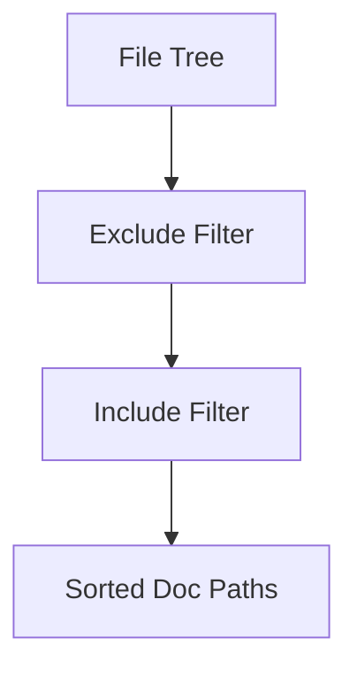
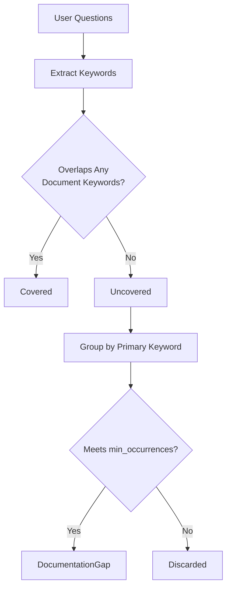
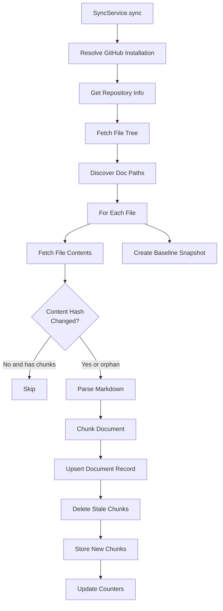
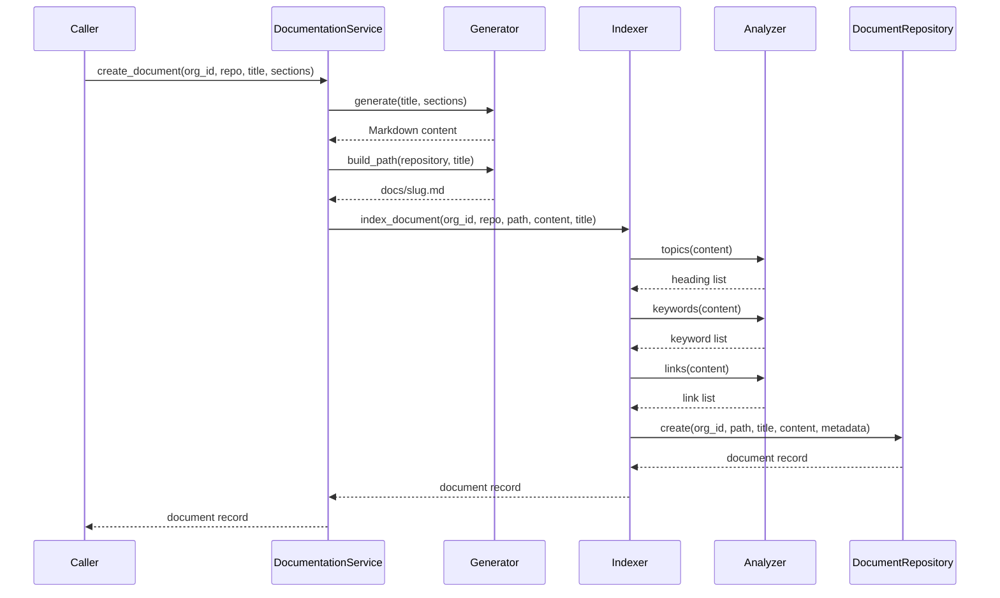
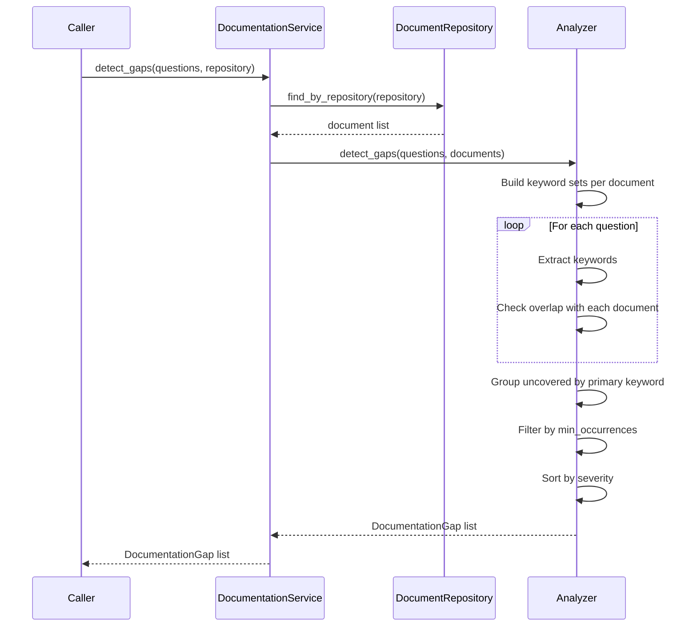

# Documentation Pipeline

> **Status:** Implemented
> **Date:** 2026-08-25
> **Scope:** Documentation subsystem — discovery, parsing, chunking, analysis, generation, indexing, validation, updating, and GitHub sync

## 1. Overview

The documentation pipeline keeps a repository's documentation in sync with its codebase. It discovers Markdown files via glob patterns, parses them into structured heading trees, chunks content for embedding, detects gaps between user questions and existing docs, generates new pages from templates, validates link integrity and freshness, and indexes everything for semantic search.

The pipeline has two primary entry points: `DocumentationService` (a facade over the individual components) and `SyncService` (an orchestrator that pulls documentation from GitHub, processes it through the full pipeline, and stores chunks in the memory system). Both rely on the same underlying modules — discovery, parser, chunker, analyzer, generator, indexer, validator, and updater — which are designed as composable, stateless components.

## 2. Data Models

The documentation subsystem defines three Pydantic models in `models.py` that flow through the pipeline:

| Model | Purpose | Key Fields |
|-------|---------|------------|
| `DocumentInfo` | A documentation page under management | `repository`, `path`, `title`, `content`, `metadata`, `updated_at` |
| `DocumentationGap` | An identified hole in the documentation | `topic`, `occurrences`, `severity`, `sample_questions` |
| `ValidationResult` | Outcome of link/freshness validation | `path`, `valid`, `broken_links`, `stale_days`, `issues` |

`DocumentInfo` uses `extra="allow"` so downstream consumers can attach arbitrary metadata (e.g., `source_url`, `chunk_count`, `branch`).

## 3. Discovery

`discover_documentation()` (`discovery.py`) classifies file paths into documentation vs. non-documentation using glob patterns. It is a pure function with no I/O — it receives a pre-fetched list of paths and returns the filtered subset.

The function applies exclude patterns first (e.g., `node_modules/**`, `dist/**`), then include patterns (e.g., `docs/**`, `*.md`, `README.md`). Directory globs ending in `/**` match both the prefix directory and anything beneath it. Results are returned sorted for deterministic processing order.

## 4. Parser

The parser (`parser.py`) converts raw Markdown into a `ParseResult` containing a heading tree built from `HeadingNode` dataclasses. Each node tracks its level (1–6), text, start/end line numbers, and children.

The parser uses a stack-based algorithm: as it scans lines with a heading regex (`^#{1,6}\s+(.+)$`), it pops nodes from the stack when a heading of equal or higher level is encountered, closing their `end_line`. The first H1 encountered becomes `ParseResult.title`. Closed root-level nodes are appended to `result.headings`.

The line offsets are critical — they allow the chunker to slice exact content ranges without overlap.

## 5. Chunker

The chunker (`chunker.py`) splits a parsed Markdown document into heading-bounded `Chunk` objects. Each chunk contains:

- `heading` — the section title (with `(part N)` suffix when split)
- `heading_path` — breadcrumb like `"Getting Started > Installation > Requirements"`
- `content` — the raw Markdown text
- `start_line` / `end_line` — line offsets for source mapping

The chunking algorithm:

1. **Flatten** the heading tree depth-first, building heading paths as it goes. H1 is excluded from child paths (sections start at H2+).
2. **Slice** each node's content from its heading line to the next heading in document order. Empty sections (pure container headings) produce no chunk.
3. **Split** oversized content at paragraph boundaries when it exceeds `DEFAULT_MAX_CHARS` (1200 characters).

This produces non-overlapping chunks suitable for embedding and retrieval.

## 6. Analyzer

The analyzer (`analyzer.py`) performs static analysis over indexed documents. It provides three extraction methods and one gap detection method:

| Method | Purpose |
|--------|---------|
| `topics(content)` | Extract H1–H3 headings as the topic inventory |
| `links(content)` | Extract all Markdown link targets |
| `keywords(text, limit)` | Extract top keywords by frequency, excluding stopwords |
| `detect_gaps(questions, documents)` | Identify topics not covered by any document |

### Gap Detection

`detect_gaps` clusters incoming user questions into topics that no existing document covers. For each document, it builds a keyword set from the title, path, headings, and top keywords. Each question is checked against every document's keyword set — if no overlap exists, the question is flagged as uncovered. Uncovered questions are grouped by their primary keyword, and clusters that meet the `min_occurrences` threshold become `DocumentationGap` instances sorted by severity.

## 7. Generator

The generator (`generator.py`) assembles new Markdown pages from structured inputs. It produces deterministic scaffolding — front matter with title and timestamp, followed by H1 title and H2 sections with body text.

Key methods:

| Method | Purpose |
|--------|---------|
| `slugify(title)` | Convert a title to a URL-safe slug |
| `generate(title, sections, front_matter)` | Render a complete Markdown page |
| `build_path(repository, title)` | Produce a `docs/{slug}.md` file path |

The generator does not perform LLM drafting — that responsibility belongs to the agent graph. This service turns an approved plan into a valid page.

## 8. Indexer

The indexer (`indexer.py`) upserts documents into the `DocumentRepository` with extracted metadata. For each document, it calls the analyzer to populate `topics`, `keywords`, and `links` in the metadata dict.

Two operations:

| Method | Purpose |
|--------|---------|
| `index_document(org_id, repository, path, content)` | Index a single document with metadata |
| `reindex_repository(repository)` | Refresh metadata for every indexed document in a repo |

## 9. Validator

The validator (`validator.py`) performs two quality checks on indexed documents:

**Link checking:** `check_links()` extracts relative Markdown links and verifies they exist in `known_paths`. External URLs, anchors, and mailto links are skipped. Broken relative links are returned as a list.

**Freshness checking:** `check_freshness()` calculates days since the document's last update. Documents older than `stale_after_days` (default: 90) are flagged as stale.

The `validate()` method combines both checks into a single `ValidationResult`.

## 10. Updater

The updater (`updater.py`) applies targeted edits to indexed documents with diff tracking. Two mutation methods:

| Method | Purpose |
|--------|---------|
| `append_section(document_id, heading, body)` | Append a new H2 section to an existing document |
| `replace_content(document_id, new_content)` | Replace the entire content of a document |

Both methods record a `last_change` metadata key and return a unified diff (via `difflib.unified_diff`) in the result for audit purposes.

## 11. DocumentationService Facade

`DocumentationService` (`service.py`) is a facade that wires together the analyzer, indexer, validator, generator, and updater behind a unified interface. It owns the `DocumentRepository` instance and passes it to each component.

| Method | Components Used |
|--------|-----------------|
| `documents_for(repository)` | Repository lookup |
| `detect_gaps(questions, repository)` | Repository + Analyzer |
| `validate_repository(repository)` | Repository + Validator |
| `create_document(org_id, repository, title, sections)` | Generator + Indexer |

## 12. SyncService

`SyncService` (`sync_service.py`) orchestrates the full documentation sync from a GitHub repository to Draftly's storage. It is the primary entry point for scheduled documentation updates.

### Sync Flow

### Hash-Based Skip

Each file's content is SHA-256 hashed. If the hash matches the stored `source_hash` and the document has chunks (`chunk_count > 0`), the file is skipped. This avoids redundant reprocessing on repeated syncs. Orphaned documents (those with a stored hash but no chunks, e.g., from a crashed mid-file run) are reprocessed.

### Chunk Storage

For each processed file, the service:

1. Deletes existing chunks for the document from the `DOCUMENTS` memory namespace
2. Creates `Document` model instances with metadata (document_id, heading_path, line offsets, commit_sha)
3. Stores all chunks in a single `store_batch` call

### SyncResult

The sync operation returns a `SyncResult` dataclass:

| Field | Description |
|-------|-------------|
| `commit_sha` | The commit that was synced |
| `repository` | Repository full name |
| `document_count` | Files processed |
| `section_count` | Total headings across all files |
| `chunk_count` | Total chunks created |
| `skipped_count` | Files skipped (unchanged) |
| `failed_files` | Files that failed processing |
| `baseline` | The `BaselineSnapshot` created |

## 13. Baseline Snapshots

`BaselineSnapshot` (`baseline.py`) records the state of a successful sync for change detection. It captures:

| Field | Purpose |
|-------|---------|
| `commit_sha` | Git commit that was synced |
| `repository` | Repository full name |
| `document_count` | Number of documents processed |
| `section_count` | Number of sections (headings) |
| `chunk_count` | Number of chunks created |
| `include` / `exclude` | Glob patterns used for discovery |
| `synced_at` | Timestamp of the sync |

Baselines are created by `create_baseline()` at the end of every successful `SyncService.sync()` call. They enable downstream consumers to compare the current state against a known-good snapshot.

## 14. Sequence Diagram: Documentation Generation Request

## 15. Gap Detection Sequence

## 16. File Reference

| File | Lines | Role |
|------|-------|------|
| `src/draftly/documentation/__init__.py` | 30 | Lazy exports (PEP 562) |
| `src/draftly/documentation/models.py` | 48 | `DocumentInfo`, `DocumentationGap`, `ValidationResult` |
| `src/draftly/documentation/discovery.py` | 35 | Glob-based file discovery |
| `src/draftly/documentation/parser.py` | 74 | Markdown heading tree parser |
| `src/draftly/documentation/chunker.py` | 106 | Heading-bounded content chunking |
| `src/draftly/documentation/analyzer.py` | 96 | Topic extraction, gap detection |
| `src/draftly/documentation/generator.py` | 53 | Markdown page generation |
| `src/draftly/documentation/indexer.py` | 69 | Document indexing with metadata |
| `src/draftly/documentation/validator.py` | 72 | Link checking, freshness validation |
| `src/draftly/documentation/updater.py` | 68 | Targeted content updates with diff |
| `src/draftly/documentation/service.py` | 76 | `DocumentationService` facade |
| `src/draftly/documentation/sync_service.py` | 194 | GitHub-to-Draftly sync orchestrator |
| `src/draftly/documentation/baseline.py` | 45 | `BaselineSnapshot` for change detection |
