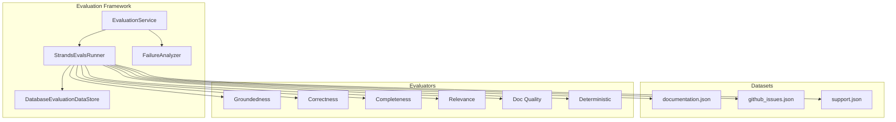

# Evaluation Subsystem

> **Status:** Implemented
> **Date:** 2026-08-25
> **Scope:** Scoring agent outputs against golden datasets using LLM judges and deterministic evaluators

## 1. Overview

The evaluation subsystem measures the quality of Draftly's agent outputs by running them against curated golden datasets and scoring each result with a configurable set of evaluators. It serves two purposes: as a CI regression gate (batch mode, run before deployment) and as a runtime quality signal (continuous mode, run per-workflow). The framework wraps Strands Evals (`strands_evals`) and adds Draftly-specific evaluators, dataset management, failure analysis, and persistent result storage.

Evaluation results feed into the memory system and inform review policies — a workflow with consistently low scores can be flagged for human review, while high-scoring workflows may bypass review gates entirely.



## 2. EvaluationService Facade

`EvaluationService` (`evaluation/service.py`) orchestrates the full evaluation pipeline:

1. Load a named dataset via `StrandsEvalsRunner.load_dataset()`.
2. Run the experiment via `run_and_persist()`, which executes evaluators against all cases and persists results.
3. Analyze failures via `FailureAnalyzer`, which categorizes failed cases into actionable buckets.
4. Return a summary dict containing the overall score, pass/fail counts, failure categories, and the dominant failure type.

The service accepts an optional `repository` for persistence and an `org_id` for multi-tenant result isolation.

## 3. Evaluators

Six evaluator types are available, split into LLM-judge evaluators and deterministic evaluators:

### LLM-Judge Evaluators

| Evaluator | Wraps | What It Measures |
|-----------|-------|-----------------|
| Groundedness | `FaithfulnessEvaluator` | Whether the output is supported by provided evidence |
| Correctness | `CorrectnessEvaluator` | Whether the output is factually accurate |
| Completeness | `OutputEvaluator` with rubric | Whether the output covers the full scope of the question |
| Relevance | `ResponseRelevanceEvaluator` | Whether the output addresses the actual question asked |

### Custom Evaluators

| Evaluator | What It Measures |
|-----------|-----------------|
| `DocumentationQualityEvaluator` | Citation coverage, topic coverage, and length heuristics using `compute_quality()` from the in-graph `EvaluatorNode` |

### Deterministic Evaluators

Re-exported from `strands_evals` for CI regression checks — no model keys required:

| Evaluator | What It Checks |
|-----------|---------------|
| `Contains` | Output contains expected substring |
| `Equals` | Output exactly matches expected value |
| `StartsWith` | Output starts with expected prefix |
| `ToolCalled` | Agent called a specific tool during execution |

All LLM-judge evaluators accept an optional `model` parameter, defaulting to the Strands SDK default. The `DocumentationQualityEvaluator` shares its scoring logic with the runtime `EvaluatorNode`, ensuring CI and production measure the same thing.

## 4. Golden Datasets

Datasets are stored as JSON files in `evaluation/datasets/` and loaded into `Case` objects:

| Dataset | File | Purpose |
|---------|------|---------|
| Documentation | `documentation.json` | Documentation Q&A quality |
| GitHub Issues | `github_issues.json` | Issue analysis and response quality |
| Support | `support.json` | Support ticket response quality |

Each dataset file contains a `cases` array where each case has:

```json
{
  "name": "case-identifier",
  "input": "user question or prompt",
  "expected_output": "expected answer or behavior",
  "metadata": { "evidence": [...], ... }
}
```

The runner also provides `load_all_datasets()` to iterate every `.json` file in the datasets directory, useful for full regression runs.

## 5. Evaluation Runner

`StrandsEvalsRunner` (`evaluation/runner.py`) wraps the Strands Evals `Experiment` class:

- **`run()`** — Executes an experiment (cases × evaluators) and returns a raw `EvaluationReport`.
- **`run_and_persist()`** — Runs the experiment, then persists a summary record to the evaluations repository.
- **`persist_report()`** — Writes the run summary (overall score, pass/fail metrics, per-case failures) to the `012_evaluations` database tables.

The runner also provides `run_dataset_sync()`, a deterministic offline runner for CI that uses the identity function as the system-under-test. This validates dataset shape and runner plumbing without requiring a live agent. It is executed via `asyncio.to_thread` because `Experiment.run_evaluations` calls `asyncio.run` internally.

## 6. Failure Analyzer

`FailureAnalyzer` (`evaluation/failure_analyzer.py`) categorizes failed cases into actionable buckets:

| Category | Trigger Keywords |
|----------|-----------------|
| `grounding` | evidence, citation, source, grounded, unsupported |
| `completeness` | incomplete, missing, omits, omitted, partial |
| `correctness` | incorrect, wrong, inaccurate, false, error |
| `relevance` | irrelevant, off-topic, unrelated, not address |
| `tone` | tone, professional, clarity, unclear |

The analyzer returns a `FailureAnalysis` dataclass containing:
- `total_failures` — count of failed cases
- `categories` — dict mapping category name to count
- `items` — list of categorized failure details
- `dominant_category()` — the category with the highest count

This analysis is used by the `EvaluationService` to identify systematic issues (e.g., "80% of failures are grounding-related, so we need better source retrieval").

## 7. Evaluation Store

`DatabaseEvaluationDataStore` (`evaluation/store.py`) implements the Strands Evals `EvaluationDataStore` protocol with an in-memory cache. The protocol methods (`load`/`save`) are synchronous, so durable persistence happens asynchronously in `StrandsEvalsRunner.persist_report()` after the experiment completes.

The store maintains a `dict[str, EvaluationData]` cache keyed by case name, allowing evaluators to read and write case-level results during an experiment run.

## 8. Integration with Memory System

Evaluation results feed back into Draftly's memory system. The `persist_report()` method writes to the `012_evaluations` tables, which are queried by the memory subsystem to:

- Track quality trends over time
- Inform review policy decisions (low-scoring workflows may require stricter review)
- Provide context for the failure analyzer's cross-run pattern detection

## File Reference

| File | Role |
|------|------|
| `src/draftly/evaluation/service.py` | `EvaluationService` facade |
| `src/draftly/evaluation/runner.py` | `StrandsEvalsRunner` — experiment execution and persistence |
| `src/draftly/evaluation/store.py` | `DatabaseEvaluationDataStore` — case-result cache |
| `src/draftly/evaluation/failure_analyzer.py` | `FailureAnalyzer` — failure categorization |
| `src/draftly/evaluation/evaluators/__init__.py` | Evaluator exports |
| `src/draftly/evaluation/evaluators/groundedness.py` | `build_groundedness_evaluator()` |
| `src/draftly/evaluation/evaluators/correctness.py` | `build_correctness_evaluator()` |
| `src/draftly/evaluation/evaluators/completeness.py` | `build_completeness_evaluator()` with rubric |
| `src/draftly/evaluation/evaluators/relevance.py` | `build_relevance_evaluator()` |
| `src/draftly/evaluation/evaluators/documentation_quality.py` | `DocumentationQualityEvaluator` |
| `src/draftly/evaluation/evaluators/deterministic.py` | `Contains`, `Equals`, `StartsWith`, `ToolCalled` |
| `src/draftly/evaluation/datasets/documentation.json` | Documentation golden dataset |
| `src/draftly/evaluation/datasets/github_issues.json` | GitHub issues golden dataset |
| `src/draftly/evaluation/datasets/support.json` | Support golden dataset |
