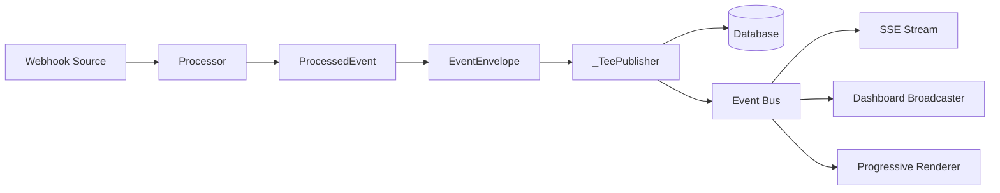
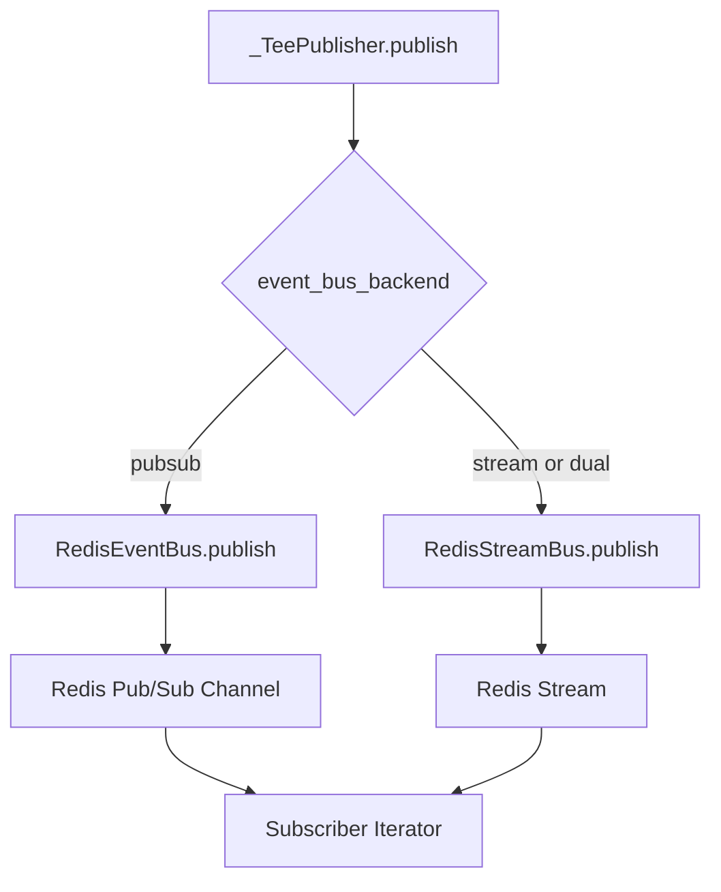
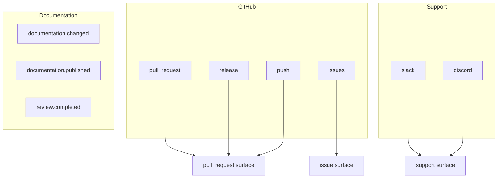
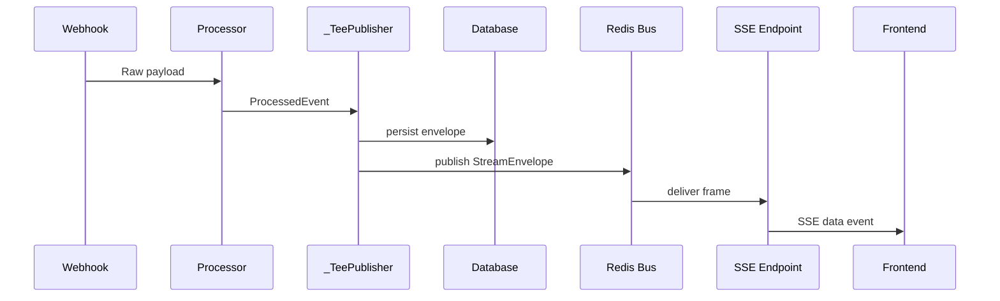

# Event-Driven Architecture

> **Status:** Implemented
> **Date:** 2026-08-25
> **Scope:** Webhook normalization, event dispatch, dual-mode Redis bus, SSE streaming, and dashboard broadcasting

## 1. Overview

Draftly's event layer transforms raw provider webhooks (GitHub, Slack, Discord) and internal documentation events into a normalized, typed event stream. Every incoming payload passes through a processor that implements the `BaseProcessor` ABC, producing a `ProcessedEvent` that downstream workflows, graph builders, and streaming consumers consume uniformly. The system uses a dual-mode Redis transport — Pub/Sub for ephemeral fan-out and Streams for durable delivery — selectable at startup via configuration.

Events flow through a pipeline: raw payload → processor → `EventEnvelope` → `_TeePublisher` (persist + publish) → `EventDispatcher` (workflow routing) → consumers (SSE, progressive rendering, dashboard). This architecture decouples webhook ingestion from processing logic, enables real-time streaming to frontends, and ensures event durability through database fallback.



## 2. EventType Enum

All event surfaces Draftly consumes or emits are declared in a single `StrEnum`. The string values serve as canonical prefixes used by processors, the dispatcher, and the deterministic routing classifiers.

| EventType | Value | Surface | Description |
|---|---|---|---|
| `GITHUB_PULL_REQUEST` | `pull_request` | pull_request | PR opened, closed, merged, labeled, etc. |
| `GITHUB_ISSUE` | `issues` | issue | Issue opened, closed, labeled, assigned, etc. |
| `GITHUB_RELEASE` | `release` | pull_request | Release published, edited, deleted |
| `GITHUB_PUSH` | `push` | pull_request | Branch push with commits |
| `SLACK_SUPPORT` | `slack` | support | Slack message event |
| `DISCORD_SUPPORT` | `discord` | support | Discord message create |
| `DOCUMENTATION_CHANGED` | `documentation.changed` | — | Internal doc file change detected |
| `DOCUMENTATION_PUBLISHED` | `documentation.published` | — | Doc delivery completed |
| `REVIEW_COMPLETED` | `review.completed` | — | Human approve/reject decision |

The `SURFACE_BY_EVENT_TYPE` mapping routes each `EventType` to its graph surface (`pull_request`, `issue`, or `support`), which `build_graph_for_run` uses to select the correct agent graph.

## 3. BaseProcessor ABC

Every processor implements a single contract: take a raw payload dict, return a `ProcessedEvent`. Processors are pure normalizers — no I/O, no graph knowledge.

```python
class BaseProcessor(ABC):
    event_type: str = ""

    @abstractmethod
    async def process(
        self, payload: dict[str, Any], *, event_id: str | None = None
    ) -> ProcessedEvent: ...

    def supports(self, payload: dict[str, Any]) -> bool:
        return True

    def _action(self, payload: dict[str, Any], default: str = "updated") -> str:
        # Normalizes the "action" field: strip, lowercase, replace hyphens
```

Key design points:

- **`supports()`** — guards whether a processor recognizes a payload (e.g., `IssueProcessor` returns `False` if `pull_request` key is present).
- **`_action()`** — extracts and normalizes the action field (`opened`, `closed`, `synchronize` → `synchronize`).
- **`event_type`** class attribute — the canonical prefix this processor handles.
- **`ProcessedEvent`** uses `extra = "allow"` to carry type-specific body fields (`pull_request`, `issue`, `question`, etc.).

## 4. ProcessedEvent Model

The normalized event output from all processors:

```python
class ProcessedEvent(BaseModel):
    event_id: str
    event_type: str          # "<prefix>.<action>" (e.g. "pull_request.opened")
    repository: str | None
    actor: str | None
    project_id: str | None
    source: str | None       # "github" | "slack" | "discord" | "documentation"
```

Each processor appends its own body field (`pull_request`, `issue`, `push`, `release`, `question`, `document`, `receipt`, `review`) via the `extra = "allow"` config. This keeps the envelope contract stable while allowing provider-specific payloads.

## 5. EventEnvelope

`EventEnvelope` wraps a `ProcessedEvent` (as `payload`) with transport-level metadata that must never leak into graph prompts:

| Field | Description |
|---|---|
| `event_type` | `EventType` enum or string |
| `payload` | Normalized event body (dict) |
| `metadata` | Delivery ID, project, timestamps, etc. |

Key methods:

- **`event_id`** — resolves from metadata or payload, falls back to `uuid4()`.
- **`source`** — extracts the first segment before `.` in the event type.
- **`stamp(**meta)`** — returns an immutable copy with merged metadata.
- **`to_task()`** — merges payload + identity keys into the dict graphs consume.

The `envelope_for()` convenience constructor stamps default metadata (`event_id`, `occurred_at`).

## 6. Dual-Mode Event Bus

Draftly supports two Redis transport modes, selectable via `config.event_bus_backend`:

| Mode | Class | Transport | Durability | Use Case |
|---|---|---|---|---|
| `pubsub` | `RedisEventBus` | Redis Pub/Sub | Ephemeral | Simple fan-out, no replay |
| `stream` | `RedisStreamBus` | Redis Streams | Durable (capped at 1000/run) | Replay, late subscribers |
| `dual` | `RedisStreamBus` | Redis Streams (default) | Durable | Production default |

The selection logic in `build_workflows()`:

```python
if event_bus_mode in ("stream", "dual"):
    event_bus = RedisStreamBus(redis_client.native)
else:
    event_bus = RedisEventBus(redis_client=..., url=...)
```

### Redis Pub/Sub (`RedisEventBus`)

- Channel naming: `draftly:events:{run_id}`
- `publish(envelope)` — serializes `StreamEnvelope` to JSON, publishes. Never raises on failure.
- `subscribe(run_id)` — async iterator yielding deserialized `StreamEnvelope` objects.
- Tracks active subscriber counts per run for diagnostics.

### Redis Streams (`RedisStreamBus`)

- Stream key: `draftly:stream:{run_id}`
- `publish(envelope)` — `XADD` with `maxlen=1000`. Fields: `seq`, `type`, `node_id`, `surface`, `payload`, `ts`.
- `subscribe(run_id, last_id="0", block_ms=15000)` — `XREAD` loop with blocking. Tracks `last_id` for cursor-based replay.
- Late subscribers can replay from any point in the stream.



## 7. _TeePublisher

The `_TeePublisher` wraps the event bus and a database fallback repository. Every published envelope is persisted first, then fanned out to Redis. If persistence fails, the run continues — streaming must never break a workflow.

```python
class _TeePublisher:
    async def publish(self, envelope):
        if self.repo is not None:
            try:
                await self.repo.append(envelope.to_dict())
            except Exception:
                logger.warning("workflow_event_persist_failed")
        await self.primary.publish(envelope)
```

The publisher is injected into both the `WorkflowRunner` and the `WorkflowContext`, allowing per-surface workflows to stream events directly.

## 8. StreamEnvelope

`StreamEnvelope` is the wire format for real-time graph streaming events (distinct from `EventEnvelope` which handles webhook normalization):

| Field | Type | Description |
|---|---|---|
| `type` | `str` | Event kind (see table below) |
| `run_id` | `str` | Workflow run identifier |
| `surface` | `str` | Graph surface (`pull_request`, `issue`, `support`) |
| `seq` | `int` | Sequence number |
| `ts` | `str` | ISO timestamp |
| `node_id` | `str \| None` | Multi-agent node identifier |
| `payload` | `dict` | Event-specific data |

StreamEnvelope types produced by `filter_graph_event()`:

| Type | Source Event | Payload |
|---|---|---|
| `node_start` | `multiagent_node_start` | `node_type` |
| `text_delta` | `multiagent_node_stream` | `text` |
| `tool_progress` | `multiagent_node_stream` | `name`, `tool_use_id` |
| `node_stop` | `multiagent_node_stop` | `status`, `duration_ms` |
| `handoff` | `multiagent_handoff` | `from`, `to` (node ID lists) |
| `workflow_result` | `result` or `force_stop` | `status`, `interrupts`, `tokens_in`, `tokens_out` |

## 9. EventDispatcher

The dispatcher has two responsibilities:

1. **`route(event)`** — maps a normalized event to its graph surface (`pull_request`, `issue`, `support`) via the `SURFACE_BY_PREFIX` mapping and the shared deterministic classifiers.

2. **`dispatch(event)`** — invokes the registered workflow function for the event's type prefix.

```python
class EventDispatcher:
    def register(self, event_type, workflow): ...
    def route(self, event) -> str | None: ...
    async def dispatch(self, event, *args, **kwargs): ...
```

The prefix extraction uses `event_prefix()` from `draftly.orchestration.routing.classifiers`, ensuring dispatcher and graph classifiers never disagree on routing.

## 10. Event Processors

### GitHub Processors

| Processor | EventType | Trigger |
|---|---|---|
| `PullRequestProcessor` | `pull_request.<action>` | PR webhook (must have `pull_request` key) |
| `IssueProcessor` | `issues.<action>` | Issue webhook (must have `issue`, no `pull_request`) |
| `PushProcessor` | `push.pushed` | Push webhook (must have `ref` + `commits`) |
| `ReleaseProcessor` | `release.<action>` | Release webhook (must have `release`) |

Each processor normalizes its provider-specific payload into the common `ProcessedEvent` shape. Event IDs are derived from `delivery_id` when available, otherwise synthesized from repo/number/action.

### Support Processors

| Processor | EventType | Trigger |
|---|---|---|
| `SlackProcessor` | `slack.message` | Slack `event_callback` with `type=message`, filtered subtypes |
| `DiscordProcessor` | `discord.message` | Discord gateway `MESSAGE_CREATE` (non-bot) |

Both extract `source_message_id`, `channel`, `thread_ts`, and `is_thread_reply` for threading support. Slack ignores subtypes: `message_changed`, `message_deleted`, `channel_join`, `channel_leave`, `bot_message`.

### Documentation Processors

| Processor | EventType | Trigger |
|---|---|---|
| `DocumentChangedProcessor` | `documentation.changed.<action>` | Internal doc file change |
| `PublishCompletedProcessor` | `documentation.published.completed` | Doc delivery receipt |
| `ReviewCompletedProcessor` | `review.completed.<decision>` | Human approve/reject |

## 11. Event Type Taxonomy



## 12. SSE Streaming and Real-Time Delivery

Events are delivered to frontends via Server-Sent Events. The flow:

1. Workflow calls `publisher.publish(envelope)` with a `StreamEnvelope`.
2. `_TeePublisher` persists to database, then publishes to Redis bus.
3. Frontend connects to SSE endpoint, which subscribes to `RedisEventBus` or `RedisStreamBus`.
4. Each `StreamEnvelope` is serialized to JSON and sent as an SSE `data` frame.

For support surfaces, `SupportProgressiveRenderer` subscribes to a run's event stream and progressively edits a chat message in Slack/Discord:

- Buffers `text_delta` events
- Throttles edits to at most once per `throttle_seconds` (default 1.0s)
- Flushes remaining buffer on `workflow_result`
- Edit failures are swallowed — progressive rendering never breaks delivery

## 13. Dashboard Broadcaster

`DashboardBroadcaster` pushes events to frontend dashboards via Redis Pub/Sub, scoped by organization:

- Channel naming: `draftly:dashboard:{org_id}`
- `broadcast(org_id, event_type, payload)` — publishes JSON `{"type": ..., "payload": ...}`.
- `subscribe(org_id)` — async iterator yielding parsed dicts.
- Tracks active subscriber counts per org.

This is separate from the workflow event bus — dashboard events are higher-level notifications (run started, completed, failed) rather than granular stream frames.



## 14. Consumer Pattern

Stream consumers subscribe to a run's event stream and react to `StreamEnvelope` types:

```python
async for envelope in bus.subscribe(run_id):
    if envelope.type == "text_delta":
        buffer += envelope.payload["text"]
    elif envelope.type == "workflow_result":
        # flush and exit
        return
```

The `SupportProgressiveRenderer` is the canonical consumer implementation. It demonstrates:

- **Buffering** — accumulates text deltas
- **Throttling** — rate-limits external API calls (chat message edits)
- **Terminal handling** — flushes on `workflow_result`
- **Fault tolerance** — swallows edit failures

## File Reference

| File | Purpose |
|---|---|
| `src/draftly/events/base.py` | `BaseProcessor` ABC and `ProcessedEvent` model |
| `src/draftly/events/types.py` | `EventType` enum and surface mappings |
| `src/draftly/events/dispatcher.py` | `EventDispatcher` routing and workflow dispatch |
| `src/draftly/events/envelope.py` | `EventEnvelope` and `envelope_for()` constructor |
| `src/draftly/events/stream_envelope.py` | `StreamEnvelope` dataclass and `filter_graph_event()` |
| `src/draftly/events/redis_bus.py` | `RedisEventBus` (Pub/Sub transport) |
| `src/draftly/events/redis_stream_bus.py` | `RedisStreamBus` (Streams transport) |
| `src/draftly/events/dashboard_broadcaster.py` | `DashboardBroadcaster` for org-scoped SSE push |
| `src/draftly/events/consumers/support_progressive.py` | `SupportProgressiveRenderer` consumer |
| `src/draftly/events/github/events.py` | `GitHubEvent` domain models |
| `src/draftly/events/github/pull_request.py` | `PullRequestProcessor` |
| `src/draftly/events/github/issue.py` | `IssueProcessor` |
| `src/draftly/events/github/push.py` | `PushProcessor` |
| `src/draftly/events/github/release.py` | `ReleaseProcessor` |
| `src/draftly/events/support/slack.py` | `SlackProcessor` |
| `src/draftly/events/support/discord.py` | `DiscordProcessor` |
| `src/draftly/events/documentation/document_changed.py` | `DocumentChangedProcessor` |
| `src/draftly/events/documentation/publish_completed.py` | `PublishCompletedProcessor` |
| `src/draftly/events/documentation/review_completed.py` | `ReviewCompletedProcessor` |
| `src/draftly/app/composition/workflows.py` | `_TeePublisher` and bus selection logic |
