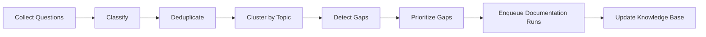
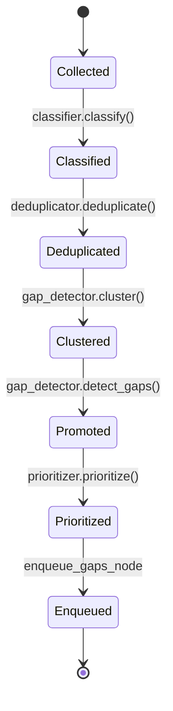
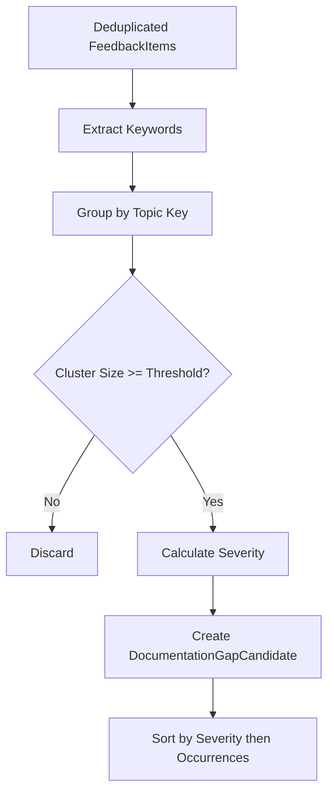
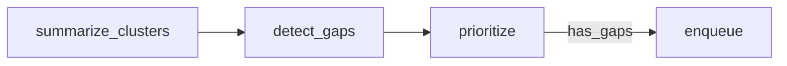

# Feedback Loop Architecture

> **Status:** Implemented
> **Date:** 2026-08-25
> **Scope:** Documentation feedback loop subsystem — turning user questions and support messages into prioritized documentation improvements.

## 1. Overview

The feedback loop is a scheduled pipeline that ingests user questions from support channels (Slack, Discord, GitHub), classifies them, deduplicates near-identical signals, clusters them by topic, detects documentation gaps, prioritizes those gaps by severity and frequency, and emits documentation-run requests. The goal is to automatically surface the most impactful documentation needs so the docs graph can create or update pages before users ask the same question again.

The pipeline operates in two layers: a domain service layer (`draftly.feedback`) that provides reusable primitives, and a workflow layer (`draftly.workflows.feedback`) that orchestrates them inside a Strands multi-agent graph. The `FeedbackService` facade ties the domain layer together, while the `documentation_feedback_loop` workflow invokes the graph and feeds it data.



## 2. Domain Models

### FeedbackItem

`FeedbackItem` (`models.py:11`) is the atomic unit of feedback. Each item represents a single user message — a question, complaint, feature request, or reaction. Key fields:

| Field | Purpose |
|---|---|
| `platform` | Source channel: `slack`, `discord`, or `github` |
| `content` | Raw message text |
| `category` | Classified type: `question`, `how_to`, `docs_gap`, `bug_report`, `feature_request`, `complaint` |
| `sentiment` | `positive`, `negative`, or `neutral` |
| `topic` | Cheap clustering key derived from leading keywords |
| `source_message_id` | `channel:thread` identifier for traceability |

### FeedbackCluster

`FeedbackCluster` (`models.py:28`) groups items that share a topic. Its `size` property drives threshold-based gap detection — clusters with fewer items than `min_cluster_size` (default 2) are ignored.

### DocumentationGapCandidate

`DocumentationGapCandidate` (`models.py:42`) is a cluster promoted to a gap candidate. It carries a `severity` score (0.0–1.0) and `occurrences` count that the prioritizer uses to rank gaps. Sample questions are retained for downstream documentation generation.

## 3. FeedbackItem Lifecycle

A `FeedbackItem` transitions through a deterministic pipeline. There are no mutable states — each stage produces new data or enriches the item in place before passing it forward.



## 4. Classification

The `FeedbackClassifier` (`classifier.py:23`) is a rule-based system that runs keyword matching against the message content. It assigns three attributes in a single pass:

1. **Category** — Matches against `CATEGORY_RULES`, an ordered list of `(category, keywords)` tuples. The first match wins. If no rule matches, the item defaults to `"question"`. Categories are: `bug_report`, `how_to`, `docs_gap`, `feature_request`, `complaint`.

2. **Sentiment** — Checks against `SENTIMENT_RULES` for `negative` or `positive` keywords. Defaults to `neutral`.

3. **Topic** — Extracts the first 1–3 significant words (>= 3 characters, lowercase alphanumeric) as a hyphenated clustering key. This key is later overridden by the gap detector's richer keyword extraction.

The classifier is intentionally simple. LLM-based refinement happens downstream in the orchestration graph if needed.

## 5. Deduplication

`DeduplicationService` (`deduplication.py:11`) collapses near-identical feedback items before clustering. The algorithm:

1. **Normalize** — Lowercase and collapse whitespace via `re.sub(r"\s+", " ", text.lower().strip())`.
2. **Compare** — Use Python's `SequenceMatcher.ratio()` to compute a similarity score (0.0–1.0) between each new item and the set of already-kept items.
3. **Threshold** — Items scoring >= `similarity_threshold` (default 0.85) against any kept item are dropped. The first occurrence is always retained.

This prevents a single question asked 50 times from dominating the gap detection.

## 6. Gap Detection

`GapDetector` (`gap_detector.py:48`) clusters deduplicated items by shared leading keywords and promotes clusters that meet a minimum occurrence threshold.

### Keyword Extraction

The detector extracts up to 4 keywords per item, filtering out a fixed set of `STOPWORDS` (articles, pronouns, question words). Keywords are lowercased and must be >= 3 characters.

### Clustering

Items are grouped into `FeedbackCluster` objects by their topic key (the hyphenation of the first few keywords). Each cluster tracks which platforms it appeared on.

### Gap Promotion

Clusters with `size >= min_cluster_size` (default 2) are promoted to `DocumentationGapCandidate`. The severity formula is:

```
severity = min(1.0, 0.25 * cluster_size + 0.1 * negative_sentiment_count)
```

This means a cluster of 4 items with 3 negative sentiments scores `min(1.0, 1.0 + 0.3) = 1.0`. More frequent clusters with negative sentiment are considered higher-impact gaps.

Candidates are sorted by descending severity, then descending occurrence count.



## 7. Prioritization

`GapPrioritizer` (`prioritization.py:14`) ranks gap candidates using a weighted score:

```
score = severity_weight * severity + frequency_weight * frequency + platform_bonus
```

Where:
- `frequency = min(occurrences / 10.0, 1.0)` — normalized to 1.0 at 10+ occurrences
- `severity` — the 0.0–1.0 value from gap detection
- Default weights: `frequency_weight = 0.6`, `severity_weight = 0.4`
- Platform bonus: `+0.1` for GitHub, `+0.05` for Slack/Discord

GitHub questions receive a higher bonus because they represent public-facing documentation needs with broader visibility.

The `prioritize()` method accepts an optional `limit` parameter to cap the number of returned candidates.

## 8. Knowledge Updater

`KnowledgeUpdater` (`knowledge_updater.py:16`) closes the feedback loop by persisting validated answers into the memory system. It has two write paths:

### record_solution

Stores a Q/A pair as a `Solution` memory in the `SOLUTIONS` namespace with:
- `importance = 0.7`
- `confidence = 0.8`
- `resolution_status = "resolved"`

This enables the retrieval system to surface previously answered questions before generating new responses.

### record_knowledge

Stores topic-level knowledge as a `Knowledge` memory in the `KNOWLEDGE` namespace with configurable `source_quality` (default 0.8).

### update_from_resolution

The full-loop method: stores the solution, then calls `memory.consolidate()` to merge near-duplicate solutions in the `SOLUTIONS` namespace. This prevents the memory store from accumulating redundant entries.

## 9. FeedbackService Facade

`FeedbackService` (`service.py:20`) is the public API that ties the domain primitives together. It accepts optional overrides for all dependencies (useful for testing) and exposes two methods:

| Method | Description |
|---|---|
| `collect_questions()` | Fetches support messages, converts them to `FeedbackItem`s, classifies each one. Returns a list of classified items. |
| `detect_gaps()` | Full pipeline: collect → deduplicate → detect gaps → prioritize. Returns up to `limit` (default 10) `DocumentationGapCandidate`s. |

The service depends on `SupportRepository` for message retrieval and the four domain services for processing.

## 10. Workflow Integration

### documentation_feedback_loop

`documentation_feedback_loop.py` is the entry point for scheduled runs. It:

1. Collects questions via `FeedbackService.collect_questions()` (with a fallback to raw `SupportRepository` queries if the service is unavailable).
2. Deduplicates the collected items.
3. Invokes the `build_feedback_graph()` DAG with the questions as input.
4. Returns a `WorkflowState` with status `DELIVERED` or `FAILED`.

The workflow accepts an optional `questions` parameter for manual triggers and a `gap_threshold` parameter (default 2).

### feedback_graph

The Strands multi-agent graph (`feedback_graph.py`) is a four-node DAG:



| Node | Class | Purpose |
|---|---|---|
| `summarize` | `SummarizeClustersNode` | Groups raw questions by topic into cluster dicts with counts |
| `detect_gaps` | `DetectGapsNode` | Filters clusters at/above the configurable threshold |
| `prioritize` | `PrioritizeGapsNode` | Sorts gaps by count descending |
| `enqueue` | `EnqueueGapsNode` | Emits `gap-{NNN}` records with topic, count, and `action: "create"` |

The `has_gaps` edge condition skips the enqueue node when no gaps are found. Graph constraints: max 8 node executions, 300s total timeout, 60s per-node timeout.

### feedback_prioritization

`feedback_prioritization.py` provides a standalone `prioritize_gaps()` function used by the knowledge-update workflow. It scores gaps by `severity_weight × count` where severity weights are topic-derived:

| Topic keyword | Weight |
|---|---|
| `breaking`, `error`, `failure` | 3 |
| `deprecated` | 2 |
| `how-to`, `question` | 1 |

### knowledge_update

`knowledge_update.py` converts prioritized gaps into memory upsert plans via `plan_knowledge_updates()`. Each plan produces a `documentation_gap` record with a `gap:{topic}` key, suitable for consumption by the memory service.

## 11. Memory System Integration

The feedback loop connects to the memory system through two interfaces:

1. **KnowledgeUpdater** — Writes `Solution` and `Knowledge` memories directly via `MemoryService.remember()`. Solutions are consolidated after writing to prevent duplication.

2. **Knowledge Update Workflow** — Produces upsert plans that the documentation graph can consume to update its knowledge base. Plans are dictionaries with `kind`, `key`, `content`, `count`, and `action` fields.

The memory integration ensures that resolved questions improve retrieval quality for future interactions, creating a virtuous cycle where the system gets better at answering questions as it processes more feedback.

## 12. File Reference

| File | Purpose |
|---|---|
| `src/draftly/feedback/models.py` | `FeedbackItem`, `FeedbackCluster`, `DocumentationGapCandidate` |
| `src/draftly/feedback/classifier.py` | Rule-based category and sentiment classification |
| `src/draftly/feedback/deduplication.py` | SequenceMatcher-based near-duplicate detection |
| `src/draftly/feedback/gap_detector.py` | Keyword clustering and gap promotion |
| `src/draftly/feedback/prioritization.py` | Weighted severity × frequency scoring |
| `src/draftly/feedback/knowledge_updater.py` | Memory persistence for solutions and knowledge |
| `src/draftly/feedback/service.py` | `FeedbackService` facade |
| `src/draftly/orchestration/graphs/feedback_graph.py` | Four-node Strands graph |
| `src/draftly/workflows/feedback/documentation_feedback_loop.py` | Scheduled workflow entry point |
| `src/draftly/workflows/feedback/feedback_prioritization.py` | Standalone gap prioritization |
| `src/draftly/workflows/feedback/knowledge_update.py` | Memory upsert plan generation |
