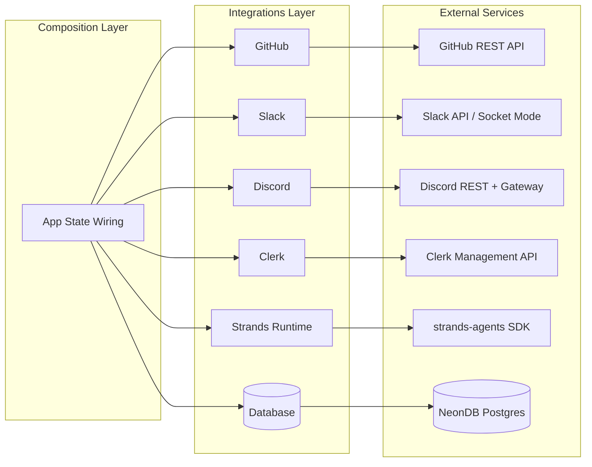
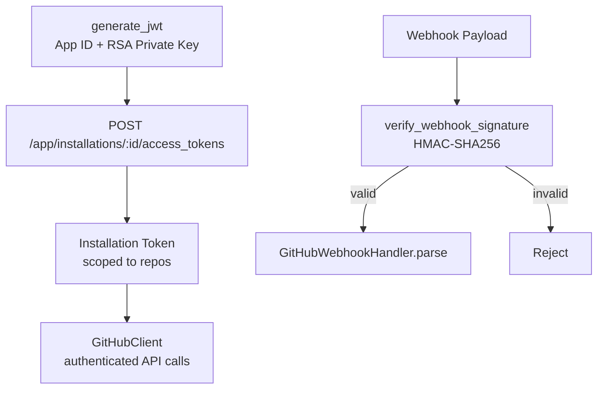
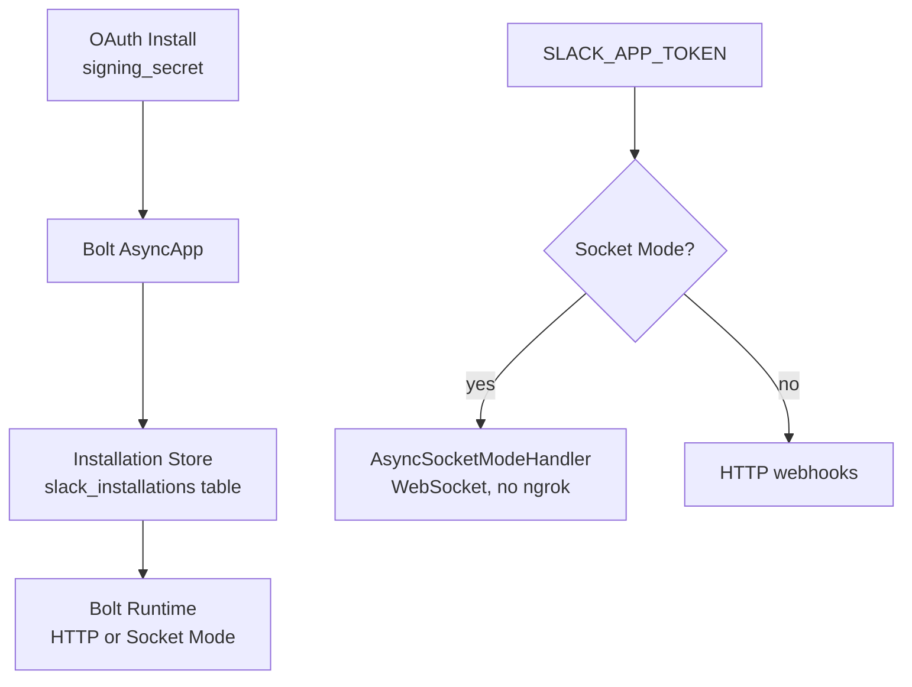
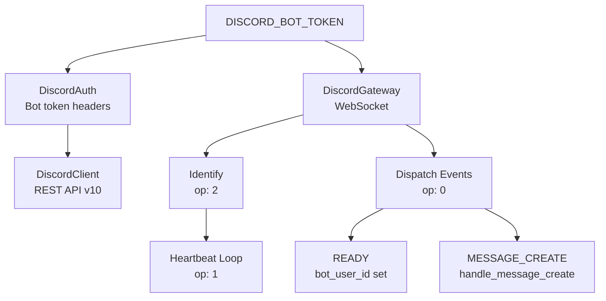
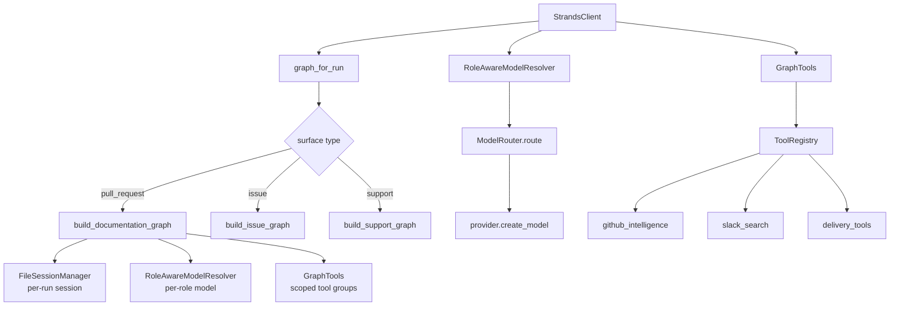

# Integrations Layer

> **Status:** Implemented
> **Date:** 2026-08-25
> **Scope:** External service integrations — GitHub, Slack, Discord, Clerk, Strands runtime, and Database

## 1. Overview

The integrations layer is Draftly's boundary with the outside world. Each integration encapsulates authentication, API communication, event parsing, and domain-model conversion for a single external service. The layer is designed so that no integration leaks protocol details upward — the rest of the application works with normalized domain events and typed clients, never raw HTTP responses or provider-specific auth objects.

Six integrations compose the layer: GitHub (App auth and webhooks), Slack (Bolt app with OAuth and Socket Mode), Discord (Ed25519 bot with Gateway WebSocket), Clerk (organization and member management), Strands (agent runtime with per-run graph construction), and Database (async Postgres via asyncpg). Each is wired into the application through the composition layer, which constructs shared instances and threads them into FastAPI's app state.

## 2. GitHub Integration

The GitHub integration authenticates as a GitHub App, receives webhook events, and exposes a typed API client for repository operations (PRs, issues, commits, file contents, tree traversal).

### 2.1 Authentication

GitHub App authentication follows a three-stage flow: generate a short-lived JWT signed with the App's RSA private key, exchange it for an installation-scoped access token, then use that token for all subsequent API calls. Webhook payloads are verified via HMAC-SHA256 before processing.

**Key files:**
- `app_auth.py` — JWT generation, installation token exchange, webhook signature verification, issue/label posting
- `auth.py` — `GitHubAuth` configuration class (token-based, used by the low-level client)
- `client.py` — `GitHubClient` with methods for PRs, issues, commits, trees, file contents, releases, and search
- `webhooks.py` — `GitHubWebhookHandler` that converts raw webhook payloads into typed `GitHubEvent` domain objects (issues, pull requests, releases)

### 2.2 Event Parsing

`GitHubWebhookHandler.parse` inspects the `event_name` and `action` fields to filter to supported actions (e.g., `opened`, `edited`, `closed` for issues and PRs). Each parsed event carries a UUID event ID, repository full name, actor login, and the original payload, typed as `GitHubIssueEvent`, `GitHubPullRequestEvent`, or `GitHubReleaseEvent`.

### 2.3 Client Capabilities

`GitHubClient` provides both synchronous (`create_pull_request`, `get_pull_request`) and async methods. The async `_request` method handles base URL construction, auth header injection, and token override for installation-scoped calls. Notable capabilities include recursive tree traversal with truncation fallback and base64-decoded file content retrieval (files up to 1 MB).

## 3. Slack Integration

The Slack integration uses Bolt for Python (`AsyncApp`) with three delivery modes: HTTP webhooks, Socket Mode (WebSocket, for local development), and the Bolt installation store for OAuth persistence. Messages are deduplicated, normalized, and dispatched to the workflow runner.

### 3.1 Authentication Flow

**Key files:**
- `app.py` — `build_slack_app` factory, `register_handlers` for event/action handlers, message dispatch with dedup guard
- `auth.py` — `SlackAuth` configuration (bot token)
- `client.py` — `SlackClient` with message search, send, DM, thread retrieval, and reaction methods
- `conversation.py` — `ConversationStore` bounded LRU cache keyed by `(org_id, channel_id, thread_ts)`
- `events.py` — `SlackEventHandler` that parses raw Slack event payloads into `SupportMessage` domain objects
- `installation_store.py` — `SlackInstallationStore` implementing Bolt's `AsyncInstallationStore` backed by `slack_installations` table
- `socket.py` — `start_socket_mode` entry point using `AsyncSocketModeHandler`

### 3.2 Event Handling

`register_handlers` attaches listeners for `app_mention`, `message` (DMs only), and `app_home_opened`. A dedup guard (`_processed_ts` set, capped at 500 entries) prevents duplicate processing. On receipt, the handler strips the bot mention, adds an eyes emoji reaction, normalizes the event via the composition layer's `events.normalize_slack`, and fires it to the workflow runner as an async task.

Review actions (`approve_review`, `reject_review`, `revise_review`) are handled as Bolt action callbacks, extracting the review ID from the action value and delegating to the `ReviewDecisionService` from app state.

### 3.3 Installation Persistence

`SlackInstallationStore` maps Bolt's `Installation` and `Bot` models to the `slack_installations` PostgreSQL table. Upsert logic checks for an existing row by `team_id` before deciding between INSERT and UPDATE. Scopes are stored as comma-joined strings and split back into lists on read.

## 4. Discord Integration

The Discord integration connects to the Discord Gateway via WebSocket for real-time events and uses the Discord REST API v10 for outbound messages. Authentication is Ed25519 bot token-based. The integration supports threaded conversations and interactive review cards with action components.

### 4.1 Authentication and Gateway

**Key files:**
- `app.py` — `handle_message_create` with dedup guard, bot/mention/channel gating, thread creation, event bus dispatch
- `auth.py` — `DiscordAuth` configuration (bot token)
- `blocks.py` — `build_discord_review_card` and `build_discord_result_embed` for interactive review components
- `client.py` — `DiscordClient` with message send/search, thread create/get, reaction, and edit methods
- `events.py` — `DiscordEventHandler` that parses Gateway payloads into `SupportMessage` domain objects
- `gateway.py` — `DiscordGateway` WebSocket client with reconnect logic, heartbeat loop, and opcode handling
- `interactions.py` — In-memory short-key to full-token mapping for review action buttons

### 4.2 Gateway Protocol

`DiscordGateway` maintains a persistent WebSocket connection to `wss://gateway.discord.gg/?v=10&encoding=json`. It handles Discord's opcode-based protocol: op 10 (Hello) triggers the heartbeat loop and Identify payload; op 0 (Dispatch) routes events by type; op 1 (Heartbeat request) sends immediate heartbeats; op 7 (Reconnect) and op 9 (Invalid Session) trigger reconnection with exponential backoff (5s to 60s). The Identify payload requests GUILDS + GUILD_MESSAGES intents (513).

### 4.3 Message Processing

`handle_message_create` applies four gates before dispatching: not from a bot, non-empty text, has guild_id (not DMs), and bot is @mentioned. Org-level trigger channel filtering is checked via `get_org_by_discord_guild`. Valid messages are cleaned (mentions, emoji, whitespace stripped), acknowledged with an eyes emoji, and threaded into a new Discord thread for focused conversation. The cleaned payload is normalized through `events.normalize_discord` and dispatched to the workflow runner.

### 4.4 Interactive Components

`blocks.py` constructs Discord embed payloads with interactive components: a "Read Full Draft" link button, Approve/Reject/Revise action buttons, and a feedback dropdown. Each button's `custom_id` contains a short key mapped to the full review token via `interactions.store_interaction_token`, keeping sensitive tokens out of Discord's component metadata.

## 5. Clerk Integration

The Clerk integration provides server-side organization and member management through the Clerk Management API. It handles listing members, updating roles, and fetching user details.

**Key file:** `clerk/client.py`

The client authenticates with `CLERK_SECRET_KEY` via Bearer token. It exposes three functions:
- `list_org_members(org_id)` — Fetches all memberships for an organization, returning user ID, email, role, and role name.
- `update_member_role(org_id, user_id, role)` — PATCHes a member's role (admin, member, reviewer).
- `get_user(user_id)` — Fetches a single user by ID.

All functions use `httpx.AsyncClient` with the Clerk Management API base URL (`https://api.clerk.com/v1`).

## 6. Strands Runtime Integration

The Strands integration is the bridge between Draftly's application layer and the Strands agent SDK. It constructs per-run agent graphs, manages session persistence, resolves models per agent role, and scopes tools to graph nodes.

### 6.1 Architecture

**Key files:**
- `client.py` — `StrandsClient` dataclass: single entry point for graph construction and invocation
- `graph.py` — `build_graph_for_run` with surface-based dispatch, `build_session_manager` for per-run session isolation
- `models.py` — `RoleAwareModelResolver` for per-agent model resolution, `resolve_concrete_model` for evaluator extraction
- `tools.py` — `GraphTools` facade over `ToolRegistry` with scoped tool groups (research channels, delivery)

### 6.2 Per-Run Graph Construction

Each workflow run gets its own graph, session manager, and tool scope. `StrandsClient.graph_for_run(run_id, surface)` dispatches to the appropriate graph builder based on surface type (`pull_request`, `issue`, `support`). The session manager uses `FileSessionManager` keyed by `draftly-{run_id}`, stored under `.draftly/sessions/`, ensuring complete isolation between concurrent runs.

### 6.3 Model Resolution

`RoleAwareModelResolver` wraps the `ModelRouter` and resolves a concrete Strands `Model` per agent role. It maps roles to task types via `ROLE_TO_TASK_TYPE`, estimates context tokens from prompt text (4 chars/token heuristic), and routes through the model router's priority-based selection. Per-role output token budgets are applied from `ROLE_OUTPUT_TOKENS` after construction.

### 6.4 Tool Scoping

`GraphTools` is a read-only adapter over `ToolRegistry` that graph builders consume. It exposes scoped tool groups: `github_intelligence`, `slack_search`, `discord_search`, `github_delivery`, `slack_post_message`, `discord_post_message`. The `research_channel_tools(channel)` method returns search + thread tools for a specific support channel, and `delivery_tools()` aggregates all delivery-oriented tools.

## 7. Database Integration

The database integration provides an async PostgreSQL client backed by `asyncpg` connection pooling, targeting NeonDB (serverless Postgres).

**Key file:** `database/client.py`

### 7.1 Connection Management

`DatabaseClient` creates a lazy `asyncpg.Pool` with configurable min/max connections (default 2-10) and a 30-second command timeout. The pool is initialized on first use via a double-checked locking pattern (`asyncio.Lock`). Connection release is guaranteed by `try/finally` blocks in all query methods.

### 7.2 Query Interface

The client exposes four query methods:
- `execute(query, *args)` — For DDL/DML statements (INSERT, UPDATE, DELETE).
- `fetch_one(query, *args)` — Returns a single row.
- `fetch_all(query, *args)` — Returns all matching rows.
- `transaction(isolation)` — Context manager yielding a connection within a transaction (default: `read_committed`).

All methods acquire a connection from the pool, execute the query, and release the connection back. Static `_conn` variants (`execute_conn`, `fetch_one_conn`, `fetch_all_conn`) accept an existing connection for use within transactions.

## 8. Composition Wiring

All integrations are instantiated and wired into the application through the composition layer (`app/composition/`). The composition modules construct shared instances (database client, Slack app, Discord gateway, Strands client) and attach them to FastAPI's `app.state.draftly` namespace. This ensures:

- **Single instances** — One `DatabaseClient`, one `StrandsClient`, one `SlackAppDeps` shared across the application.
- **Dependency order** — Database starts before integrations that depend on it; Slack installation store receives the database client.
- **Clean shutdown** — The async context manager stops services in reverse dependency order.

The `ToolRegistry` (built in `composition/tools.py`) constructs all tool groups and injects them into `GraphTools`, which the Strands runtime consumes. The `EventRegistry` (in `composition/events.py`) provides the normalization functions that Slack, Discord, and GitHub handlers call to convert raw payloads into domain events.

## 9. File Reference

### GitHub Integration
- `src/draftly/integrations/github/app_auth.py` — JWT generation, installation token exchange, webhook verification, issue/label helpers
- `src/draftly/integrations/github/auth.py` — `GitHubAuth` token configuration
- `src/draftly/integrations/github/client.py` — `GitHubClient` REST API client
- `src/draftly/integrations/github/webhooks.py` — `GitHubWebhookHandler` event parser

### Slack Integration
- `src/draftly/integrations/slack/app.py` — Bolt app factory, handler registration, message dispatch
- `src/draftly/integrations/slack/auth.py` — `SlackAuth` token configuration
- `src/draftly/integrations/slack/client.py` — `SlackClient` REST API client
- `src/draftly/integrations/slack/conversation.py` — `ConversationStore` bounded LRU cache
- `src/draftly/integrations/slack/events.py` — `SlackEventHandler` event parser
- `src/draftly/integrations/slack/installation_store.py` — `SlackInstallationStore` Bolt persistence
- `src/draftly/integrations/slack/socket.py` — Socket Mode entry point

### Discord Integration
- `src/draftly/integrations/discord/app.py` — Message handler with dedup, gating, and dispatch
- `src/draftly/integrations/discord/auth.py` — `DiscordAuth` token configuration
- `src/draftly/integrations/discord/blocks.py` — Review card and result embed builders
- `src/draftly/integrations/discord/client.py` — `DiscordClient` REST API v10 client
- `src/draftly/integrations/discord/events.py` — `DiscordEventHandler` event parser
- `src/draftly/integrations/discord/gateway.py` — `DiscordGateway` WebSocket client
- `src/draftly/integrations/discord/interactions.py` — Interaction token store

### Clerk Integration
- `src/draftly/integrations/clerk/client.py` — Clerk Management API client

### Strands Runtime Integration
- `src/draftly/integrations/strands/client.py` — `StrandsClient` facade
- `src/draftly/integrations/strands/graph.py` — Per-run graph construction and session management
- `src/draftly/integrations/strands/models.py` — `RoleAwareModelResolver` and model resolution
- `src/draftly/integrations/strands/tools.py` — `GraphTools` tool-scoping adapter

### Database Integration
- `src/draftly/integrations/database/client.py` — `DatabaseClient` async Postgres client

### Composition Layer
- `src/draftly/app/composition/tools.py` — `ToolRegistry` and tool group construction
- `src/draftly/app/composition/events.py` — Event normalization registry
- `src/draftly/app/composition/agents.py` — Agent construction
- `src/draftly/app/composition/workflows.py` — Workflow runner wiring
- `src/draftly/app/composition/workers.py` — Background worker setup
