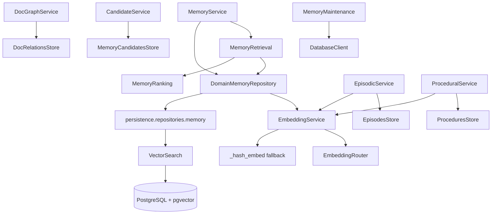
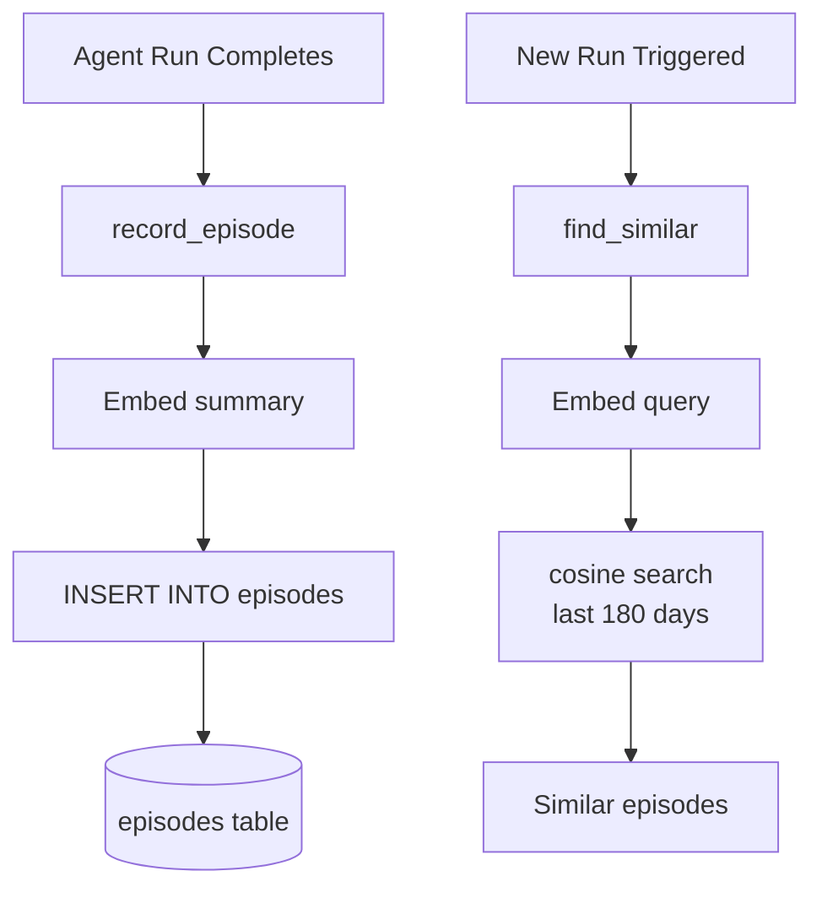
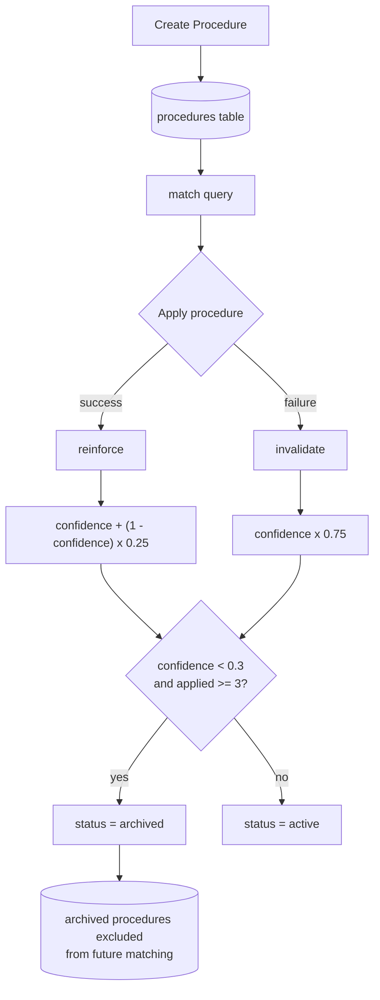
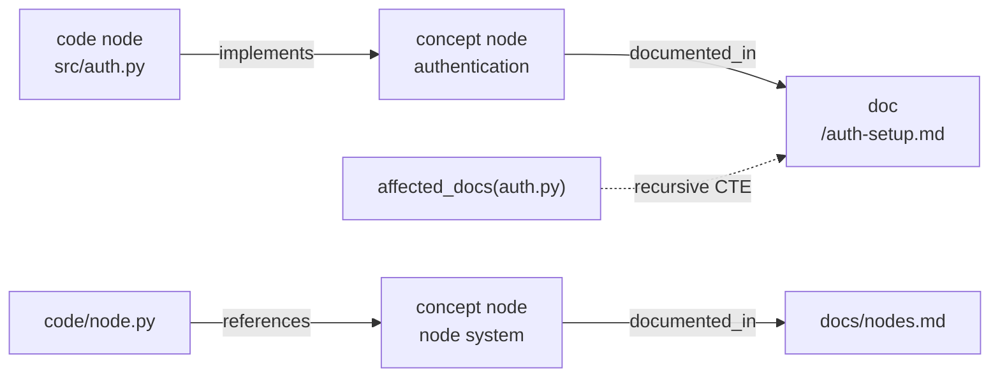
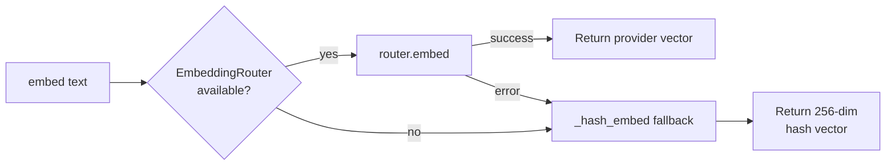
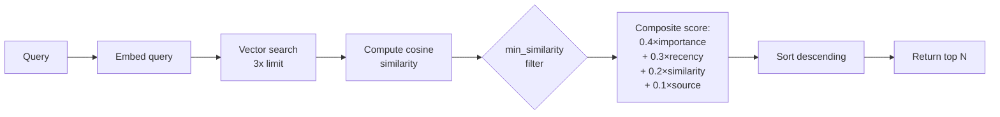
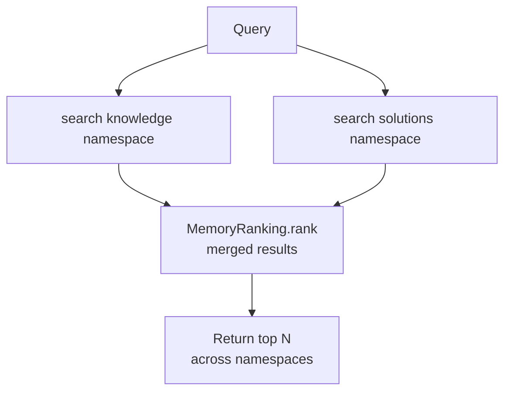
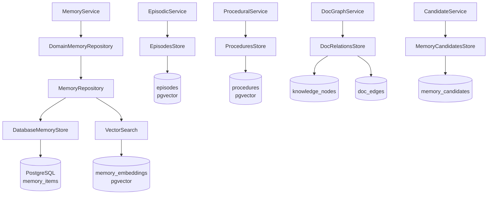

# Memory Subsystem Architecture

> **Status:** Implemented
> **Date:** 2026-08-25
> **Scope:** Memory storage, retrieval, ranking, episodic/procedural memory, docgraph, candidate extraction, embedding pipeline, maintenance, and all memory model types

## 1. Overview

The memory subsystem is Draftly's long-term knowledge layer. It enables the agent to learn from past interactions, maintain curated knowledge, and ground responses in validated information. Every workflow run can extract candidates, which a curation pipeline promotes into typed memories organized by namespace. Retrieval uses vector similarity search over pgvector embeddings, re-ranked by a composite score of recency, importance, similarity, and source quality.

The subsystem is organized into seven functional layers: a high-level **MemoryService** facade, an **EmbeddingService** with provider fallback, a **MemoryRetrieval** engine, a **MemoryRanking** scorer, a **DomainMemoryRepository** persistence wrapper, specialized sub-services for **episodic**, **procedural**, and **docgraph** memory, and a **MemoryMaintenance** scheduler for soft eviction and consolidation.



### Memory Lifecycle

Every memory follows a five-stage lifecycle from extraction to serving:


## 2. MemoryService Facade

`MemoryService` (`service.py`) is the top-level API consumed by workflows and domain services. It composes `MemoryRetrieval`, `DomainMemoryRepository`, and `MemoryRanking` behind a clean interface.

### Storage Operations

| Method | Purpose |
|--------|---------|
| `remember(item)` | Store a typed `MemoryItem` with auto-generated embedding |
| `forget(memory_id)` | Hard-delete a memory record |
| `delete_by_metadata(namespace, key, value)` | Bulk-delete items matching metadata criteria within an org |
| `store_batch(items)` | Batch-persist multiple items with a single `embed_batch` call |
| `supersede(old_id, new_content, ...)` | Mark an old record as `superseded`, store the replacement, and record provenance linking old to new |

### Retrieval Operations

| Method | Purpose |
|--------|---------|
| `recall(namespace, query, limit)` | Semantic search within a single namespace |
| `recall_knowledge(query, limit)` | Cross-namespace search across `knowledge` + `solutions`, re-ranked into a unified result set |

### Curation Operations

| Method | Purpose |
|--------|---------|
| `consolidate(namespace, query, min_similarity)` | Find near-duplicate memories and reinforce the most important one instead of storing a duplicate |
| `curate_namespace(namespace)` | Return hygiene stats (total items, high-importance count) |

The `supersede` method is particularly important for knowledge maintenance: it keeps the old record (marked `superseded`, excluded from retrieval) while storing the corrected version with a `supersedes` metadata link and provenance tracking.

## 3. Episodic Memory

Episodic memory records what happened during individual agent runs. It answers the question: "What did we do last time something like this came up?"

### EpisodicService

`EpisodicService` (`episodic/service.py`) wraps `EpisodesStore` and `EmbeddingService`.

- **`record_episode(**fields)`**: Embeds the episode summary, inserts into the `episodes` table, and returns the stored record. Fields include `org_id`, `agent_run_id`, `trigger_type`, `trigger_summary`, `actions_taken`, `tools_used`, `outcome`, and `evaluation_results`.
- **`find_similar(query, org_id, limit)`**: Embeds the query, performs vector similarity search over recent episodes (within 180 days by default), and returns matching records ordered by distance.

### Storage

`EpisodesStore` (`integrations/database/episodes_store.py`) uses the `episodes` table with a pgvector `embedding` column. Search uses the `<=>` cosine distance operator with a `1 - distance` similarity score. The `recent_only` flag defaults to true, filtering to episodes from the last 180 days.



## 4. Procedural Memory

Procedural memory stores learned investigation playbooks — reusable patterns for handling recurring situations. Each procedure has trigger conditions, ordered steps, applicability context, and a confidence score that evolves with use.

### ProceduralService

`ProceduralService` (`procedural/service.py`) provides four core operations:

| Method | Purpose |
|--------|---------|
| `create(name, pattern_description, ...)` | Store a new procedure at confidence 0.5 with its embedding |
| `match(query, org_id, limit)` | Find active procedures whose embedding is closest to the query |
| `reinforce(procedure_id)` | Record a successful application; boosts confidence |
| `invalidate(procedure_id)` | Record a failed application; reduces confidence |

### Confidence Scoring

Confidence evolves through a multiplicative decay/reinforcement model:

- **Success**: `new_confidence = old + (1.0 - old) * 0.25` — asymptotically approaches 1.0
- **Failure**: `new_confidence = old * 0.75` — decays toward 0.0
- **Auto-archive**: When a procedure has been applied at least 3 times (`MIN_APPLICATIONS_BEFORE_ARCHIVE`) and confidence drops below 0.3 (`ARCHIVE_CONFIDENCE`), its status transitions to `archived`

This creates a self-correcting system: procedures that consistently succeed gain confidence, while unreliable ones are automatically retired.



### Storage

`ProceduresStore` (`integrations/database/procedures_store.py`) uses a `procedures` table with columns for `name`, `pattern_description`, `trigger_conditions` (JSONB), `steps` (JSONB array), `applicability_context`, `success_count`, `failure_count`, `confidence`, `status`, and a pgvector `embedding`. Search filters to `status = 'active'` and uses cosine distance ordering.

## 5. Docgraph

The docgraph tracks relationships between code, concepts, and documentation. It answers: "If this code changes, which docs are affected?"

### DocGraphService

`DocGraphService` (`docgraph/service.py`) provides three operations:

| Method | Purpose |
|--------|---------|
| `ensure_node(node_type, key, org_id, title)` | Upsert a node (`code`, `doc`, or `concept` type) into the knowledge graph |
| `link(source_key, target_key, relation_type, ...)` | Create or confirm an edge between two nodes |
| `affected_docs(code_paths, org_id)` | Recursively find all documentation reachable from given code paths |

### Graph Traversal

The `affected_docs` method uses a recursive CTE that walks from code nodes through `doc_edges` to reach `doc` nodes. This enables impact analysis: when a source file changes, Draftly can identify which documentation pages need review.



### Storage

`DocRelationsStore` (`integrations/database/doc_relations_store.py`) uses two tables:
- **`knowledge_nodes`**: Stores nodes with `org_id`, `node_type`, `key`, `title`. Unique on `(org_id, node_type, key)`.
- **`doc_edges`**: Stores edges with `source_node_id`, `target_node_id`, `relation_type`, `evidence` (JSONB), `first_seen_at`, `last_confirmed_at`. Unique on `(source_node_id, target_node_id, relation_type)` with upsert on conflict.

## 6. Candidate Extraction

The candidate system is a curation outbox: workflows propose potential memories, and a curator approves or rejects them. This two-phase approach prevents raw workflow output from polluting the knowledge base.

### CandidateService

`CandidateService` (`candidates/service.py`) manages the outbox lifecycle:

| Method | Purpose |
|--------|---------|
| `enqueue(candidate)` | Insert a `MemoryCandidate` into the pending queue |
| `claim_batch(limit)` | Atomically claim pending candidates for processing (`FOR UPDATE SKIP LOCKED`) |
| `mark_applied(candidate_id, reason)` | Mark a candidate as successfully promoted to memory |
| `mark_rejected(candidate_id, reason)` | Mark a candidate as rejected |
| `set_status_pending(candidate_id, reason)` | Return a claimed candidate to the pending queue for retry |

### Candidate Types

The `MemoryCandidate` model (`candidates/models.py`) supports five candidate types:

| Type | Purpose |
|------|---------|
| `fact` | A factual claim extracted from a workflow run |
| `decision` | A decision record (why the software is the way it is) |
| `procedure_pattern` | A potential procedural memory pattern |
| `doc_relation` | A proposed code-to-doc relationship for the docgraph |
| `episode_summary` | A summary of a workflow run for episodic memory |

Each candidate carries `confidence`, `source_type`, `source_id`, and `evidence` for provenance tracking.

### Storage

`MemoryCandidatesStore` (`integrations/database/memory_candidates_store.py`) uses the `memory_candidates` table. The `claim_pending` method uses `FOR UPDATE SKIP LOCKED` for safe concurrent claiming in multi-worker environments. Status transitions: `pending` → `processing` → `applied`/`rejected` (or back to `pending` for retry).

## 7. Embedding Pipeline

The `EmbeddingService` (`embeddings.py`) generates vector embeddings for all memory content. It uses the Phase 2 `EmbeddingRouter` when a provider is configured; otherwise falls back to a deterministic hashing embedder so memory writes never fail in offline/CI environments.

### Provider Fallback Chain



### EmbeddingRouter Configuration

`build_embedding_router()` (`models/factory.py`) registers providers in priority order:

| Priority | Provider | Config Source |
|----------|----------|---------------|
| 10 | OpenRouter | `OPENROUTER_API_KEY` |
| 20 | Requesty | `REQUESTY_API_KEY` |
| 30 | OrcaRouter | `ORCAROUTER_API_KEY` |

The default embedding model is `text-embedding-3-small` (1536 dimensions), overridable via `EMBEDDING_MODEL_ID`.

### Fallback Embedder

The `_hash_embed` function produces a deterministic 256-dimensional vector using SHA-256 token hashing. Each token is hashed to an index with a sign bit, then L2-normalized. This provides basic semantic similarity (tokens that appear together cluster together) without requiring any API access.

### Vector Utilities

`vector_utils.py` provides two helpers:
- **`normalize_vector(embedding, dim=1536)`**: Truncates or zero-pads to the target dimension so writes never fail.
- **`format_vector(embedding)`**: Formats as pgvector text input `'[a,b,c]'`.

## 8. Ranking Algorithm

`MemoryRanking` (`ranking.py`) scores each candidate memory using a weighted composite formula. The four factors are:

### Formula

```
score = importance_weight × importance
      + recency_weight × recency_score
      + similarity_weight × similarity
      + source_weight × source_score
```

### Default Weights

| Factor | Weight | Source |
|--------|--------|--------|
| Importance | 0.4 | `record.importance` (0.0–1.0) |
| Recency | 0.3 | Exponential decay with 30-day half-life |
| Similarity | 0.2 | Cosine similarity to query embedding |
| Source Quality | 0.1 | `metadata.source_quality` or `record.confidence` |

### Recency Score

Recency uses exponential decay: `0.5 ^ (age_days / half_life_days)`. A record created today scores 1.0; at 30 days it scores 0.5; at 60 days, 0.25. Records with no `created_at` default to 1.0 (assumed new).

### Source Quality

Source quality is read from `metadata.source_quality` when available, otherwise falls back to the record's `confidence` value.

### Ranking Flow

The `retrieve` method in `MemoryRetrieval` requests 3x the desired limit from the vector store, computes cosine similarity for each candidate, optionally filters by `min_similarity`, then delegates to `MemoryRanking.rank()` which scores and sorts all candidates.



## 9. Maintenance

`MemoryMaintenance` (`maintenance.py`) implements soft eviction policies. Nothing is hard-deleted — memories are either archived or compressed.

### Episode Archival

`archive_old_episodes()` collapses episodes older than 180 days (`EPISODE_RETENTION_DAYS`) into one archived summary memory per `(org_id, trigger_type, month)`. The summary is stored as a `knowledge` type memory with `status = 'archived'`, `importance = 0.4`, `confidence = 0.6`.

### Stale Semantic Memory Demotion

`demote_stale_semantic_memory()` archives active semantic memories that are stale and rarely accessed. A memory is demoted when:
- `importance < 0.3` (`STALE_IMPORTANCE_FLOOR`)
- `last_accessed_at` is NULL or older than 90 days (`STALE_ACCESS_DAYS`)
- `memory_type` is not `decision` (decisions are never auto-demoted — they document why the software is the way it is)

### Schedule

Maintenance runs weekly via the `memory.maintenance` RQ task (Sunday 6 AM by default). The `memory.curation` task runs every 30 minutes to process candidate outbox items.

## 10. Retrieval Flow

The retrieval pipeline combines vector search with multi-factor ranking:

1. **Embed the query** using `EmbeddingService.embed()`
2. **Vector search** via `VectorSearch` against the `memory_embeddings` table using pgvector's `<=>` cosine distance operator
3. **Re-score** each result with `MemoryRanking.score()` using the composite formula
4. **Filter** by minimum similarity if specified
5. **Sort** by composite score, highest first
6. **Return** the top N results

For knowledge-grounded retrieval (`recall_knowledge`), the pipeline fans out across the `knowledge` and `solutions` namespaces independently, then merges and re-ranks the combined results.

### Cross-Namespace Retrieval



## 11. Memory Model Types

All models extend `MemoryItem` (`models/base.py`), which defines the shared shape: `id`, `org_id`, `namespace`, `content`, `memory_type`, `importance`, `confidence`, `metadata`, `created_at`, `updated_at`.

| Model | `memory_type` | Purpose | Key Fields |
|-------|--------------|---------|------------|
| `MemoryItem` | `"fact"` (default) | Base class for all memory records | `namespace`, `content`, `importance`, `confidence`, `metadata` |
| `Conversation` | `"conversation"` | Support conversation excerpts | `platform`, `thread_id` |
| `Document` | `"document"` | Documentation page tracked in memory | `path`, `repository`, `title`, `heading_path`, `start_line`, `end_line` |
| `Feedback` | `"feedback"` | Feedback about delivered answers or docs | `target_id`, `sentiment` |
| `Issue` | `"issue"` | GitHub issue distilled into memory | `number`, `repository`, `state` |
| `Knowledge` | `"knowledge"` | Curated knowledge used to ground answers | `topic`, `source_quality` |
| `Project` | `"project"` | Repository/project level context | `repository`, `default_branch` |
| `Question` | `"question"` | User question captured from a support surface | `topic`, `source_message_id` |
| `Solution` | `"solution"` | Validated answer linked to a question | `question_id`, `resolution_status` |

The base `MemoryItem` type is also used directly as `memory_type = "fact"` for generic factual memories.

## 12. Persistence Architecture

The memory subsystem uses PostgreSQL with pgvector for vector similarity search. The persistence layer is split into three tiers:

### Database Tables

| Table | Purpose | Key Columns |
|-------|---------|-------------|
| `memory_items` | Core memory records | `id`, `org_id`, `namespace`, `memory_type`, `content`, `status`, `importance`, `confidence`, `metadata`, `version`, `access_count`, `last_accessed_at` |
| `memory_embeddings` | Vector embeddings for memory_items | `id`, `memory_item_id`, `org_id`, `embedding` (VECTOR), `model`, `dimensions` |
| `episodes` | Agent run episodes | `id`, `org_id`, `agent_run_id`, `trigger_type`, `trigger_summary`, `actions_taken`, `tools_used`, `outcome`, `evaluation_results`, `embedding` (VECTOR) |
| `procedures` | Learned investigation playbooks | `id`, `org_id`, `name`, `pattern_description`, `trigger_conditions`, `steps`, `applicability_context`, `confidence`, `status`, `success_count`, `failure_count`, `embedding` (VECTOR) |
| `knowledge_nodes` | Docgraph nodes | `id`, `org_id`, `node_type`, `key`, `title` |
| `doc_edges` | Docgraph edges | `id`, `org_id`, `source_node_id`, `target_node_id`, `relation_type`, `evidence`, `first_seen_at`, `last_confirmed_at` |
| `memory_candidates` | Curation outbox | `id`, `org_id`, `candidate_type`, `payload`, `source_type`, `source_id`, `evidence`, `confidence`, `status`, `decision_reason` |

### Memory Namespaces

The `MemoryNamespaces` class defines the canonical namespace constants:

| Namespace | Constant | Purpose |
|-----------|----------|---------|
| `documents` | `DOCUMENTS` | Documentation page content |
| `conversations` | `CONVERSATIONS` | Support conversation excerpts |
| `questions` | `QUESTIONS` | User questions from support surfaces |
| `solutions` | `SOLUTIONS` | Validated answers |
| `issues` | `ISSUES` | GitHub issue distillations |
| `knowledge` | `KNOWLEDGE` | Curated knowledge for grounding |
| `feedback` | `FEEDBACK` | Feedback on delivered answers |
| `projects` | `PROJECTS` | Repository-level context |

### Layer Architecture



## 13. Redis Integration

Redis serves the memory subsystem through the `RedisEMAStatsStore`, which caches model performance metrics (latency, success rates) across restarts. While not directly part of the memory read/write path, the EMA stats store informs model routing decisions that affect which LLM generates embeddings and responses, indirectly influencing memory quality.

The `RedisClient` also provides:
- **Event Bus**: `RedisStreamBus` / `RedisEventBus` for real-time event streaming between workflow stages
- **Provider Health**: `RedisProviderHealth` tracks which embedding providers are available
- **Rate Limiting**: Protects embedding API calls from bursts

## 14. Integration Points

The memory subsystem integrates with other Draftly components through these interfaces:

| Component | Integration | Direction |
|-----------|-------------|-----------|
| **Workflows** | Call `MemoryService.remember()` after runs to store outcomes | Write |
| **Workflows** | Call `MemoryService.recall_knowledge()` to ground responses | Read |
| **Agent Tools** | `memory_search`, `get_memory`, `supersede_memory`, `reinforce_memory` tools expose memory to agents | Read/Write |
| **Memory Curator Agent** | Processes candidate outbox, promotes/rejects candidates | Read/Write |
| **Feedback Loop** | Records user feedback as `Feedback` memories | Write |
| **Evaluation Loop** | Records evaluation outcomes as episodic memories | Write |
| **Onboarding** | Seeds initial `Project` and `Knowledge` memories | Write |
| **Scheduled Workers** | `memory.curation` (30 min), `memory.maintenance` (weekly) | Read/Write |

## 15. File Reference

### Memory Subsystem Core

| File | Lines | Role |
|------|-------|------|
| `src/draftly/memory/__init__.py` | 16 | Public API exports |
| `src/draftly/memory/service.py` | 204 | `MemoryService` — high-level facade |
| `src/draftly/memory/embeddings.py` | 68 | `EmbeddingService` — provider + fallback embedding |
| `src/draftly/memory/retrieval.py` | 70 | `MemoryRetrieval` — semantic search + re-ranking |
| `src/draftly/memory/ranking.py` | 69 | `MemoryRanking` — composite scoring algorithm |
| `src/draftly/memory/repository.py` | 145 | `DomainMemoryRepository` — persistence wrapper |
| `src/draftly/memory/vector_utils.py` | 22 | `normalize_vector`, `format_vector` helpers |
| `src/draftly/memory/maintenance.py` | 73 | `MemoryMaintenance` — soft eviction policies |

### Memory Models

| File | Lines | Role |
|------|-------|------|
| `src/draftly/memory/models/__init__.py` | 23 | Model exports |
| `src/draftly/memory/models/base.py` | 25 | `MemoryItem` — base model |
| `src/draftly/memory/models/conversation.py` | 13 | `Conversation` — support excerpt |
| `src/draftly/memory/models/document.py` | 17 | `Document` — documentation page |
| `src/draftly/memory/models/feedback.py` | 13 | `Feedback` — answer/doc feedback |
| `src/draftly/memory/models/issue.py` | 14 | `Issue` — GitHub issue |
| `src/draftly/memory/models/knowledge.py` | 13 | `Knowledge` — curated knowledge |
| `src/draftly/memory/models/project.py` | 13 | `Project` — repository context |
| `src/draftly/memory/models/question.py` | 13 | `Question` — user question |
| `src/draftly/memory/models/solution.py` | 13 | `Solution` — validated answer |

### Episodic Memory

| File | Lines | Role |
|------|-------|------|
| `src/draftly/memory/episodic/__init__.py` | 5 | Module exports |
| `src/draftly/memory/episodic/service.py` | 44 | `EpisodicService` — record + recall episodes |

### Procedural Memory

| File | Lines | Role |
|------|-------|------|
| `src/draftly/memory/procedural/__init__.py` | 5 | Module exports |
| `src/draftly/memory/procedural/service.py` | 95 | `ProceduralService` — playbooks + confidence |

### Docgraph

| File | Lines | Role |
|------|-------|------|
| `src/draftly/memory/docgraph/__init__.py` | 5 | Module exports |
| `src/draftly/memory/docgraph/service.py` | 67 | `DocGraphService` — code/doc relationships |

### Candidate Extraction

| File | Lines | Role |
|------|-------|------|
| `src/draftly/memory/candidates/__init__.py` | 6 | Module exports |
| `src/draftly/memory/candidates/models.py` | 29 | `MemoryCandidate` — candidate model |
| `src/draftly/memory/candidates/service.py` | 49 | `CandidateService` — outbox facade |

### Persistence Layer

| File | Lines | Role |
|------|-------|------|
| `src/draftly/persistence/repositories/memory.py` | 181 | `MemoryRepository` — domain persistence |
| `src/draftly/integrations/database/memory_store.py` | 277 | `DatabaseMemoryStore` — memory_items CRUD |
| `src/draftly/integrations/database/vector_search.py` | 87 | `VectorSearch` — pgvector similarity search |
| `src/draftly/integrations/database/episodes_store.py` | 75 | `EpisodesStore` — episode persistence |
| `src/draftly/integrations/database/procedures_store.py` | 93 | `ProceduresStore` — procedure persistence |
| `src/draftly/integrations/database/doc_relations_store.py` | 92 | `DocRelationsStore` — docgraph persistence |
| `src/draftly/integrations/database/memory_candidates_store.py` | 74 | `MemoryCandidatesStore` — outbox persistence |

### Embedding Infrastructure

| File | Lines | Role |
|------|-------|------|
| `src/draftly/models/factory.py` | 767 | `build_embedding_router()` — provider registration |
