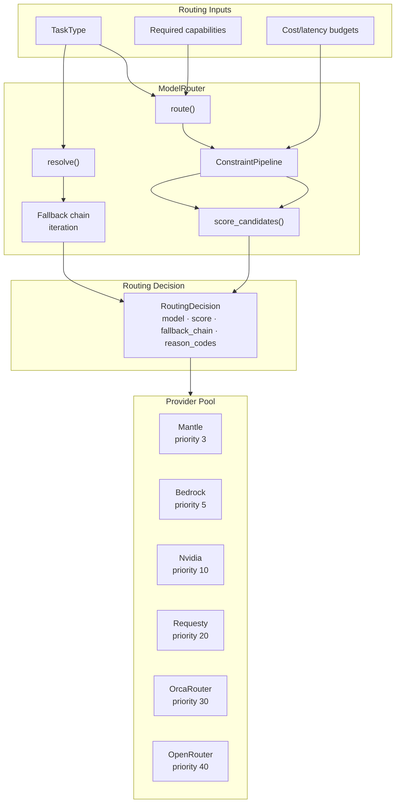
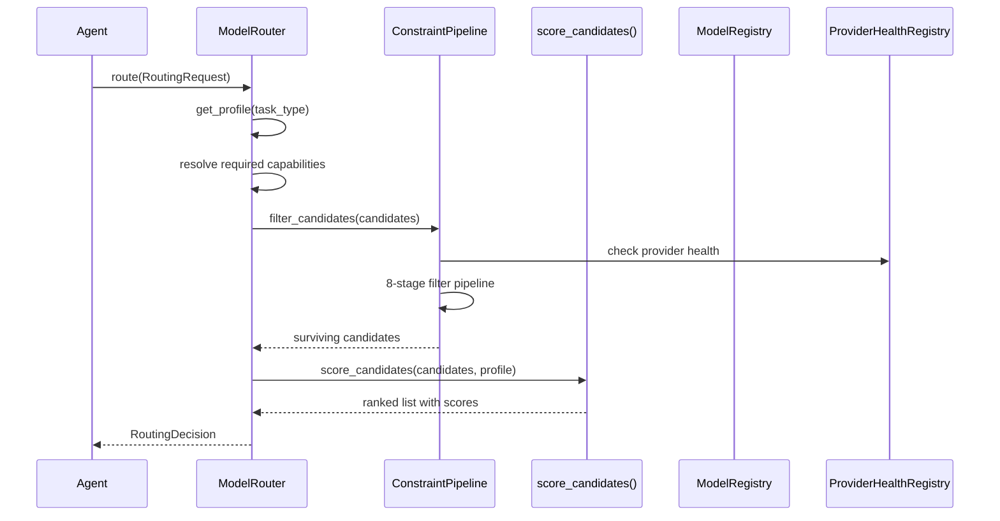
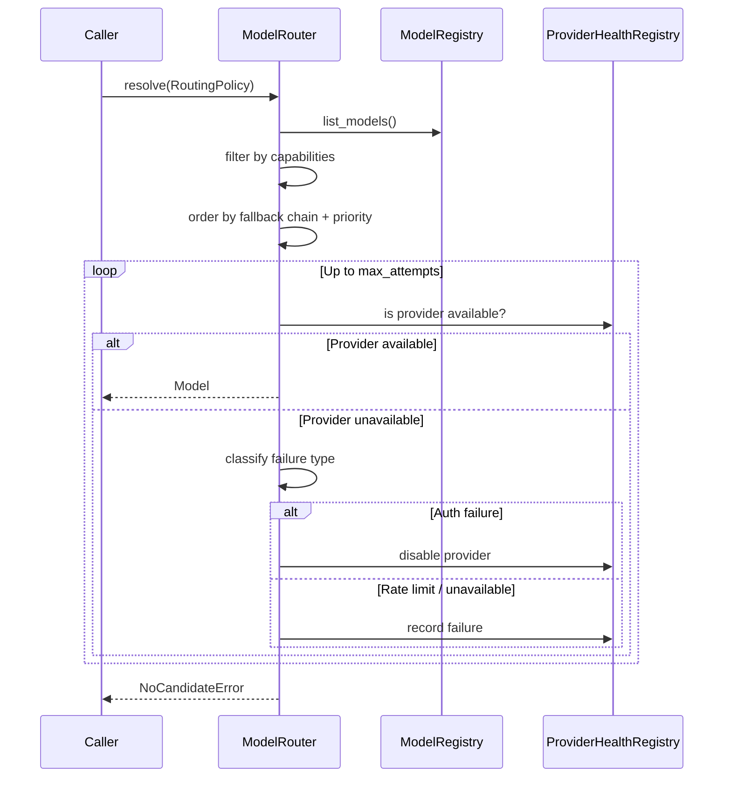
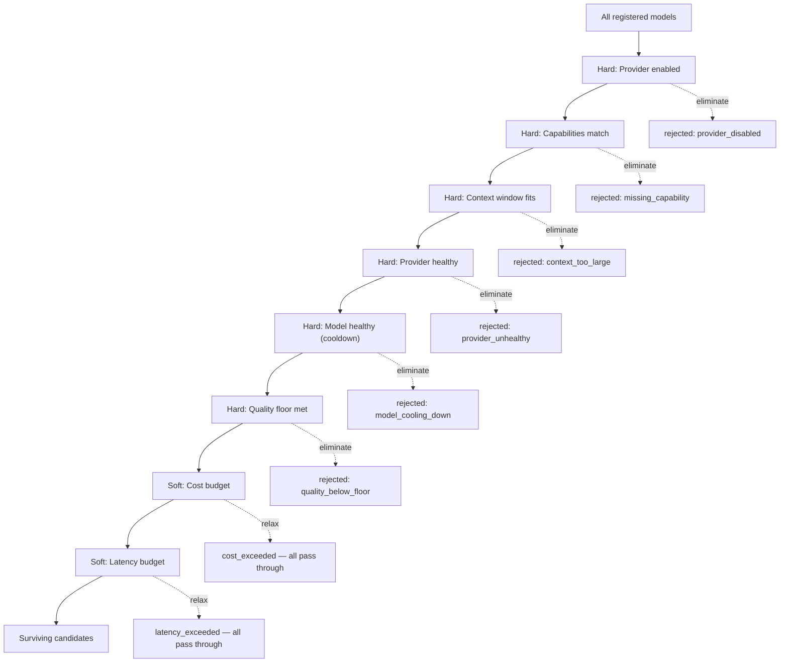
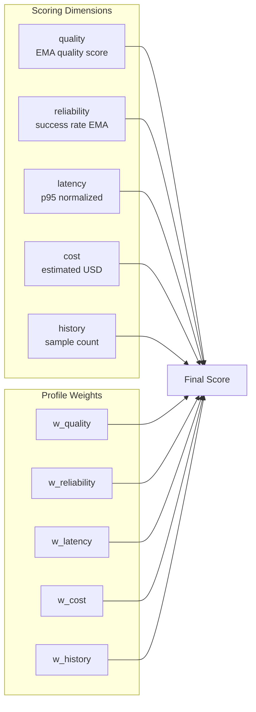
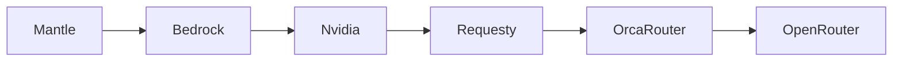
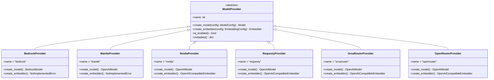
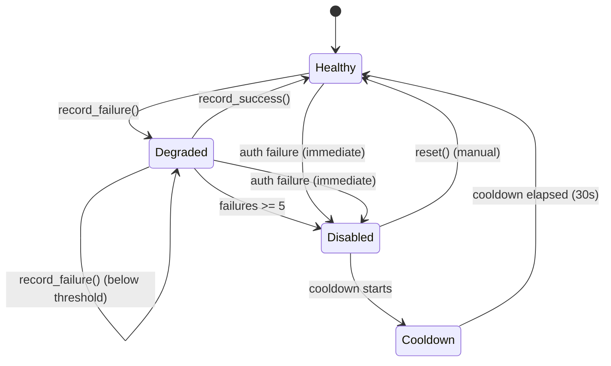
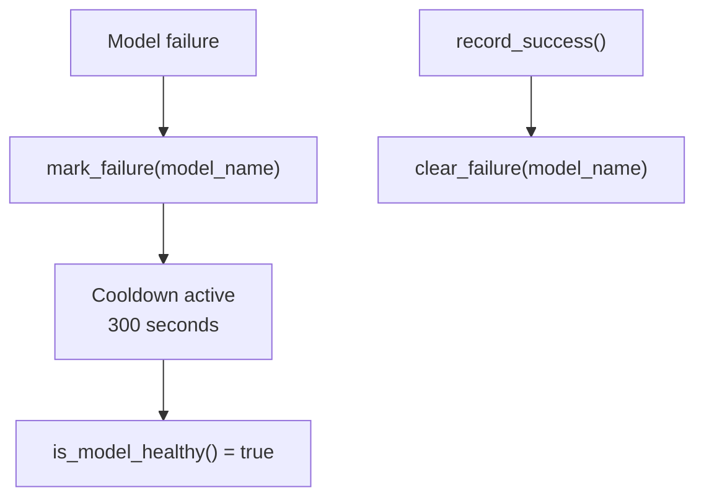
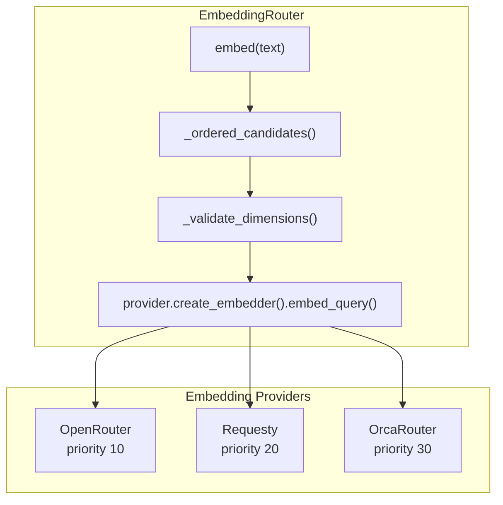

# Models Router Architecture

> **Status:** Implemented
> **Date:** 2026-08-25
> **Scope:** Multi-provider model routing, constraint pipeline, weighted scoring, health/failover, embedding routing

## 1. Overview

The models router selects the best LLM for each agent task from a registry of 6 providers and ~25 models. It supports two routing APIs — an adaptive path that scores candidates across multiple dimensions, and a legacy path that iterates a fallback chain — and degrades gracefully when providers fail.



## 2. Routing APIs

### 2.1 Adaptive Path — `route()`

Used by new agent code. Takes a `RoutingRequest` and returns a `RoutingDecision` with ranked models.



### 2.2 Legacy Path — `resolve()`

Still used by `dependencies.py`. Takes a `RoutingPolicy` and iterates a fallback chain.



## 3. Constraint Pipeline

The adaptive path passes candidates through 8 ordered filters. Hard constraints eliminate; soft constraints relax.



### Hard Constraints

| Stage | Filter | Behavior |
|-------|--------|----------|
| 1 | Provider enabled | Must be in `enabled_providers` set |
| 2 | Capabilities | Model must have all required capabilities |
| 3 | Context window | Input tokens must fit; unknown window passes ≤16k tokens |
| 4 | Provider health | `ProviderHealthRegistry.available()` must be true |
| 5 | Model health | `ModelHealthRegistry.is_model_healthy()` must be true |
| 6 | Quality floor | EMA quality must meet profile's floor (≥20 samples required) |

### Soft Constraints

| Stage | Filter | Behavior |
|-------|--------|----------|
| 7 | Cost budget | If any candidates fit, filter to them; otherwise log and keep all |
| 8 | Latency budget | Same relaxation pattern as cost |

## 4. Scoring Algorithm

Surviving candidates are scored across 5 weighted dimensions. Weights come from the task type's `RoutingProfile`.



**Formula:**
```
score = w_quality × quality
      + w_reliability × reliability
      + w_latency × latency
      + w_cost × cost
      + w_history × history
```

### Dimension Details

| Dimension | Source | Normalization |
|-----------|--------|---------------|
| `quality` | EMA quality score (≥20 samples) | Raw value (0-1); falls back to `quality_floor` if insufficient samples |
| `reliability` | Success rate EMA | Raw value (0-1); defaults to 0.95 for new models |
| `latency` | p95 latency from EMA stats | `1 - (p95 / 30_000ms)` clamped to [0, 1] |
| `cost` | Estimated from `ModelConfig` pricing | `1 - (cost / $0.50)` clamped to [0, 1]; unpriced models use $0.50 sentinel |
| `history` | Sample count from EMA stats | `min(1.0, sample_count / 100)` — rewards battle-tested models |

## 5. Routing Profiles

Seven task-type profiles define quality floors and scoring weights:

| Profile | w_quality | w_reliability | w_latency | w_cost | w_history | quality_floor |
|---------|-----------|---------------|-----------|--------|-----------|---------------|
| support | 0.25 | 0.25 | 0.20 | 0.20 | 0.10 | 0.80 |
| fast | 0.15 | 0.25 | 0.30 | 0.20 | 0.10 | 0.75 |
| reasoning | 0.40 | 0.20 | 0.10 | 0.15 | 0.15 | 0.88 |
| documentation_generation | 0.35 | 0.25 | 0.15 | 0.15 | 0.10 | 0.85 |
| documentation_review | 0.50 | 0.20 | 0.10 | 0.10 | 0.10 | 0.93 |
| evaluation | 0.50 | 0.20 | 0.10 | 0.10 | 0.10 | 0.93 |
| delivery | 0.30 | 0.25 | 0.15 | 0.15 | 0.15 | 0.95 |

**Key insight:** Higher-quality tasks (review, evaluation, delivery) have stricter quality floors. The `fast` profile prioritizes latency. The `reasoning` profile prioritizes quality.

## 6. Provider Registry

### 6.1 Provider Priority

Lower priority number = higher preference:

| Priority | Provider | Protocol | Embeddings |
|----------|----------|----------|------------|
| 3 | Mantle | OpenAI-compatible | No |
| 5 | Bedrock | Native Bedrock | No |
| 10 | Nvidia | OpenAI-compatible | Yes |
| 20 | Requesty | OpenAI-compatible | Yes |
| 30 | OrcaRouter | OpenAI-compatible | Yes |
| 40 | OpenRouter | OpenAI-compatible | Yes |

### 6.2 Fallback Chain

All capability chains share the same provider order:



### 6.3 Provider Implementation

All providers implement the `ModelProvider` ABC:



## 7. Health and Failover

### 7.1 Provider Health

`ProviderHealth` tracks per-provider state with auto-disable and cooldown.



**Failure classification:**

| Failure Type | Trigger | Behavior |
|--------------|---------|----------|
| `auth` | Invalid credentials | Disable immediately, no auto-recovery |
| `rate_limit` | 429 response | Record failure, trigger fallback |
| `service_unavailable` | 503/timeout | Record failure, trigger fallback |
| `invalid_request` | Bad prompt | Re-raise immediately (fail fast) |
| `timeout` | Unrecognized errors | Record failure, trigger fallback |

### 7.2 Model Health

`ModelHealthRegistry` provides per-model cooldown (300s default) separate from provider health.



## 8. Embedding Routing

Embeddings use a separate `ModelRegistry` and `ProviderHealthRegistry` to avoid mixing with LLM routing.



**Constraints:**
- All providers must serve the same `model_id` (vector space invariant)
- Dimension validation: returned vector length must match configured `dimensions`
- Bedrock and Mantle do not support embeddings (`NotImplementedError`)

## 9. Task Type Capabilities

Each `TaskType` maps to a minimal set of required capabilities:

| TaskType | Required Capabilities |
|----------|----------------------|
| `SUPPORT` | reasoning, tool_calling, structured_output, support |
| `FAST` | tool_calling, structured_output |
| `REASONING` | reasoning, tool_calling, structured_output |
| `RESEARCH` | reasoning, tool_calling, structured_output, research |
| `DOCUMENTATION_GENERATION` | reasoning, tool_calling, structured_output |
| `DOCUMENTATION_REVIEW` | reasoning, tool_calling, structured_output, verification |
| `EVALUATION` | reasoning, tool_calling, structured_output, evaluation |
| `DELIVERY` | tool_calling, structured_output |

### Known Capabilities

```
reasoning · tool_calling · structured_output · research · verification · support · evaluation
```

## 10. Agent Role Policies

The factory builds per-role policies that map agent roles to routing chains:

| Role | Chain Key | Capability | Max Output Tokens |
|------|-----------|------------|-------------------|
| analyzer | reasoning | reasoning | 2048 |
| researcher | research | research | 4096 |
| writer | reasoning | reasoning | 8192 |
| reviewer | verification | verification | 4096 |
| auditor | evaluation | evaluation | 2048 |
| question_analyzer | reasoning | reasoning | 2048 |
| solution_researcher | research | research | 4096 |
| answer_writer | reasoning | reasoning | 8192 |
| support_reviewer | verification | verification | 4096 |
| classifier | fast | tool_calling | 1024 |
| memory_curator | fast | tool_calling | 4096 |

## 11. Redis-Backed Alternatives

For multi-process deployments, two in-memory stores have Redis counterparts:

| In-Memory | Redis | Trade-off |
|-----------|-------|-----------|
| `ProviderHealthRegistry` | `RedisProviderHealth` | TTL-based cooldown; cross-process health sharing |
| `EMAStatsStore` | `RedisEMAStatsStore` | Persists across restarts; p50/p95 deferred (expensive in Redis) |

Both fail open — if Redis is unavailable, the in-memory fallback is used.

## 12. Configuration

### Provider Environment Variables

| Provider | API Key Env Var | Base URL Env Var |
|----------|----------------|-----------------|
| Bedrock | `AWS_ACCESS_KEY_ID` | — (uses AWS SDK) |
| Mantle | `MANTLE_API_KEY` | `MANTLE_ENDPOINT_URL` |
| Nvidia | `NVIDIA_API_KEY` | — |
| Requesty | `REQUESTY_API_KEY` | — |
| OrcaRouter | `ORCAROUTER_API_KEY` | — |
| OpenRouter | `OPENROUTER_API_KEY` | — |

### Model ID Overrides

Each model's `model_id` can be overridden via environment variables. The factory resolves them in order, falling back to hardcoded defaults. See `.env.example` for the full list.

## 13. File Reference

| File | Lines | Purpose |
|------|-------|---------|
| `models/config.py` | 46 | Frozen dataclasses: ProviderConfig, ModelConfig, EmbeddingConfig |
| `models/schemas.py` | 69 | TaskType, RoutingRequest, RoutingDecision |
| `models/policies.py` | 85 | Fallback chains, RoutingPolicy, AgentModelPolicy |
| `models/health.py` | 129 | ProviderHealth, ProviderHealthRegistry |
| `models/performance.py` | 140 | EMAStatsStore, ModelHealthRegistry |
| `models/capabilities.py` | 64 | CapabilityMatcher, KNOWN_CAPABILITIES |
| `models/registry.py` | 85 | ModelRegistry (providers, models, embeddings) |
| `models/router.py` | 370 | ModelRouter (route + resolve) |
| `models/constraints.py` | 179 | ConstraintPipeline (8-stage filter) |
| `models/scoring.py` | 103 | 5-dimension weighted scoring |
| `models/profiles.py` | 87 | RoutingProfile, ROUTING_PROFILES |
| `models/pricing.py` | 30 | Cost estimation |
| `models/embeddings.py` | 182 | EmbeddingRouter, OpenAICompatibleEmbedder |
| `models/factory.py` | 767 | Assembly: build_model_router, build_embedding_router |
| `models/redis_health.py` | 31 | Redis-backed provider health |
| `models/redis_performance.py` | 140 | Redis-backed EMA stats |
| `models/providers/base.py` | 53 | ModelProvider ABC |
| `models/providers/bedrock.py` | 47 | BedrockProvider |
| `models/providers/mantle.py` | 54 | MantleProvider |
| `models/providers/nvidia.py` | 58 | NvidiaProvider |
| `models/providers/requesty.py` | 56 | RequestyProvider |
| `models/providers/orcarouter.py` | 56 | OrcaRouterProvider |
| `models/providers/openrouter.py` | 58 | OpenRouterProvider |
