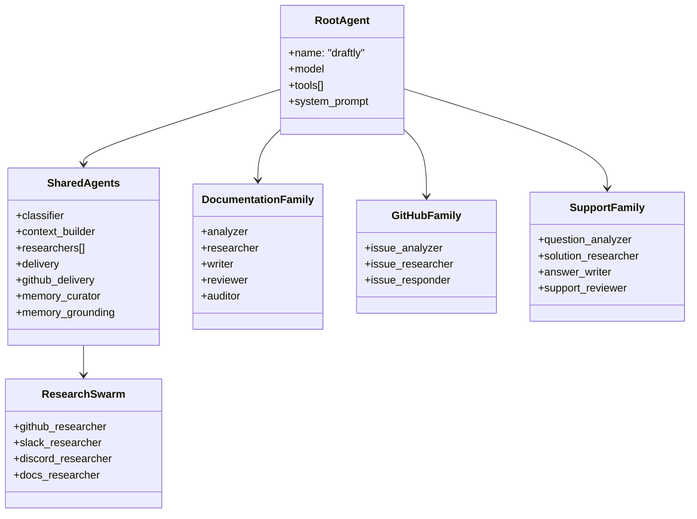
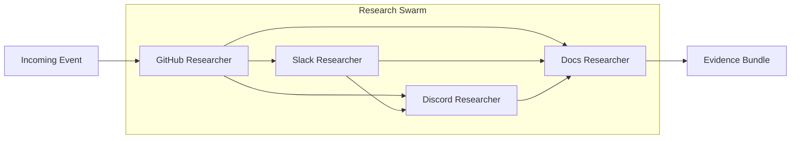
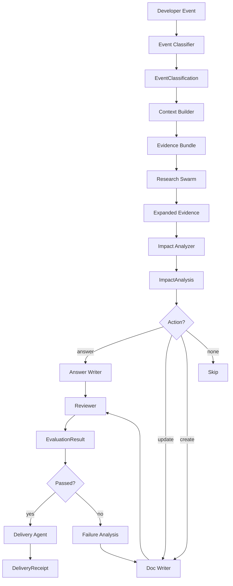

# Multi-Agent System Architecture

> **Status:** Implemented
> **Date:** 2026-08-25
> **Scope:** Draftly's multi-agent architecture including agent families, research swarm, agent composition, skills system, and shared utilities

## 1. Overview

Draftly employs a multi-agent architecture built on the Strands framework to process developer events across multiple surfaces (GitHub, Slack, Discord, documentation stores). The system is organized into four agent families—documentation, GitHub, support, and shared—each handling specialized workflows. A Research Swarm of four channel-scoped researchers enables parallel evidence collection across disparate sources.

Agents compose into directed workflows where each agent performs a focused task (classification, research, writing, evaluation, delivery) and passes structured output to the next agent. The system includes 20 agent skills that provide domain-specific guidance, and shared utilities for memory management, context building, and delivery orchestration.

## 2. Agent Families

### 2.1 Documentation Family

The documentation family handles the full lifecycle of documentation changes—from analyzing impact to writing, reviewing, and auditing documentation.

| Agent | File | Purpose |
|-------|------|---------|
| `impact` | `documentation/analyzer.py` | Analyzes documentation impact and decides answer/update/create |
| `doc_researcher` | `documentation/researcher.py` | Researches documentation coverage and gaps |
| `doc_writer` | `documentation/writer.py` | Writes documentation change plans (create/update) |
| `doc_reviewer` | `documentation/reviewer.py` | Reviews documentation changes against policy |
| `doc_auditor` | `documentation/auditor.py` | Audits documentation for staleness and gaps |

### 2.2 GitHub Family

The GitHub family processes GitHub issues to determine if they signal documentation gaps or require support-style answers.

| Agent | File | Purpose |
|-------|------|---------|
| `issue_analyzer` | `github/issue_analyzer.py` | Analyzes GitHub issues for documentation gaps |
| `issue_researcher` | `github/issue_researcher.py` | Researches GitHub issues for context and solutions |
| `issue_responder` | `github/issue_responder.py` | Responds to GitHub issues with answers or doc pointers |

### 2.3 Support Family

The support family handles incoming support questions from Slack and Discord, routing them to the appropriate workflow.

| Agent | File | Purpose |
|-------|------|---------|
| `support_analyzer` | `support/question_analyzer.py` | Analyzes support questions for documentation gaps |
| `support_researcher` | `support/solution_researcher.py` | Researches solutions for support questions |
| `support_writer` | `support/answer_writer.py` | Writes answers to support questions |
| `support_reviewer` | `support/support_reviewer.py` | Reviews support answers for accuracy and completeness |

### 2.4 Shared Agents

Shared agents provide cross-cutting functionality used by all families.

| Agent | File | Purpose |
|-------|------|---------|
| `event_classifier` | `shared/classifier.py` | Classifies incoming developer events by surface and impact |
| `context` | `shared/context.py` | Collects evidence about the event from GitHub, search, and docs |
| `delivery` | `shared/delivery.py` | Delivers the final output (PR, reply, or message) with HITL |
| `github_delivery` | `shared/github_delivery.py` | Opens documentation pull requests on GitHub |
| `memory_curator` | `shared/memory_curator.py` | Curates long-term memory candidates into durable knowledge |

## 3. Research Swarm

The Research Swarm is a Strands `Swarm` of four channel-scoped researchers that collaborate to gather evidence across multiple sources. The swarm uses automatic handoffs to route research tasks to the most appropriate researcher.

| Researcher | Tools | Scope |
|------------|-------|-------|
| `github_researcher` | `github_intelligence` | GitHub issues, PRs, diffs, code |
| `slack_researcher` | `slack_search`, `slack_get_thread` | Slack conversation history |
| `discord_researcher` | `discord_search`, `discord_get_thread` | Discord conversation history |
| `docs_researcher` | `semantic_search`, `keyword_search`, `hybrid_search` | Documentation store coverage |

**Swarm Configuration:**
- Entry point: `github_agent`
- Max handoffs: 20
- Max iterations: 20
- Execution timeout: 900s
- Node timeout: 300s
- Repetitive handoff detection: 8 window, 3 min unique agents

## 4. Agent Composition Workflow

Agents compose into workflows where each agent's output becomes the next agent's input. The typical flow follows: classify → research → analyze → write → review → deliver.

## 5. Agent Skill System

Draftly includes 20 agent skills that provide domain-specific guidance, rules, and references for each workflow. Skills are defined as SKILL.md files with metadata, steps, guidelines, and references.

| Skill | Description |
|-------|-------------|
| `documentation-audit` | Audits documentation for staleness, broken links, and coverage gaps |
| `documentation-evaluation` | Evaluates generated documentation for correctness and quality |
| `documentation-feedback-loop` | Converts recurring support questions into documentation work |
| `documentation-gap-detection` | Detects documentation gaps from support questions and feedback |
| `documentation-generation` | Generates new documentation pages with proper structure |
| `documentation-research` | Researches documentation coverage and existing content |
| `documentation-update` | Updates existing documentation to reflect code changes |
| `evaluation-failure-analysis` | Analyzes evaluation failures to drive revision iterations |
| `github-delivery` | Delivers documentation changes via GitHub branches and PRs |
| `github-issue-analysis` | Analyzes GitHub issues for documentation gaps |
| `github-pr-analysis` | Analyzes GitHub PRs for documentation impact |
| `github-release-analysis` | Analyzes GitHub releases for breaking changes and features |
| `memory-curation` | Consolidates and deduplicates memory items |
| `memory-retrieval` | Retrieves relevant memory items for tasks |
| `repository-analysis` | Explores repository structure and code for documentation work |
| `support-answering` | Answers support questions accurately with evidence |
| `support-delivery` | Posts approved answers to Slack/Discord threads |
| `support-evaluation` | Evaluates support answers for accuracy and helpfulness |
| `support-feedback-analysis` | Analyzes support feedback patterns for documentation gaps |
| `support-triage` | Triages incoming support questions for routing |

## 6. Shared Agent Utilities

### 6.1 Classifier

The `event_classifier` agent classifies incoming events by surface (pull_request, issue, support_question) and determines urgency. It uses structured output (`EventClassification`) and no tools.

### 6.2 Context Builder

The `context` agent gathers evidence from GitHub, search, and documentation stores. It produces an `EvidenceBundle` with items and summary, using tools for evidence collection.

### 6.3 Research Agent

The research agent (via the Research Swarm) searches across GitHub, Slack, Discord, and documentation stores. Each channel-scoped researcher specializes in its source.

### 6.4 Delivery Agent

The delivery agent handles final output delivery (PRs, replies, messages) with Human-in-the-Loop (HITL) defense-in-depth. It produces a `DeliveryReceipt` confirming successful delivery.

### 6.5 Memory Curator

The memory curator agent manages long-term memory by curating candidates into durable knowledge. It decides actions: CREATE, UPDATE, MERGE, SUPERSEDE, REJECT, or ARCHIVE for each memory candidate.

### 6.6 Memory Grounding

The `MemoryGroundedNode` wrapper recalls organizational memory (knowledge, episodes, procedures) and prepends it to agent tasks as grounding context. It degrades silently when memory is unavailable.

## 7. File Reference

| Path | Description |
|------|-------------|
| `src/draftly/agents/draftly_agent.py` | Root Draftly agent |
| `src/draftly/agents/subagents.py` | Research Swarm builder |
| `src/draftly/agents/prompts.py` | System prompt templates |
| `src/draftly/agents/schemas.py` | Pydantic schemas for agent output |
| `src/draftly/agents/shared/classifier.py` | Event classifier agent |
| `src/draftly/agents/shared/context.py` | Context builder agent |
| `src/draftly/agents/shared/research.py` | Channel-scoped researchers |
| `src/draftly/agents/shared/delivery.py` | Delivery agent with HITL |
| `src/draftly/agents/shared/github_delivery.py` | GitHub PR delivery agent |
| `src/draftly/agents/shared/memory_curator.py` | Memory curator agent |
| `src/draftly/agents/shared/memory_grounding.py` | Memory grounding wrapper |
| `src/draftly/agents/documentation/analyzer.py` | Documentation impact analyzer |
| `src/draftly/agents/documentation/researcher.py` | Documentation researcher |
| `src/draftly/agents/documentation/writer.py` | Documentation writer |
| `src/draftly/agents/documentation/reviewer.py` | Documentation reviewer |
| `src/draftly/agents/documentation/auditor.py` | Documentation auditor |
| `src/draftly/agents/github/issue_analyzer.py` | GitHub issue analyzer |
| `src/draftly/agents/github/issue_researcher.py` | GitHub issue researcher |
| `src/draftly/agents/github/issue_responder.py` | GitHub issue responder |
| `src/draftly/agents/support/question_analyzer.py` | Support question analyzer |
| `src/draftly/agents/support/solution_researcher.py` | Support solution researcher |
| `src/draftly/agents/support/answer_writer.py` | Support answer writer |
| `src/draftly/agents/support/support_reviewer.py` | Support reviewer |
| `src/draftly/skills/` | Agent skill definitions (20 skills) |
