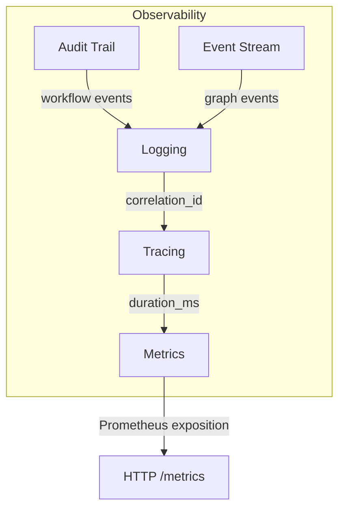
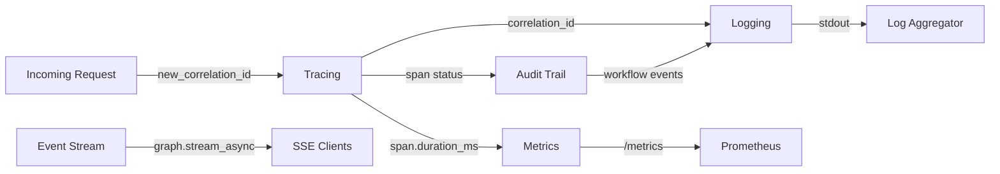

# Observability

> **Status:** Implemented
> **Date:** 2026-08-25
> **Scope:** structlog logging, metrics, tracing, audit trail, and event streaming

## 1. Overview

The observability subsystem provides five pillars of visibility into Draftly's runtime behavior: structured logging, metrics collection, request correlation and tracing, an append-only audit trail, and real-time event streaming via SSE. All components are designed to be dependency-free at the core (no OpenTelemetry or Prometheus server required), process-local, and safe for single-instance deployments.

The logging pipeline uses `structlog` with a `ProcessorFormatter` that treats both application and third-party log entries identically. Metrics are collected in a thread-safe in-process registry with counters, gauges, and timing histograms, exposed in Prometheus text exposition format. Tracing is built on a `ContextVar` that carries a correlation ID across async boundaries, with an optional `traced` context manager that records span durations into the metrics registry. The audit trail stores workflow-level events with a pluggable persistence sink and an in-memory fallback. Event streaming provides an in-process pub/sub hub that fans graph events out to subscribed SSE clients.



## 2. Structured Logging

**Source:** `draftly/observability/logging.py`

All logging flows through a single `configure_logging(settings)` call, which is idempotent (guarded by a handler marker `_draftly_handler`). The pipeline uses `structlog.stdlib.ProcessorFormatter` so that both structlog entries and foreign stdlib entries receive identical treatment.

### Processor Chain

| Processor | Purpose |
|-----------|---------|
| `merge_contextvars` | Merges any values set via `structlog.contextvars` |
| `add_correlation_id` | Injects the active tracing correlation ID |
| `add_log_level` | Adds the log level to the event dict |
| `add_logger_name` | Adds the logger module name |
| `TimeStamper(fmt="iso", utc=True)` | Adds an ISO-formatted UTC timestamp |

### Renderers

- **Development:** `ConsoleRenderer()` — colored, human-readable console output.
- **Production:** `JSONRenderer()` — structured JSON for log aggregation pipelines.

### Third-Party Noise Control

`slack_bolt` logger is set to `ERROR` to suppress verbose debug output from the Slack SDK.

## 3. Metrics

**Source:** `draftly/observability/metrics.py`

A thread-safe in-process metrics registry (`Metrics`) supports three metric types with a single-process scope.

### Metric Types

| Type | API | Storage | Description |
|------|-----|---------|-------------|
| Counter | `increment(name, value=1.0)` | `defaultdict(float)` | Monotonically increasing count |
| Gauge | `set_gauge(name, value)` | `dict[str, float]` | Point-in-time value |
| Timing | `observe(name, seconds)` / `timer(name)` context manager | `defaultdict(list)` with 10,000 sample cap | Duration histogram |

### Timer Context Manager

```python
async with metrics.timer("my_operation"):
    await do_work()
# Automatically records <name>.calls and <name>.duration_ms
```

The `_Timer` inner class uses `time.perf_counter()` for high-resolution timing. On exit, it records both `<name>.calls` (counter) and `<name>.duration_ms` (timing histogram).

### Summary Statistics

The `_summarize` method computes `count`, `sum_ms`, `p50_ms`, and `p99_ms` from sorted samples.

### Prometheus Exposition

`metrics.render()` produces standard Prometheus text format:

```
# TYPE my_counter counter
my_counter 42.0
# TYPE my_gauge gauge
my_gauge 7.0
# TYPE my_timer_milliseconds summary
my_timer_milliseconds_count 100
my_timer_milliseconds{quantile="p50_ms"} 12.5
my_timer_milliseconds{quantile="p99_ms"} 89.3
```

A module-level singleton `metrics = Metrics()` is shared across the application.

## 4. Tracing and Correlation

**Source:** `draftly/observability/tracing.py`

### Correlation ID

A `ContextVar[str]` named `_correlation_id` carries a UUID hex string across async call chains within a single request or workflow.

| Function | Purpose |
|----------|---------|
| `new_correlation_id()` | Generate and set a fresh UUID hex |
| `current_correlation_id()` | Read the active ID (empty string outside scope) |
| `bind_correlation_id(id)` | Adopt an externally supplied ID (e.g. from HTTP headers) |
| `clear_correlation_id()` | Reset after request handling |

### Span Timing

The `traced(name, metrics, attributes)` async context manager:

1. Captures the current correlation ID.
2. Starts a `perf_counter` timer.
3. Yields a span dict with `name`, `correlation_id`, and `attributes`.
4. On success, sets `span["status"] = "ok"`.
5. On exception, sets `span["status"] = "error"` and increments `<name>.errors`.
6. Always records `span["duration_ms"]`, and when a `metrics` instance is provided, increments `<name>.calls` and observes `<name>.duration_ms`.

### Integration with Logging

The logging processor `add_correlation_id` calls `current_correlation_id()` and injects it into every log event dict, enabling log correlation across async boundaries.

## 5. Audit Trail

**Source:** `draftly/observability/audit.py`

`AuditTrail` is an append-only store with a pluggable persistence sink. It complements the security audit module (`draftly.security.audit`) by recording workflow-level events: run outcomes, human decisions, and system actions.

### Design

- **Sink:** Any async callable `sink(entry)`. When `None`, entries are only held in memory.
- **In-Memory Fallback:** A `deque(maxlen=1000)` holds recent entries so callers never fail because of auditing.
- **Error Handling:** Sink failures are logged but do not propagate to callers.

### API

| Method | Purpose |
|--------|---------|
| `record(actor, action, target, outcome, details)` | Record one auditable event |
| `record_run(run_id, workflow, status, details)` | Convenience for `workflow_run` actions |
| `recent(limit=50)` | Return recent in-memory entries (newest first) |

### Entry Schema

```json
{
  "actor": "system",
  "action": "workflow_run",
  "target": "run-abc123",
  "outcome": "ok",
  "details": {"workflow": "docs-update"},
  "at": "2026-08-25T12:00:00+00:00"
}
```

## 6. Event Streaming

**Source:** `draftly/observability/events.py`

### Graph Event Stream

`stream_graph_events(graph, task, invocation_state)` wraps `graph.stream_async` into an async iterator of SSE-ready dicts with `event` and `data` fields.

### In-Process Pub/Sub

`EventStream` provides channel-based fan-out for live workflow events.

| Method | Purpose |
|--------|---------|
| `subscribe(channel)` | Return an `asyncio.Queue` (maxsize=256) |
| `unsubscribe(channel, queue)` | Remove a subscriber; clean up empty channels |
| `publish(channel, event)` | Fan event to all subscribers; returns delivery count |

Slow subscribers (full queue) are logged and skipped rather than blocking the publisher.

### SSE Rendering

`EventStream.format_sse(event)` renders a single event as a Server-Sent Events frame:

```
event: node_complete
data: {"channel": "default", "at": "...", "node": "analyzer"}
```

## 7. Interconnections



The five pillars are loosely coupled: each can be used independently, but they reinforce each other when combined. Correlation IDs flow from tracing into logs. Span timings flow into metrics. Audit entries include the workflow context. Event streams capture graph execution for real-time dashboards.

## 8. File Reference

| File | Role |
|------|------|
| `src/draftly/observability/logging.py` | structlog configuration and processor pipeline |
| `src/draftly/observability/metrics.py` | Thread-safe counters, gauges, timing histograms, Prometheus exposition |
| `src/draftly/observability/tracing.py` | ContextVar correlation ID and `traced` span timing |
| `src/draftly/observability/audit.py` | Append-only audit trail with pluggable sink |
| `src/draftly/observability/events.py` | Graph event streaming and in-process pub/sub for SSE |
