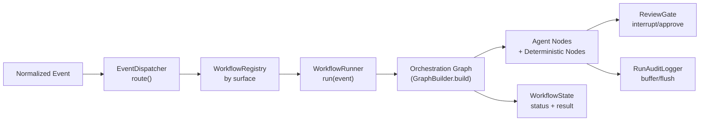
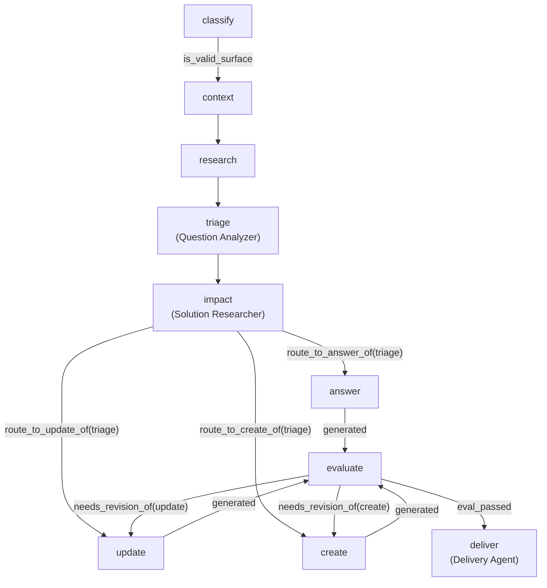
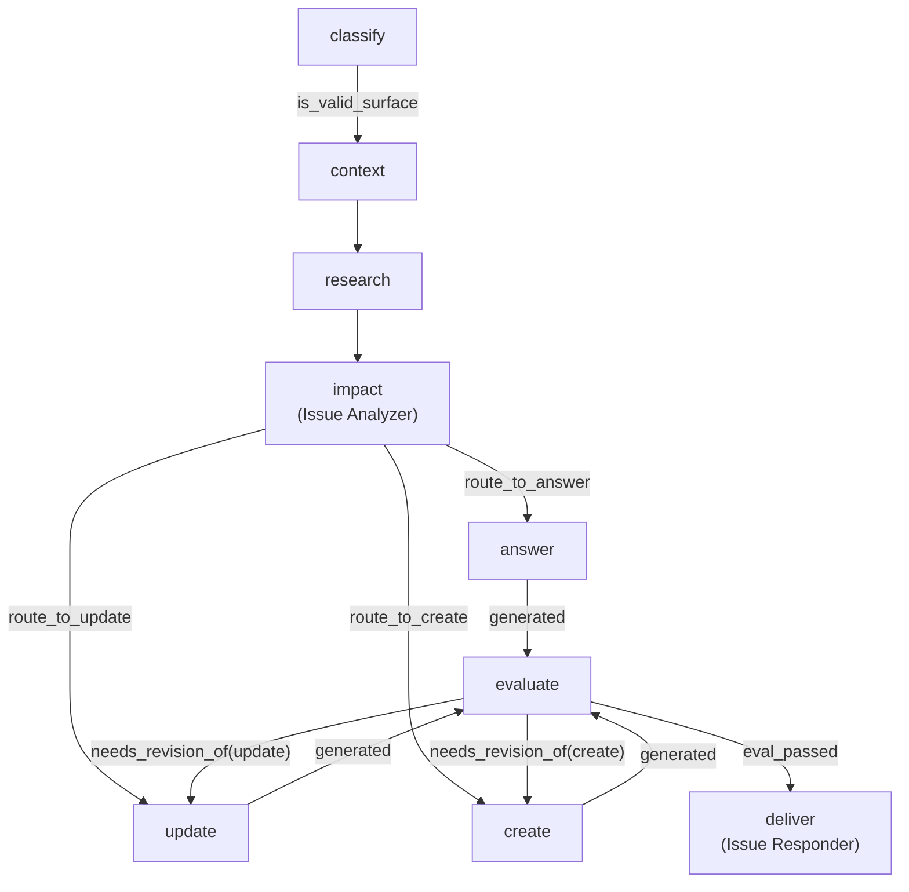
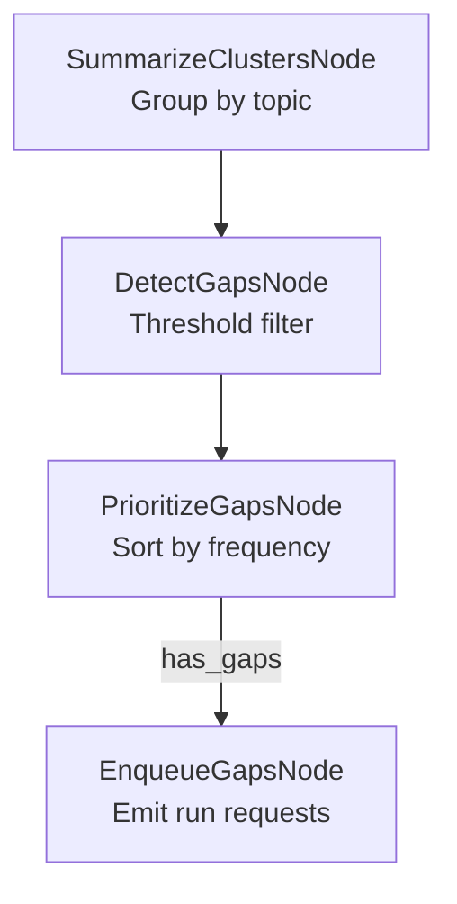
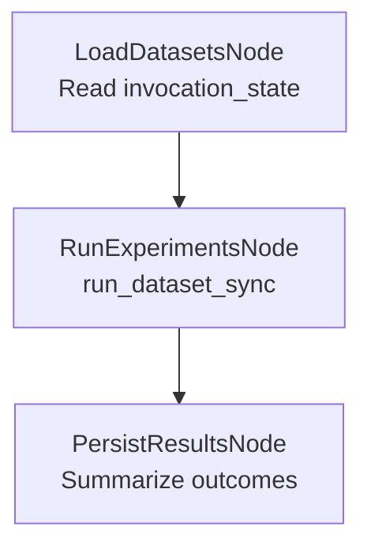
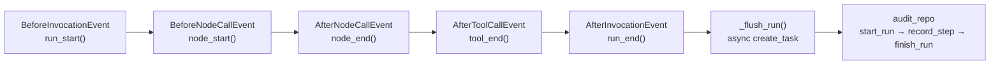
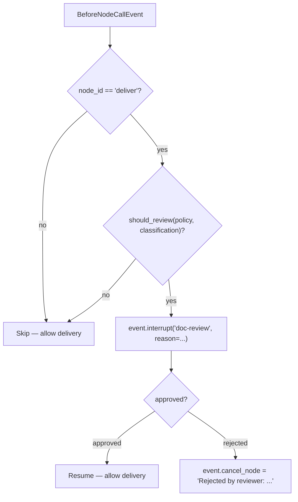
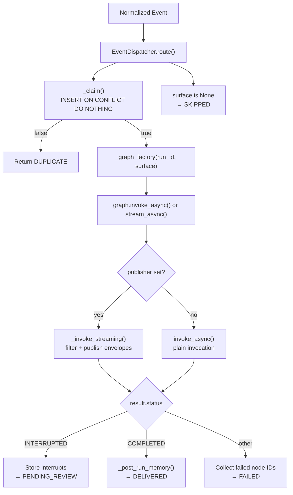

# Orchestration Layer

> **Status:** Implemented
> **Date:** 2026-08-25
> **Scope:** Graph construction, node abstractions, hooks, routing, typed state, and the WorkflowRunner execution lifecycle

## 1. Overview

The orchestration layer composes agent instances into directed acyclic graphs using the Strands multiagent SDK (`GraphBuilder`). Each graph models a complete workflow — intake, classification, research, generation, evaluation, and delivery — with deterministic routing conditions that decide which generation path to take and whether human review is required before delivery.

Five orchestration graphs exist today, sharing common infrastructure: a base node abstraction for parsing inter-node payloads, a deterministic evaluator that gates quality, hook providers for audit logging and human-in-the-loop review, and typed Pydantic state classes that normalize incoming events from each surface (GitHub, Slack, Discord).

The `WorkflowRunner` wraps graph execution with idempotency (atomic claim via the events table), session persistence, streaming, outcome handling, and token accounting. It bridges the event system (normalized webhooks, scheduled jobs) to the graph runtime.



## 2. Orchestration Graphs

### 2.1 Documentation Graph

The primary graph. Handles pull requests, releases, and any documentation-focused event.

```mermaid
flowchart TD
    classify["classify\n(Classifier Agent)"]
    context["context\n(Context Agent)"]
    research["research\n(Research Swarm)"]
    impact["impact\n(Impact Agent)"]
    answer["answer\n(Answer Writer)"]
    update["update\n(Writer Agent)"]
    create["create\n(Writer Agent)"]
    evaluate["evaluate\n(EvaluatorNode)"]
    deliver["deliver\n(Delivery Agent)"]

    classify -->|"is_valid_surface"| context
    context --> research
    research --> impact
    impact -->|"route_to_answer"| answer
    impact -->|"route_to_update"| update
    impact -->|"route_to_create"| create
    answer -->|"generated"| evaluate
    update -->|"generated"| evaluate
    create -->|"generated"| evaluate
    evaluate -->|"needs_revision_of(update)"| update
    evaluate -->|"needs_revision_of(create)"| create
    evaluate -->|"eval_passed"| deliver
```



**Nodes:** classify, context, research, impact, answer, update, create, evaluate, deliver

**Key details:**
- Two distinct writer agent instances for `update` and `create` (SDK rejects duplicate executors)
- `EvaluatorNode` defaults to `max_iterations=2` to stay under the `max_node_executions=10` budget
- Memory grounding wraps the context agent when memory is available
- `ReviewGate` and `RunAuditLogger` attach as hook providers before graph build

### 2.2 Support Graph

Handles Slack and Discord questions. Adds a triage node between research and impact.



**Key difference from documentation graph:** Routing conditions read the `triage` node's `ImpactAnalysis` (question analyzer verdict) rather than the `impact` node's output (free-text solution research).

### 2.3 Issue Graph

Handles GitHub issue events. Uses `issue_analyzer` as the impact node and `issue_responder` for delivery.



**Key difference:** Delivery posts a comment on the issue (via `IssueResponder`) rather than posting to Slack/Discord or creating a PR.

### 2.4 Feedback Graph

Scheduled, deterministic graph with no LLM agents. Clusters support questions, detects documentation gaps, prioritizes them, and enqueues documentation runs.



**All nodes are deterministic `MultiAgentBase` custom nodes** — no model calls, no tool use. The gap threshold defaults to 2 (a topic must appear in at least 2 questions).

### 2.5 Evaluation Graph

CI/batch evaluation harness. Loads golden datasets, runs experiments, and persists pass/fail results.



**Key detail:** `RunExperimentsNode` uses `asyncio.to_thread` to run dataset experiments because the default runner calls `asyncio.run()` internally, which cannot nest inside the graph's event loop.

## 3. Base Node Abstraction

`orchestration/nodes/base.py` provides three helpers shared by all graph nodes and routing conditions:

| Function | Purpose |
|----------|---------|
| `agent_result(data)` | Wraps a Python dict as an `AgentResult` with JSON in the message text, so downstream nodes and conditions can parse it |
| `node_data(state, node_id)` | Reads a node's structured payload from graph state — handles both `MultiAgentBase` results (nested under node name) and LLM agent results (on `structured_output`) |
| `safe_node_data(state, node_id)` | Best-effort `node_data` that returns `None` instead of raising; critical for session-restored states where `structured_output` is lost |
| `parse_node_input(task)` | Parses the graph's `list[ContentBlock]` input format (`"From <dep_id>:\n  - <agent_name>: <json>"`) into `{dep_id: dict}` |

**Three result shapes** (verified against `strands/multiagent/graph.py`):
1. Custom `MultiAgentBase` nodes: `state.results[node_id].result` → `MultiAgentResult` → `results[name].result` → `AgentResult` → JSON in message text
2. LLM agents with `structured_output_model`: `state.results[node_id].result` → `AgentResult` → `.structured_output.model_dump()`
3. Session-restored results: structured output lost, message has tool blocks — `safe_node_data` returns `None`, conditions degrade to `False`

## 4. EvaluatorNode

A deterministic quality gate (`orchestration/nodes/evaluate.py`) that scores generated drafts on three axes:

| Metric | Weight | Criterion |
|--------|--------|-----------|
| Citation coverage | 0.4 | Fraction of evidence items whose `id` appears in the draft |
| Topic completeness | 0.3 | Fraction of evidence `topic` strings found (case-insensitive) in the draft |
| Length heuristic | 0.3 | `min(len(draft) / 500, 1.0)` — very short drafts score low |

**Pass threshold:** score >= 0.7 **or** iteration >= `max_iterations`. The node tracks its own iteration count and forces a pass at the iteration cap to prevent infinite revise loops.

**Revise routing:** When evaluation fails, `needs_revision_of(node_id)` routes back to whichever generation node actually produced the draft (`update` or `create`). Each revise edge is scoped to a single node ID to prevent both edges from firing simultaneously.

## 5. Hook Providers

### 5.1 RunAuditLogger

Buffers per-step telemetry (node starts/ends, tool calls) during graph execution and flushes asynchronously at invocation end. Never blocks the graph on I/O.



**Design:** Hook callbacks are synchronous (Strands requirement). Events are buffered in `_steps` and `_run_meta` lists. At `AfterInvocationEvent`, `run_end()` schedules an async `create_task(_flush_run(...))` that writes `agent_runs` + `agent_steps` rows. Without an audit repo, the hook degrades to structured log lines.

### 5.2 ReviewGate

Human-in-the-loop hook that pauses the graph before the `deliver` node.



**Key behaviors:**
- First call: `event.interrupt()` raises `InterruptException`, graph finishes with `Status.INTERRUPTED`
- Resume: `invoke_async` receives `interruptResponse`, `interrupt()` returns the stored decision
- Rejection sets `event.cancel_node` (SDK propagates `RuntimeError` — caught by the workflow runner)
- Interrupt IDs are deterministic (uuid5 of node_id + name) — stable across processes

## 6. Routing

### 6.1 Classifiers

`routing/classifiers.py` maps normalized `event_type` strings to surfaces and workflow keys. This is an LLM-free, deterministic lookup:

| Event prefix | Surface | Workflow |
|-------------|---------|----------|
| `pull_request` | `pull_request` | `github_pr` |
| `issues` | `issue` | `github_issue` |
| `slack` | `support` | `support` |
| `discord` | `support` | `support` |

### 6.2 Conditions

`routing/conditions.py` defines graph edge conditions. All conditions guard on node presence before reading payloads (defensive against partially-executed graphs):

| Condition | Purpose |
|-----------|---------|
| `is_valid_surface` | Parses task JSON and checks `event_type` prefix against `RECOGNIZED_SURFACES` |
| `route_to_answer` / `route_to_update` / `route_to_create` | Reads `action` field from the impact node's `ImpactAnalysis` |
| `route_to_answer_of(node_id)` | Factory — routes off a specific node's output (used by support graph to route on `triage`) |
| `generated` | True when any of answer/update/create has produced output |
| `eval_passed` / `needs_revision` | Reads `passed` field from evaluator node |
| `needs_revision_of(*node_ids)` | Scoped revision — only routes back to nodes that actually ran |
| `all_dependencies_complete(required)` | AND-semantics — fires only when every listed node completed |

### 6.3 Policies

`routing/policies.py` resolves whether human review is required before delivery:

| Policy | Behavior |
|--------|----------|
| `always` | Every delivery requires human approval (default) |
| `risky` | Only high-risk changes require approval (`breaking_change`, `deprecation`, `api_change`, or `urgency=high`) |
| `never` | Auto-approve everything (not recommended for production) |

`resolve_review_policy()` normalizes untrusted input — unknown values fall back to `always`.

## 7. Typed State Classes

Each surface defines a Pydantic `BaseModel` for its normalized event. These are the graph's `task` JSON:

| Class | File | Key fields |
|-------|------|------------|
| `PullRequestEvent` | `state/documentation.py` | `event_type`, `pull_request.{number, sha, title, changed_files}` |
| `IssueEvent` | `state/documentation.py`, `state/issue.py` | `event_type`, `issue.{number, title, body, labels}` |
| `SupportEvent` | `state/support.py` | `source` (slack/discord), `source_message_id`, `question` |
| `FeedbackEvent` | `state/feedback.py` | `source`, `normalized_question`, `answer_status` |

## 8. WorkflowRunner

`WorkflowRunner` replaces the pipelines layer. One run = one session = one graph.

### Lifecycle



### WorkflowStatus

Seven statuses tracked by `WorkflowState`:

| Status | Meaning |
|--------|---------|
| `pending` | Initial state before execution |
| `running` | Graph is executing |
| `duplicate` | Event already claimed by another run |
| `pending_review` | Graph interrupted by ReviewGate, awaiting human decision |
| `delivered` | Graph completed successfully |
| `failed` | One or more nodes failed |
| `skipped` | Event type not recognized by dispatcher |

### Idempotency

Claimed **before** the graph is touched: an atomic `INSERT..ON CONFLICT DO NOTHING` on the events table decides whether this delivery owns the run. If claim fails, the runner checks if the event was already recorded and returns `DUPLICATE`.

### Streaming

When a `publisher` is set, the runner iterates `graph.stream_async()`, filters events through `filter_graph_event()`, and publishes `StreamEnvelope` objects. The stream MUST end with a `result` or `force_stop` terminal event. Time-to-first-token (`ttft`) is measured from invocation start to first `text_delta`.

## 9. WorkflowContext

A dataclass bundling all dependencies a workflow function may touch:

| Field | Purpose |
|-------|---------|
| `repositories` | Duck-typed storage (`.events`, `.reviews`, `.documents`, `.support`, `.routing`, `.performance`) |
| `tools` | Tools registry passed to graph agents |
| `model` | Strands model for graph agents (None = offline/test) |
| `hooks` | Additional hook providers |
| `config` | Application config (`.strands.review_policy`, `.strands.max_node_executions`, etc.) |
| `audit_repo` | Audit log persistence |
| `memory` | Agentic memory subsystem |
| `publisher` | Streaming publisher (None = streaming off) |

## 10. WorkflowRegistry

Maps canonical workflow names to async workflow functions. Supports `register()`, `get()`, `run()`, and attribute-access fallback for legacy callers.

```python
registry.register("github_pr", run_pull_request_workflow)
registry.register("github_issue", run_github_issue_workflow)
registry.register("support", run_slack_support)
```

## File Reference

| File | Purpose |
|------|---------|
| `src/draftly/orchestration/graphs/documentation_graph.py` | Primary documentation graph builder |
| `src/draftly/orchestration/graphs/support_graph.py` | Slack/Discord support graph builder |
| `src/draftly/orchestration/graphs/issue_graph.py` | GitHub issue graph builder |
| `src/draftly/orchestration/graphs/feedback_graph.py` | Scheduled feedback-loop graph (deterministic) |
| `src/draftly/orchestration/graphs/evaluation_graph.py` | CI/batch evaluation harness graph |
| `src/draftly/orchestration/nodes/base.py` | `agent_result`, `node_data`, `safe_node_data`, `parse_node_input` |
| `src/draftly/orchestration/nodes/evaluate.py` | `EvaluatorNode`, `compute_quality` |
| `src/draftly/orchestration/hooks/audit.py` | `RunAuditLogger` hook provider |
| `src/draftly/orchestration/hooks/review_gate.py` | `ReviewGate` hook provider |
| `src/draftly/orchestration/routing/classifiers.py` | `surface_for_event`, `workflow_for_event` |
| `src/draftly/orchestration/routing/conditions.py` | Graph edge conditions |
| `src/draftly/orchestration/routing/policies.py` | `should_review`, `resolve_review_policy` |
| `src/draftly/orchestration/state/documentation.py` | `PullRequestEvent`, `IssueEvent` |
| `src/draftly/orchestration/state/issue.py` | `IssueEvent` (issue surface) |
| `src/draftly/orchestration/state/support.py` | `SupportEvent` |
| `src/draftly/orchestration/state/feedback.py` | `FeedbackEvent` |
| `src/draftly/workflows/runner.py` | `WorkflowRunner` |
| `src/draftly/workflows/state.py` | `WorkflowState`, `WorkflowStatus` |
| `src/draftly/workflows/context.py` | `WorkflowContext` |
| `src/draftly/workflows/registry.py` | `WorkflowRegistry` |
