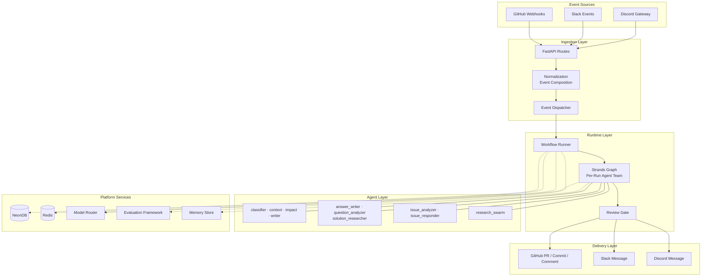
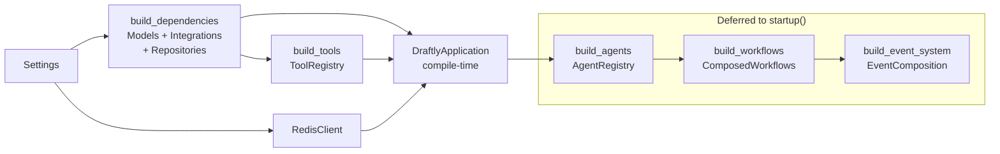
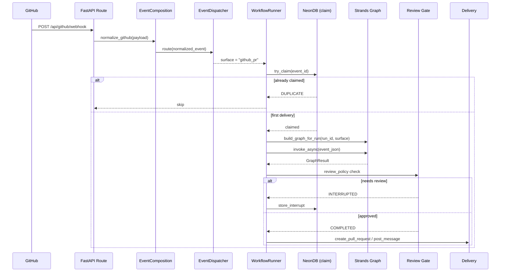

# Draftly Architecture Overview

> **Status:** Implemented
> **Date:** 2026-08-25
> **Scope:** High-level system architecture of the Draftly autonomous documentation engineering platform

## 1. Overview

Draftly is an autonomous documentation engineering platform that processes events from GitHub, Slack, and Discord, routes them through specialized agent workflows, and produces documentation updates, support responses, and code-level changes via pull requests. The system is built on FastAPI, powered by Strands agents, and uses NeonDB (PostgreSQL) and Redis for persistence and real-time coordination.

At its core, Draftly follows an event-driven architecture: external webhooks arrive at FastAPI routes, get normalized into a common event envelope, and are dispatched to the appropriate workflow. Each workflow constructs a Strands agent graph on-the-fly — agents are not singletons but per-run objects composed from a factory registry with model-specific tool scoping. The entire runtime lifecycle (infrastructure, composition, background workers) is managed through an async context manager that starts and stops services in dependency order.

## 2. System Architecture

The system is organized into five layers that process events from ingestion to delivery:

## 3. Layer Descriptions

### Event Sources

Three external integrations feed events into Draftly:

| Source | Transport | Examples |
|--------|-----------|----------|
| GitHub | Webhook POST (`/api/github/webhook`) | Pull request opened, issue created, release published, push |
| Slack | Bolt Socket Mode + HTTP (`/api/slack/*`) | Message posted in thread, mention |
| Discord | Gateway WebSocket (`/api/discord/*`) | Thread message, mention |

### Ingestion Layer

Raw webhook payloads are normalized by platform-specific processors (`PullRequestProcessor`, `IssueProcessor`, `SlackProcessor`, etc.) into a common event envelope. The `EventDispatcher` then maps the normalized event to a workflow surface name (e.g., `github_pr`, `slack_support`).

### Runtime Layer

The `WorkflowRunner` is the central execution engine. It claims the event idempotently, constructs a Strands agent graph for the run's surface, and invokes it. After execution, a review gate determines whether the result proceeds to delivery or is held for human approval.

### Agent Layer

Agents are not pre-instantiated singletons. The `AgentRegistry` holds factory functions — one per role. At graph construction time, factories are called with the run's resolved model and scoped tool set, producing fresh agent instances for each execution. This ensures model routing decisions (fast vs. reasoning) are respected per-run.

### Delivery Layer

Completed workflows produce side effects in external systems: pull requests on GitHub, messages in Slack/Discord threads, or direct commits. Delivery is always gated by the review policy.

### Platform Services

| Service | Purpose |
|---------|---------|
| NeonDB (PostgreSQL) | Event persistence, document store, reviews, evaluations, memory, routing telemetry |
| Redis | Event streaming, semantic caching, rate limiting, provider health, ticket store, EMA stats, RQ job queues |
| Model Router | Selects the best LLM per task type with cross-provider fallback and EMA-based scoring |
| Evaluation Framework | Documentation quality evaluation loops |
| Memory Store | Episodic memory, procedural memory, document graph, candidate extraction |

## 4. Composition Architecture

Draftly uses a composition root pattern (`create_application()`) that wires all dependencies in a strict order. The composition is split into two phases:

- **Compile-time**: Settings, infrastructure clients, tools, and model handles are built immediately.
- **Startup-time**: Agents, workflows, and events are built after infrastructure is confirmed healthy (database connection, evaluation store warm-start).

This two-phase approach prevents import-time failures when provider keys are absent (offline/CI mode) and ensures database-dependent services are available before agent construction.

## 5. Request Flow

A typical GitHub pull request event follows this path:

## 6. Key Design Decisions

| Decision | Rationale |
|----------|-----------|
| Agents as factories, not instances | Each run gets its own agent instances scoped to the resolved model and surface-specific tools |
| Idempotency via DB claim | Atomic `INSERT..ON CONFLICT DO NOTHING` prevents duplicate graph executions for retrying webhooks |
| Two-phase composition | Enables offline/CI mode without provider keys while keeping startup orderly |
| Per-run graph construction | Strands graphs are ephemeral — one session, one graph, one run |
| Review gate as interrupt | Graph execution halts at a human-in-the-loop node rather than failing silently |
| Redis dual-mode streaming | Configurable between pub/sub and stream backends with `_TeePublisher` fallback to DB |

## 7. File Reference

| File | Role |
|------|------|
| `main.py` | Application entrypoint — loads env, starts uvicorn |
| `src/draftly/app/config.py` | `Settings` class — all env vars and defaults |
| `src/draftly/app/lifecycle.py` | `DraftlyApplication` — async context manager, composition root |
| `src/draftly/app/dependencies.py` | `ApplicationDependencies` — DI container |
| `src/draftly/app/api/app.py` | FastAPI app factory — routers and middleware |
| `src/draftly/app/composition/agents.py` | `AgentRegistry` — role-to-factory mapping |
| `src/draftly/app/composition/tools.py` | `ToolRegistry` — scoped tool groups |
| `src/draftly/app/composition/workflows.py` | `ComposedWorkflows` — registry, runner, context |
| `src/draftly/app/composition/events.py` | `EventComposition` — webhook normalization |
| `src/draftly/app/composition/workers.py` | `TaskRunner` + scheduled job definitions |
| `src/draftly/app/composition/rq_jobs.py` | RQ queue setup and job enqueue interface |
| `src/draftly/app/composition/rq_scheduler.py` | rq-scheduler cron job registration |
| `src/draftly/agents/draftly_agent.py` | Root Draftly agent definition |
| `src/draftly/workflows/runner.py` | `WorkflowRunner` — graph execution engine |
