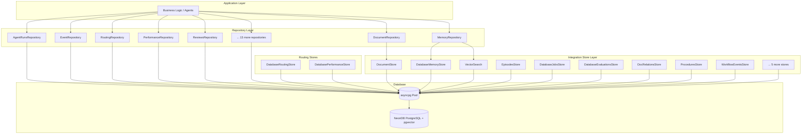
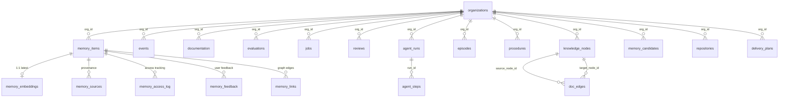
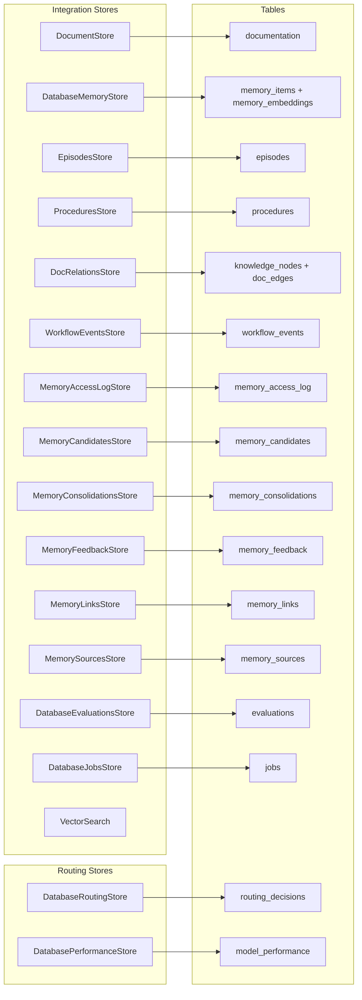
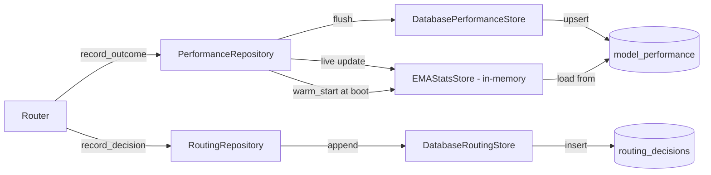

# Persistence Layer

> **Status:** Implemented
> **Date:** 2026-08-25
> **Scope:** Database client, repository pattern, integration stores, vector search, routing stores, and migration system for Draftly Agent Backend

## 1. Overview

The persistence layer provides all database access for Draftly Agent Backend. It is built on asyncpg connecting to a NeonDB (PostgreSQL) instance, organized into two distinct layers: **integration stores** for low-level, table-specific data access, and **repositories** for domain-oriented business logic that composes one or more stores. The layer also includes pgvector-based semantic search for memory embeddings, a routing performance store for LLM model selection, and a migration system tracking 32 sequential schema migrations.

The design follows a strict separation of concerns: stores handle SQL generation and row mapping, repositories own transactional boundaries and domain invariants, and the `DatabaseClient` owns connection pooling and lifecycle. All database operations are fully async, and the client supports both auto-acquired connections and explicitly-passed connections for multi-statement transactions.



## 2. Database Client

The `DatabaseClient` class wraps an asyncpg connection pool with lazy initialization and configurable pool sizing.

| Property | Default | Description |
|---|---|---|
| `pool_min_size` | 2 | Minimum idle connections |
| `pool_max_size` | 10 | Maximum total connections |
| `command_timeout` | 30 | Per-query timeout in seconds |

**Source:** `src/draftly/integrations/database/client.py`

### Connection Lifecycle

- `start()` — lazily creates the pool on first use (thread-safe via `asyncio.Lock`)
- `close()` — drains and releases the pool
- `_acquire()` / pool release — automatic in `execute`, `fetch_one`, `fetch_all`

### Transaction Support

```python
async with client.transaction(isolation="read_committed") as conn:
    await client.fetch_one_conn(conn, sql, *params)
    await client.execute_conn(conn, sql, *params)
```

The `transaction()` context manager acquires a connection, starts a transaction, yields the connection for multi-statement use, and releases it on exit. Connection-scoped static helpers (`execute_conn`, `fetch_one_conn`, `fetch_all_conn`) operate on an explicitly-passed connection.

### Environment Variables

The client resolves the database URL in this order:
1. Explicit `database_url` constructor argument
2. `NEON_DATABASE_URL` environment variable
3. `DATABASE_URL` environment variable (required fallback)

## 3. Repository Pattern

Draftly defines **20 repositories** under `src/draftly/persistence/repositories/`. Each repository owns the business logic and transactional boundaries for a domain, delegating raw SQL to either an integration store or the `DatabaseClient` directly.

| # | Repository | Domain | Tables | Pattern |
|---|---|---|---|---|
| 1 | `AgentRunsRepository` | Run audit trail | `agent_runs`, `agent_steps` | Direct SQL |
| 2 | `DeliveryRepository` | Delivery plans, commits, PRs | `delivery_plans`, `delivery_commits`, `delivery_pull_requests` | Direct SQL |
| 3 | Discord functions | Discord workflow persistence | `discord_workflows` | Direct SQL (module-level) |
| 4 | `DocumentRepository` | Documentation CRUD | `documentation` | Wraps `DocumentStore` |
| 5 | `EvaluationRepository` | Evaluation results | `evaluations` | Wraps `DatabaseEvaluationsStore` |
| 6 | `EventRepository` | GitHub events + idempotency | `events` | Direct SQL |
| 7 | `GitHubInstallationsRepository` + functions | GitHub App installations & workflows | `github_installations`, `github_workflows` | Direct SQL (mixed class + module-level) |
| 8 | `JobRepositoryImpl` | Background jobs | `jobs` | Wraps `DatabaseJobsStore` |
| 9 | `MemoryRepository` | Memory CRUD + semantic search | `memory_items`, `memory_embeddings` | Wraps `DatabaseMemoryStore` + `VectorSearch` |
| 10 | `OnboardingRepository` | Onboarding state machine | `onboarding_state` | Direct SQL |
| 11 | `OrganizationsRepository` (functions) | Organization lookups | `organizations` | Direct SQL (module-level) |
| 12 | `RepositoryConfigRepository` | Repository configuration | `repositories` | Direct SQL |
| 13 | `ReviewersRepository` | Reviewer CRUD | `reviewers` | Direct SQL |
| 14 | `ReviewsRepository` | Review requests & decisions | `reviews` | Direct SQL |
| 15 | `RoutingRepository` | Routing decision log | `routing_decisions` | Wraps `DatabaseRoutingStore` |
| 16 | `PerformanceRepository` | Model performance + warm-start | `model_performance` | Wraps `DatabasePerformanceStore` + `EMAStatsStore` |
| 17 | Slack functions | Slack installations & workflows | `slack_installations`, `slack_workflows` | Direct SQL (module-level) |
| 18 | `SupportRepository` | Support threads, messages, events | `support_threads`, `support_messages`, `events` | Direct SQL |
| 19 | `WorkflowEventRepositoryImpl` | SSE replay event log | `workflow_events` | Wraps `WorkflowEventsStore` |

> **Note:** Several repositories (Discord, GitHub, Organizations, Slack) use module-level functions rather than classes. They follow the same `DatabaseClient` dependency injection pattern but expose a functional API.

### Domain Model Relationships



## 4. Integration Stores

Integration stores provide low-level, table-specific data access. They live under `src/draftly/integrations/database/` and contain 15 specialized stores (plus the `DatabaseClient` and `VectorSearch`).

### 4.1 Core Data Stores

| Store | Table(s) | Purpose |
|---|---|---|
| `DocumentStore` | `documentation` | Documentation CRUD with dual API: repository/path-based and org-based |
| `DatabaseMemoryStore` | `memory_items`, `memory_embeddings` | Memory lifecycle with transactional embedding insert/update |
| `DatabaseEvaluationsStore` | `evaluations` | Evaluation run results with metrics and failure details |
| `DatabaseJobsStore` | `jobs` | Background job scheduling and status tracking |

### 4.2 Memory Subsystem Stores

| Store | Table | Purpose |
|---|---|---|
| `MemoryAccessLogStore` | `memory_access_log` | Records every memory retrieval with query, similarity score, and rank |
| `MemoryCandidatesStore` | `memory_candidates` | Outbox table for pending memory candidates with `FOR UPDATE SKIP LOCKED` claim |
| `MemoryConsolidationsStore` | `memory_consolidations` | Logs merge/dedup/summarize operations on memories |
| `MemoryFeedbackStore` | `memory_feedback` | User/agent feedback scores on memory quality |
| `MemoryLinksStore` | `memory_links` | Graph edges between memory items (relationships) |
| `MemorySourcesStore` | `memory_sources` | Provenance tracking: source type, URL, commit SHA, content hash |

### 4.3 Knowledge Graph Stores

| Store | Table(s) | Purpose |
|---|---|---|
| `DocRelationsStore` | `knowledge_nodes`, `doc_edges` | Documentation knowledge graph with recursive code-to-doc traversal |
| `ProceduresStore` | `procedures` | Reusable procedure patterns with vector embeddings for semantic matching |

### 4.4 Workflow & Observability Stores

| Store | Table | Purpose |
|---|---|---|
| `EpisodesStore` | `episodes` | Agent run episodes with embeddings for similarity search |
| `WorkflowEventsStore` | `workflow_events` | Durable SSE event log keyed by `(run_id, seq)` for replay |

### 4.5 Vector Search

| Store | Description |
|---|---|
| `VectorSearch` | Async cosine similarity search over `memory_embeddings` joined with `memory_items` |

### 4.6 Routing Stores (in `persistence/stores/`)

| Store | Table | Purpose |
|---|---|---|
| `DatabaseRoutingStore` | `routing_decisions` | Logs every LLM routing decision with model, score, cost, and latency |
| `DatabasePerformanceStore` | `model_performance` | Upserts per-model/per-task aggregate stats (EMA, percentiles, success rate) |

### Store Classification



## 5. Vector Search (pgvector)

The system uses the `vector` PostgreSQL extension (pgvector) for semantic search across three entity types.

| Entity | Table | Extension | Index | Dimensions |
|---|---|---|---|---|
| Memory embeddings | `memory_embeddings` | `vector(1536)` | HNSW cosine | 1536 |
| Episode embeddings | `episodes` | `vector(1536)` | HNSW cosine | 1536 |
| Procedure embeddings | `procedures` | `vector(1536)` | HNSW cosine | 1536 |

**Search implementation** (`VectorSearch`): Uses the cosine distance operator `<=>` to rank active memory items by similarity, returning the top-N results with a computed `similarity` score (`1 - cosine_distance`).

**Memory insert/update flow** (`DatabaseMemoryStore`): Writes to `memory_items` and `memory_embeddings` within a single transaction. On update, a new embedding row is appended (versioned), preserving the embedding history.

**Default embedding model:** `text-embedding-3-small` (1536 dimensions).

## 6. Routing Store

The routing subsystem provides durable performance tracking for the LLM model router.



The `PerformanceRepository` bridges an in-memory EMA (Exponential Moving Average) cache with durable storage. On each routing decision, the live cache is updated first (so the next `route()` call sees it immediately), then flushed to the database. At boot, `warm_start()` loads persisted aggregates into the live cache.

**Tables:**
- `routing_decisions` — append-only log of every routing decision (model selected, score, cost, latency, success)
- `model_performance` — upserted per `(model_name, task_type)` with sample count, latency percentiles, success rate, and quality EMA

## 7. Migration System

Draftly uses numbered SQL migration files under `src/draftly/persistence/migrations/`. There are **32 migrations** (001 through 032), applied sequentially. Each file is idempotent (`CREATE TABLE IF NOT EXISTS`, `CREATE INDEX IF NOT EXISTS`).

### Migration Index

| # | File | Purpose |
|---|---|---|
| 001 | `001_organizations.sql` | Multi-tenant organizations (Clerk) |
| 002 | `002_memory_items.sql` | Core memory items with constraints |
| 003 | `003_memory_embeddings.sql` | pgvector extension + embedding table |
| 004 | `004_memory_sources.sql` | Memory provenance tracking |
| 005 | `005_memory_links.sql` | Memory graph edges |
| 006 | `006_memory_feedback.sql` | User feedback on memories |
| 007 | `007_events.sql` | GitHub event log with idempotency |
| 008 | `008_memory_access_log.sql` | Memory retrieval audit |
| 009 | `009_memory_consolidations.sql` | Memory merge/dedup log |
| 010 | `010_documentation.sql` | Documentation store with quality flags |
| 011 | `011_support_threads.sql` | Support conversation threads |
| 012 | `012_evaluations.sql` | Evaluation results |
| 013 | `013_jobs.sql` | Background job scheduler |
| 014 | `014_delivery.sql` | Delivery plans, commits, pull requests |
| 015 | `015_embeddings.sql` | Additional embedding support |
| 016 | `016_github_installations.sql` | GitHub App installations |
| 017 | `017_slack_installations.sql` | Slack workspace installations |
| 018 | `018_reviewers.sql` | Reviewer CRUD |
| 019 | `019_slack_workflows.sql` | Slack workflow tracking |
| 020 | `020_discord_workflows.sql` | Discord workflow tracking |
| 021 | `021_github_workflows.sql` | GitHub workflow tracking |
| 022 | `022_reviews.sql` | Review requests and decisions |
| 023 | `023_agent_runs.sql` | Agent run audit trail + steps |
| 024 | `024_onboarding.sql` | Onboarding state machine |
| 025 | `025_repositories.sql` | Connected repository configuration |
| 026 | `026_routing_decisions.sql` | LLM routing decision log |
| 027 | `027_model_performance.sql` | Model performance aggregates |
| 028 | `028_episodes.sql` | Agent episodes with embeddings |
| 029 | `029_procedures.sql` | Reusable procedure patterns |
| 030 | `030_doc_relations.sql` | Documentation knowledge graph |
| 031 | `031_memory_candidates.sql` | Memory candidate outbox |
| 032 | `032_workflow_events.sql` | Durable SSE event log |

### Schema Overview

The schema spans approximately 25 tables across these domains:

- **Tenant:** `organizations`
- **Memory:** `memory_items`, `memory_embeddings`, `memory_sources`, `memory_links`, `memory_feedback`, `memory_access_log`, `memory_consolidations`, `memory_candidates`
- **Documentation:** `documentation`, `knowledge_nodes`, `doc_edges`
- **Events:** `events`, `workflow_events`, `episodes`
- **Operations:** `jobs`, `agent_runs`, `agent_steps`, `reviews`, `evaluations`
- **Delivery:** `delivery_plans`, `delivery_commits`, `delivery_pull_requests`
- **Integrations:** `github_installations`, `github_workflows`, `slack_installations`, `slack_workflows`, `discord_workflows`
- **Routing:** `routing_decisions`, `model_performance`
- **Knowledge:** `procedures`
- **User:** `reviewers`, `onboarding_state`, `repositories`

## 8. Key Design Patterns

- **Outbox pattern:** `memory_candidates` uses `FOR UPDATE SKIP LOCKED` for safe concurrent claim of pending items
- **Idempotent insert:** Events, GitHub workflows, and Slack workflows use `ON CONFLICT DO NOTHING` / `ON CONFLICT DO UPDATE` for safe replay
- **Versioned embeddings:** Memory updates append new embedding rows rather than overwriting, preserving history
- **Warm-start bridge:** `PerformanceRepository` loads durable aggregates into an in-memory EMA cache at boot
- **Recursive traversal:** `DocRelationsStore.docs_for_code` uses a `WITH RECURSIVE CTE` to walk the knowledge graph from code nodes to documentation nodes
- **Transaction-scoped writes:** `DatabaseMemoryStore.insert` and `.update` use explicit transactions to atomically write both the memory item and its embedding

## File Reference

### Database Client
- `src/draftly/integrations/database/client.py`

### Integration Stores
- `src/draftly/integrations/database/doc_relations_store.py`
- `src/draftly/integrations/database/document_store.py`
- `src/draftly/integrations/database/episodes_store.py`
- `src/draftly/integrations/database/evaluations_store.py`
- `src/draftly/integrations/database/jobs_store.py`
- `src/draftly/integrations/database/memory_access_log_store.py`
- `src/draftly/integrations/database/memory_candidates_store.py`
- `src/draftly/integrations/database/memory_consolidations_store.py`
- `src/draftly/integrations/database/memory_feedback_store.py`
- `src/draftly/integrations/database/memory_links_store.py`
- `src/draftly/integrations/database/memory_sources_store.py`
- `src/draftly/integrations/database/memory_store.py`
- `src/draftly/integrations/database/procedures_store.py`
- `src/draftly/integrations/database/vector_search.py`
- `src/draftly/integrations/database/workflow_events_store.py`

### Routing Stores
- `src/draftly/persistence/stores/routing.py`

### Repositories
- `src/draftly/persistence/repositories/agent_runs.py`
- `src/draftly/persistence/repositories/delivery.py`
- `src/draftly/persistence/repositories/discord.py`
- `src/draftly/persistence/repositories/documents.py`
- `src/draftly/persistence/repositories/evaluations.py`
- `src/draftly/persistence/repositories/events.py`
- `src/draftly/persistence/repositories/github.py`
- `src/draftly/persistence/repositories/jobs.py`
- `src/draftly/persistence/repositories/memory.py`
- `src/draftly/persistence/repositories/onboarding.py`
- `src/draftly/persistence/repositories/organizations.py`
- `src/draftly/persistence/repositories/repository_config.py`
- `src/draftly/persistence/repositories/reviewers.py`
- `src/draftly/persistence/repositories/reviews.py`
- `src/draftly/persistence/repositories/routing.py`
- `src/draftly/persistence/repositories/slack.py`
- `src/draftly/persistence/repositories/support.py`
- `src/draftly/persistence/repositories/workflow_events.py`

### Migrations
- `src/draftly/persistence/migrations/001_organizations.sql` through `032_workflow_events.sql` (32 files)
