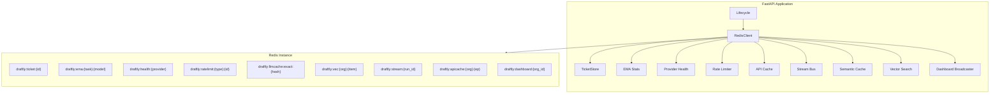
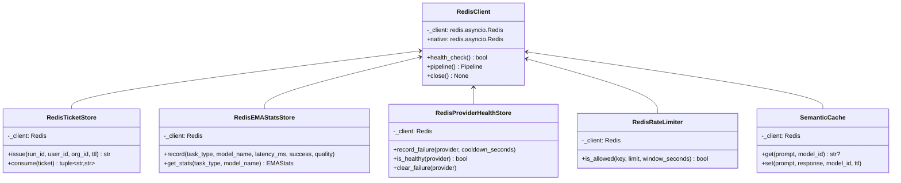
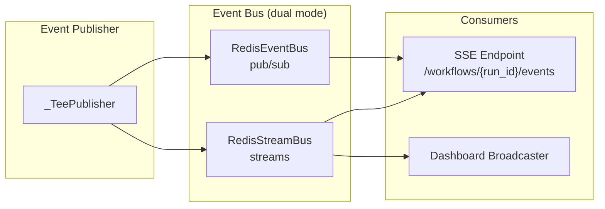
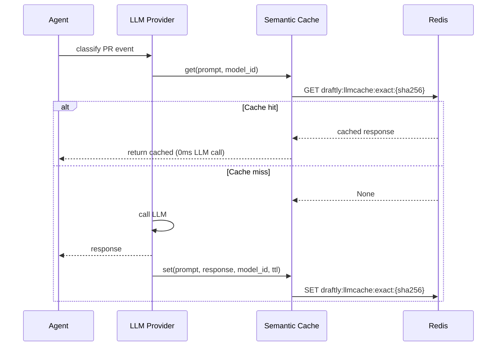
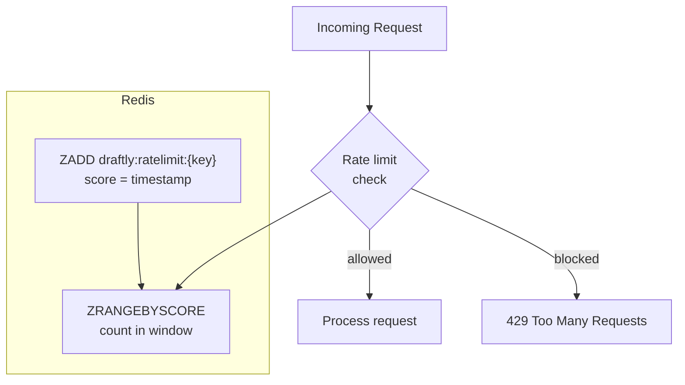
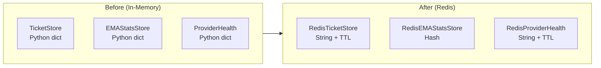
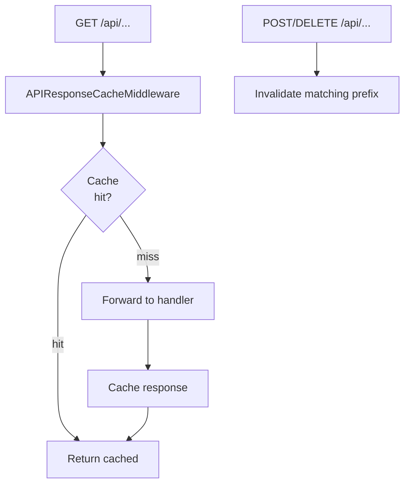
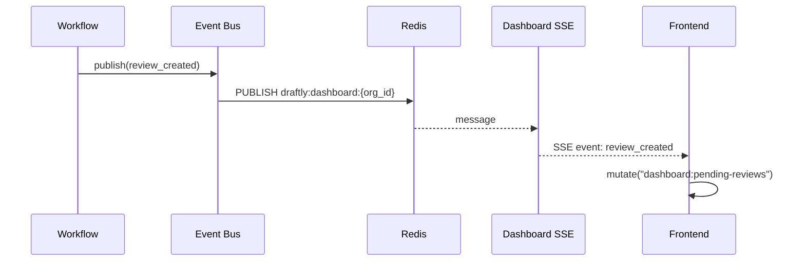
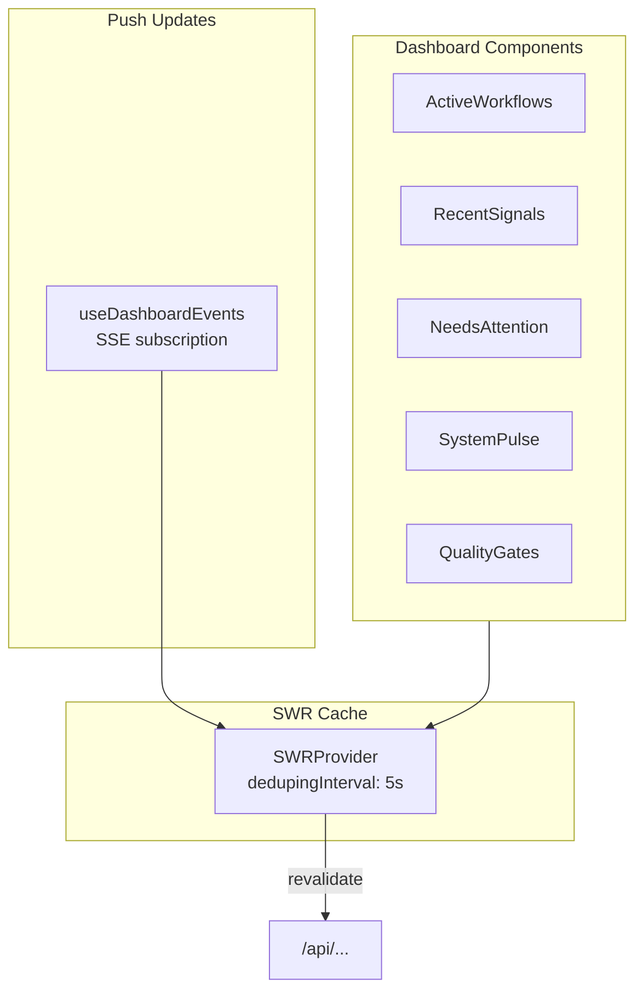
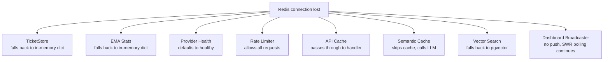

# Redis Integration Architecture

> **Status:** Implemented
> **Date:** 2026-08-25
> **Scope:** Backend Redis subsystems + frontend SWR + dashboard push

## 1. Overview

Draftly uses Redis as a shared infrastructure layer for caching, real-time streaming, rate limiting, and distributed state. All Redis subsystems share a single connection pool through `RedisClient` and use the `draftly:` key prefix for namespace isolation.



## 2. Connection Layer

`RedisClient` (`src/draftly/integrations/redis.py`) wraps `redis.asyncio` and provides:

- `.native` — raw `redis.asyncio.Redis` for subsystems that need it
- `.health_check()` — ping with graceful error handling
- `.pipeline()` — batched commands (non-transactional)
- `.close()` — graceful shutdown



## 3. Subsystem Architecture

### 3.1 Event Streaming (Dual-Mode)

The event bus supports both Redis Streams (durable, replayable) and Redis Pub/Sub (lightweight). Mode selection is configured via `event_bus_backend`:



**Key design decisions:**
- Each SSE connection gets a unique consumer (no shared consumer groups)
- Stream entries capped at `MAXLEN ~1000` per run
- Replay from PostgreSQL event store, then switch to live stream
- Pub/sub remains fallback for lightweight scenarios

### 3.2 Semantic Cache

Intercepts LLM calls at the provider level. Transparent to agent code.



**Cache TTL by task type:**

| Task Type | TTL |
|-----------|-----|
| `fast` | 600s |
| `reasoning` | 1800s |
| `documentation_generation` | 3600s |
| `support` | 900s |
| `evaluation` | 0 (disabled) |

### 3.3 Rate Limiting

Sliding window rate limiter using Redis sorted sets.



**Rate limits:**

| Source | Key Pattern | Limit | Window |
|--------|------------|-------|--------|
| GitHub webhooks | `draftly:ratelimit:github:{installation_id}` | 100 | 60s |
| Slack events | `draftly:ratelimit:slack:{workspace_id}` | 50 | 60s |
| Discord events | `draftly:ratelimit:discord:{guild_id}` | 50 | 60s |
| API per user | `draftly:ratelimit:api:{user_id}` | 30 | 60s |
| LLM per org | `draftly:ratelimit:llm:{org_id}:{task_type}` | configurable | 60s |

### 3.4 Distributed State

Replaces in-memory Python dicts with Redis-backed stores.



**Ticket Store** uses atomic GET+DEL (Lua script) for single-use SSE auth tickets.
**EMA Stats** uses Redis hashes with warm-start (load all `draftly:ema:*` at boot).
**Provider Health** uses Redis strings with TTL for auto-expiring cooldowns.

### 3.5 API Response Cache

FastAPI middleware that caches GET responses for specific endpoints.



**Cache TTLs:**

| Endpoint Pattern | TTL |
|-----------------|-----|
| `/api/workflows/` | 10s |
| `/api/repositories` | 60s |
| `/api/documentation` | 30s |
| `/api/observability/` | 20s |

### 3.6 Dashboard Push (Backend → Frontend)

Publishes dashboard-relevant events via Redis pub/sub for real-time frontend updates.



**Events broadcast:**
- `review_created` — new review pending
- `review_decided` — review approved/rejected
- `job_started` — background job began
- `job_completed` — background job finished
- `run_completed` — workflow run finished

### 3.7 Frontend SWR

Dashboard components use SWR (stale-while-revalidate) instead of custom polling.



**SWR keys:**

| Component | SWR Key | Refresh Interval |
|-----------|---------|-----------------|
| ActiveWorkflows | `dashboard:active-jobs` | 15s |
| RecentSignals | `dashboard:recent-runs` | 15s |
| NeedsAttention | `dashboard:pending-reviews` | 20s |
| SystemPulse | `dashboard:metrics` | 30s |
| QualityGates | `dashboard:model-perf` | 60s |

## 4. Key Schema

```
draftly:ticket:{id}             → SSE auth ticket (String, TTL 60s)
draftly:ema:{task}:{model}      → EMA performance stats (Hash)
draftly:health:{provider}       → Provider cooldown (String, TTL 300s)
draftly:ratelimit:{type}:{id}   → Rate limit window (Sorted Set)
draftly:llmcache:exact:{hash}   → Exact LLM cache (String, TTL varies)
draftly:llmcache:semantic:{org} → Semantic LLM cache index (RediSearch)
draftly:vec:{org}:{item_id}     → Vector embeddings (Hash, per-org RediSearch)
draftly:stream:{run_id}         → Workflow events (Stream, MAXLEN ~1000)
draftly:apicache:{org}:{ep}     → API response cache (String, TTL 10-120s)
draftly:dashboard:{org_id}      → Dashboard events (Pub/Sub channel)
```

## 5. Graceful Degradation

Every Redis subsystem fails open — a Redis outage degrades performance but never breaks functionality:



## 6. Configuration

New fields in `src/draftly/app/config.py`:

| Field | Type | Default | Description |
|-------|------|---------|-------------|
| `semantic_cache_enabled` | `bool` | `True` | Enable LLM semantic cache |
| `semantic_cache_similarity_threshold` | `float` | `0.90` | Min similarity for cache hit |
| `semantic_cache_ttl` | `dict` | varies | Per-task-type TTL map |
| `vector_search_backend` | `literal` | `"dual"` | `redis`, `pgvector`, or `dual` |
| `event_bus_backend` | `literal` | `"dual"` | `pubsub`, `stream`, or `dual` |
| `rate_limiting_enabled` | `bool` | `True` | Enable rate limiting |
| `api_cache_enabled` | `bool` | `True` | Enable API response cache |

## 7. File Reference

| File | Subsystem |
|------|-----------|
| `src/draftly/integrations/redis.py` | Connection layer |
| `src/draftly/integrations/ticket_store.py` | Distributed ticket store |
| `src/draftly/models/redis_performance.py` | EMA stats |
| `src/draftly/models/redis_health.py` | Provider health |
| `src/draftly/integrations/rate_limiter.py` | Rate limiting |
| `src/draftly/integrations/api_cache.py` | API response cache |
| `src/draftly/integrations/semantic_cache.py` | LLM semantic cache |
| `src/draftly/integrations/redis_vector_search.py` | Vector search |
| `src/draftly/events/redis_stream_bus.py` | Event streams |
| `src/draftly/events/dashboard_broadcaster.py` | Dashboard push |
| `src/draftly/app/config.py` | Configuration |
| `src/draftly/app/lifecycle.py` | Lifecycle wiring |
| `src/draftly/app/dependencies.py` | Dependency injection |
