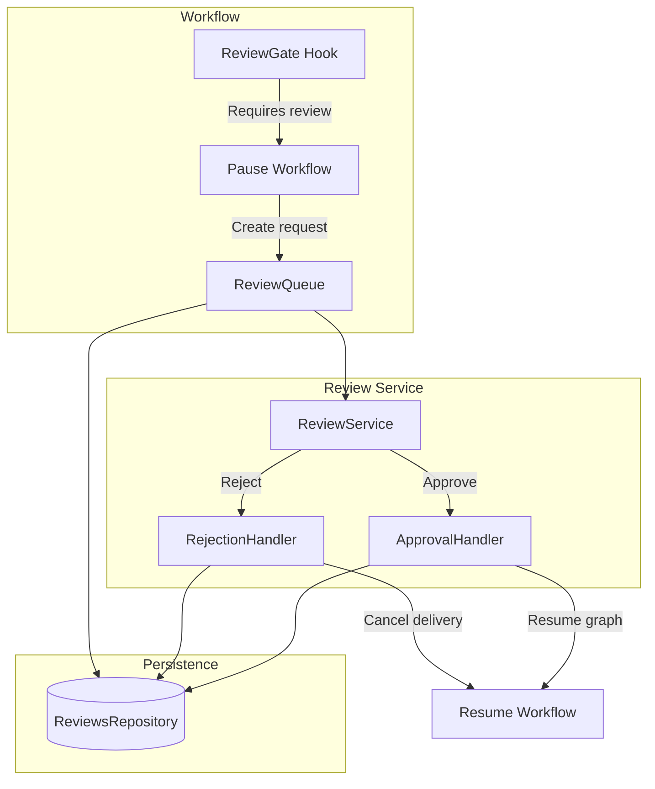

# Review Subsystem

> **Status:** Implemented
> **Date:** 2026-08-25
> **Scope:** Human-in-the-loop quality gate for agent-generated deliveries

## 1. Overview

The review subsystem implements a human-in-the-loop quality gate that sits between agent output generation and delivery. When a workflow requires human approval — determined by `ReviewPolicy` — the orchestration graph pauses execution via a Strands interrupt, creates a `ReviewRequest`, and waits for a human reviewer to approve or reject the proposed change. This ensures high-risk documentation changes (breaking changes, deprecations, API modifications) are validated before reaching external platforms.

The subsystem is built around a queue-based architecture. `ReviewQueue` manages pending requests, `ApprovalHandler` and `RejectionHandler` process decisions, and `ReviewPolicy` determines when review is required. All operations are coordinated through `ReviewService`, which provides the high-level API for listing, inspecting, and deciding on reviews.

## 2. ReviewService Facade

`ReviewService` (`review/service.py`) is the high-level API that composes `ReviewQueue`, `ApprovalHandler`, and `RejectionHandler`:

| Method | Purpose |
|--------|---------|
| `list_pending(org_id)` | List all pending reviews, oldest first |
| `get(review_id)` | Retrieve a single review request |
| `get_by_run_id(run_id)` | Find the pending review for a specific workflow run |
| `decide(decision)` | Apply an approve/reject decision and return resume info |
| `expire_stale()` | Expire reviews past their deadline |
| `policy(name)` | Create a named `ReviewPolicy` instance |

The `decide()` method dispatches to `ApprovalHandler.approve()` or `RejectionHandler.reject()` based on `ReviewDecision.approved`, returning a resume dict that contains the `run_id`, `interrupt_id`, and the decision response.

The `_to_request()` static method transforms raw database records into `ReviewRequest` models, extracting the review summary, evaluation data, and evidence count from the record's `tool_args`.

## 3. ReviewQueue

`ReviewQueue` (`review/queue.py`) manages the lifecycle of pending reviews:

- **`pending(org_id)`** — Lists reviews with `status="pending"`, optionally filtered by org, sorted oldest-first. This ordering ensures fairness when multiple reviews are queued.
- **`expire_stale()`** — Marks reviews past their `expires_at` deadline as expired. Expired reviews are automatically skipped by the queue.
- **`get(review_id)`** — Retrieves a specific review record by ID.

The queue delegates to `ReviewsRepository` for all persistence operations, maintaining a clean separation between queue logic and database access.

## 4. ApprovalHandler

`ApprovalHandler` (`review/approvals.py`) processes approved reviews:

1. Records the decision in the database via `repository.record_decision()` with `decision="approved"`.
2. Extracts the `interrupt_id` from the review's `tool_args`.
3. Returns a resume dict containing `run_id`, `interrupt_id`, and the approval response.

The `build_resume_input()` method formats the resume payload for Strands' multi-turn interrupt protocol, wrapping the response in the `interruptResponse` structure that `invoke_async` expects.

On resume, the ReviewGate hook receives the approval and allows the workflow to proceed to the delivery node.

## 5. RejectionHandler

`RejectionHandler` (`review/rejection.py`) processes rejected reviews:

1. Records the decision in the database via `repository.record_decision()` with `decision="rejected"`.
2. Extracts the `interrupt_id` from the review's `tool_args`.
3. Returns a resume dict with the rejection response and an `expected_outcome` of `"delivery_cancelled"`.

Per the ReviewGate contract, a rejection response causes the gate to set `event.cancel_node`, which surfaces as a `RuntimeError` from `invoke_async` on resume. The workflow runner catches this and marks the run as failed with the reviewer's comment.

This design ensures rejected deliveries are cleanly cancelled without leaving orphaned branches or partial state.

## 6. ReviewPolicy

`ReviewPolicy` (`review/policies.py`) determines whether a given workflow requires human review. It delegates to the orchestration routing policies to ensure API-level and graph-level gating agree:

| Policy | Behavior |
|--------|----------|
| `"always"` | Every delivery requires human approval |
| `"risky"` | Only high-risk deliveries require approval (breaking changes, deprecations, API changes, high urgency) |
| `"never"` | Auto-approve everything (not recommended for production) |

The `requires_review(classification)` method evaluates whether a specific classification triggers review under the current policy. Unknown policy strings default to `"always"` for safety.

Risk detection (`is_risky()`) checks two classification fields:
- `change_type` — flagged if in `{breaking_change, deprecation, api_change}`
- `urgency` — flagged if set to `"high"`

## 7. Review Models

Two Pydantic models represent the review domain (`review/models.py`):

### ReviewRequest

Represents a pending human review of a proposed documentation change:

| Field | Type | Purpose |
|-------|------|---------|
| `review_id` | `str` | Unique identifier |
| `run_id` | `str` | Associated workflow run |
| `workflow` | `str` | Workflow type (documentation, support, etc.) |
| `org_id` | `str` | Organization for multi-tenant isolation |
| `summary` | `str` | Human-readable description of the proposed change |
| `evaluation` | `dict` | Evaluation scores and metrics |
| `evidence_count` | `int` | Number of evidence sources cited |
| `interrupt_id` | `str \| None` | Strands interrupt ID for resuming the workflow |
| `created_at` | `datetime \| None` | When the review was created |
| `expires_at` | `datetime \| None` | When the review expires |

### ReviewDecision

Represents a reviewer's approve/reject decision:

| Field | Type | Purpose |
|-------|------|---------|
| `review_id` | `str` | Which review this decision applies to |
| `reviewer_id` | `str` | Who made the decision |
| `approved` | `bool` | `True` for approve, `False` for reject |
| `comment` | `str` | Optional reviewer feedback |
| `decided_at` | `datetime \| None` | When the decision was made |

## 8. Integration with Orchestration Hooks

The review subsystem integrates with the orchestration layer through the `ReviewGate` hook. The gate:

1. Evaluates `ReviewPolicy.requires_review()` against the workflow's classification.
2. If review is required, creates a `ReviewRequest` and pauses the workflow via Strands' interrupt mechanism.
3. The workflow runner stores the interrupt and waits for human input.
4. When a decision arrives (via `ReviewService.decide()`), the gate resumes the workflow with the approval or rejection response.
5. On approval, the workflow proceeds to the delivery node. On rejection, the gate cancels the delivery via `event.cancel_node`.

This creates a clean separation: the review subsystem owns the queue and decisions, while the orchestration layer owns the workflow pause/resume mechanics.

## File Reference

| File | Role |
|------|------|
| `src/draftly/review/service.py` | `ReviewService` facade |
| `src/draftly/review/queue.py` | `ReviewQueue` — pending review management |
| `src/draftly/review/approvals.py` | `ApprovalHandler` — process approvals and resume workflows |
| `src/draftly/review/rejection.py` | `RejectionHandler` — process rejections and cancel deliveries |
| `src/draftly/review/policies.py` | `ReviewPolicy` — always/risky/never policy evaluation |
| `src/draftly/review/models.py` | `ReviewRequest`, `ReviewDecision` domain models |
| `src/draftly/orchestration/routing/policies.py` | Policy resolution and risk detection |
