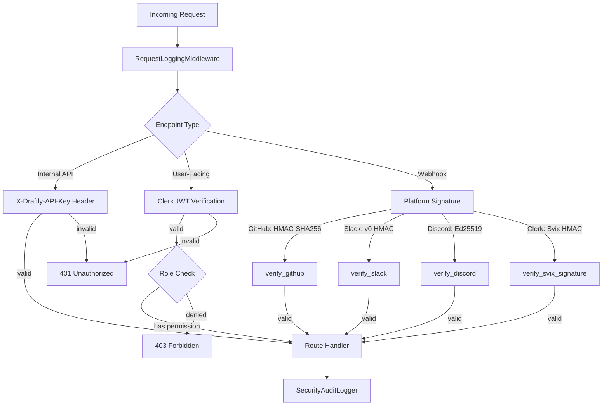
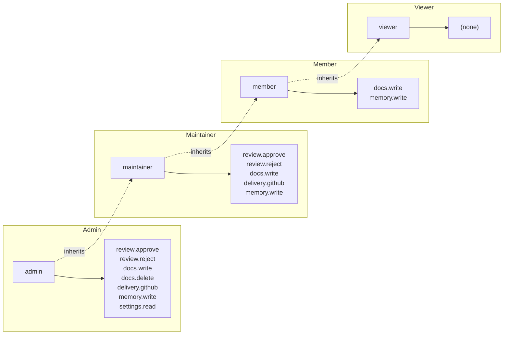
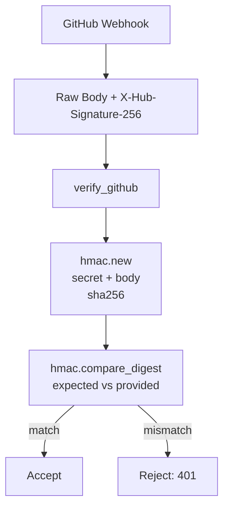

# Security Subsystem

> **Status:** Implemented
> **Date:** 2026-08-25
> **Scope:** Security layers — authentication, authorization, webhook verification, secret management, PII redaction, and audit logging

## 1. Overview

Draftly's security subsystem provides defense-in-depth across four layers: authentication (Clerk JWT verification), authorization (org-scoped role-based permissions), webhook verification (platform-specific signature validation), and data protection (PII redaction, secret management, audit logging). Every inbound request passes through the `RequestLoggingMiddleware` for correlation, and protected endpoints enforce Clerk JWT verification or API key validation before processing.

The security modules are composable — each can be used independently or combined. Route handlers declare their auth requirements via FastAPI's `Depends()` mechanism, while webhook endpoints verify platform signatures directly in the handler body.

## 2. Authentication

### 2.1 Clerk JWT Verification

All user-facing endpoints verify Clerk-issued JWTs via the `get_verified_token` FastAPI dependency. The verification flow:

1. Extract the `Authorization: Bearer <token>` header
2. Derive the JWKS URL from the Clerk publishable key (base64-decoded domain)
3. Fetch the signing key from `/.well-known/jwks.json` (cached for 1 hour)
4. Verify the token with `RS256` algorithm and expiration check
5. Extract `user_id`, `org_id`, and `org_role` from the JWT payload

The dependency supports both JWT v2 (nested `o` claim with `id` and `rol`) and v1 (flat `org_id`/`org_role` with `org:` prefix normalization).

Two role-gated dependencies build on `get_verified_token`:

| Dependency | Required Roles | Purpose |
|------------|---------------|---------|
| `get_verified_token` | Any authenticated user | Base authentication for all protected routes |
| `require_admin_role` | `admin` | Org-level admin operations (role assignment, reviewer management) |
| `require_reviewer_role` | `reviewer`, `admin` | Reviewer self-registration |

### 2.2 API Key Authentication

Internal API endpoints (metrics, health) use `APIKeyMiddleware`, which validates the `X-Draftly-API-Key` header against the configured `api_key` setting. This is separate from webhook verification and JWT auth — it protects service-to-service calls.

## 3. Authorization

### 3.1 Role-Based Permissions (RBAC)

Draftly implements a coarse-grained RBAC model scoped to organizations. Four roles exist, each granting a set of permissions:

| Role | Permissions |
|------|------------|
| `admin` | `review.approve`, `review.reject`, `docs.write`, `docs.delete`, `delivery.github`, `memory.write`, `settings.read` |
| `maintainer` | `review.approve`, `review.reject`, `docs.write`, `delivery.github`, `memory.write` |
| `member` | `docs.write`, `memory.write` |
| `viewer` | _(no permissions)_ |

The `Principal` dataclass aggregates permissions from all assigned roles via set union. The `PermissionChecker` enforces:

- **Permission check**: `has_permission(principal, permission)` returns `True` if the principal holds the permission through any role
- **Org scoping**: `require(principal, permission, org_id=...)` rejects cross-org access when the principal's `org_id` differs from the target
- **Denied events**: Permission failures raise `PermissionDeniedError` and are logged by the audit logger

### 3.2 Route-Level Auth Patterns

Routes declare auth requirements at the router or handler level:

| Pattern | Example Routes |
|---------|---------------|
| Router-level `Depends(get_verified_token)` | `documentation`, `evaluations`, `jobs`, `reviews`, `runs`, `support`, `onboarding`, `observability` |
| Handler-level `Depends(get_verified_token)` | `github/install-url`, `slack/install-url`, `discord/link`, `reviewers/list` |
| Handler-level `Depends(require_admin_role)` | `reviewers/create`, `reviewers/delete`, `reviewers/assign-role`, `reviewers/org-members` |
| Handler-level `Depends(require_reviewer_role)` | `reviewers/self` |
| No auth (webhook) | `github/webhook`, `slack/events`, `slack/interactivity`, `discord/interactions`, `clerk/webhook` |
| No auth (health) | `health`, `health/ready` |
| No auth (metrics) | `metrics`, `metrics/snapshot` |

## 4. Webhook Verification

Each platform uses a distinct cryptographic verification scheme. All verifiers share a common `WebhookVerifier` class.

### 4.1 GitHub — HMAC-SHA256

GitHub signs the raw request body using HMAC-SHA256 with the configured webhook secret. The signature arrives in the `X-Hub-Signature-256` header as `sha256=<hex>`.

The GitHub route handler (`/api/github/webhook`) verifies the signature before parsing JSON, then normalizes the event through `EventComposition.normalize_github()`.

### 4.2 Slack — v0 HMAC with Replay Protection

Slack uses HMAC-SHA256 over `v0:<timestamp>:<body>` with the signing secret. The `verify_slack` method enforces a 300-second replay window by comparing the timestamp against the current time.

| Header | Purpose |
|--------|---------|
| `X-Slack-Request-Timestamp` | Unix timestamp for the request |
| `X-Slack-Signature` | `v0=<hex>` HMAC signature |

Slack events are handled through the Bolt framework's `AsyncSlackRequestHandler`, which performs its own verification. The explicit `WebhookVerifier` provides a secondary verification path.

### 4.3 Discord — Ed25519 Signatures

Discord uses Ed25519 digital signatures over `<timestamp><body>` with the application's public key. Verification uses the `PyNaCl` library's `VerifyKey`.

| Header | Purpose |
|--------|---------|
| `X-Signature-Timestamp` | ISO timestamp for the request |
| `X-Signature-Ed25519` | Hex-encoded Ed25519 signature |

The Discord interactions endpoint handles three interaction types:

| Type Code | Name | Behavior |
|-----------|------|----------|
| `1` | PING | Returns `{"type": 1}` (Discord health check) |
| `3` | Component | Processes button clicks for review decisions (approve/reject/revise/feedback) |
| Other | — | Returns 400 |

### 4.4 Clerk — Svix HMAC

Clerk webhooks use Svix's signing scheme: HMAC-SHA256 over `{svix_id}.{svix_timestamp}.{body}` with a base64-decoded secret (prefixed with `whsec_`). The `verify_svix_signature` function checks all `v1,<signature>` tokens in the space-delimited `svix-signature` header.

## 5. Secret Management

Secrets are resolved from environment variables using an env-first approach with a configurable prefix.

### 5.1 SecretManager

The `SecretManager` resolves secrets by checking:

1. `DRAFTLY_<NAME>` (prefixed, primary)
2. `<NAME>` (bare, fallback)

| Method | Behavior |
|--------|----------|
| `get(name)` | Returns the value or `None` if unset |
| `require(name)` | Returns the value or raises `KeyError` if missing |
| `ref(name)` | Returns a `SecretRef` dataclass (deferred resolution) |

Secret values are never logged. The `SecretRef` pattern supports lazy resolution for cases where the secret is needed later rather than at initialization time.

### 5.2 Configuration Secrets

Key secrets managed through `Settings`:

| Secret | Environment Variable | Purpose |
|--------|---------------------|---------|
| GitHub webhook secret | `GITHUB_WEBHOOK_SECRET` | Webhook signature verification |
| Slack signing secret | `SLACK_SIGNING_SECRET` | Webhook signature verification |
| Discord public key | `DISCORD_PUBLIC_KEY` | Ed25519 signature verification |
| Clerk secret key | `CLERK_SECRET_KEY` | Clerk API operations |
| Clerk publishable key | `CLERK_PUBLISHABLE_KEY` | JWKS URL derivation |
| Clerk webhook signing secret | `CLERK_SIGNING_SECRET` | Svix webhook verification |
| API key | `DRAFTLY_API_KEY` | Internal API authentication |

## 6. PII and Secrets Redaction

The `RedactionService` scrubs sensitive data from text before it reaches agent prompts. Redaction runs in priority order — more specific patterns are applied first to prevent partial matches.

| Pattern | Detection | Replacement |
|---------|-----------|-------------|
| Private keys | `-----BEGIN .* PRIVATE KEY-----` | `[REDACTED_PRIVATE_KEY]` |
| AWS access keys | `AKIA[0-9A-Z]{16}` | `[REDACTED_AWS_KEY]` |
| Bearer/token/API key | `bearer\|token\|api_key\|secret = <value>` | `bearer=••••••••••••` |
| Email addresses | Standard email regex | `[REDACTED_EMAIL]` |
| Phone numbers | International format regex | `[REDACTED_PHONE]` |

The `contains_secret` method provides a fast boolean check for whether text likely contains credentials, useful as a guard before sending content to external services.

## 7. Security Audit Logging

The `SecurityAuditLogger` produces structured JSON audit events via the `draftly.security.audit` structlog logger. Each event captures:

| Field | Type | Description |
|-------|------|-------------|
| `action` | `str` | What was attempted (e.g., `review.approve`, `docs.write`) |
| `actor` | `str?` | User or service principal ID |
| `org_id` | `str?` | Organization scope |
| `resource` | `str?` | Target resource identifier |
| `outcome` | `str` | `"allowed"` or `"denied"` |
| `detail` | `dict` | Additional context (error messages, reason codes) |
| `occurred_at` | `datetime` | UTC timestamp |

Two convenience methods record events with the correct outcome:

- `allowed(action=..., actor=..., org_id=..., resource=...)` — logs an allowed action
- `denied(action=..., actor=..., org_id=..., resource=...)` — logs a denied action

Both emit the event as a JSON string through structlog, enabling downstream aggregation by log processors.

## 8. Middleware Stack

Three middleware layers process every request in order:

### 8.1 RequestLoggingMiddleware

- Assigns or propagates `X-Request-ID` (correlation ID)
- Binds `request_id`, `method`, `path` to structlog context
- Measures request duration
- Logs completion/failure with status code and duration
- Clears context vars in `finally` block

### 8.2 APIKeyMiddleware

- Validates `X-Draftly-API-Key` header for internal endpoints
- Returns `401` with `{"detail": "Invalid API key."}` on mismatch
- Applied selectively to protected internal routes

### 8.3 Error Handler

- Catches unhandled exceptions globally
- Returns `500` with structured error body including `request_id`
- Logs the full exception with structlog

## 9. File Reference

| File | Lines | Role |
|------|-------|------|
| `src/draftly/security/__init__.py` | 23 | Public API exports |
| `src/draftly/security/audit.py` | 86 | `SecurityAuditLogger`, `AuditEvent` |
| `src/draftly/security/permissions.py` | 68 | `Principal`, `PermissionChecker`, `ROLE_PERMISSIONS` |
| `src/draftly/security/redaction.py` | 40 | `RedactionService`, PII/secret patterns |
| `src/draftly/security/secrets.py` | 43 | `SecretManager`, `SecretRef` |
| `src/draftly/security/webhook_verification.py` | 107 | `WebhookVerifier` (GitHub, Slack, Discord) |
| `src/draftly/app/api/auth.py` | 102 | Clerk JWT verification, role-gated dependencies |
| `src/draftly/app/api/middleware/auth.py` | 37 | `APIKeyMiddleware` |
| `src/draftly/app/api/middleware/errors.py` | 37 | Global exception handler |
| `src/draftly/app/api/middleware/logging.py` | 72 | `RequestLoggingMiddleware` |
