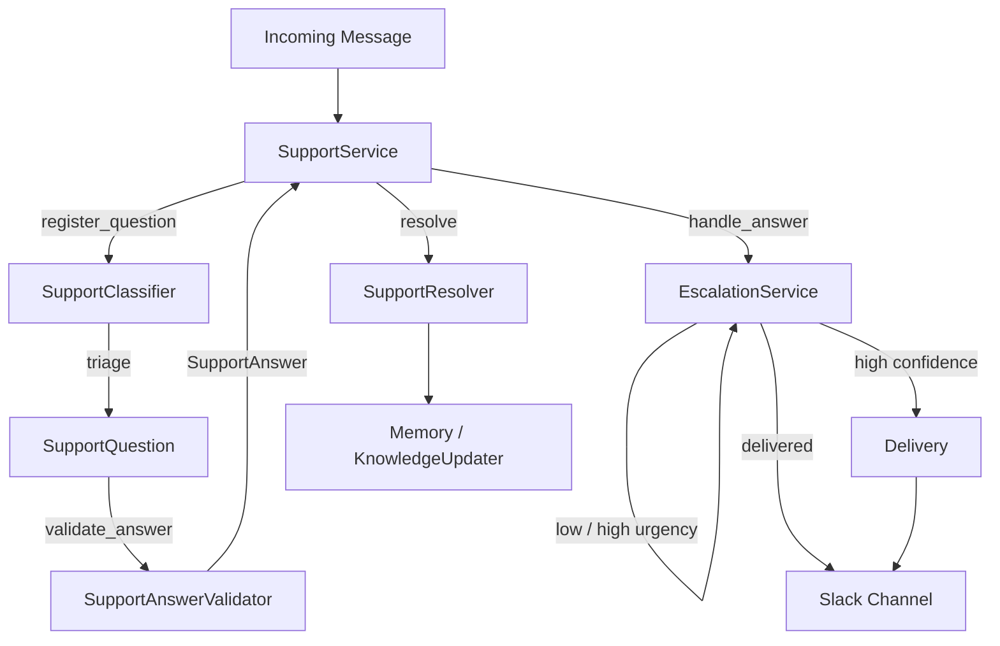
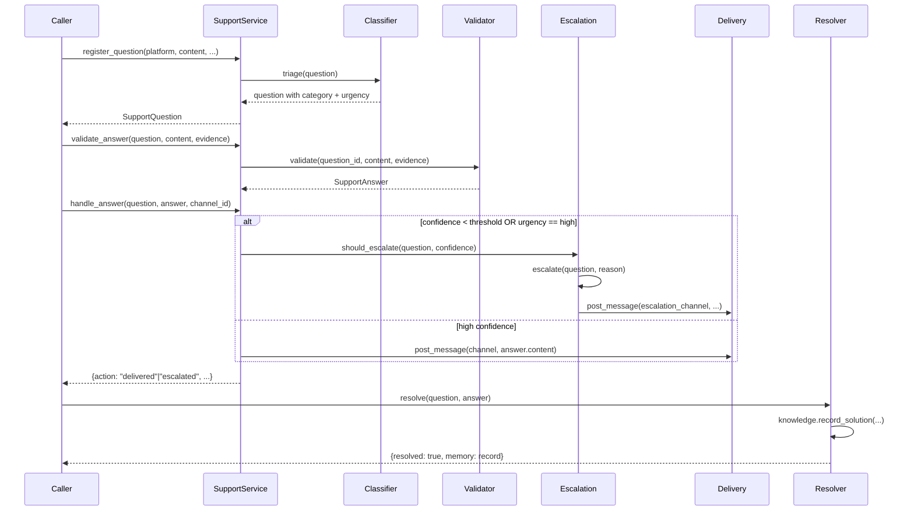

# Support Service

> **Status:** Implemented
> **Date:** 2026-08-25
> **Scope:** Support question lifecycle, classification, answer validation, escalation, and resolution

## 1. Overview

The support subsystem provides a complete triage-to-answer lifecycle for incoming support questions from any platform. A `SupportService` facade coordinates four collaborators: a rule-based classifier that assigns category and urgency, a deterministic answer validator that scores confidence based on citation grounding, an escalation service that routes low-confidence or high-urgency questions to humans, and a resolver that closes the loop by recording resolved Q/A pairs into memory.

The design is platform-agnostic at the domain layer — `SupportMessage`, `SupportThread`, `SupportQuestion`, and `SupportAnswer` models carry a `platform` field — while delivery is delegated to platform-specific connectors (Slack, Discord). Domain events are modeled as `SupportEvent` pydantic models for downstream event-driven processing.



## 2. Domain Models

**Source:** `draftly/support/models.py`

All models use Pydantic v2 with `ConfigDict(extra="allow")` for forward compatibility.

### SupportMessage

A single message from any platform.

| Field | Type | Description |
|-------|------|-------------|
| `id` | `str` | Platform-specific message ID |
| `platform` | `str` | Source platform (slack, discord, etc.) |
| `channel_id` | `str \| None` | Channel where the message was posted |
| `channel_name` | `str \| None` | Human-readable channel name |
| `author_id` | `str \| None` | Platform author ID |
| `author_name` | `str \| None` | Human-readable author name |
| `content` | `str` | Message text |
| `thread_id` | `str \| None` | Thread the message belongs to |
| `timestamp` | `datetime \| None` | When the message was posted |
| `url` | `str \| None` | Link to the original message |
| `raw` | `dict \| None` | Raw platform payload |
| `org_id` | `str \| None` | Organization scope |

### SupportThread

A conversation thread across any platform.

| Field | Type | Description |
|-------|------|-------------|
| `id` | `str` | Thread ID |
| `platform` | `str` | Source platform |
| `channel_id` | `str \| None` | Channel containing the thread |
| `channel_name` | `str \| None` | Human-readable channel name |
| `root_message_id` | `str \| None` | First message in the thread |
| `messages` | `list[SupportMessage]` | Thread messages |
| `created_at` | `datetime \| None` | Thread creation time |
| `updated_at` | `datetime \| None` | Last update time |
| `raw` | `dict \| None` | Raw platform payload |
| `org_id` | `str \| None` | Organization scope |

### SupportQuestion

A triaged support question.

| Field | Type | Default | Description |
|-------|------|---------|-------------|
| `question_id` | `str` | — | Generated `q-{uuid[:12]}` |
| `platform` | `str` | — | Source platform |
| `content` | `str` | — | Question text |
| `author` | `str \| None` | `None` | Question author |
| `channel_id` | `str \| None` | `None` | Source channel |
| `thread_id` | `str \| None` | `None` | Source thread |
| `source_message_id` | `str \| None` | `None` | Original message ID |
| `category` | `str` | `"question"` | Assigned by classifier |
| `urgency` | `str` | `"normal"` | Assigned by classifier |
| `org_id` | `str \| None` | `None` | Organization scope |
| `timestamp` | `datetime \| None` | `None` | Registration time |

### SupportAnswer

A generated, validated answer.

| Field | Type | Default | Description |
|-------|------|---------|-------------|
| `answer_id` | `str` | — | `answer-{question_id}` |
| `question_id` | `str` | — | Reference to the question |
| `content` | `str` | — | Answer text |
| `confidence` | `float` | `0.0` | Score 0.0–1.0 |
| `citations` | `list[str]` | `[]` | Evidence references |
| `grounded` | `bool` | `False` | Has at least one citation |
| `metadata` | `dict` | `{}` | Extra info (e.g. `length_ok`) |
| `created_at` | `datetime \| None` | `None` | Creation timestamp |

## 3. Question Lifecycle

**Source:** `draftly/support/service.py`

The `SupportService` facade manages the full lifecycle:



### Step 1: Register (Triage)

`register_question` creates a `SupportQuestion` with a generated `q-{uuid[:12]}` ID and delegates to `SupportClassifier.triage()` which assigns `category` and `urgency` via keyword matching.

### Step 2: Validate Answer

`validate_answer` delegates to `SupportAnswerValidator.validate()` which scores confidence based on citation presence, evidence grounding, and content length.

### Step 3: Handle Answer

`handle_answer` checks escalation criteria. If the question should be escalated, it routes to the escalation channel. Otherwise, it delivers the answer to the source channel via Slack delivery.

### Step 4: Resolve

`SupportResolver.resolve()` records the Q/A pair into the knowledge updater for future retrieval.

## 4. SupportClassifier

**Source:** `draftly/support/classifier.py`

A rule-based triage classifier that assigns `category` and `urgency` through keyword matching.

### Category Keywords

| Category | Keywords |
|----------|----------|
| `bug` | error, crash, fails, broken, exception |
| `docs` | docs, documentation, guide, example |
| `billing` | invoice, billing, charge, payment, plan |
| `how_to` | how do, how to, how can, configure, setup |
| `general` | (fallback when no keywords match) |

### Urgency Keywords

| Level | Keywords |
|-------|----------|
| `high` | production, outage, down, urgent, asap, blocked |
| `normal` | (default) |

The classifier is intentionally simple — the graph's analyzer agent refines classification further during the research phase.

## 5. SupportAnswerValidator

**Source:** `draftly/support/answer.py`

Deterministic answer quality scoring.

### Validation Rules

| Rule | Condition | Impact |
|------|-----------|--------|
| Minimum length | `len(content) >= 40` | Required for base confidence |
| Maximum length | `len(content) <= 4000` | Prevents overly verbose answers |
| Citations present | Regex `\[[^\]]+\]` or `https?://\S+` | Enables grounding |
| Evidence grounded | At least one evidence `id` found in content | Required for `grounded=True` |

### Confidence Scoring

```
base = 0.5 * min(citation_count, 2) / 2.0
if length_ok: base += 0.3
if empty: confidence = 0.0
final = min(base, 1.0)
```

The `citations` method extracts both bracket-style `[ref]` and URL-style citations from the answer content.

## 6. EscalationService

**Source:** `draftly/support/escalation.py`

Routes questions to humans when the system is not confident enough to answer.

### Escalation Criteria

| Condition | Action |
|-----------|--------|
| `question.urgency == "high"` | Always escalate |
| `confidence < confidence_threshold` (default 0.4) | Escalate |

### Escalation Flow

1. Format a structured message with rotating light emoji, platform, author, category, urgency, and question content (truncated to 500 chars).
2. Post to the configured `escalation_channel` (default: `support-escalation`) via `SlackDelivery.post_message`.
3. Log the escalation with `question_id` and `reason`.

## 7. SupportResolver

**Source:** `draftly/support/resolver.py`

Closes the loop on answered questions by recording resolved Q/A pairs into the `KnowledgeUpdater`, which writes to long-term memory for future retrieval by the support service and other agents.

## 8. Support Events

**Source:** `draftly/support/events.py`

Domain events for downstream event-driven processing.

### SupportEvent

| Field | Type | Description |
|-------|------|-------------|
| `event_id` | `str` | Unique event ID |
| `platform` | `str` | Source platform |
| `event_type` | `str` | Event type identifier |
| `occurred_at` | `datetime \| None` | When the event occurred |
| `actor_id` | `str \| None` | Who triggered the event |
| `payload` | `dict` | Event-specific data |

## 9. File Reference

| File | Role |
|------|------|
| `src/draftly/support/service.py` | `SupportService` facade — lifecycle orchestration |
| `src/draftly/support/classifier.py` | Rule-based category and urgency classification |
| `src/draftly/support/answer.py` | Deterministic answer validation and confidence scoring |
| `src/draftly/support/escalation.py` | Low-confidence / high-urgency routing to humans |
| `src/draftly/support/resolver.py` | Q/A pair recording into memory |
| `src/draftly/support/models.py` | Pydantic domain models |
| `src/draftly/support/events.py` | Domain event model |
