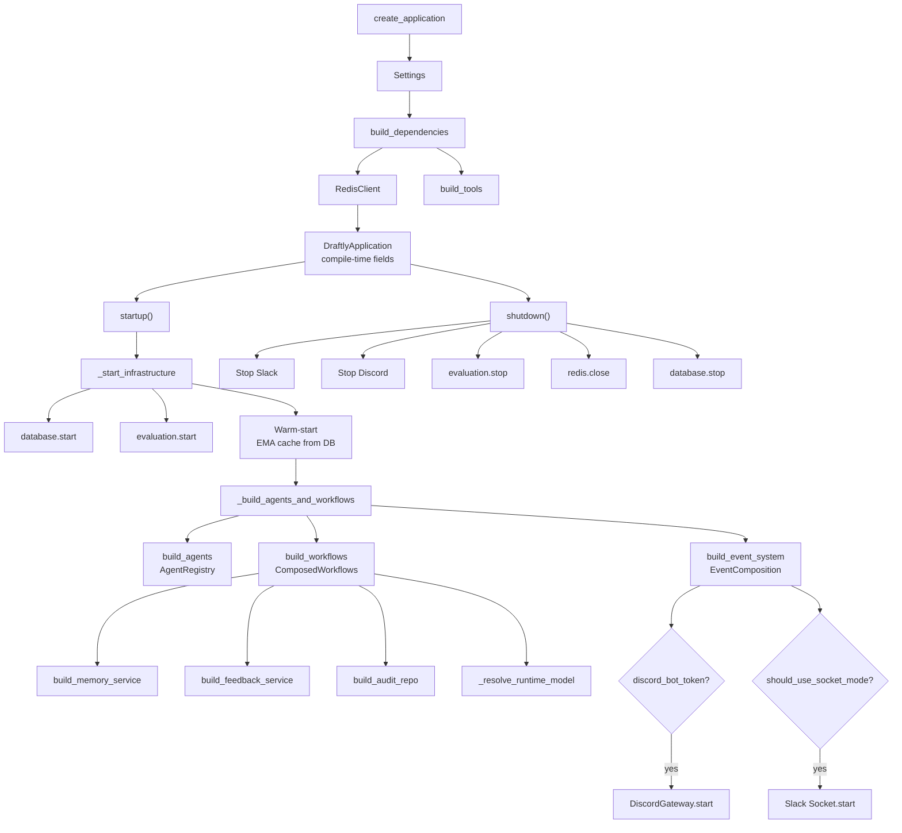
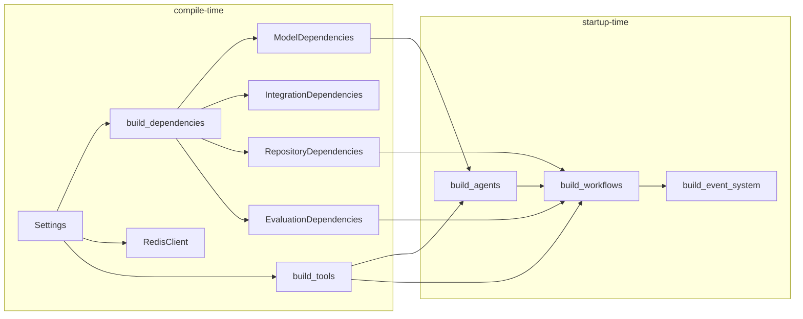
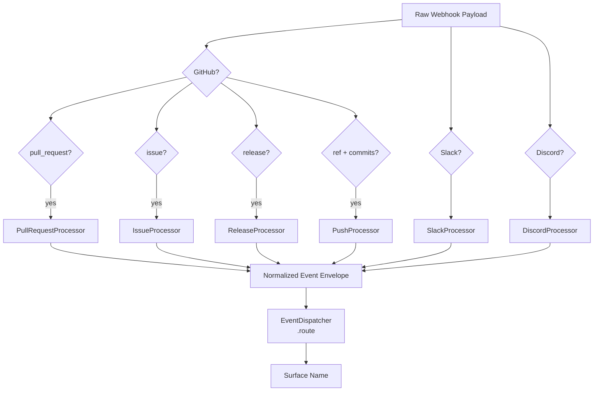
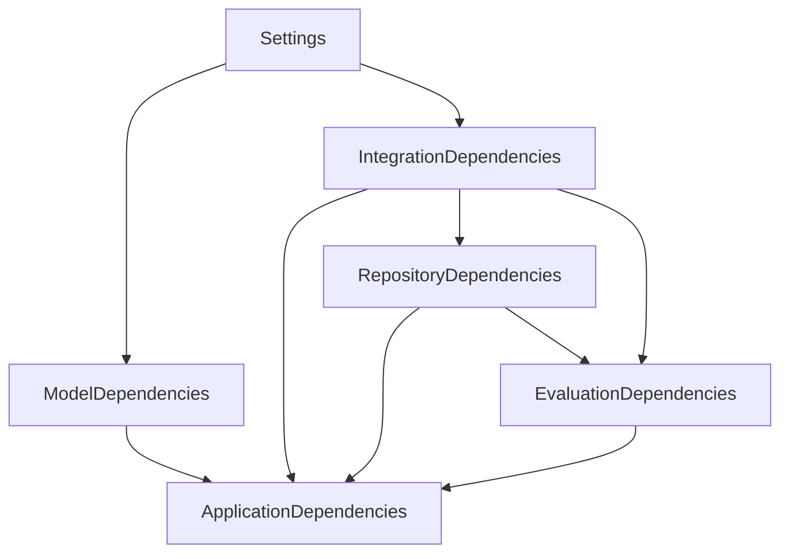
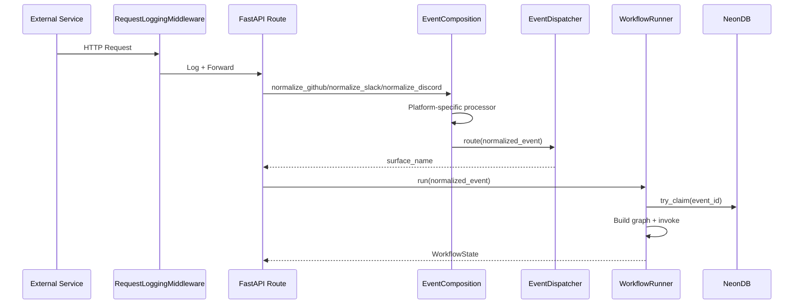
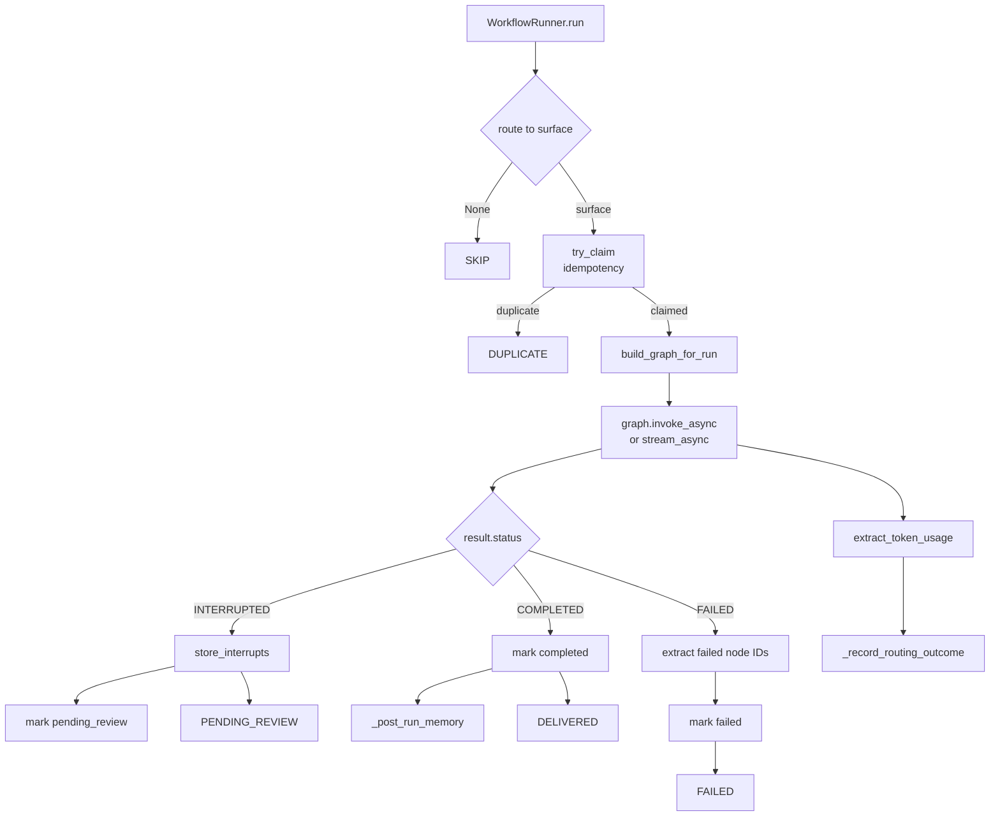

# Draftly System Design

> **Status:** Implemented
> **Date:** 2026-08-25
> **Scope:** Internal system design — lifecycle, composition, DI, configuration, request flow, workers, and runtime integration

## 1. DraftlyApplication Lifecycle

`DraftlyApplication` is a dataclass that owns the complete Draftly runtime. It is created by `create_application()` (the composition root) and managed through FastAPI's lifespan protocol as an async context manager.

### Startup Order

Infrastructure starts first (database, evaluation store), followed by agent and workflow construction, then background integrations (Discord gateway, Slack socket mode). Agents and workflows are deferred to startup so that database-dependent services are confirmed available before graph construction.

### Shutdown Order

Shutdown occurs in reverse startup order: background integrations (Slack, Discord) are cancelled first, then infrastructure services stop in reverse dependency order (evaluation → Redis → database). The `_maybe_start` / `_maybe_stop` helpers call `start()` / `stop()` (or `close()`) methods on resources when present, supporting both sync and async lifecycle hooks.

### Composition Root

`create_application()` is the single place where all dependencies are wired:

## 2. Composition Layer

The composition layer (`src/draftly/app/composition/`) is responsible for wiring domain-specific objects into registries that the runtime consumes.

### AgentRegistry

Holds **factory functions** — not agent instances. Each factory takes `(model, tools)` and returns a fresh Strands `Agent`. This design ensures:

- Agents are per-run objects, not singletons
- Model routing decisions (fast vs. reasoning) are applied at construction time
- Tool scoping is surface-specific (documentation vs. support vs. research)

| Role | Factory | Purpose |
|------|---------|---------|
| `classifier` | `build_classifier` | Route events to surfaces |
| `context_agent` | `build_context_agent` | Gather context for a run |
| `delivery_agent` | `build_delivery_agent` | Produce PR/commit/comment |
| `impact_agent` | `build_impact_agent` | Assess documentation impact |
| `writer_agent` | `build_writer_agent` | Write documentation |
| `answer_writer` | `build_answer_writer` | Draft support answers |
| `question_analyzer` | `build_question_analyzer` | Analyze support questions |
| `solution_researcher` | `build_solution_researcher` | Research solutions |
| `issue_analyzer` | `build_issue_analyzer` | Analyze GitHub issues |
| `issue_responder` | `build_issue_responder` | Respond to GitHub issues |
| `research_swarm_factory` | `build_research_swarm` | Multi-agent research swarm |

### ToolRegistry

Groups tools by agent scope. Each group contains only tools appropriate for that agent role:

| Group | Tools | Used By |
|-------|-------|---------|
| `documentation` | `analyze_structure`, `extract_frontmatter`, `validate_links`, `semantic_search`, `code_search`, `get_diff`, `get_files`, `affected_docs` | Documentation analysis agents |
| `documentation_engineer` | `read_file`, `write_file`, `create_branch`, `create_commit`, `create_pull_request` | Writer agent (delivery path) |
| `documentation_reviewer` | `get_diff`, `get_files`, `semantic_search`, `analyze_structure`, `validate_links` | Review agents |
| `github_intelligence` | `get_pull_request`, `get_issue`, `get_diff`, `create_comment`, `code_search` | Issue/PR agents |
| `support_engineer` | `slack_*`, `discord_*`, `semantic_search`, `keyword_search` | Support response agents |
| `research` | `get_pull_request`, `get_issue`, `slack_*`, `discord_*`, `semantic_search`, `code_search` | Research swarm |
| `github_delivery` | `create_branch`, `create_commit`, `create_pull_request`, `create_comment` | Delivery agents |
| `memory_curator` | `memory_search`, `get_memory`, `supersede_memory`, `reinforce_memory`, `archive_memory`, `record_doc_relation`, `record_procedure` | Memory curation |

The `all_tools` attribute is a deduplicated union of every scoped group (by identity, not name), built by `_unique_tools()`.

### ComposedWorkflows

Contains the `WorkflowRegistry`, `WorkflowRunner`, `WorkflowContext`, and optionally the `event_bus` (Redis stream or pub/sub). The registry maps surface names to workflow functions:

| Surface | Workflow Function | Trigger |
|---------|-------------------|---------|
| `github_pr` | `run_pull_request_workflow` | Webhook |
| `github_release` | `run_release_workflow` | Webhook |
| `github_issue` | `run_github_issue_workflow` | Webhook |
| `slack_support` | `run_slack_support` | Webhook |
| `discord_support` | `run_discord_support` | Webhook |
| `documentation_sync` | `run_documentation_sync` | Scheduled |
| `documentation_audit` | `run_documentation_audit` | Scheduled |
| `feedback_loop` | `run_feedback_loop` | Scheduled |
| `evaluation_loop` | `run_evaluation_loop` | Scheduled |
| `onboarding_initialize` | `run_onboarding_initialize` | On-demand |
| `memory_curation` | `run_memory_curation` | Scheduled |
| `memory_maintenance` | `run_memory_maintenance` | Scheduled |

### EventComposition

Normalizes raw webhook payloads from three platforms into a common event envelope:

## 3. Dependency Injection

The `ApplicationDependencies` dataclass is the DI container. It holds infrastructure, models, integrations, repositories, and evaluation — but intentionally excludes agents, tools, and workflows (which are composition-layer concerns).

### Dependency Graph

### ModelDependencies

Resolved through the `ModelRouter` with capability-based policies:

| Handle | Capabilities | Role |
|--------|--------------|------|
| `fast` | `tool_calling` | Quick responses, tool-heavy agents |
| `reasoning` | `reasoning` + `tool_calling` | Complex analysis, multi-step reasoning |
| `research` | stage-specific | Research swarm tasks |
| `review` | stage-specific | Review gate evaluation |
| `rubric_grader` | stage-specific | Documentation quality scoring |

The `EMAStatsStore` tracks per-model latency and success metrics, warmed from the `PerformanceRepository` on startup.

### IntegrationDependencies

| Client | Transport | Purpose |
|--------|-----------|---------|
| `DatabaseClient` | asyncpg (NeonDB) | All persistence |
| `GitHubClient` | HTTP (GitHub API) | PR/issue/comment operations |
| `SlackClient` | HTTP (Slack API) | Message operations |
| `DiscordClient` | HTTP (Discord API) | Message operations |
| `slack_app` | Bolt Socket Mode | Inbound Slack events |
| `discord_gateway` | WebSocket | Inbound Discord events |

### RepositoryDependencies

14 repositories, all constructed from the single `DatabaseClient`:

| Repository | Domain |
|------------|--------|
| `DeliveryRepository` | Delivery tracking |
| `EventRepository` | Event claims and status |
| `MemoryRepository` | Vector search + memory persistence |
| `DocumentRepository` | Document store |
| `GitHubInstallationsRepository` | GitHub App installations |
| `EvaluationRepository` | Evaluation results |
| `SupportRepository` | Support context |
| `JobRepositoryImpl` | Job state |
| `ReviewsRepository` | Review decisions |
| `ReviewersRepository` | Reviewer assignments |
| `RoutingRepository` | Model routing decisions |
| `PerformanceRepository` | EMA performance data |
| `OnboardingRepository` | Onboarding state |
| `RepositoryConfigRepository` | Per-repository configuration |

### Redis Subsystems

Redis serves multiple roles through a shared `RedisClient`:

| Subsystem | Class | Purpose |
|-----------|-------|---------|
| EMA Stats | `RedisEMAStatsStore` | Model performance caching across restarts |
| Provider Health | `RedisProviderHealth` | LLM provider availability |
| Ticket Store | `RedisTicketStore` | Deduplication tickets |
| Event Bus | `RedisEventBus` / `RedisStreamBus` | Real-time event streaming |
| Rate Limiting | — | API rate limit enforcement |
| API Cache | — | Response caching |

## 4. Configuration System

Configuration is loaded from environment variables and `.env` files via Pydantic Settings. The `Settings` class (208 lines) is the single source of truth.

### Configuration Categories

| Category | Key Settings | Defaults |
|----------|-------------|----------|
| Application | `app_name`, `environment`, `debug`, `host`, `port` | `"Draftly"`, `"development"`, `False`, `0.0.0.0`, `8000` |
| LLM | `openai_api_key`, `anthropic_api_key`, `fast_model`, `reasoning_model` | `None`, `None`, `"gpt-4.1-mini"`, `"gpt-4.1"` |
| GitHub | `github_token`, `github_webhook_secret`, `github_repository`, `github_app_id` | All `None` |
| Slack | `slack_bot_token`, `slack_signing_secret`, `slack_app_token` | All `None` |
| Discord | `discord_bot_token`, `discord_public_key`, `discord_app_id` | All `None` |
| Database | `database_url`, `database_pool_min_size`, `database_pool_max_size` | `postgresql://localhost:5432/draftly`, `2`, `10` |
| Redis | `redis_url`, `events_streaming_enabled`, `event_bus_backend` | `redis://localhost:6379/0`, `False`, `"dual"` |
| Strands | `strands_graph_id`, `strands_review_policy`, `strands_execution_timeout` | `"draftly-main-graph"`, `"always"`, `600` |
| Workers | `worker_enabled`, `worker_concurrency` | `True`, `4` |
| RQ | `rq_queue_prefix`, `rq_scheduler_enabled`, `rq_worker_queues` | `"draftly"`, `True`, `["scheduled","webhooks","default"]` |
| Security | `require_api_key`, `clerk_publishable_key`, `clerk_secret_key` | `False`, `None`, `None` |
| Token Budget | `max_tokens_per_run`, `summarization_trigger_fraction`, `recursion_limit` | `50000`, `0.70`, `30` |

### Strands Configuration

The `StrandsConfig` model (derived from `Settings`) controls the agents runtime:

| Field | Default | Description |
|-------|---------|-------------|
| `graph_id` | `"draftly-main-graph"` | Graph identifier for session storage |
| `session_storage_dir` | `".draftly/sessions"` | Persisted session location |
| `max_node_executions` | `10` | Maximum graph node executions per run |
| `execution_timeout` | `600` | Total graph execution timeout (seconds) |
| `node_timeout` | `180` | Per-node timeout (seconds) |
| `review_policy` | `"always"` | `"always"` / `"risky"` / `"never"` |

## 5. Request Flow

### Webhook Ingestion

### Graph Execution

### Streaming Path

When a publisher is configured, `WorkflowRunner` uses `graph.stream_async` instead of `graph.invoke_async`. Each graph event is filtered through `filter_graph_event`, wrapped in a `StreamEnvelope`, and published to the `_TeePublisher` (which persists to DB first, then fans out to Redis). Time-to-first-token (`draftly_run_ttft_ms`) is measured from the start of invocation to the first `text_delta` envelope.

## 6. Background Workers

### TaskRunner

The `TaskRunner` maps task names to async handler functions. Each handler is a workflow function wrapped with the composed `WorkflowContext`, so handlers receive only job arguments.

| Task Name | Workflow | Schedule |
|-----------|----------|----------|
| `documentation.sync` | `documentation_sync` | `0 2 * * *` (daily 2 AM) |
| `documentation.sync_repository` | `documentation_sync` | On-demand |
| `documentation.stale_scan` | `documentation_audit` | `0 3 * * 0` (weekly Sunday 3 AM) |
| `support.gap_scan` | `feedback_loop` | `0 4 * * *` (daily 4 AM) |
| `evaluation.loop` | `evaluation_loop` | `0 5 * * *` (daily 5 AM) |
| `onboarding.initialize` | `onboarding_initialize` | On-demand |
| `memory.curation` | `memory_curation` | `*/30 * * * *` (every 30 min) |
| `memory.maintenance` | `memory_maintenance` | `0 6 * * 0` (weekly Sunday 6 AM) |

## 7. RQ Integration

### Queue Architecture

Three named queues isolate job types by priority and latency characteristics:

| Queue | Prefix | Purpose |
|-------|--------|---------|
| `draftly:scheduled` | — | Cron-triggered background tasks |
| `draftly:webhooks` | — | Inbound webhook processing (github_pr, slack_support, etc.) |
| `draftly:default` | — | On-demand and ad-hoc jobs |

### Job Enqueue

`enqueue_job()` routes tasks to the correct queue via `QUEUE_MAP`, wraps async handlers in sync RQ-compatible functions via `make_sync_handler()`, and configures retry policy (3 attempts with exponential backoff: 10s, 30s, 60s), 1-hour TTL, and metadata tracking.

### Scheduler

`rq-scheduler` replaces a custom polling loop. `setup_rq_scheduler()` iterates over `SCHEDULED_JOBS`, resolves each handler, wraps it in a sync adapter, and registers it with the scheduler's `cron()` method targeting the `draftly:scheduled` queue.

## 8. Strands Runtime Integration

### Graph Construction

Graphs are built per-run via `build_graph_for_run()` (imported lazily in `_default_graph_factory`). The factory receives:

- `run_id` and `surface` (determines which agents and tools to include)
- `tools_registry` (scoped `ToolRegistry`)
- `model` (resolved `Strands` model handle)
- `hooks` (pre/post execution hooks)
- `storage_dir` (session persistence path)
- `audit_repo` (agent-run audit logging)
- `memory` (memory service)
- Graph limits: `max_node_executions`, `execution_timeout`, `node_timeout`

### Invocation State

The graph receives an `invocation_state` dict (not in the prompt) containing:

| Key | Source | Purpose |
|-----|--------|---------|
| `run_id` | UUID | Unique run identifier |
| `review_policy` | `StrandsConfig.review_policy` | Controls review gate behavior |
| `delivery_summary` | Empty (populated during run) | Delivery metadata |
| `evaluation` | Empty (populated during run) | Evaluation results |
| `evidence_count` | 0 (populated during run) | Evidence accumulation |
| `source` | Event payload | Origin platform |
| `event_type` | Event payload | Event classification |
| `project_id` | Event payload | Organization/project |

### Session Management

Session management is deferred to Phase 4. The `session_manager` field on `DraftlyApplication` is `None` at compile time and will be wired once the session store is implemented.

### Review Gate

The review gate reads `review_policy` from `invocation_state`. When the graph interrupts (human-in-the-loop node), `WorkflowRunner` persists the interrupt via `ReviewsRepository.store_interrupt()` and marks the event as `pending_review`. The frontend or API consumer then approves or rejects via the reviews API.

## 9. File Reference

### Application Layer

| File | Lines | Role |
|------|-------|------|
| `src/draftly/app/lifecycle.py` | 445 | `DraftlyApplication`, `create_application()`, lifespan |
| `src/draftly/app/dependencies.py` | 606 | `ApplicationDependencies`, model/integration/repository builders |
| `src/draftly/app/config.py` | 208 | `Settings`, `StrandsConfig` |
| `src/draftly/app/api/app.py` | 123 | FastAPI app factory, router registration |

### Composition Layer

| File | Lines | Role |
|------|-------|------|
| `src/draftly/app/composition/agents.py` | 78 | `AgentRegistry`, `build_agents()` |
| `src/draftly/app/composition/tools.py` | 271 | `ToolRegistry`, `build_tools()`, scoped tool groups |
| `src/draftly/app/composition/workflows.py` | 183 | `ComposedWorkflows`, `build_workflows()`, `WorkflowContext` |
| `src/draftly/app/composition/events.py` | 73 | `EventComposition`, `build_event_system()` |
| `src/draftly/app/composition/workers.py` | 109 | `TaskRunner`, `TASK_REGISTRY`, `SCHEDULED_JOBS` |
| `src/draftly/app/composition/rq_jobs.py` | 114 | RQ queue setup, `enqueue_job()` |
| `src/draftly/app/composition/rq_scheduler.py` | 64 | `setup_rq_scheduler()` |

### Runtime

| File | Lines | Role |
|------|-------|------|
| `main.py` | 39 | Entrypoint — env loading, uvicorn |
| `src/draftly/agents/draftly_agent.py` | 26 | Root Draftly agent |
| `src/draftly/workflows/runner.py` | 380 | `WorkflowRunner` — graph execution, idempotency, telemetry |
