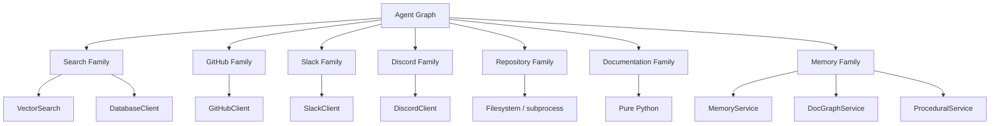

# Tools

> **Status:** Implemented
> **Date:** 2026-08-25
> **Scope:** All 7 tool families, their integration clients, and agent-facing API

## 1. Overview

Draftly's tool layer provides 42 async tools organized into 7 families. Each tool is a Strands `@tool`-decorated async function that lazy-loads its integration client on first call, keeping startup lightweight. Tools are grouped by the external system or capability they interface with: search, GitHub, Slack, Discord, repository filesystem/git, documentation analysis, and memory/knowledge management.

The tool families are designed to be consumed by the agent graph — each node in the workflow graph selects the tools it needs. Tools are stateless per call; integration clients are instantiated on demand and use connection pooling from their respective SDKs.



## 2. Search Family

**Package:** `draftly.tools.search`

Three search strategies over the memory store, composable by the agent.

| Tool | Function | Client | Description |
|------|----------|--------|-------------|
| `semantic_search` | Vector similarity search | `VectorSearch` | Finds memory items by embedding cosine similarity within a namespace |
| `keyword_search` | Full-text keyword search | `DatabaseClient` | ILIKE search on `content` and `summary` columns, ordered by importance |
| `hybrid_search` | Combined semantic + keyword | Both | Merges results by ID with 70/30 semantic/keyword weighting |

### hybrid_search Scoring

- Semantic results: `score = 0.7 * similarity`
- Keyword-only results: `score = 0.3`
- Merged results where both match: `score = 0.7 * similarity + 0.3`
- Final ranking: descending by score, truncated to `limit`

### keyword_search Schema

Queries the `memory_items` table with columns: `id`, `org_id`, `namespace`, `memory_type`, `content`, `summary`, `status`, `importance`, `confidence`, `version`, `access_count`, `last_accessed_at`, `created_at`, `updated_at`.

## 3. GitHub Family

**Package:** `draftly.tools.github`

Eight tools covering the full GitHub issue/PR lifecycle. All tools delegate to `GitHubClient` which wraps the GitHub REST API.

| Tool | Function | Description |
|------|----------|-------------|
| `get_issue` | `get_issue(owner, repo, number)` | Fetch a GitHub issue by number |
| `get_pull_request` | `get_pull_request(owner, repo, number)` | Fetch a GitHub pull request by number |
| `get_files` | `get_files(owner, repo, number)` | List files changed in a PR |
| `get_diff` | `get_diff(owner, repo, number)` | Get the unified diff of a PR |
| `create_branch` | `create_branch(owner, repo, name, base_sha)` | Create a branch at a base commit SHA |
| `create_commit` | `create_commit(owner, repo, branch, message, files)` | Commit file changes (tree + commit + ref update) |
| `create_pull_request` | `create_pull_request(owner, repo, title, body, head, base)` | Open a new pull request |
| `create_comment` | `create_comment(owner, repo, number, body)` | Post a comment on a PR or issue |

### Integration Client

All GitHub tools use `draftly.integrations.github.client.GitHubClient`, which provides async wrappers around the GitHub REST API with token-based authentication.

## 4. Slack Family

**Package:** `draftly.tools.slack`

Three tools for reading and writing Slack conversations.

| Tool | Function | Description |
|------|----------|-------------|
| `get_thread` | `get_thread(channel, ts)` | Fetch all messages in a Slack thread |
| `search_messages` | `search_messages(query, channel_id, limit)` | Search Slack messages, optionally scoped to a channel |
| `post_message` | `post_message(channel, text, thread_ts)` | Post a message to a channel (optionally in a thread) |

### Integration Client

All Slack tools use `draftly.integrations.slack.client.SlackClient`, which wraps the Slack Web API with token-based authentication. Tool names are prefixed (`slack_get_thread`, `slack_search_messages`, `slack_post_message`) to avoid namespace collisions.

## 5. Discord Family

**Package:** `draftly.tools.discord`

Three tools for reading and writing Discord conversations.

| Tool | Function | Description |
|------|----------|-------------|
| `get_thread` | `get_thread(channel_id, thread_id)` | Fetch a Discord thread channel by ID |
| `search_messages` | `search_messages(query, channel_id, limit)` | Search Discord messages, optionally scoped to a channel |
| `post_message` | `post_message(channel_id, content, thread_id)` | Post a message to a channel (optionally in a thread) |

### Integration Client

All Discord tools use `draftly.integrations.discord.client.DiscordClient`, which wraps the Discord API with bot token authentication. Tool names are prefixed (`discord_get_thread`, etc.) for disambiguation.

## 6. Repository Family

**Package:** `draftly.tools.repository`

Eight tools for inspecting and modifying a local repository checkout. No external API — these use filesystem access and `subprocess` calls to `git`.

### Filesystem Tools

| Tool | Function | Description |
|------|----------|-------------|
| `read_file` | `read_file(path)` | Read a file's contents (UTF-8) |
| `write_file` | `write_file(path, content)` | Write content to a file (creates parent dirs) |
| `list_directory` | `list_directory(path)` | List directory entries with name, path, is_dir, size |
| `file_exists` | `file_exists(path)` | Check if a file exists |

### Git Tools

| Tool | Function | Description |
|------|----------|-------------|
| `git_status` | `git_status(repo_dir)` | Porcelain git status output |
| `git_diff` | `git_diff(repo_dir, base, head)` | Unified diff between base and head (defaults to HEAD) |
| `git_log` | `git_log(repo_dir, limit)` | Recent commit metadata (sha, author, date, subject) |

### Code Search

| Tool | Function | Description |
|------|----------|-------------|
| `code_search` | `code_search(query, repo_dir, limit, case_sensitive)` | Walk repository files, find matching lines (skips `.git`, `node_modules`, `__pycache__`, etc.) |

The `code_search` tool skips directories in `_SKIPPED_DIRS` and reads files with `errors="replace"` for resilience. Results are truncated to `limit` matches with path, line number, and content (max 200 chars per line).

## 7. Documentation Family

**Package:** `draftly.tools.documentation`

Nine tools for analyzing, parsing, and manipulating Markdown documentation. Pure Python — no external dependencies.

### Structure Tools

| Tool | Function | Description |
|------|----------|-------------|
| `analyze_structure` | `analyze_structure(content)` | Analyze heading outline, code block count, word count, line count |
| `generate_toc` | `generate_toc(content)` | Generate a Markdown table of contents from headings |
| `find_section` | `find_section(content, heading)` | Return the body of the first section matching a heading |

### Markdown Tools

| Tool | Function | Description |
|------|----------|-------------|
| `split_sections` | `split_sections(content)` | Split a document into sections by headings (level, title, body) |
| `markdown_to_text` | `markdown_to_text(content)` | Strip Markdown syntax, returning plain text |

### Link Tools

| Tool | Function | Description |
|------|----------|-------------|
| `extract_links` | `extract_links(content)` | Extract all Markdown links, flagging images and anchors |
| `validate_links` | `validate_links(content, base_dir)` | Validate relative links against files on disk |

### Frontmatter Tools

| Tool | Function | Description |
|------|----------|-------------|
| `extract_frontmatter` | `extract_frontmatter(content)` | Parse YAML frontmatter into a dict |
| `update_frontmatter` | `update_frontmatter(content, updates)` | Insert or replace frontmatter keys, preserving the body |

The frontmatter parser is a minimal, dependency-free YAML subset that handles scalars, booleans, numbers, and flat lists. Complex YAML nested structures are not supported.

## 8. Memory Family

**Package:** `draftly.tools.memory`

Eight tools for reading, writing, and curating long-term memory, the knowledge graph, and procedural memory.

### Read Tools

| Tool | Function | Client | Description |
|------|----------|--------|-------------|
| `memory_search` | `memory_search(namespace, query, limit)` | `MemoryService` | Semantic search over active long-term memory |
| `get_memory` | `get_memory(memory_id)` | `MemoryService` | Fetch one memory record by UUID |
| `affected_docs` | `affected_docs(changed_files_json, org_id)` | `DocGraphService` | Resolve docs affected by changed code paths via the knowledge graph |

### Write Tools

| Tool | Function | Client | Description |
|------|----------|--------|-------------|
| `record_doc_relation` | `record_doc_relation(source_key, target_key, relation_type, org_id)` | `DocGraphService` | Record a code-to-doc relationship (IMPLEMENTS, DOCUMENTED_BY, AFFECTS, DERIVED_FROM) |
| `record_procedure` | `record_procedure(name, pattern_description, org_id)` | `ProceduralService` | Store a learned investigation playbook |

### Curation Tools

| Tool | Function | Client | Description |
|------|----------|--------|-------------|
| `supersede_memory` | `supersede_memory(old_memory_id, new_content, namespace, org_id, evidence_json)` | `MemoryService` | Replace an outdated memory with corrected content (old marked superseded) |
| `reinforce_memory` | `reinforce_memory(memory_id, amount)` | `MemoryService` | Increase confidence of a corroborated memory (capped at 1.0) |
| `archive_memory` | `archive_memory(memory_id)` | `MemoryService` | Soft-evict a memory (archived, never surfaces in retrieval) |

### Integration Clients

| Client | Purpose |
|--------|---------|
| `MemoryService` | Read/write access to the memory_items table |
| `DocGraphService` | Code-to-document knowledge graph (link, affected_docs) |
| `ProceduralService` | Investigation playbook storage and retrieval |

## 9. Tool Registration Pattern

All tools use the Strands `@tool` decorator for automatic schema generation:

```python
from strands.tools import tool

@tool
async def my_tool(param: str, limit: int = 10) -> list[dict]:
    """Description visible to the agent."""
    from draftly.integrations.some.client import SomeClient
    client = SomeClient()
    return await client.do_thing(param, limit=limit)
```

Key patterns:
- **Lazy imports:** Integration clients are imported inside the function body, not at module level.
- **Explicit tool names:** Platform tools use prefixed names (e.g. `slack_get_thread`) to avoid collisions.
- **Stateless per call:** No mutable state is shared between invocations.

## 10. File Reference

| File | Role |
|------|------|
| `src/draftly/tools/search/__init__.py` | Package exports |
| `src/draftly/tools/search/semantic_search.py` | Vector similarity search |
| `src/draftly/tools/search/keyword_search.py` | Full-text keyword search |
| `src/draftly/tools/search/hybrid_search.py` | Combined semantic + keyword search |
| `src/draftly/tools/github/__init__.py` | Package exports |
| `src/draftly/tools/github/get_issue.py` | Fetch GitHub issue |
| `src/draftly/tools/github/get_pull_request.py` | Fetch GitHub PR |
| `src/draftly/tools/github/get_files.py` | List PR changed files |
| `src/draftly/tools/github/get_diff.py` | Get PR unified diff |
| `src/draftly/tools/github/create_branch.py` | Create GitHub branch |
| `src/draftly/tools/github/create_commit.py` | Create GitHub commit |
| `src/draftly/tools/github/create_pull_request.py` | Open GitHub PR |
| `src/draftly/tools/github/create_comment.py` | Post PR/issue comment |
| `src/draftly/tools/slack/__init__.py` | Package exports |
| `src/draftly/tools/slack/get_thread.py` | Fetch Slack thread |
| `src/draftly/tools/slack/search_messages.py` | Search Slack messages |
| `src/draftly/tools/slack/post_message.py` | Post Slack message |
| `src/draftly/tools/discord/__init__.py` | Package exports |
| `src/draftly/tools/discord/get_thread.py` | Fetch Discord thread |
| `src/draftly/tools/discord/search_messages.py` | Search Discord messages |
| `src/draftly/tools/discord/post_message.py` | Post Discord message |
| `src/draftly/tools/repository/__init__.py` | Package exports |
| `src/draftly/tools/repository/filesystem.py` | File read/write/list/exists |
| `src/draftly/tools/repository/git.py` | Git status/diff/log |
| `src/draftly/tools/repository/code_search.py` | Source code search |
| `src/draftly/tools/documentation/__init__.py` | Package exports |
| `src/draftly/tools/documentation/structure.py` | Document structure analysis |
| `src/draftly/tools/documentation/markdown.py` | Markdown parsing and text extraction |
| `src/draftly/tools/documentation/links.py` | Link extraction and validation |
| `src/draftly/tools/documentation/frontmatter.py` | YAML frontmatter parsing and editing |
| `src/draftly/tools/memory/__init__.py` | Package exports |
| `src/draftly/tools/memory/search.py` | Memory search and retrieval |
| `src/draftly/tools/memory/knowledge.py` | Knowledge graph and procedural memory |
| `src/draftly/tools/memory/curation.py` | Memory supersede/reinforce/archive |
| `src/draftly/tools/memory/affected_docs.py` | Doc-graph affected docs lookup |
