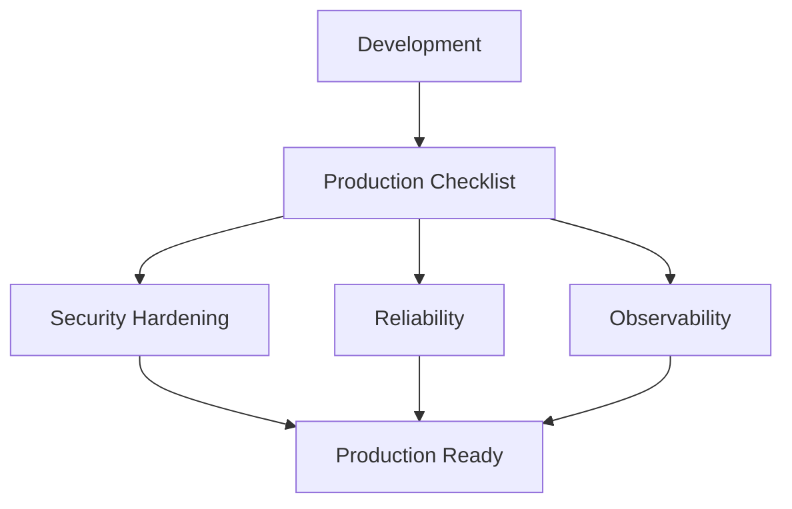
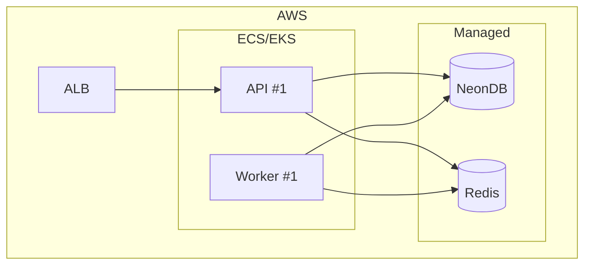
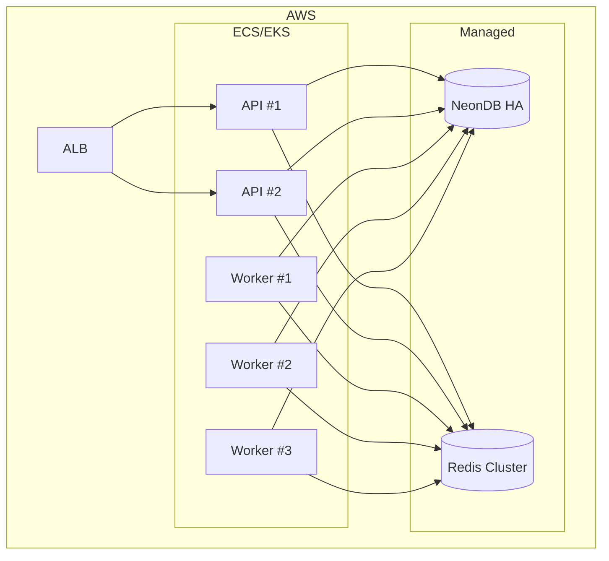

# Production Deployment

> **Status:** Implemented
> **Date:** 2026-08-25
> **Scope:** Production readiness checklist, configuration hardening, and operational procedures for running Draftly in production.

## 1. Overview

Running Draftly in production requires attention to security, reliability, and observability. This guide covers the configuration changes, infrastructure decisions, and operational procedures needed to move from development to a production-ready deployment.



## 2. Production Checklist

### 2.1 Security

| Item | Action | Why |
|------|--------|-----|
| API key authentication | Set `REQUIRE_API_KEY=true` and generate a strong key | Prevents unauthorized API access |
| Webhook secrets | Configure `GITHUB_WEBHOOK_SECRET`, `SLACK_SIGNING_SECRET`, `DISCORD_PUBLIC_KEY` | Validates inbound webhook signatures |
| Environment variables | Never commit `.env` files; use secret managers | Protects credentials |
| CORS | Restrict `FRONTEND_URL` to the production domain | Prevents cross-origin abuse |
| Debug mode | Set `DEBUG=false` | Prevents information leakage |
| Review policy | Set `STRANDS_REVIEW_POLICY=always` for initial rollout | Human oversight on all outputs |

### 2.2 Reliability

| Item | Action | Why |
|------|--------|-----|
| Database backups | Enable NeonDB point-in-time recovery | Data durability |
| Redis persistence | Enable AOF or RAG for Redis data | Queue durability |
| Worker redundancy | Run ≥2 worker instances | No single point of failure |
| Health checks | Configure ALB health check on `/api/health` | Automatic container replacement |
| Timeouts | Tune `STRANDS_EXECUTION_TIMEOUT` and `STRANDS_NODE_TIMEOUT` | Prevents runaway graphs |
| Token budgets | Set `MAX_TOKENS_PER_RUN=50000` | Prevents cost explosions |
| Rate limiting | Set `RATE_LIMITING_ENABLED=true` | Protects against abuse |

### 2.3 Observability

| Item | Action | Why |
|------|--------|-----|
| Structured logging | Set `LOG_LEVEL=INFO` (or `WARNING` in high-traffic) | Machine-parseable logs |
| Metrics | Expose Prometheus metrics from the API | Dashboards and alerting |
| Error tracking | Integrate Sentry or equivalent | Alert on exceptions |
| Queue monitoring | Run RQ Dashboard or equivalent | Visibility into job processing |
| Token usage tracking | Monitor `draftly_tokens_*` metrics | Cost management |

## 3. Configuration Hardening

### 3.1 Strands Runtime

```bash
# Conservative production defaults
STRANDS_MAX_NODE_EXECUTIONS=10
STRANDS_EXECUTION_TIMEOUT=600
STRANDS_NODE_TIMEOUT=180
STRANDS_REVIEW_POLICY=always
MAX_TOKENS_PER_RUN=50000
RECURSION_LIMIT=30
SUMMARIZATION_TRIGGER_FRACTION=0.70
```

**Rationale:**
- `max_node_executions=10` prevents infinite loops in agent graphs.
- `execution_timeout=600` (10 minutes) caps total graph runtime.
- `node_timeout=180` (3 minutes) prevents individual nodes from stalling.
- `review_policy=always` ensures human approval for all deliveries initially. Relax to `risky` once confidence in the system is established.

### 3.2 Worker Configuration

```bash
WORKER_ENABLED=true
WORKER_CONCURRENCY=4
RQ_QUEUE_PREFIX=draftly
RQ_SCHEDULER_ENABLED=true
RQ_WORKER_QUEUES=scheduled,webhooks,default
```

**Scaling guidance:**

| Traffic Level | Concurrency | Worker Instances |
|---------------|-------------|------------------|
| Low (< 100 events/day) | 2 | 1 |
| Medium (100–1000 events/day) | 4 | 2 |
| High (> 1000 events/day) | 8 | 3+ |

### 3.3 Database Pooling

```bash
DATABASE_POOL_MIN_SIZE=2
DATABASE_POOL_MAX_SIZE=10
```

For multi-instance deployments, calculate: `MAX_POOL_SIZE × API_INSTANCES + WORKER_CONCURRENCY × WORKER_INSTANCES` must stay below your database's `max_connections`.

### 3.4 Redis Subsystems

```bash
REDIS_URL=redis://your-redis-host:6379/0
EVENTS_STREAMING_ENABLED=true
SEMANTIC_CACHE_ENABLED=true
VECTOR_SEARCH_BACKEND=dual
EVENT_BUS_BACKEND=dual
RATE_LIMITING_ENABLED=true
API_CACHE_ENABLED=true
```

The `dual` backend mode uses both Redis and PostgreSQL for redundancy. For cost optimization, start with `redis` and upgrade to `dual` as data volume grows.

### 3.5 Slack and Discord Support

Slack/Discord support is a durable, org-scoped pipeline. It requires platform
installation, credential environment variables, queue workers, and a review
callback contract. See `docs/workflows/support.md` for the full operational
contract.

**Required secrets:**

| Variable | Purpose |
|----------|---------|
| `SLACK_SIGNING_SECRET` | Verify `X-Slack-Signature` on `/api/slack/events` and interactivity |
| `SLACK_CLIENT_ID` / `SLACK_CLIENT_SECRET` | Slack OAuth v2 exchange on `/api/slack/oauth/callback` |
| `SLACK_BOT_TOKEN` | Environment fallback bot token (workspace installs take precedence) |
| `DISCORD_PUBLIC_KEY` | Verify `X-Signature-Ed25519` on Discord interactions |
| `DISCORD_BOT_TOKEN` | Discord bot token for posting and channel/guild queries |

Outbound delivery selects credentials **per installation** (Slack `team_id` /
Discord `guild_id`) with the corresponding environment token as fallback, so a
multi-tenant deployment never sends a reply through the wrong workspace's bot.

**Slack installation:**

1. Point users at `/api/slack/install-url` (returns a scoped OAuth URL).
2. Completing OAuth saves the workspace bot token and redirects to the frontend.
3. Link the workspace to a Clerk org via `/api/slack/link` — only linked
   workspaces are routable.

**Discord guild linking:**

1. Invite the bot to the guild via `/api/discord/invite-url`.
2. Link the guild to a Clerk org via `/api/discord/link`.
3. Configure trigger channels via `/api/discord/trigger-channels` so the bot
   only answers in the intended channels.

**Queue workers:** each webhook worker must be reachable and subscribed.
Support jobs are enqueued as `slack_support.enqueue` / `discord_support.enqueue`
on the `webhooks` queue — include `webhooks` in `RQ_WORKER_QUEUES`. When RQ is
disabled the same task handlers run in-process. Posted replies are persisted as
`SupportDeliveryReceipt` rows before the thread is marked resolved, which
short-circuits duplicate webhook redeliveries.

**Review callback behavior:** when the policy requires human approval, the run
pauses at `pending_review` and the originating platform's interactivity
(button / modal / component) posts the decision to `/api/slack/interactivity`
or `/api/discord/interactions`. The shared `resume_review_decision` helper
resumes the paused graph and only records the decision when the run reaches the
expected terminal status — an approval must reach `delivered`, a rejection must
reach `failed`. A failed approval resume keeps the review actionable and never
records an approval for work that did not reach delivery.

## 4. Deployment Architecture

### 4.1 Minimal Production Setup



### 4.2 High-Availability Setup



## 5. Operational Procedures

### 5.1 Deployment

Before building the API image, read [API container packaging status](#8-api-container-packaging-status): its current entry point is missing from the image. The commands below describe the intended deployment flow after packaging is corrected.

```bash
# Build and push images
docker build -f docker/Dockerfile.api -t draftly-api:latest .
docker build -f docker/Dockerfile.worker -t draftly-worker:latest .
docker push ...

# Update ECS service (example)
aws ecs update-service --cluster draftly --service draftly-api --force-new-deployment
aws ecs update-service --cluster draftly --service draftly-worker --force-new-deployment
```

### 5.2 Scaling Workers

```bash
# Scale workers based on queue depth
aws ecs update-service --cluster draftly --service draftly-worker --desired-count 3
```

Monitor `RQ` queue depth and scale workers when pending jobs exceed processing capacity.

### 5.3 Database Maintenance

- NeonDB handles maintenance automatically for serverless plans.
- For dedicated plans, schedule maintenance windows during low-traffic periods.
- Monitor connection count and query latency via NeonDB dashboard.

### 5.4 Log Management

Structured logs use `structlog` and output JSON. Key log events:

| Event | Level | Meaning |
|-------|-------|---------|
| `runner_duplicate` | INFO | Event was already processed |
| `pr_workflow_done` | INFO | PR workflow completed |
| `slack_support_done` | INFO | Slack support workflow completed |
| `discord_support_done` | INFO | Discord support workflow completed |
| `support_delivery_already_exists` | INFO | Duplicate Slack/Discord delivery suppressed |
| `review_resumed` | INFO | A paused review was resumed with a decision |
| `documentation_sync_done` | INFO | Doc sync completed |
| `runner_claim_failed` | ERROR | Idempotency claim failed |
| `runner_publish_failed` | WARNING | Streaming publish failed (non-fatal) |

### 5.5 Rollback

1. Tag the current image version before deployment.
2. If issues arise, update the ECS service to use the previous image tag.
3. Database migrations are backward-compatible by design; no rollback needed.

## 6. Cost Management

| Cost Driver | Control Mechanism |
|-------------|-------------------|
| LLM token usage | `MAX_TOKENS_PER_RUN`, `SUMMARIZATION_TRIGGER_FRACTION` |
| Worker compute | `WORKER_CONCURRENCY`, horizontal scaling |
| Redis memory | `SEMANTIC_CACHE_ENABLED`, TTL on cached items |
| Database storage | NeonDB auto-scaling; monitor via dashboard |
| Network | ALB request routing; minimize cross-AZ traffic |

## 7. File Reference

- `docker/Dockerfile` — Base image
- `docker/Dockerfile.api` — API image (port 8000)
- `docker/Dockerfile.worker` — Worker image (background processing)
- `src/draftly/app/config.py` — All configuration with defaults
- `src/draftly/workflows/runner.py` — WorkflowRunner (execution engine)
- `src/draftly/workflows/context.py` — WorkflowContext (dependency bundle)
- `src/draftly/support/identity.py` — Slack/Discord org enrichment
- `src/draftly/review/resume.py` — Review-resume helper
- `src/draftly/observability/metrics.py` — Prometheus metrics

## 8. API container packaging status

The [backend README](../../README.md#run-draftly) uses native API startup. The current [API Dockerfile](../../docker/Dockerfile.api) declares `CMD ["python", "main.py"]`, but copies only the virtual environment and `src/` into its runtime stage. It does not copy `main.py`. Its build stage also installs the project without explicitly copying the `README.md` referenced by the package manifest.

The following are the intended build/run commands, **not a verified working deployment**. Correct the image's package inputs and runtime entry point before using them. This documentation change does not modify the Dockerfile.

```bash
docker build -f docker/Dockerfile.api -t draftly-api .
docker run --rm --env-file .env \
  -p 8000:8000 \
  -e REDIS_URL=redis://host.docker.internal:6379/0 \
  draftly-api
```

On macOS and Windows, use `host.docker.internal` for host services reached from a container; configure the database hostname similarly if PostgreSQL runs on the host. Redis and the database are separate dependencies, and queued work also needs a running RQ worker. See [Redis and worker alternatives](redis.md#11-compose-and-rq-worker-alternatives).

The `.env` must include model and embedding-provider access as well as database and Redis configuration. GitHub App operations additionally need the configured private key available at `GITHUB_PRIVATE_KEY_PATH`. No image build, cloud deployment, or end-to-end container run was performed as part of this README review.
