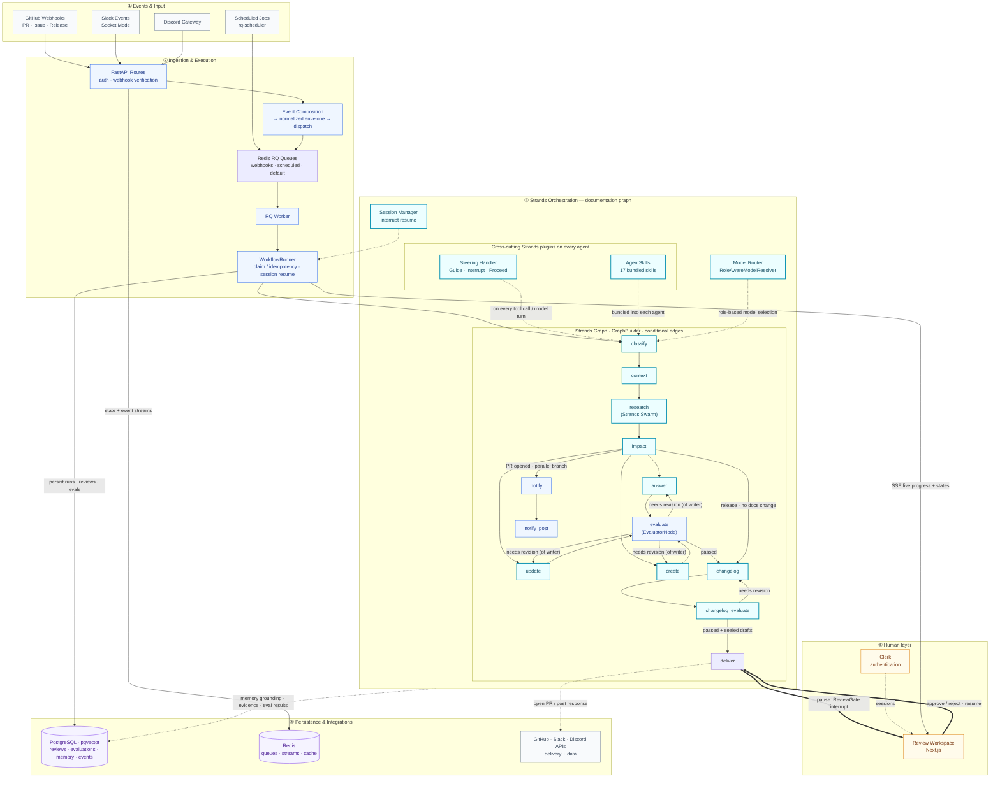

# Draftly Architecture Diagram

## Project at a glance

|              |                                                                                                                                                                                                                      |
| ------------ | -------------------------------------------------------------------------------------------------------------------------------------------------------------------------------------------------------------------- |
| **Problem**  | In software development, docs drifts out of date and become stale as code changes, hence leaving documentation teams with a task to repeatedly discover, research, draft, and validate docs as the codebase changes. |
| **Audience** | Developers, dev-rels, open-source maintainers and documentation teams responsible for keeping software documentation upto date with the code changes.                                                                |
| **Outcome**  | Draftly detects GitHub events, researches their impact on docs, drafts or updates documentation, verifies quality, and asks a human to approve the result before updating the docs.                                  |

---

## The diagram

## Legend

| Color      | Meaning                                                      | Examples                                                |
| ---------- | ------------------------------------------------------------ | ------------------------------------------------------- |
| **Teal**   | Strands Agents SDK constructs (Technological Implementation) | Graph, Agent nodes, Steering, Skills, Model Router      |
| **Blue**   | Draftly-owned application code                               | FastAPI, WorkflowRunner, EvaluatorNode, tool registries |
| **Purple** | State / persistence                                          | PostgreSQL · pgvector, Redis                            |
| **Gray**   | External systems & webhooks                                  | GitHub, Slack, Discord                                  |
| **Amber**  | Human-in-the-loop surface                                    | Review Workspace, Clerk auth                            |

Why teal carries the whole "③ Strands Orchestration" band: the #1 Devpost judging criterion is _Technological Implementation_ — how deeply the project uses Strands Agents. Making every Strands construct visually distinct from Draftly's own code lets a judge see the SDK in use in the first glance.

## How to read the architecture

1. **Events start the work.** GitHub webhooks, Slack events, Discord messages, and scheduled jobs provide the triggers that Draftly handles in the background.
2. **Ingestion makes execution durable.** FastAPI verifies and normalizes incoming events before Redis-backed RQ queues hand them to a worker and `WorkflowRunner`.
3. **Strands performs the reasoning.** A conditional agent graph classifies the request, gathers context, delegates research to a Swarm, assesses documentation impact, and chooses whether to answer, update, or create content.
4. **Evaluation governs quality.** Drafts must pass groundedness and completeness evaluation. Failed work loops back to the responsible writer; successful work advances toward delivery.
5. **A human controls publication.** `ReviewGate` interrupts the graph before delivery. Approval or rejection in the review workspace resumes the persisted run with the human decision intact.

The solid arrows show execution flow, dotted arrows show cross-cutting services or external actions, and the thick arrows mark the human interrupt-and-resume boundary.

## Strands features surfaced (and where they live in code)

| Strands feature     | Construct used                                                                          | Where in code                                                                                                                | What judges see                                                               |
| ------------------- | --------------------------------------------------------------------------------------- | ---------------------------------------------------------------------------------------------------------------------------- | ----------------------------------------------------------------------------- |
| **Graphs**          | `GraphBuilder` + `GraphState`, conditional edges, `reset_on_revisit`, `SessionManager`  | `orchestration/graphs/documentation_graph.py`, `issue_graph.py`, `support_graph.py`, `content_graph.py`, `feedback_graph.py` | A governed pipeline of specialized agents, not a single chatbot loop          |
| **Agents & Swarms** | `Agent` + `Swarm` (`subagents.py`)                                                      | `agents/documentation/research_swarm.py`                                                                                     | Research sub-agents handing off autonomously                                  |
| **Skills**          | `AgentSkills` plugin loading bundled skills                                             | `agents/documentation/researcher.py:43`                                                                                      | Packaged, reusable agent skills per role                                      |
| **Steering**        | `SteeringHandler` subclass → `Guide` / `Interrupt` / `Proceed` on `BeforeToolCallEvent` | `steering/handler.py`, `steering/policy.py`, `steering/decisions.py`                                                         | Deterministic guardrails + optional isolated LLM judge; durable interventions |
| **Hooks / HITL**    | `HookProvider` interrupting on `BeforeNodeCallEvent`                                    | `orchestration/hooks/review_gate.py`                                                                                         | Human approval is a first-class graph control flow                            |
| **Evaluation**      | `strands_evals` `Case` / `Experiment` + evaluators                                      | `evaluation/runner.py`, `evaluation/evaluators/*.py`                                                                         | Runtime-verified quality gates and dataset evals                              |
| **Models**          | `Model`, `BedrockModel`, `OpenAIModel`, `RoleAwareModelResolver`                        | `models/`, `providers/`, `integrations/strands/models.py`                                                                    | Capability-based model routing by agent role                                  |

## Human control and operational reliability

Draftly combines autonomous execution with explicit control points:

- `WorkflowRunner` claims work idempotently so repeated delivery does not create duplicate runs.
- Redis queues move webhook and scheduled work out of the request path and into durable background execution.
- Evaluator nodes return incomplete or insufficiently grounded drafts to the appropriate writer instead of allowing them to advance.
- Session management persists interrupted state so a review decision resumes the same workflow rather than starting over.
- `ReviewGate` prevents publication until a person explicitly approves the proposed change.
- PostgreSQL records runs, evidence, reviews, and evaluation results for traceability.

This is the central product promise: Draftly handles repetitive documentation work end to end, but accountability remains with the documentation team.

## Caption for Devpost and the video

> Draftly keeps SDK documentation aligned with the code that ships. GitHub, Slack, and Discord events land in a FastAPI service, are normalized, and run through Redis-backed RQ workers into a Strands Agents graph — the teal orchestration layer. Specialized Strands agents classify, research through a sub-agent Swarm, assess impact, and draft an update; a Strands EvaluatorNode checks groundedness and completeness, looping revisions until they pass. Every agent runs with Strands Skills embedded and a Strands Steering handler that can Guide, Interrupt, or Proceed on each tool call. Before anything is published, a Strands hook interrupts the graph for a human review decision in a Next.js workspace; approval resumes the run and a delivery agent opens the PR. Runtime evaluation runs as Strands Evals experiments against golden datasets, and results persist in PostgreSQL.

## Scope and boundaries

The diagram shows the documentation graph in full. GitHub Issue and Slack/Discord support surfaces run parallel graphs (`issue_graph`, `support_graph`) built from the same `GraphBuilder` + plugin stack (skills, steering, model routing), sharing the same persistence, review, and delivery machinery — drawn once here for slide legibility.

The diagram intentionally emphasizes system responsibilities and control flow rather than deployment topology. It does not expand every parallel graph, every agent tool, or every database table. Those details remain available in the source code without making the submission image unreadable.

## Submission asset map

| Destination                      | Asset                                       | Purpose                                                                                               |
| -------------------------------- | ------------------------------------------- | ----------------------------------------------------------------------------------------------------- |
| **Devpost architecture diagram** | High-resolution PNG with a white background | The presentation-ready artifact judges can understand without Mermaid support                         |
| **Devpost project description**  | The caption above                           | Connects the visual flow to the problem, Strands implementation, evaluation, and human decision point |
| **Public repository**            | This Markdown file                          | Provides the maintainable Mermaid source, code references, scope, and operational explanation         |
| **Demo video and slides**        | The same exported PNG                       | Keeps terminology and visual storytelling consistent across the submission                            |

## Rendering

- **GitHub** renders this Mermaid natively (paste into a README or `.md` file).
- **mermaid.live** — paste the code block, export PNG/SVG at 2x for slides.
- **CLI:** `npx -y @mermaid-js/mermaid-cli -i diagram.md -o diagram.svg -b white` (needs a Chromium install for first-use only).
- Use a descriptive filename such as `draftly-strands-architecture.png` for the Devpost upload.
- Reserve a raster PNG for the Devpost gallery; keep this `.md` source in the repository.

Before submission, verify the exported image at its actual display size: all five bands are labeled, the revision loop and interrupt/resume arrows are legible, the teal Strands band is the most prominent element, and no text is clipped. The diagram should pass a five-second test: a new viewer can identify the trigger, Strands orchestration, evaluation loop, and human approval gate without additional explanation.
