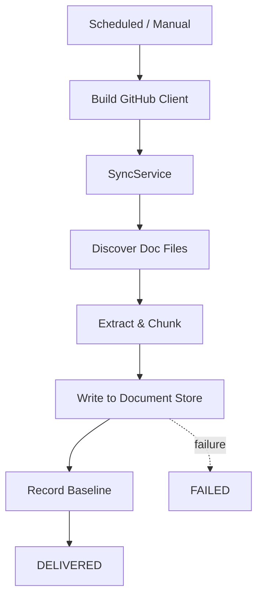

# Documentation Sync Workflow

> **Status:** Implemented
> **Date:** 2026-08-25
> **Scope:** Scheduled full-repository documentation synchronization from GitHub into the document store and memory index.

## 1. Overview

The documentation sync workflow performs a full sweep of a repository's documentation files, ingesting them into Draftly's document store and memory index. It is triggered on a schedule (or manually during onboarding) and handles the complete lifecycle: GitHub authentication, file discovery, content extraction, chunking, and storage.

This workflow does not go through `WorkflowRunner` — it is a standalone async function that manages its own error boundaries.



## 2. Trigger

- **Scheduled:** Runs on a configurable cron schedule per organization/repository.
- **Manual:** Invoked via the API for ad-hoc synchronization.
- **Onboarding:** Called during `run_onboarding_initialize` as the first stage.

## 3. Flow

### Step 1: GitHub Authentication

The workflow fetches the GitHub App installation for the organization and builds an authenticated client:

```python
installation = await context.repositories.github_installations.first_for_org(org_id)
github = await build_installation_client(installation["installation_id"])
```

### Step 2: Sync Service

The `SyncService` handles the core sync logic:

1. **File discovery** — Scans the repository for documentation files matching the include/exclude patterns (default: `README.md`, `docs/**`, `*.md`, `*.mdx`; excluding `node_modules/**`, `dist/**`).
2. **Content extraction** — Reads each file and extracts structured content.
3. **Chunking** — Splits documents into searchable chunks for the memory index.
4. **Storage** — Writes documents, sections, and chunks to the document store.

### Step 3: Result Recording

The sync result includes:

| Metric | Description |
|--------|-------------|
| `document_count` | Number of documents successfully stored |
| `section_count` | Number of sections extracted |
| `chunk_count` | Number of chunks created for search |
| `skipped_count` | Files skipped (matched exclude patterns) |
| `failed_files` | List of files that failed to process |
| `baseline` | Baseline snapshot for future comparisons |

### Step 4: Completion

On success, the state is marked `DELIVERED`. On failure (including zero documents stored with failed files), the state is marked `FAILED` with the error message.

## 4. Key Steps

| Step | Description |
|------|-------------|
| Fetch GitHub installation | Authenticated client for the target repository |
| Initialize SyncService | Inject GitHub client and workflow context |
| Run sync | Discover, extract, chunk, and store documentation |
| Record baseline | Capture document/chunk counts for future audits |
| Log outcome | Structured log with org, repo, doc count, chunk count |

## 5. Parameters

| Parameter | Type | Required | Description |
|-----------|------|----------|-------------|
| `org_id` | `str` | Yes | Organization identifier |
| `repository_full_name` | `str` | Yes | Repository in `owner/repo` format |
| `include` | `list[str]` | No | Glob patterns to include (defaults to markdown files) |
| `exclude` | `list[str]` | No | Glob patterns to exclude |

## 6. File Reference

- `src/draftly/workflows/documentation/documentation_sync.py` — Workflow implementation
- `src/draftly/workflows/documentation/__init__.py` — Package exports
- `src/draftly/documentation/sync_service.py` — Core sync logic
- `src/draftly/integrations/github/app_auth.py` — GitHub App authentication
