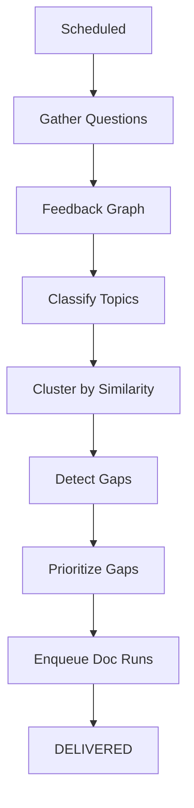

# Feedback Loop Workflow

> **Status:** Implemented
> **Date:** 2026-08-25
> **Scope:** Scheduled workflow that converts recurring support questions into prioritized documentation gap candidates.

## 1. Overview

The feedback loop workflow closes the gap between user pain and documentation improvements. It runs on a schedule, gathers recent support questions, clusters them by topic, and produces prioritized documentation gap candidates that feed into the documentation generation pipeline.

The workflow uses a deterministic feedback graph (built by `build_feedback_graph`) to process questions through classification, clustering, gap detection, and prioritization stages.



## 2. Trigger

- **Scheduled:** Runs periodically (e.g., daily or weekly) to process accumulated support signals.
- **Manual:** Can be invoked with a pre-built question list for targeted analysis.

## 3. Flow

### Step 1: Question Gathering

Questions come from two sources:

1. **Direct payload** — Questions passed explicitly in the job parameters.
2. **Feedback service** — The workflow calls `context.feedback.collect_questions()` to pull recent support messages. If the feedback service is unavailable, it falls back to querying the support repository directly.

Questions are deduplicated via `feedback.deduplicator` when available.

### Step 2: Feedback Graph Invocation

The `build_feedback_graph` constructs a deterministic processing graph with the configured `gap_threshold` (default: 2). The graph processes questions through:

1. **Classification** — Categorizes each question by topic.
2. **Clustering** — Groups semantically similar questions.
3. **Gap detection** — Identifies topics with insufficient documentation coverage.
4. **Prioritization** — Ranks gaps by severity × frequency.

### Step 3: Outcome

On successful completion (`Status.COMPLETED`), the state is marked `DELIVERED`. The graph produces `DocumentationGapCandidate` objects that are enqueued for documentation generation.

## 4. Key Steps

| Step | Description |
|------|-------------|
| Gather questions | From payload, feedback service, or support repository |
| Deduplicate | Remove duplicate questions |
| Build feedback graph | Construct the processing pipeline |
| Invoke graph | Process questions through classification → clustering → detection → prioritization |
| Record outcome | Mark state as DELIVERED or FAILED |

## 5. Parameters

| Parameter | Type | Required | Default | Description |
|-----------|------|----------|---------|-------------|
| `questions` | `list[dict]` | No | `None` | Pre-built question list (triggers gathering if absent) |
| `gap_threshold` | `int` | No | `2` | Minimum occurrences to create a gap candidate |

## 6. Question Format

```python
{
    "topic": "custom domain setup",   # clustering key
    "question": "How do I set up...", # original content
    "source": "slack",                # platform identifier
}
```

## 7. Output

`DocumentationGapCandidate` objects with:

| Field | Description |
|-------|-------------|
| `topic` | Clustered topic name |
| `occurrences` | Number of questions in the cluster |
| `severity` | Computed severity score |
| `platforms` | Source platforms (slack, discord) |
| `sample_questions` | Representative questions from the cluster |

## 8. File Reference

- `src/draftly/workflows/feedback/documentation_feedback_loop.py` — Workflow implementation
- `src/draftly/workflows/feedback/feedback_prioritization.py` — Gap prioritization logic
- `src/draftly/workflows/feedback/knowledge_update.py` — Knowledge base update plans
- `src/draftly/orchestration/graphs/feedback_graph.py` — Feedback graph builder
