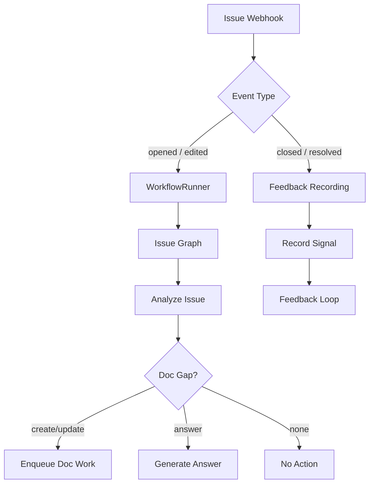

# GitHub Issue Workflow

> **Status:** Implemented
> **Date:** 2026-08-25
> **Scope:** Processing GitHub issue webhooks — analysis, triage, feedback recording, and resolution.

## 1. Overview

When a GitHub issue event arrives via webhook, Draftly routes it through the issue workflow to determine whether the issue signals a documentation gap, requires a support-style answer, or has no documentation impact. The workflow also records resolved issues as feedback signals for the documentation feedback loop.

The issue workflow has two entry points: `run_github_issue_workflow` (for active issue processing through `WorkflowRunner`) and `process_issue_feedback` (for recording feedback from closed/resolved issues).



## 2. Trigger

- **GitHub `issues` webhook:** Fired on issue open, edit, close, label changes.
- **Event type routing:** The `EventDispatcher` routes issue events to the appropriate handler.

## 3. Flow

### 3.1 Active Issue Processing (`run_github_issue_workflow`)

This workflow delegates to `WorkflowRunner`, which handles idempotency, graph construction, and outcome management. The issue graph invokes these skills in sequence:

1. **`github-issue-analysis`** — Fetches the issue, searches docs for coverage, classifies the impact.
2. **`support-answering`** (if action is `answer`) — Generates a response grounded in evidence.
3. **`documentation-generation`** or **`documentation-update`** (if action is `create`/`update`) — Produces a `DocChangePlan`.
4. **`documentation-evaluation`** — Scores the draft before delivery.
5. **`github-delivery`** (if approved) — Opens a PR with the documentation changes.

### 3.2 Feedback Recording (`process_issue_feedback`)

For closed/resolved issues, this lightweight workflow records a feedback signal:

```python
state.result = {
    "topic": issue.title.strip().lower() or "general",
    "question": issue.title,
    "source": "github_issue",
    "state": issue.state,
}
```

The signal is stored for the scheduled feedback loop to cluster and prioritize.

## 4. Impact Analysis

The issue analysis skill produces an `ImpactAnalysis`:

| Action | Meaning |
|--------|---------|
| `create` | Topic is undocumented — new page needed |
| `update` | Docs exist but are wrong, stale, or incomplete |
| `answer` | Issue is answerable without docs changes |
| `none` | No documentation impact (spam, duplicate, etc.) |

## 5. File Reference

- `src/draftly/workflows/github/issue_resolution.py` — Active issue workflow (via WorkflowRunner)
- `src/draftly/workflows/github/issue_feedback.py` — Feedback signal recording
- `src/draftly/workflows/github/__init__.py` — Package exports
- `src/draftly/skills/github-issue-analysis/SKILL.md` — Issue analysis skill
- `src/draftly/skills/documentation-gap-detection/SKILL.md` — Gap detection skill
