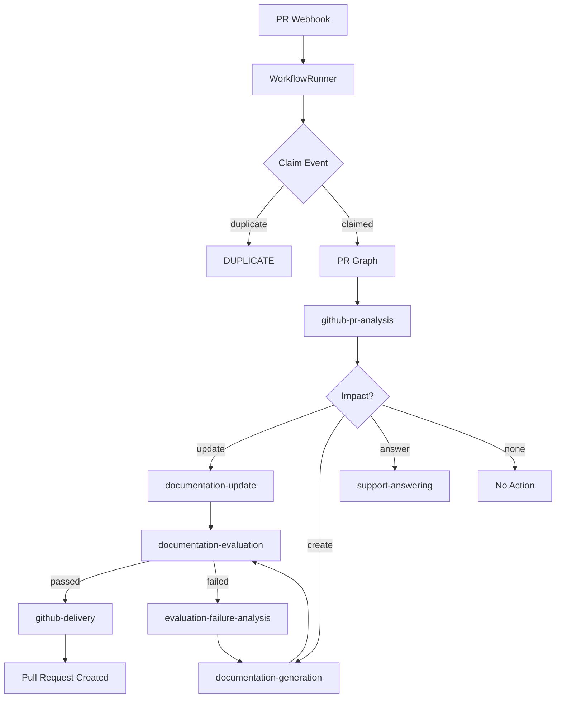

# GitHub Pull Request Workflow

> **Status:** Implemented
> **Date:** 2026-08-25
> **Scope:** Processing GitHub pull request webhooks — diff analysis, documentation impact assessment, and automated doc updates.

## 1. Overview

When a pull request event arrives via webhook, Draftly routes it through the PR workflow to analyze the code changes and determine their documentation impact. The workflow inspects the PR's title, body, diff, and changed files to decide whether documentation must be updated, created, or left unchanged.

This workflow is a thin adapter that delegates to `WorkflowRunner`, which handles idempotency and graph execution. The PR graph performs the heavy lifting through its skill nodes.

## 2. Trigger

- **GitHub `pull_request` webhook:** Fired on PR open, synchronize, edit, close.
- **Event routing:** The `EventDispatcher` determines the surface from the event payload.

## 3. Flow

### Step 1: Idempotency Claim

The `WorkflowRunner` attempts to claim the event atomically. If the event was already processed, it returns `DUPLICATE`.

### Step 2: PR Analysis

The `github-pr-analysis` skill:

1. Fetches the PR title, body, and changed files.
2. Retrieves the diff for actual code changes.
3. Classifies the change type:

| Change Type | Description |
|-------------|-------------|
| `documentation_only` | Only docs files changed |
| `bug_fix` | Bug fix in code |
| `new_feature` | New functionality added |
| `api_change` | Public API modified |
| `breaking_change` | Backward-incompatible change |
| `deprecation` | Feature marked deprecated |

4. Maps changed files to affected documentation via semantic/keyword search.

### Step 3: Impact Assessment

Produces an `ImpactAnalysis` with:

- **action**: `update`, `create`, `answer`, or `none`
- **affected_documents**: List of doc paths that need changes
- **rationale**: Why the action is recommended
- **evidence**: Concrete file paths and doc references

### Step 4: Documentation Work

Based on the action:

- **`update`**: The `documentation-update` skill reads the affected sections and applies minimal, surgical edits.
- **`create`**: The `documentation-generation` skill writes a new page following project conventions.
- **`answer`**: The `support-answering` skill generates a response.
- **`none`**: No documentation work needed (documentation-only PRs get this action).

### Step 5: Evaluation

The `documentation-evaluation` skill scores the draft:

- **Groundedness**: All claims backed by cited sources.
- **Completeness**: Key topics covered.
- **Correctness**: Technical claims accurate per the code.
- **Quality**: Structure, clarity, style adherence.

### Step 6: Delivery (if approved)

The `github-delivery` skill:

1. Creates a branch from the base SHA.
2. Writes changed files and commits.
3. Opens a pull request with title, body, and labels.
4. Records the PR number as the delivery reference.

## 4. Urgency Classification

| Urgency | Trigger |
|---------|---------|
| HIGH | API changes, breaking changes, deprecations |
| MEDIUM | New features, bug fixes with user-facing impact |
| LOW | Documentation-only changes, internal refactors |

## 5. File Reference

- `src/draftly/workflows/documentation/github_pr_workflow.py` — Workflow implementation
- `src/draftly/workflows/runner.py` — WorkflowRunner execution engine
- `src/draftly/skills/github-pr-analysis/SKILL.md` — PR analysis skill
- `src/draftly/skills/documentation-update/SKILL.md` — Documentation update skill
- `src/draftly/skills/documentation-generation/SKILL.md` — Documentation generation skill
- `src/draftly/skills/documentation-evaluation/SKILL.md` — Documentation evaluation skill
- `src/draftly/skills/github-delivery/SKILL.md` — GitHub delivery skill
