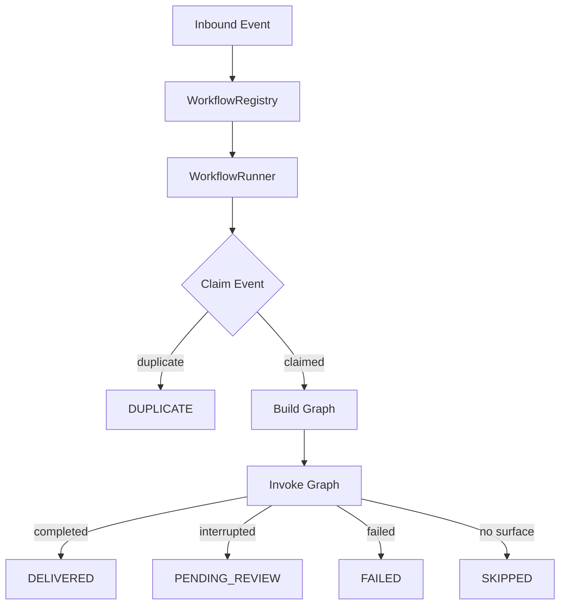
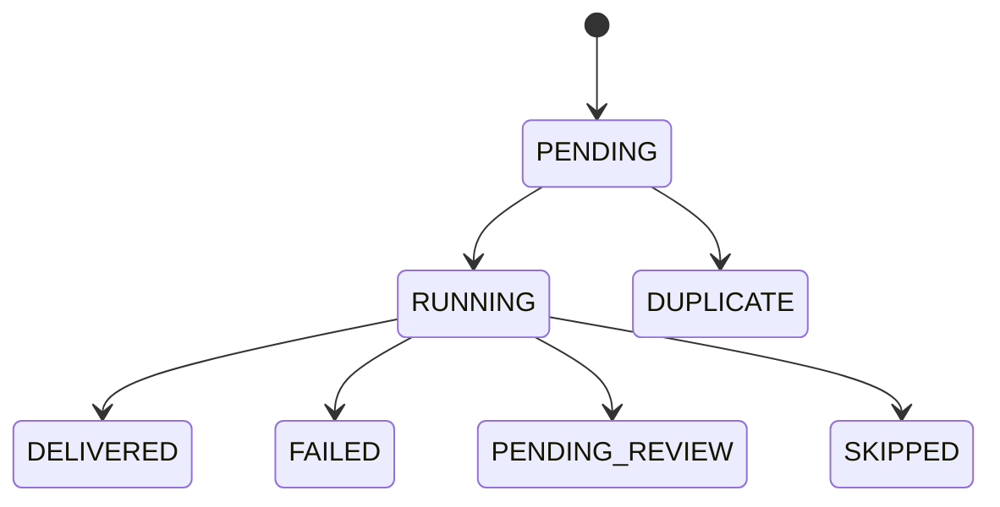
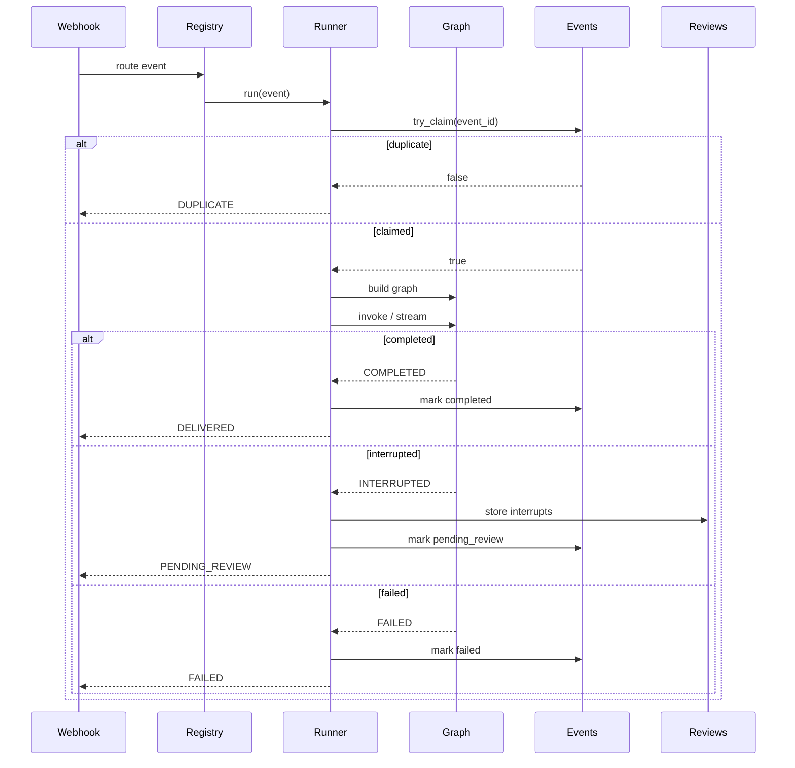

# Workflow System Overview

> **Status:** Implemented
> **Date:** 2026-08-25
> **Scope:** The Draftly workflow layer — execution engine, state management, and all workflow types.

## 1. Overview

The workflow layer is the execution backbone of Draftly. It replaces the earlier pipeline architecture with a model where each inbound event triggers exactly one run, one session, and one agent graph. The system guarantees idempotency through atomic event claiming, so duplicate webhook deliveries never cause double execution.

A workflow is a Python async function that receives a `WorkflowContext` (dependency bundle) and an event payload, then returns a `WorkflowState` (outcome record). The `WorkflowRunner` handles the common pattern of claim → build graph → invoke → handle outcome, while domain-specific workflow functions handle standalone tasks like audits and memory maintenance.



## 2. Core Components

### 2.1 WorkflowRunner

`WorkflowRunner` is the execution engine (`src/draftly/workflows/runner.py`). It owns the full lifecycle of a run:

1. **Idempotency claim** — An atomic `INSERT..ON CONFLICT DO NOTHING` on the events table determines whether this delivery owns the run.
2. **Graph construction** — Builds a per-run Strands agent graph via `graph_factory`.
3. **Graph invocation** — Invokes the graph synchronously or via streaming.
4. **Outcome handling** — Routes the result to the appropriate terminal status.

The runner is storage-agnostic: it accesses repositories through `WorkflowContext.repositories` (duck-typed interfaces for `.events` and `.reviews`).

**Key method:**
```python
async def run(self, event: dict[str, Any]) -> WorkflowState
```

**Streaming mode:** When a publisher is configured, the runner iterates `graph.stream_async`, publishes `StreamEnvelope` events, and records time-to-first-token (TTFT) metrics. The outcome handling is identical on both synchronous and streaming paths.

### 2.2 WorkflowState

`WorkflowState` (`src/draftly/workflows/state.py`) is the outcome record for a run. Every field is serializable.

**Fields:**

| Field | Type | Description |
|-------|------|-------------|
| `run_id` | `str` | Unique identifier for this run (= event_id) |
| `status` | `WorkflowStatus` | Current workflow status |
| `surface` | `str \| None` | Routing surface (e.g. `"pull_request"`, `"slack"`) |
| `event` | `dict` | The original inbound event payload |
| `result` | `Any` | Graph result or workflow-specific output |
| `errors` | `list[str]` | Error messages from failed steps |
| `interrupts` | `list[dict]` | Interrupt records (for human review) |
| `started_at` | `str` | ISO timestamp when the run began |
| `finished_at` | `str \| None` | ISO timestamp when the run completed |

**WorkflowStatus enum (7 statuses):**

| Status | Meaning |
|--------|---------|
| `PENDING` | Run created but not yet started |
| `RUNNING` | Graph is executing |
| `DUPLICATE` | Event was already claimed by another run |
| `PENDING_REVIEW` | Graph interrupted; awaiting human review |
| `DELIVERED` | Successfully completed |
| `FAILED` | Graph or workflow step failed |
| `SKIPPED` | No matching surface for this event |



### 2.3 WorkflowContext

`WorkflowContext` (`src/draftly/workflows/context.py`) is the dependency bundle passed to every workflow function. It carries repositories, configuration, and runtime handles — never a FastAPI app object.

**Key fields:**

| Field | Purpose |
|-------|---------|
| `repositories` | Duck-typed storage (events, reviews, documents, support, etc.) |
| `memory` | Memory subsystem handle |
| `evaluation` | Evaluation subsystem handle |
| `feedback` | Feedback service handle |
| `config` | Application settings |
| `tools` | Tool registry for agent nodes |
| `model` | Concrete Strands Model (None = offline/test mode) |
| `hooks` | Lifecycle hooks for the graph |
| `storage_dir` | Session storage path |
| `audit_repo` | Audit trail repository |
| `routing_decision` | Adaptive router decision for this run |
| `episodic` | Episodic memory subsystem |
| `procedural` | Procedural memory subsystem |
| `candidates` | Memory candidate queue |
| `publisher` | Streaming event publisher |

**Convenience properties:**

- `context.events` → `repositories.events` (event claiming and status)
- `context.reviews` → `repositories.reviews` (interrupt storage)
- `context.review_policy()` → `"always"` / `"risky"` / `"never"`
- `context.graph_limits()` → Strands budget knobs (max_node_executions, timeouts)

### 2.4 WorkflowRegistry

`WorkflowRegistry` (`src/draftly/workflows/registry.py`) maps canonical workflow names to async workflow functions.

```python
registry.register("pull_request", run_pull_request_workflow)
registry.register("slack_support", run_slack_support)
await registry.run("pull_request", context, event)
```

The registry supports attribute-style access (`registry.pull_request`) for backward compatibility with the legacy `TASK_REGISTRY` pattern.

## 3. Workflow Types

### 3.1 Documentation Workflows

| Workflow | Function | Trigger | Description |
|----------|----------|---------|-------------|
| Documentation Sync | `run_documentation_sync` | Scheduled | Full-repository doc sweep — ingests docs into the document store |
| Documentation Audit | `run_documentation_audit` | Scheduled | Freshness scan, broken links, orphaned docs, duplicate headings |
| PR Workflow | `run_pull_request_workflow` | GitHub `pull_request` webhook | Runs the documentation graph against PR events |
| Release Workflow | `run_release_workflow` | GitHub `release` webhook | Runs the documentation graph against release events |

### 3.2 GitHub Workflows

| Workflow | Function | Trigger | Description |
|----------|----------|---------|-------------|
| Issue Resolution | `run_github_issue_workflow` | GitHub `issues` webhook | Runs the issue graph for triage, analysis, and response |
| Issue Feedback | `process_issue_feedback` | GitHub `issues` (closed) | Records issue-derived feedback signals for the feedback loop |

### 3.3 Support Workflows

| Workflow | Function | Trigger | Description |
|----------|----------|---------|-------------|
| Slack Support | `run_slack_support` | Slack message event | Runs the support graph for a Slack question |
| Discord Support | `run_discord_support` | Discord message event | Runs the support graph for a Discord question |
| Support Resolution | `resolve_support_thread` | Post-delivery | Marks support threads as resolved or leaves them open |

### 3.4 Feedback Workflows

| Workflow | Function | Trigger | Description |
|----------|----------|---------|-------------|
| Feedback Loop | `run_feedback_loop` | Scheduled | Clusters support questions into documentation gap candidates |
| Feedback Prioritization | `prioritize_gaps` | Internal | Ranks gaps by severity × frequency |
| Knowledge Update | `plan_knowledge_updates` | Internal | Builds memory upsert plans for prioritized gaps |

### 3.5 Evaluation Workflows

| Workflow | Function | Trigger | Description |
|----------|----------|---------|-------------|
| Documentation Evaluation | `run_evaluation_loop` | Scheduled | Runs evaluation graph over golden datasets |
| Support Evaluation | `evaluate_support_answer` | Internal | Keyword-coverage scoring for support answers |

### 3.6 Onboarding Workflows

| Workflow | Function | Trigger | Description |
|----------|----------|---------|-------------|
| Initialize | `run_onboarding_initialize` | First repository setup | Chains: ingest → knowledge → evaluate → health → recommendations |

### 3.7 Memory Workflows

| Workflow | Function | Trigger | Description |
|----------|----------|---------|-------------|
| Memory Curation | `run_memory_curation` | Scheduled (batch) | Claims candidate batches, applies curator decisions |
| Memory Maintenance | `run_memory_maintenance` | Scheduled (weekly) | Archives old episodes, demotes stale semantic memory |

### 3.8 Post-Run Workflows

| Workflow | Function | Trigger | Description |
|----------|----------|---------|-------------|
| Candidate Extraction | `record_post_run_memory` | After completed run | Records episodes and enqueues memory candidates |

## 4. Execution Flow

The standard event-driven workflow follows this path:



### Standalone Workflows

Workflows that do not go through `WorkflowRunner` (audits, sync, feedback, evaluation, memory) follow a simpler path:

1. Receive `WorkflowContext` and parameters.
2. Perform the task directly (query repositories, invoke graphs, process data).
3. Return a `WorkflowState` with `DELIVERED` or `FAILED`.

These workflows handle their own error boundaries independently — a failure in memory maintenance does not affect documentation sync.

## 5. File Reference

### Core Framework

- `src/draftly/workflows/__init__.py` — Package exports
- `src/draftly/workflows/runner.py` — WorkflowRunner execution engine
- `src/draftly/workflows/state.py` — WorkflowState and WorkflowStatus
- `src/draftly/workflows/context.py` — WorkflowContext dependency bundle
- `src/draftly/workflows/registry.py` — WorkflowRegistry name-to-function mapping

### Documentation Workflows

- `src/draftly/workflows/documentation/__init__.py`
- `src/draftly/workflows/documentation/documentation_sync.py`
- `src/draftly/workflows/documentation/documentation_audit.py`
- `src/draftly/workflows/documentation/github_pr_workflow.py`
- `src/draftly/workflows/documentation/github_release_workflow.py`

### GitHub Workflows

- `src/draftly/workflows/github/__init__.py`
- `src/draftly/workflows/github/issue_resolution.py`
- `src/draftly/workflows/github/issue_feedback.py`

### Support Workflows

- `src/draftly/workflows/support/__init__.py`
- `src/draftly/workflows/support/slack_support_workflow.py`
- `src/draftly/workflows/support/discord_support_workflow.py`
- `src/draftly/workflows/support/support_resolution.py`

### Feedback Workflows

- `src/draftly/workflows/feedback/__init__.py`
- `src/draftly/workflows/feedback/documentation_feedback_loop.py`
- `src/draftly/workflows/feedback/feedback_prioritization.py`
- `src/draftly/workflows/feedback/knowledge_update.py`

### Evaluation Workflows

- `src/draftly/workflows/evaluation/__init__.py`
- `src/draftly/workflows/evaluation/documentation_evaluation.py`
- `src/draftly/workflows/evaluation/support_evaluation.py`

### Onboarding Workflows

- `src/draftly/workflows/onboarding/__init__.py`
- `src/draftly/workflows/onboarding/initialize.py`

### Memory Workflows

- `src/draftly/workflows/memory/__init__.py`
- `src/draftly/workflows/memory/curation_workflow.py`

### Maintenance Workflows

- `src/draftly/workflows/maintenance/__init__.py`
- `src/draftly/workflows/maintenance/run_memory_maintenance.py`

### Post-Run Workflows

- `src/draftly/workflows/post_run/__init__.py`
- `src/draftly/workflows/post_run/candidate_extractor.py`
