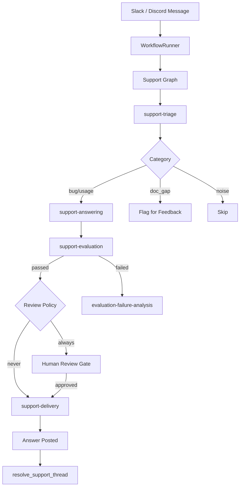
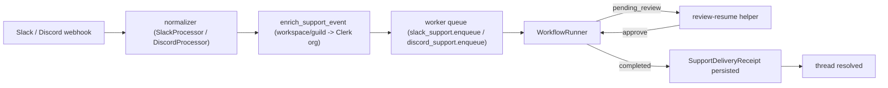

# Support Workflow

> **Status:** Implemented
> **Date:** 2026-08-25
> **Scope:** Processing inbound developer support questions from Slack and Discord — triage, answering, evaluation, delivery, and resolution.

## 1. Overview

The support workflow handles developer questions arriving in Slack and Discord channels. It triages each question, generates an evidence-grounded answer, evaluates the answer for quality, and delivers it back to the originating thread. Questions that signal documentation gaps are routed to the feedback loop for follow-up.

The workflow has three surface-specific entry points (Slack, Discord) that share the same `WorkflowRunner`-based graph, plus a post-delivery resolution step.

## 2. Trigger

- **Slack message event:** `app_mention`, `message` in channels where Draftly is present.
- **Discord message event:** Messages in configured guild channels.
- **Event routing:** The `EventDispatcher` routes to `run_slack_support` or `run_discord_support`.

## 3. Flow

### Step 1: Triage

The `support-triage` skill classifies the incoming question:

| Category | Action |
|----------|--------|
| `bug_report` | Route to answering |
| `usage_question` | Route to answering |
| `doc_gap_signal` | Flag for feedback loop + attempt answer |
| `noise` | Skip (bot messages, Draftly's own replies) |

The triage skill searches for prior similar questions before classifying, and flags non-English questions for language-matched responses.

### Step 2: Answering

The `support-answering` skill:

1. Re-reads the question and thread context.
2. Researches the answer using semantic/keyword search and documentation.
3. Verifies the answer against code and cited evidence.
4. Writes a concise answer with concrete steps, config snippets, or doc links.
5. Cites sources so the developer can verify.

**Guidelines:**
- If docs are wrong, say so and flag the gap.
- Answers should be skimmable: short paragraphs, steps, one code block.
- No citable source → route to uncertainty handling, not general knowledge.

### Step 3: Evaluation

The `support-evaluation` skill scores the draft answer:

| Metric | Criteria |
|--------|----------|
| Correctness | Technically accurate |
| Completeness | Actually answers the question asked |
| Groundedness | Claims backed by cited sources |
| Helpfulness | Steps are actionable and unambiguous |

Borderline scores route to human review rather than auto-failing.

### Step 4: Review Gate

Based on the configured `review_policy`:

- **`always`** — All answers require human approval before delivery.
- **`risky`** — Only high-risk payloads (uncertain confidence, breaking changes) require review.
- **`never`** — Approved answers are delivered automatically.

### Step 5: Delivery

The `support-delivery` skill posts the answer back to the originating thread:

- Replies in-thread (never creates new channels/DMs).
- Checks for existing delivery references to prevent double-posting.
- Records a `DeliveryReceipt` with the message reference.

**Platform-specific delivery:**

| Platform | Method |
|----------|--------|
| Slack | `post_message` with `thread_ts` |
| Discord | `post_message` with `thread_id` |
| GitHub | `create_comment` on the issue/PR |

### Step 6: Resolution

The `resolve_support_thread` function updates the thread status:

- **`DELIVERED`** → Thread marked resolved.
- **`PENDING_REVIEW`** / **`FAILED`** → Thread left open for the feedback loop.

## 4. Operational Contract

Support delivery is a durable, org-scoped pipeline. Each phase is covered by
end-to-end integration tests in `tests/integration/test_slack_support_delivery.py`
and `tests/integration/test_discord_support_delivery.py`.

### 4.1 Ingress normalization

The real `SlackProcessor` / `DiscordProcessor` turn raw webhook payloads into
normalized support events carrying `source`, `source_message_id`, `channel`,
`thread_ts`, and `question`. Duplicate webhook redeliveries map to the same
`event_id` so the runner can claim exactly one run.

### 4.2 Organization enrichment

`enrich_support_event` resolves the workspace/guild identity to the linked
Clerk organization id **before** any workflow runs. A support workflow never
launches with a Slack team id or Discord guild id as its tenant:

| Platform | Identity key | Lookup |
|----------|--------------|--------|
| Slack | `team_id` | `get_org_by_slack_team` |
| Discord | `guild_id` | `get_org_by_discord_guild` |

Unlinked workspaces/guilds raise `SupportIdentityError` and are dropped at the
ingress boundary.

### 4.3 Queue dispatch

Enriched events are dispatched through `enqueue_support_event`:

- **RQ enabled:** enqueued on the `webhooks` queue as
  `slack_support.enqueue` / `discord_support.enqueue`.
- **RQ disabled:** scheduled on the registered in-process task (the same task
  handler a worker would run).

The webhook ack stays fast because the graph never runs synchronously in the
request; it runs on the durable worker path.

### 4.4 Review resume

When the review policy requires a human decision, the run pauses at
`pending_review`. The shared `resume_review_decision` helper restores the
persisted source event, resumes the paused graph with the decision, and only
records the decision once the run reaches the expected status:

- **approve** → must reach `delivered` before the approval is persisted.
- **reject** → must reach `failed` before the rejection is persisted.

A failed approval resume keeps the review actionable and never records an
approval for work that did not reach delivery.

### 4.5 Delivery and receipts

Delivery returns to the originating thread only:

- Slack → `slack_post_message` with `thread_ts`.
- Discord → `discord_post_message` with `thread_id`.
- Documentation-gap outcomes route explicitly to reviewed GitHub delivery.

A `SupportDeliveryReceipt` is persisted only after a successful provider post,
recording `provider_message_id`, `channel_id`, `thread_id`, `source_message_id`,
`org_id`, and `status`. The runner's duplicate suppression short-circuits any
event that already has a persisted receipt, so a redelivered webhook never
posts a second reply. The thread is marked resolved only after the receipt is
durable.

### 4.6 Test fixtures

- `run_fake_slack_question(team, channel, ts, *, review, approve, ...)` guides a
  question through the real normalizer, org enrichment, in-process task handler,
  and review-resume helper, against a fake `SlackClient`.
- `run_fake_discord_question(guild, channel, message_id, *, review, approve, ...)`
  does the same for `DiscordClient`.

Both record every provider post in `fake_slack.sent` / `fake_discord.sent` and
assert org ids, queue task names, thread targets, review transitions, and the
persisted receipt.

## 5. File Reference

### Workflow Implementation

- `src/draftly/workflows/support/slack_support_workflow.py` — Slack entry point
- `src/draftly/workflows/support/discord_support_workflow.py` — Discord entry point
- `src/draftly/workflows/support/support_resolution.py` — Post-delivery resolution
- `src/draftly/workflows/support/__init__.py` — Package exports

### Skills

- `src/draftly/skills/support-triage/SKILL.md` — Question classification
- `src/draftly/skills/support-answering/SKILL.md` — Answer generation
- `src/draftly/skills/support-evaluation/SKILL.md` — Answer quality scoring
- `src/draftly/skills/support-delivery/SKILL.md` — Thread delivery
- `src/draftly/skills/support-feedback-analysis/SKILL.md` — Pattern analysis

### Related

- `src/draftly/support/identity.py` — `enrich_support_event`, `resolve_support_target`
- `src/draftly/app/composition/rq_jobs.py` — `enqueue_support_event`, `support_task_for_event`
- `src/draftly/review/resume.py` — `resume_review_decision`
- `src/draftly/delivery/models.py` — `SupportDeliveryReceipt`
- `tests/integration/test_slack_support_delivery.py` — Slack E2E verification
- `tests/integration/test_discord_support_delivery.py` — Discord E2E verification

### References

- `src/draftly/skills/support-triage/references/support-taxonomy.md`
- `src/draftly/skills/support-triage/references/severity-rules.md`
- `src/draftly/skills/support-triage/references/escalation-rules.md`
- `src/draftly/skills/support-triage/references/confidence-rules.md`
