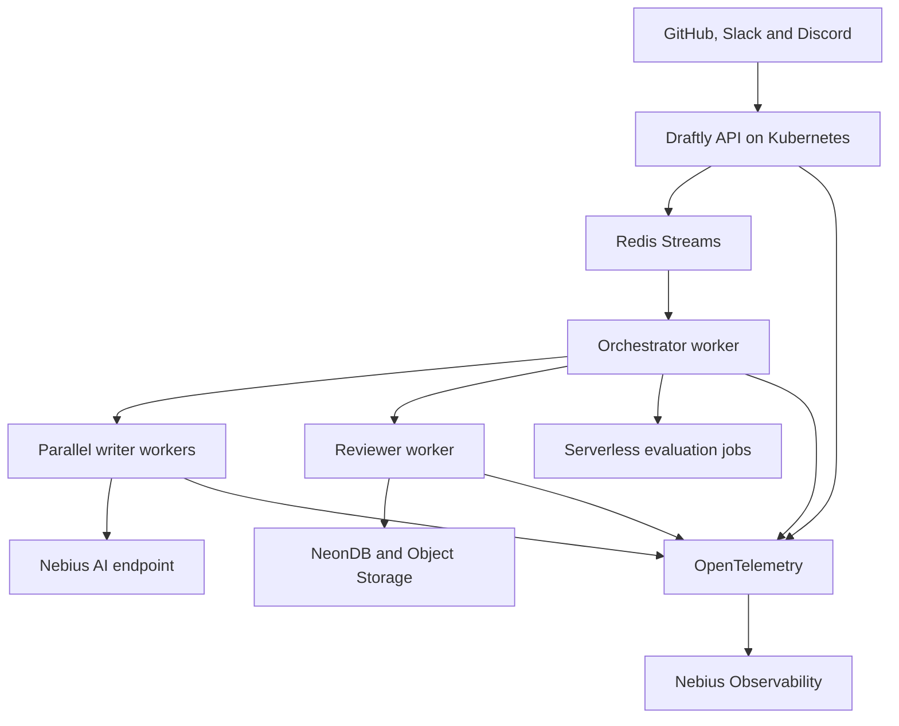
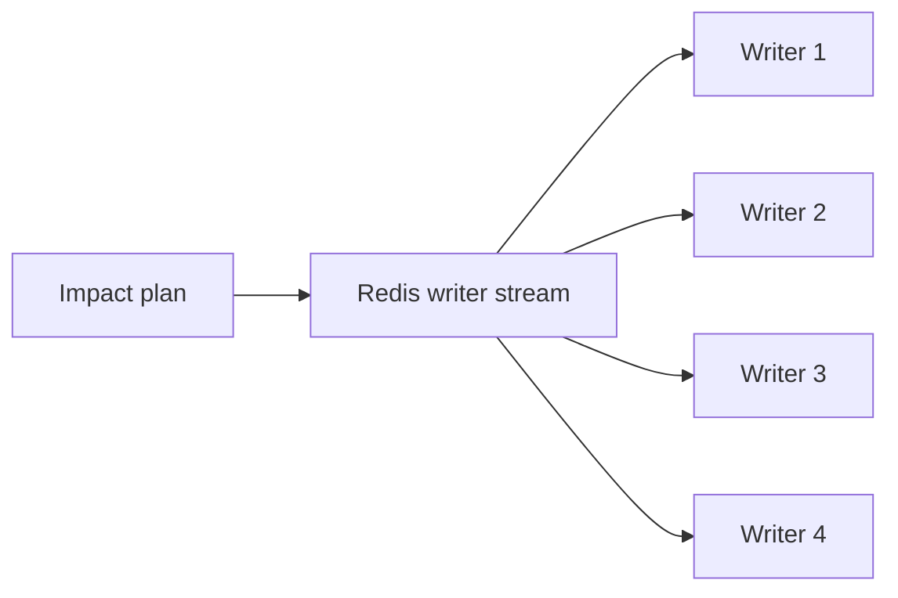
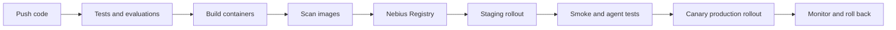

For Draftly, I recommend a hybrid Nebius deployment:

- Nebius Managed Kubernetes for the always-running Draftly platform: API, orchestrator, Redis consumers, parallel writers, reviewer, frontend and SSE.
- Nebius Serverless AI Endpoint for an optional self-hosted LLM or reranker.
- Nebius Serverless AI Jobs for batch evaluations, documentation indexing and scheduled maintenance.
- Nebius Container Registry for all container images.
- Nebius Observability plus OpenTelemetry for logs, metrics and traces.
- NeonDB remains Draftly’s durable application database.

This division fits Nebius’s current services: Serverless AI Jobs execute finite containerized tasks, while Endpoints expose persistent request-serving workloads. Managed Kubernetes provides the scaling and orchestration required by Draftly’s multi-agent, event-driven platform. [Nebius Serverless AI overview](https://docs.nebius.com/serverless/overview)

## 1. Recommended architecture



### Deployment mapping

| Draftly component        | Nebius deployment                    | Reason                                    |
| ------------------------ | ------------------------------------ | ----------------------------------------- |
| Next.js frontend         | Managed Kubernetes                   | Long-running web application              |
| FastAPI API/webhooks     | Managed Kubernetes                   | Low-latency, continuously available       |
| SSE service              | Managed Kubernetes                   | Requires persistent client connections    |
| Workflow orchestrator    | Managed Kubernetes                   | Continuously consumes events              |
| Writer workers           | Managed Kubernetes                   | Scale horizontally for multi-page updates |
| Reviewer workers         | Managed Kubernetes                   | Independent concurrency and scaling       |
| Redis Streams            | Kubernetes or external managed Redis | Queue, durable events and SSE progress    |
| NeonDB                   | External Neon service                | Existing durable state and vector storage |
| Generated artifacts      | Nebius Object Storage                | Durable large-file storage                |
| Self-hosted LLM/reranker | Serverless AI Endpoint               | Managed containerized inference           |
| Strands evaluation runs  | Serverless AI Jobs                   | Finite, resource-intensive batch tasks    |
| Telemetry collector      | Nebius Observability Agent           | Collects logs, metrics and traces         |

## 2. Containerize Draftly

Use at least two images:

1. `draftly-backend`: API, orchestrator, writer, reviewer and evaluator code.
2. `draftly-frontend`: Next.js application.

The backend image can run different components by overriding its command. This prevents duplicating dependencies across five nearly identical images.

### Backend Dockerfile

```dockerfile
FROM python:3.12-slim AS builder

WORKDIR /app

RUN pip install --no-cache-dir uv

COPY pyproject.toml uv.lock ./
RUN uv sync --frozen --no-dev

FROM python:3.12-slim

ENV PYTHONUNBUFFERED=1 \
    PYTHONDONTWRITEBYTECODE=1 \
    PATH="/app/.venv/bin:$PATH"

WORKDIR /app

RUN useradd --create-home --uid 10001 draftly

COPY --from=builder /app/.venv /app/.venv
COPY --chown=draftly:draftly . .

USER draftly

EXPOSE 8000

CMD ["uvicorn", "draftly.api.main:app", \
     "--host", "0.0.0.0", "--port", "8000"]
```

The same image can start different processes:

```yaml
# API
command: ["uvicorn", "draftly.api.main:app", "--host", "0.0.0.0", "--port", "8000"]

# Orchestrator
command: ["python", "-m", "draftly.workers.orchestrator"]

# Writer
command: ["python", "-m", "draftly.workers.writer"]

# Reviewer
command: ["python", "-m", "draftly.workers.reviewer"]

# Evaluation job
command: ["python", "-m", "draftly.evaluations.run"]
```

### Container requirements

Every service should:

- Write structured JSON logs to stdout.
- Expose `/health/live`, `/health/ready` and `/metrics`.
- Shut down gracefully after receiving `SIGTERM`.
- Store no important state on the container filesystem.
- Accept configuration through environment variables.
- Retrieve secrets at runtime.
- Use immutable image tags or image digests.
- Run as a non-root user.
- Set explicit CPU and memory requests and limits.

## 3. Push images to Nebius Container Registry

Nebius Container Registry stores Docker images and integrates with Nebius Managed Kubernetes. Its CLI credential helper lets Docker push images without a separate `docker login`. [Nebius Container Registry quickstart](https://docs.nebius.com/container-registry/quickstart)

Set up the CLI and registry:

```bash
nebius profile create
nebius config set parent-id <project-id>

export DRAFTLY_REGION_ID=eu-north1

export DRAFTLY_REGISTRY_PATH=$(
  nebius registry create \
    --name draftly \
    --format json |
  jq -r '.metadata.id' |
  cut -d- -f 2
)

nebius registry configure-helper
```

Build and push:

```bash
docker build \
  -t cr.$DRAFTLY_REGION_ID.nebius.cloud/$DRAFTLY_REGISTRY_PATH/draftly-backend:1.0.0 \
  -f backend/Dockerfile backend

docker push \
  cr.$DRAFTLY_REGION_ID.nebius.cloud/$DRAFTLY_REGISTRY_PATH/draftly-backend:1.0.0
```

Repeat for the frontend.

When a Kubernetes node group has an appropriate Nebius service account, its Pods can pull same-project registry images without an `imagePullSecret`. [Pulling Nebius registry images from Kubernetes](https://docs.nebius.com/kubernetes/workloads/images-container-registry)

## 4. Deploy the core platform to Managed Kubernetes

Create a CPU node group for the application services. Start with at least two nodes for availability and enable node autoscaling.

Nebius’s cluster autoscaler adds nodes when Pods cannot be scheduled and removes underutilized nodes. [Nebius Kubernetes autoscaling](https://docs.nebius.com/kubernetes/node-groups/autoscaling)

A sensible starting arrangement is:

- General node group: 2–6 CPU nodes
- Optional intensive-worker node group: 0–10 larger CPU nodes
- Optional GPU node group: only if models run inside Kubernetes

Create namespaces:

```bash
kubectl create namespace draftly
kubectl create namespace observability
```

### API Deployment

```yaml
apiVersion: apps/v1
kind: Deployment
metadata:
  name: draftly-api
  namespace: draftly
spec:
  replicas: 2
  selector:
    matchLabels:
      app: draftly-api
  template:
    metadata:
      labels:
        app: draftly-api
    spec:
      containers:
        - name: api
          image: cr.eu-north1.nebius.cloud/REGISTRY_ID/draftly-backend:1.0.0
          command:
            - uvicorn
            - draftly.api.main:app
            - --host
            - "0.0.0.0"
            - --port
            - "8000"
          ports:
            - name: http
              containerPort: 8000
          envFrom:
            - configMapRef:
                name: draftly-config
            - secretRef:
                name: draftly-secrets
          resources:
            requests:
              cpu: 250m
              memory: 512Mi
            limits:
              cpu: "1"
              memory: 1Gi
          readinessProbe:
            httpGet:
              path: /health/ready
              port: http
            periodSeconds: 10
          livenessProbe:
            httpGet:
              path: /health/live
              port: http
            periodSeconds: 20
          startupProbe:
            httpGet:
              path: /health/live
              port: http
            failureThreshold: 30
            periodSeconds: 5
```

Expose the API through a Kubernetes Service and Nebius load balancer. Nebius Managed Kubernetes supports load-balancer-backed Services. [Nebius Kubernetes documentation](https://docs.nebius.com/kubernetes/index)

### Separate worker Deployments

Create different Kubernetes Deployments from the same image:

```text
draftly-orchestrator
draftly-writer
draftly-reviewer
draftly-delivery
draftly-sse
```

Do not run the entire workflow inside the API process. The API should validate the webhook, persist an event and return quickly.

## 5. Scale writer agents correctly

When one pull request affects 11 pages, the orchestrator should create 11 document-level tasks—or several small related batches—in Redis Streams.

```text
documentation.tasks.writer
├── docs/oauth.md
├── docs/pkce.md
├── docs/migration.md
├── docs/api-reference.md
└── ...
```

Each writer container consumes one task at a time:



Use Kubernetes Horizontal Pod Autoscaling for writers:

```yaml
apiVersion: autoscaling/v2
kind: HorizontalPodAutoscaler
metadata:
  name: draftly-writer
  namespace: draftly
spec:
  minReplicas: 2
  maxReplicas: 20
  scaleTargetRef:
    apiVersion: apps/v1
    kind: Deployment
    name: draftly-writer
  metrics:
    - type: Resource
      resource:
        name: cpu
        target:
          type: Utilization
          averageUtilization: 65
```

CPU-based scaling is a starting point. Queue-depth scaling is better for Draftly:

```text
desired writers ≈ ceil(pending document tasks / target tasks per worker)
```

For example, with 40 pending files and a target of two pending tasks per worker, scale toward 20 workers.

Keep two warm writer replicas during demos and normal usage. That prevents Draftly’s first large workflow from waiting for both model and worker startup.

## 6. Use Serverless AI Endpoints for inference

A Nebius Serverless AI Endpoint can run a containerized model or application behind a managed HTTPS URL. It supports token authentication, private-registry images, environment secrets and attached buckets or filesystems. A public IP is not required to use the managed HTTPS endpoint. [Managing Serverless AI Endpoints](https://docs.nebius.com/serverless/endpoints/manage)

Possible Draftly endpoint workloads include:

- Main documentation-writing LLM
- Smaller model for impact classification
- Embedding model
- Reranker
- Documentation-review model

Example:

```bash
nebius ai endpoint create \
  --name draftly-writer-model \
  --image <vllm-or-custom-image> \
  --container-command "python3 -m vllm.entrypoints.openai.api_server" \
  --container-port 8000 \
  --auth token \
  --token-secret draftly-model-auth \
  --subnet-id <subnet-id> \
  --platform <gpu-platform> \
  --preset <gpu-preset> \
  --disk-size 250Gi
```

Nebius reports that endpoint creation takes approximately five minutes. Stopped endpoints do not incur compute charges, but restarting for a live workflow introduces a cold-start delay. Therefore:

- Keep the writer endpoint running during a hackathon demo.
- Use a small always-warm model for routing and impact analysis.
- Send large drafting workloads to a more capable model.
- Add readiness probes at the application level.
- Run a warm-up inference before marking the Draftly model connection ready.

Nebius automatically collects endpoint GPU, CPU and storage metrics, but those usage metrics can take 5–10 minutes to appear. [Monitoring Serverless AI endpoints and jobs](https://docs.nebius.com/serverless/monitoring)

## 7. Use Serverless AI Jobs for batch work

Nebius Serverless AI Jobs are one-off or scheduled container workloads. Their container VM is removed automatically after completion. They can mount Object Storage or shared filesystems and inject secrets from SecretStash. [Managing Serverless AI Jobs](https://docs.nebius.com/serverless/jobs/manage)

Use them for:

- Nightly Strands Eval SDK evaluations
- Large documentation regression suites
- Rebuilding embeddings
- Initial repository indexing
- Analytics aggregation
- Documentation-health scans
- Batch research or migration work

Example evaluation job:

```bash
nebius ai job create \
  --name draftly-documentation-eval \
  --image cr.eu-north1.nebius.cloud/REGISTRY_ID/draftly-backend:1.0.0 \
  --container-command python \
  --args "-m draftly.evaluations.run --dataset documentation" \
  --env DRAFTLY_ENV=production \
  --env-secret NEON_DATABASE_URL=draftly-production \
  --env-secret MODEL_API_KEY=draftly-production \
  --volume "storagebucket-e***:/artifacts:rw" \
  --subnet-id <subnet-id> \
  --platform <platform> \
  --preset <preset> \
  --timeout 2h
```

Write results to NeonDB or Object Storage before the job exits because its local container disk is removed when the job finishes.

## 8. Instrument Draftly with OpenTelemetry

Install the Nebius Observability Agent in the Kubernetes cluster:

```bash
helm install nebius-observability-agent \
  oci://cr.nebius.cloud/observability/public/nebius-observability-agent-helm \
  --version $(curl \
    https://nebius-observability-agent.storage.eu-north1.nebius.cloud/nebius-observability-agent-helm/latest-release) \
  --namespace observability \
  --create-namespace
```

The agent can collect logs, metrics and traces. When tracing is enabled, it exposes an in-cluster OTLP endpoint at:

```text
nebius-observability-agent.observability.svc.cluster.local:4317
```

[Nebius Observability Agent documentation](https://docs.nebius.com/observability/agents/nebius-o11y-agent)

Configure Draftly:

```yaml
env:
  - name: OTEL_SERVICE_NAME
    value: draftly-writer
  - name: OTEL_EXPORTER_OTLP_ENDPOINT
    value: http://nebius-observability-agent.observability.svc.cluster.local:4317
  - name: OTEL_EXPORTER_OTLP_PROTOCOL
    value: grpc
  - name: OTEL_RESOURCE_ATTRIBUTES
    value: deployment.environment=production,service.version=1.0.0
```

### Trace structure

Create one root trace for every Draftly workflow:

```text
workflow run
├── webhook ingestion
├── repository checkout
├── impact analysis
├── evidence retrieval
├── writer dispatch
│   ├── write docs/oauth.md
│   ├── write docs/pkce.md
│   └── write docs/migration.md
├── documentation review
├── evaluation
└── GitHub pull-request delivery
```

Attach these identifiers to every span and log:

```text
workflow.id
run.id
source.type
source.delivery_id
repository
commit_sha
agent.name
document.path
model.provider
model.name
```

Nebius Tracing accepts OpenTelemetry-formatted traces, stores them per project and can visualize them through Grafana. [Nebius Tracing](https://docs.nebius.com/observability/tracing)

Do not store private chain-of-thought. Record structured decisions instead:

```json
{
  "decision": "parallel_writer_dispatch",
  "reason_code": "multiple_independent_documents",
  "affected_documents": 11,
  "writer_tasks": 11,
  "max_concurrency": 4
}
```

## 9. Application metrics

Expose Prometheus metrics from every Draftly service:

```text
draftly_workflows_started_total
draftly_workflows_completed_total
draftly_workflows_failed_total
draftly_workflow_duration_seconds
draftly_queue_pending_tasks
draftly_queue_oldest_task_seconds
draftly_writer_task_duration_seconds
draftly_model_time_to_first_token_seconds
draftly_model_requests_total
draftly_model_tokens_total
draftly_model_cost_usd_total
draftly_tool_calls_total
draftly_tool_failures_total
draftly_evaluation_score
draftly_review_rejection_total
draftly_documents_changed_total
```

Use histograms for latency:

```python
from prometheus_client import Histogram

writer_duration = Histogram(
    "draftly_writer_task_duration_seconds",
    "Duration of one document-writing task",
    ["model", "result"],
)
```

Avoid high-cardinality labels such as `workflow_id`, prompt text, document body or arbitrary repository URLs in Prometheus metrics. Put those values in traces and logs.

Nebius supports application-level Kubernetes metric ingestion through the Nebius Observability Agent or Prometheus Operator. It also supports viewing metrics in Grafana. [Nebius observability options](https://docs.nebius.com/observability/index)

## 10. Structured logging

Log to stdout in JSON:

```json
{
  "timestamp": "2026-09-20T12:00:00Z",
  "level": "INFO",
  "service": "draftly-writer",
  "workflow_id": "wf_123",
  "run_id": "run_456",
  "trace_id": "4f6b...",
  "document_path": "docs/oauth.md",
  "event": "writer_completed",
  "duration_ms": 48231,
  "model": "writer-model-v1"
}
```

Nebius can collect custom Kubernetes logs, query them in its console or LogCLI, export them, and expose them to Grafana through a Loki data source. [Nebius Logs](https://docs.nebius.com/observability/logging)

Redact:

- GitHub installation tokens
- Slack and Discord tokens
- Model API keys
- Database URLs
- Webhook secrets
- Private repository content
- Full prompts containing customer data

## 11. Monitoring and alerting

Use two layers:

### Infrastructure monitoring

Use Nebius dashboards for:

- Node CPU, memory and storage
- Pod restarts
- Endpoint CPU and GPU utilization
- Object Storage usage
- Serverless job state
- Network and disk anomalies

Nebius’s built-in threshold alerts currently document direct alert creation for Compute VMs and Object Storage buckets. [Nebius alerts](https://docs.nebius.com/observability/alerts)

### Draftly application monitoring

Use Prometheus and Alertmanager in Kubernetes for agent-specific conditions:

| Alert                 | Suggested trigger                      |
| --------------------- | -------------------------------------- |
| Workflow failures     | More than 5% over 10 minutes           |
| Stuck workflow        | No state transition for 10 minutes     |
| Writer backlog        | More than 20 files for 5 minutes       |
| Oldest queued task    | Older than 5 minutes                   |
| Model latency         | P95 above 60 seconds                   |
| Time to first token   | P95 above 15 seconds                   |
| Model errors          | More than 3% over 10 minutes           |
| Evaluation regression | Average score below 0.85               |
| Unsupported claims    | More than 5% of evaluated claims       |
| Review rejection      | More than 20% over one hour            |
| Redis consumer lag    | Above an agreed threshold              |
| NeonDB errors         | More than 1% over five minutes         |
| Pod crash loop        | More than three restarts in 15 minutes |
| Cost anomaly          | Hourly token cost over budget          |

Example Prometheus alert:

```yaml
groups:
  - name: draftly
    rules:
      - alert: DraftlyWriterBacklog
        expr: draftly_queue_pending_tasks{queue="writer"} > 20
        for: 5m
        labels:
          severity: warning
        annotations:
          summary: Draftly writer backlog is growing
          description: More than 20 documents have waited for five minutes.
```

## 12. CI/CD deployment flow

Use this production sequence:



Version together:

- Application code
- Strands agent definitions
- Prompts
- Skills
- Tool schemas
- Model-routing policy
- Evaluation datasets
- Database migrations

Use image digests in production:

```yaml
image: cr.eu-north1.nebius.cloud/REGISTRY_ID/draftly-backend@sha256:...
```

For zero-downtime upgrades:

- Use rolling Kubernetes Deployments.
- Require readiness before receiving traffic.
- Set a Pod disruption budget for the API and SSE services.
- Stop workers from accepting new work during termination.
- Finish or release the current Redis task before exiting.
- Keep workflow operations idempotent.
- Store checkpoints in NeonDB after every significant node.

## Recommended rollout order

1. Containerize the backend and frontend.
2. Push both images to Nebius Container Registry.
3. Create Managed Kubernetes with a 2–6-node autoscaling CPU group.
4. Deploy API, frontend, Redis, SSE and one instance of each worker.
5. Configure NeonDB and external integrations.
6. Split writer work into document-level Redis tasks.
7. Add writer HPA and maintain two warm replicas.
8. Deploy the optional model as a Serverless AI Endpoint.
9. Move Strands evaluations to Serverless AI Jobs.
10. Install the Nebius Observability Agent.
11. Add OpenTelemetry spans and Prometheus metrics.
12. Build Grafana dashboards and Alertmanager rules.
13. Run a controlled 1-page, 5-page and 11-page load test.
14. Tune worker concurrency, model capacity and alert thresholds.

The most important design decision is to keep Draftly’s orchestration and writer pool on Managed Kubernetes rather than deploying the entire product as one Serverless AI Endpoint. Kubernetes gives Draftly independent services, parallel workers, warm capacity, Redis-driven execution, SSE support and workload autoscaling; Serverless AI then complements it with managed inference and batch evaluation capacity.
