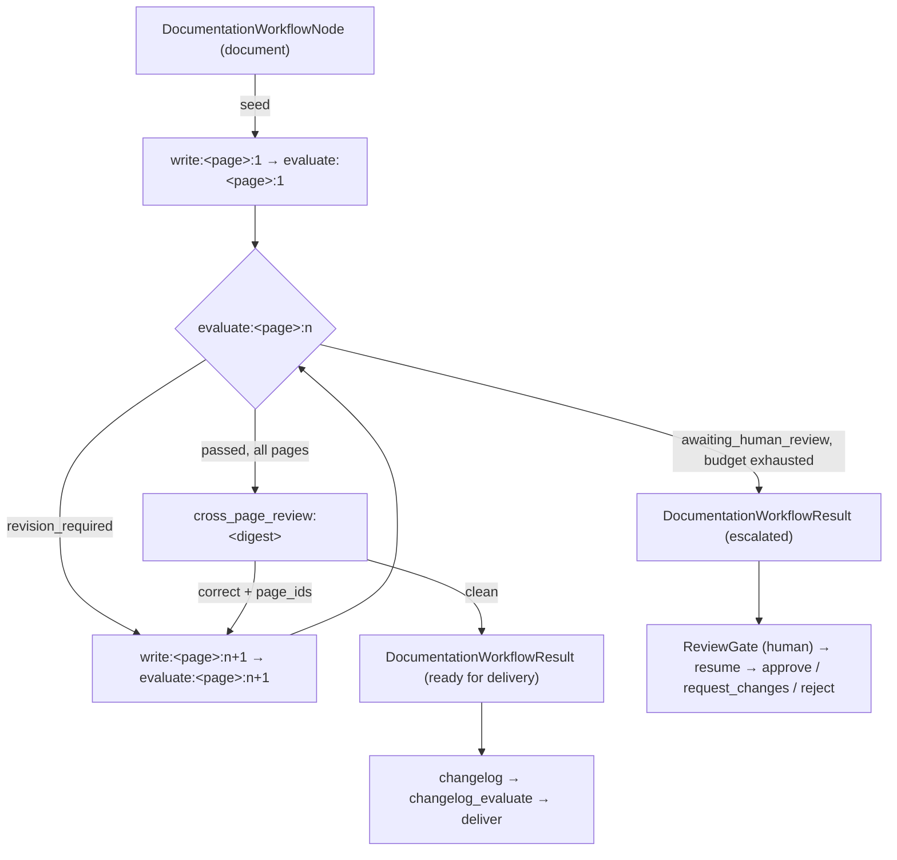

The problem is that treating evaluation as a workflow-level result fails the entire documentation stage because of one page:

```text
11 pages → evaluation → one failure → every page re-dispatched to the writer
```

Draftly replaced that with a durable, page-scoped workflow where evaluation returns one result per page and only the implicated pages are revised:

```text
11 pages → 11 write/evaluate task pairs → filter failed pages → revise only failures
```

## Final topology

Documentation generation is a single `DocumentationWorkflowNode` (the graph node named `document`). The top-level Strands Graph keeps intake, research, impact analysis, changelog, approval, and delivery, but the documentation path contains **no Strands feedback edge**: every write/evaluate/review cycle runs inside the page workflow's own durable DAG.



The node seeds pinned v1 tasks — `task_id` is the page path, one `write` task followed by one `evaluate` task per planned page. The executor then claims and runs them under two concurrency pools (`write_concurrency` and `evaluation_concurrency`), scheduling revision pairs and the cross-page review as the evaluations settle. The node reports a compact `DocumentationWorkflowResult` plus a `sealed_pages` claim naming each accepted artifact identity; full Markdown bodies never cross the graph edge.

Routing conditions read the result, not a fresh agent loop:

- `documentation_passed` routes a fully-passed workflow to the changelog.
- `documentation_delivery_ready` gates delivery on every required page having a signed-off artifact.
- Escalated pages settle with `passed=False, ready_for_review=True` and route to the graph-level human ReviewGate.

## 1. Artifact identity

Every page artifact is immutable and individually addressable. Content lives in `DraftRepository`; the graph only ever carries the identity.

```python
from pydantic import BaseModel, ConfigDict, Field


class DocumentArtifact(BaseModel):
    model_config = ConfigDict(frozen=True)
    page_id: str
    path: str
    artifact_id: str
    version: int = Field(ge=1)
    content_hash: str = Field(pattern=r"^[0-9a-f]{64}$")
    action: str
    status: Literal["sealed"] = "sealed"
    content: str = Field(exclude=True, repr=False)
```

`page_id` is the normalized repository-relative path:

```python
from draftly.orchestration.page_workflow.models import normalize_page_id

assert normalize_page_id("./docs/oauth.md") == "docs/oauth.md"
for path in ("/etc/passwd", "../README.md", "docs/../../secret"):
    with pytest.raises(ValueError):
        normalize_page_id(path)
```

Writes are reserved atomically (`documentation_page_states.next_version`), so two writers can never reserve the same version. `record_artifact` only promotes when the incoming version is strictly newer than the page's `latest_version`; a late write cannot clobber a newer artifact.

## 2. Return granular evaluation results

Evaluation persists one `PageEvaluationResult` per page against the exact `(page_id, artifact_id, version, content_hash)` it graded, and rejects stale results.

```python
class MetricResult(BaseModel):
    name: str
    score: float = Field(ge=0.0, le=1.0)
    threshold: float = Field(ge=0.0, le=1.0)
    passed: bool
    blocking: bool
    reason: str


class PageEvaluationResult(BaseModel):
    page_id: str
    artifact_id: str
    version: int = Field(ge=1)
    content_hash: str = Field(pattern=r"^[0-9a-f]{64}$")
    attempt: int = Field(ge=1)
    status: Literal["passed", "revision_required", "awaiting_human_review"]
    score: float = Field(ge=0.0, le=1.0)
    metrics: list[MetricResult]
    revision_feedback: list[str]
```

The blocking gate is `quality_score >= 0.70`. Citation coverage, topic completeness, and detail remain individually visible metrics. The doc's per-page pipeline concept is real; see the page workflow.

## 3. Selective revision scheduling

A failed evaluation schedules a `RevisionTask`-shaped pair for the **next attempt version** of that page's artifact:

```python
class RevisionTask(BaseModel):
    page_id: str
    path: str
    artifact_id: str
    artifact_version: int = Field(ge=1)
    failed_metrics: list[MetricResult]
    instructions: list[str]
    revision_attempt: int = Field(ge=1)
```

Only the evaluated `PageEvaluationResult`'s `revision_required` decisions create tasks, and each one carries exactly that page's failed metrics, evaluation feedback, its path-scoped evidence, and (on a cross-page correction) the reviewer's instructions. Separate from `revision_attempt`, the durable run tracks the page's persisted `attempt` in `documentation_workflow_tasks` input so re-created handlers and rebuilt graphs agree on how many automatic passes have been consumed.

## 4. Cross-page review placement

The cross-page review is **inside the workflow**, not a Strands feedback edge. It runs as a `cross_page_review` task enqueued only when the last settling evaluation leaves **every** page `passed` (`_schedule_review_if_ready`). Its task id is `cross-page-review:<digest>` where the digest covers the accepted artifact identities for every page, so a stale review cannot replay against newer artifacts.

The reviewer receives deterministic, LLM-free per-page summaries (headings, links, first paragraph, reference count, length) and returns either:

- `clean` → the workflow passes; or
- `correct` with targeted per-page instructions keyed by `task_id` → `RevisionSchedule` pairs are created for **only** the named pages, and each re-enters the selective writing/evaluating loop above.

## 5. Per-page attempt budget

```python
from draftly.orchestration.page_workflow.repository import (
    MAX_AUTOMATIC_EVALUATION_ATTEMPTS,
)
```

`MAX_AUTOMATIC_EVALUATION_ATTEMPTS = 3`. Persist attempts per page, not per workflow:

- Attempt 1 fails → targeted revision
- Attempt 2 fails → targeted revision (with the rubric's feedback appended)
- Attempt 3 fails → `awaiting_human_review`

One problematic page does not restart the passing pages. Infrastructure retries (`retry_or_fail_task`: a handler raising is retried once, then the task fails and the run fails) **do not** increment the quality attempt — only evaluation outcomes do.

## 6. Missing-evidence escalation

A page with no usable path-scoped evidence never passes and never falls back to a batch blob. `PageEvaluatorHandler` filters the task's evidence with `_evidence_has_signals`; when nothing remains, the evaluation is recorded as `awaiting_human_review` immediately with the feedback "No page-scoped evidence is available; human review required". The page pauses at the review gate with its sealed artifact instead of looping on an ungradeable draft.

## 7. Human resume

Escalated pages surface as `ready_for_review=True` and route to the graph-level ReviewGate. `DocumentationWorkflowNode.resume` applies the decision durably:

- `approve` — marks the escalated pages passed; a duplicate approve is a no-op.
- `request_changes` — requires a comment and schedules one human-guided write/evaluate pair per escalated page (the three automatic attempts are untouched); the executor re-runs.
- `reject` — cancels pending tasks and fails the escalated pages.

## 8. Restart behavior

The workflow is durable by construction:

- Tasks, page states, and evaluations live in PostgreSQL (`documentation_page_states`, `documentation_page_evaluations`, `documentation_workflow_tasks`).
- Claims use `FOR UPDATE SKIP LOCKED` plus a lease (`lease_owner` / `lease_expires_at`); a worker that crashes mid-task simply loses its lease.
- `PageWorkflowExecutor.run` calls `reset_expired_leases` before each claim round, so a restarted worker reclaims orphaned tasks and the DAG resumes where it left off.
- Seeding is idempotent (`ON CONFLICT (run_id, page_id) DO NOTHING`, pinned task ids), so re-entering the `document` node after a retry cannot double-publish work.

## 9. Hard cutover

This is a hard replacement, not a feature flag:

- The legacy `document → review → evaluate` Strands loop and its `FanOutWriterNode` / `ReviewNode` nodes were deleted; their reusable helpers moved into `page_workflow/handlers.py`.
- Offline fixtures without a `PageWorkflowRepository` fail fast — there is no shadow drafting path that fabricates unsealed bytes.
- `scripts/check_documentation_cutover.py` exits 0 only when no documentation workflow remains in `queued`, `running`, `pending_review`, or `pending_intervention` (see `docs/documentation-workflow-cutover.md`).

## 10. Why Draftly owns the DAG adapter

Draftly builds and executes the page DAG itself instead of delegating to `strands_tools.workflow` because the requirements are persistence-shaped:

- **Lease-based durability.** Strands' Workflow tool manages task state in memory; Draftly needs tasks to survive worker restarts and be re-claimed by other workers through PostgreSQL leases.
- **Sealed-artifact accounting.** Tasks are versioned writes against a store that enforces `next_version` and stale-artifact rejection. The DAG layer must coordinate with `DraftRepository`, not a generic task runner.
- **Separate concurrency budgets.** Writers and evaluators claim through different semaphores, and distinct provider rate limits make that a first-class scheduling concern.
- **Deterministic gates stay deterministic.** The quality gate is computed by Draftly's own rubric logic (`compute_page_metrics`); the DAG exists to schedule it per page, not to let a general-purpose flow runner reinterpret verdicts.
- **Deadlock detection.** Every pending task must be reachable from a completed dependency; Draftly raises `DeadlockedWorkflowError` when a run can never progress, which is a property the Strands workflow tool does not surface.

In short: the DAG adapter is persistence + scheduling glue around Draftly's own artifact store and evaluation gates, and that glue must be inspectable and testable in-process.

The robust architecture is therefore:

```text
Impact analysis
    → parallel per-page write/evaluate loops (durable DAG, bounded concurrency)
    → selective per-page revision loops (max 3 attempts)
    → cross-page consistency review (only after every page passes)
    → escalate / pass
    → changelog (passed) or human review (escalated)
    → GitHub PR
```

This preserves valid work, reduces model calls and latency, and prevents a single failed page from restarting the complete documentation-generation stage.