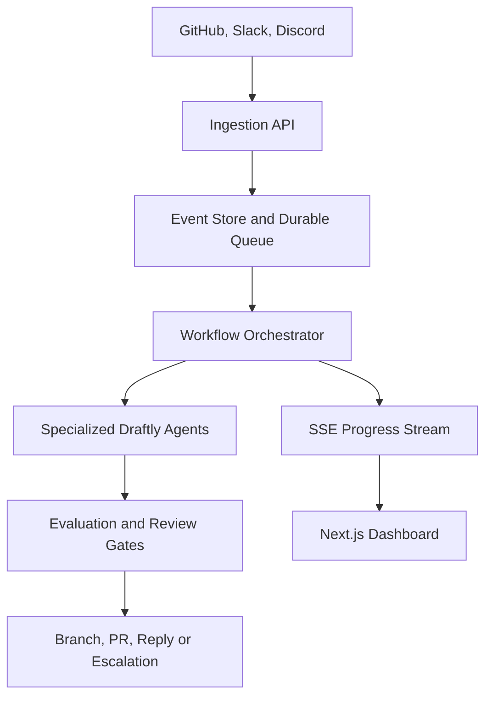
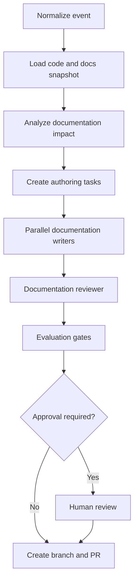

# Making Draftly production-ready

Draftly becomes production-ready when it can safely process real customer repositories, recover from failures without duplicating changes, prove every generated claim, protect tenant data, and show operators exactly what each agent is doing.

The biggest shift is this:

> Draftly should stop behaving like one long AI-agent invocation and become a durable documentation workflow platform in which agents perform bounded, observable tasks.

## 1. Establish the production architecture

Use five clearly separated layers:



### Control plane

The control plane manages:

- Organizations and workspaces
- Users, roles and permissions
- GitHub App installations
- Slack and Discord connections
- Repository configuration
- Documentation policies
- Model and cost limits
- Approval rules
- Audit history

This should be separate from individual agent executions. A failed workflow must not affect authentication, configuration or the dashboard.

### Execution plane

The execution plane handles:

- Webhook processing
- Repository synchronization
- Documentation impact analysis
- Research and context retrieval
- Parallel document generation
- Reviews and evaluations
- GitHub branch and pull-request creation
- Support replies

Run API services and workers independently so they can scale separately.

## 2. Make ingestion fast, secure and idempotent

Webhook endpoints must not run the complete Draftly workflow.

The GitHub webhook path should be:

1. Receive the raw request.
2. Verify its HMAC signature.
3. Validate the installation, event and action.
4. Deduplicate using `X-GitHub-Delivery`.
5. Store the immutable event.
6. enqueue a workflow.
7. Return `202 Accepted`.
8. Process asynchronously.

GitHub recommends using a webhook secret, checking event/action types, responding within ten seconds and using the delivery ID to protect against replayed or duplicate events. [GitHub webhook best practices](https://docs.github.com/en/webhooks/using-webhooks/best-practices-for-using-webhooks), [signature validation](https://docs.github.com/en/webhooks/using-webhooks/validating-webhook-deliveries).

Use an idempotency key such as:

```text
github:{installation_id}:{x_github_delivery}
```

Store a normalized internal event:

```json
{
  "event_id": "evt_123",
  "tenant_id": "tenant_42",
  "source": "github",
  "source_event_id": "delivery-id",
  "event_type": "pull_request",
  "action": "closed",
  "repository_id": "repo_31",
  "commit_sha": "abc123",
  "received_at": "2026-09-20T08:00:00Z",
  "schema_version": 1
}
```

Apply the same pattern to Slack and Discord.

## 3. Build durable workflows instead of long-running requests

Persist the state of every workflow and node in NeonDB:

```text
workflow_runs
workflow_steps
source_events
artifacts
documentation_impacts
review_decisions
evaluation_results
tool_executions
audit_events
```

Each step should have an explicit state:

```text
pending → running → succeeded
                  ↘ retrying
                  ↘ awaiting_approval
                  ↘ failed
                  ↘ cancelled
```

Every step must define:

- Input and output schema
- Timeout
- Retry policy
- Idempotency key
- Maximum attempts
- Required permissions
- Failure classification
- Compensation or recovery action

### Redis Streams

Use Redis Streams as the delivery and coordination layer, but keep NeonDB as the source of truth.

Recommended streams:

```text
draftly:workflow-jobs
draftly:agent-jobs
draftly:workflow-events
draftly:dead-letter
```

Use consumer groups, explicit acknowledgements and pending-message recovery. A worker should acknowledge a job only after its durable result is committed.

Add:

- Exponential backoff with jitter
- Dead-letter queues
- Worker heartbeats
- Job leases
- Stalled-job recovery
- Maximum retry counts
- Graceful worker shutdown
- Per-tenant concurrency limits

Aim for effectively-once side effects rather than pretending the entire distributed workflow can be processed exactly once. Before opening a PR, for example, check whether the workflow has already created one.

## 4. Redesign the agent graph around bounded tasks

Keep the Strands Graph, but make deterministic application code responsible for orchestration.

A production flow could be:



Agents should decide or generate content. Ordinary code should handle:

- Retries
- Scheduling
- State transitions
- Permissions
- Database writes
- Git operations
- Rate limiting
- Approval enforcement

### Fix large documentation jobs

Do not send all affected pages to one writer invocation.

For a PR affecting eleven pages:

1. Impact analysis creates eleven typed authoring tasks.
2. Group closely related pages into small batches of one to three files.
3. Start a bounded pool of writer workers.
4. Give every writer only the relevant diff, APIs and documentation context.
5. Save each result independently.
6. Review individual documents.
7. Perform one final cross-document consistency review.

Use bounded parallelism—perhaps three or four writers initially—not unlimited fan-out. This reduces the 25-minute writer gap while protecting model rate limits and cost.

Also add a warm-up/probe operation when the first model or connector call is expected to suffer a cold start.

## 5. Introduce an evidence-based authoring contract

Every generated change should include structured provenance:

```json
{
  "path": "docs/oauth.md",
  "action": "update",
  "base_commit": "abc123",
  "claims": [
    {
      "text": "PKCE is required for public clients.",
      "sources": [
        {
          "path": "src/authly/oauth.py",
          "lines": "84-113",
          "commit": "abc123"
        }
      ],
      "confidence": 0.96
    }
  ]
}
```

Require the writer to produce:

- Target file and action
- Patch or full content
- Evidence for factual claims
- APIs and symbols referenced
- Assumptions
- Unresolved questions
- Confidence score

The reviewer should reject unsupported claims rather than rewriting them silently.

Do not use semantic search alone. Combine:

- Exact symbol and path search
- Git diff analysis
- AST or language-aware extraction
- Documentation index
- Hybrid keyword/vector retrieval
- Existing style and navigation metadata

Pin all evidence to a commit SHA so a workflow cannot accidentally mix two repository versions.

## 6. Put deterministic quality gates after the agents

Strands Eval SDK should be a release and workflow gate, not merely an analytics feature.

### Per-document gates

Check:

- Required sections
- Referenced symbols exist
- Links resolve
- Code examples parse or execute
- Commands are valid
- Markdown/MDX builds
- No unsupported factual claims
- Terminology and style compliance
- No unexplained deletions

### Workflow-level gates

Check:

- Every detected impact was handled or explicitly dismissed
- Navigation was updated for new pages
- Cross-document references remain consistent
- Breaking changes include migration guidance
- Security changes require human approval
- Final changes still apply cleanly to the latest base branch

Define a policy such as:

```yaml
publishing:
  default: pull_request
  direct_publish: false

quality_gates:
  factual_grounding: 0.90
  completeness: 0.85
  reviewer_pass_required: true
  docs_build_required: true

human_review:
  required_for:
    - security_changes
    - breaking_changes
    - deprecations
    - low_confidence
    - more_than_5_files
```

A model saying “looks correct” is not enough. Build success, symbol verification and source grounding should be deterministic where possible.

## 7. Make human approval a first-class workflow state

The dashboard should allow reviewers to:

- Inspect the source event and code diff
- Compare documentation before and after
- View evidence for every important claim
- See evaluation results
- Edit proposed content
- Approve, reject or request revision
- Re-run only the failed document
- View cost, latency and agent activity

Approval decisions must include:

```text
reviewer
timestamp
workflow version
artifact version
decision
reason
edited content hash
```

After approval, Draftly must verify that the repository base SHA has not changed. If it has, rebase and revalidate before delivery.

Initially, Draftly should publish through pull requests—not direct pushes to default branches.

## 8. Enforce multi-tenant security

Production Draftly will process proprietary code, support conversations and credentials. Security therefore becomes part of the product.

### Required controls

- Tenant ID on every stored record
- Database row-level security or equivalent enforcement
- Least-privilege GitHub App permissions
- Short-lived GitHub installation tokens
- Secrets stored in a secret manager
- Encryption in transit and at rest
- Role-based authorization
- Comprehensive audit logs
- Configurable retention and deletion
- Secret and PII redaction before model calls
- Repository allowlists
- Egress restrictions for execution sandboxes

### Agent-specific protections

Treat repository files, issues and support messages as untrusted input. They can contain prompt-injection instructions.

Agents must not be able to:

- Reveal system prompts or secrets
- Change approval policies
- Access another tenant
- Invoke arbitrary tools
- Push directly without authorization
- Make unrestricted network calls
- Execute repository code on the host worker

Use isolated, ephemeral sandboxes with:

- CPU, memory and execution limits
- Read-only repository mounts where possible
- Restricted network egress
- No platform credentials inside the sandbox
- Automatic destruction after the run

Tool permissions should be defined per agent. A documentation reviewer does not need PR-writing permissions, and a research agent does not need database administration access.

## 9. Add complete observability

Use one correlation chain throughout the system:

```text
tenant_id
source_event_id
workflow_run_id
step_run_id
agent_invocation_id
tool_call_id
artifact_id
```

Emit OpenTelemetry-compatible traces, structured logs and metrics.

### Operational metrics

Track:

- Webhook acceptance and validation failures
- Queue depth and oldest-job age
- Workflow success rate
- Retry and dead-letter rates
- Step latency
- Worker saturation
- Database and Redis errors
- SSE connection health

### AI metrics

Track:

- Time to first model token
- Model and connector cold-start time
- Input/output tokens
- Cost per workflow and document
- Retrieval latency
- Context size
- Tool-call duration
- Unsupported-claim rate
- Reviewer rejection rate
- Human edit distance
- Evaluation score by model and prompt version

Your earlier 14-minute silent gap should become visible as separate spans:

```text
queue_wait
worker_start
model_resolution
connector_initialization
retrieval
time_to_first_token
generation
validation
```

That tells you whether the delay came from capacity, cold starts, model routing or document generation.

## 10. Define service-level objectives

Suggested initial SLOs:

| Capability                       |                     Initial objective |
| -------------------------------- | ------------------------------------: |
| Webhook acknowledgement          |                   p95 under 2 seconds |
| Dashboard API availability       |                                 99.9% |
| Small one-file workflow          |                   p95 under 5 minutes |
| Large ten-file workflow          |                  p95 under 15 minutes |
| Successful workflow completion   | At least 99% excluding invalid inputs |
| Duplicate external side effects  |                                     0 |
| Unauthorized cross-tenant access |                                     0 |
| Workflow progress visibility     |               Update within 5 seconds |
| Recovery point objective         |                  15 minutes or better |
| Recovery time objective          |                      1 hour or better |

Alert on user impact rather than every individual exception.

## 11. Harden NeonDB and Redis

For NeonDB:

- Use pooled connections for API and worker traffic
- Use separate database roles for migrations, API and workers
- Run migrations as a deployment step
- Test point-in-time restoration
- Add query timeouts
- Index tenant IDs, workflow states and source-event identifiers
- Archive large traces or artifacts outside transactional tables
- Verify backups through scheduled restore exercises

For Redis:

- Enable authentication and TLS
- Configure memory limits and eviction carefully
- Monitor stream length and pending entries
- Trim completed event streams according to retention
- Persist important events in Neon before acknowledging them
- Do not treat Redis as the only copy of workflow state

Use the transactional outbox pattern when database changes must result in queue messages.

## 12. Build a real CI/CD pipeline

Every pull request to Draftly should run:

1. Formatting, linting and type checks
2. Unit tests
3. Integration tests with Postgres and Redis
4. Webhook signature and replay tests
5. Workflow recovery tests
6. Prompt-injection and authorization tests
7. Strands Eval SDK regression suite
8. Documentation build tests
9. Container vulnerability scanning
10. Database migration compatibility checks

Deploy immutable container images through:

```text
development → preview → staging → production
```

Production releases should support:

- Rolling or canary deployment
- Automatic health checks
- Previous-image rollback
- Backward-compatible database migrations
- Feature flags
- Prompt and model version pinning
- Separate staging credentials and databases

Never couple a production release to an unversioned prompt or automatically changing model alias.

## 13. Use Nebius according to workload type

A sensible deployment split is:

| Draftly workload         | Recommended runtime            |
| ------------------------ | ------------------------------ |
| FastAPI control API      | Long-running container service |
| Next.js frontend         | Long-running web deployment    |
| Webhook ingestion        | Always-available API service   |
| Workflow workers         | Autoscaled containers          |
| Models                   | Nebius Serverless Endpoints    |
| Full repository indexing | Serverless Jobs                |
| Scheduled evaluations    | Serverless Jobs                |
| Historical reprocessing  | Serverless Jobs                |
| Large backfills          | Serverless Jobs                |

Do not run an entire interactive workflow as one serverless job if users need live progress and approvals. Long-running workers plus persistent state are better for that workflow; jobs fit bounded batch operations.

## 14. Prepare operational procedures

Create runbooks for:

- GitHub webhook outage
- Redis unavailable
- Neon unavailable
- Model provider unavailable
- Stuck workflow
- Duplicate PR creation
- Compromised integration credential
- Incorrect generated documentation
- Tenant deletion request
- Queue backlog
- Failed deployment and rollback

Add administration controls to:

- Pause an organization
- Pause one integration
- Cancel a workflow
- Retry a failed step
- Re-run from a checkpoint
- Disable a model
- Rotate credentials
- inspect dead-lettered work

## 15. Roll out incrementally

### Phase 1: Reliable single-repository beta

Ship:

- GitHub PR and release events
- One documentation format
- Durable workflow state
- Redis worker queue
- Evidence-backed generation
- Human-reviewed PR delivery
- Basic traces and cost reporting

Do not enable automatic publishing.

### Phase 2: Multi-tenant private beta

Add:

- Organization isolation
- RBAC
- Quotas
- Audit logs
- Installation lifecycle handling
- Backup and restore tests
- Parallel per-document generation
- Support for multiple repositories

### Phase 3: Production release

Add:

- Slack and Discord ingestion
- Formal SLOs and alerting
- Dead-letter management
- Data retention controls
- Security review
- Load and chaos testing
- Incident response procedures
- Billing and usage limits

### Phase 4: Controlled automation

Only after collecting enough approval data should Draftly allow low-risk changes to bypass manual review. Start with changes such as typo fixes or deterministic API-reference updates, never security or breaking-change documentation.

## Production readiness checklist

Draftly is ready for real users when all of these are true:

- A worker can crash at any point and the workflow safely resumes.
- Replayed webhooks do not create duplicate runs or PRs.
- Every factual documentation claim has repository evidence.
- Generated code examples are tested.
- Large updates are parallelized and bounded.
- Every model, prompt, tool and artifact is versioned.
- Users can see live progress and actionable failures.
- Human approval cannot be bypassed by an agent.
- Tenant data and credentials are isolated.
- Database restoration has been tested.
- Failed releases can be rolled back.
- Costs and latency are measurable per workflow.
- Evaluation regressions block deployment.
- Operators have runbooks and administrative controls.

The highest-priority production work for Draftly is therefore: durable orchestration, evidence-backed generation, tenant security, evaluation gates and end-to-end observability. More agents and integrations should come only after those foundations are dependable.
