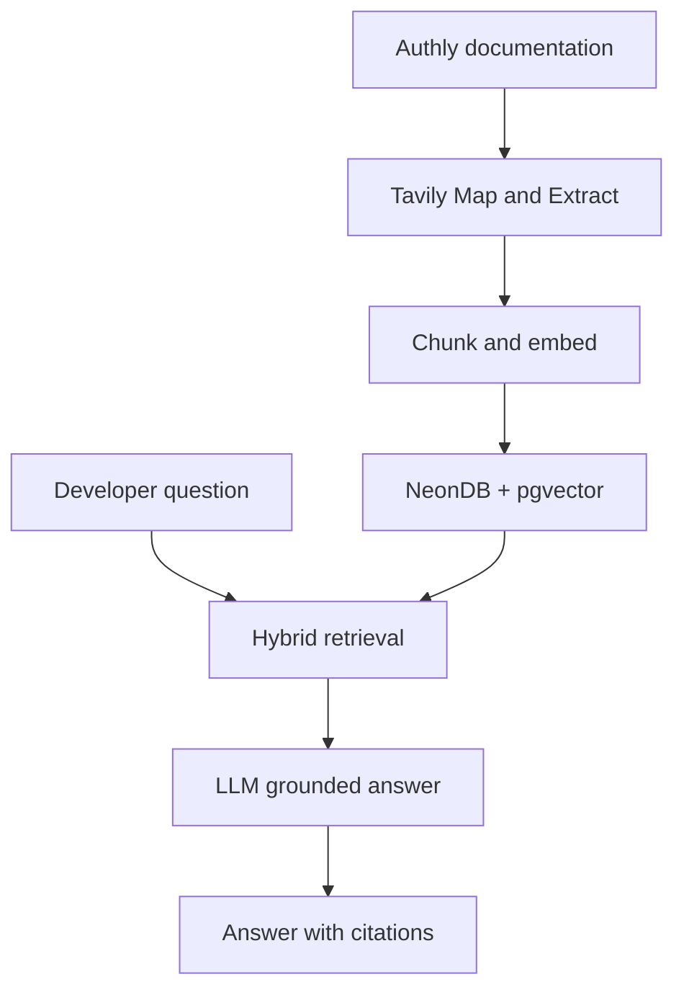
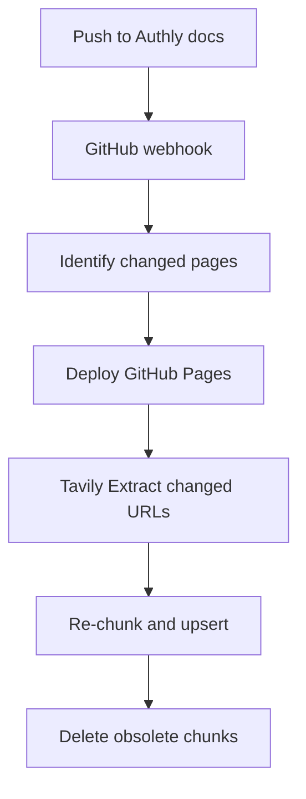

The best design is to use Tavily for discovering and extracting the public [Authly documentation](https://thegreatbonnie.github.io/authly/docs/), while NeonDB with `pgvector` stores the searchable knowledge base.

Tavily should be the ingestion and freshness layer—not the permanent vector database.

## What the Authly RAG system does

A user could ask:

> How do I create and revoke an Authly session?

The system would:

1. Convert the question into an embedding.
2. Retrieve relevant chunks from:

   * `manage-sessions.html`
   * `reference/api.html`
   * Possibly `reference/errors.html`
3. Give those passages to the LLM.
4. Generate an answer based only on those passages.
5. Include links back to the Authly documentation.



## Why use Tavily

The Authly documentation currently includes:

* Getting-started tutorial
* Client configuration
* User authentication
* OAuth authorization URLs
* Session management
* Organizations and members
* Roles and permissions
* Webhook signing
* Error troubleshooting
* SDK, API, data-model and CLI references
* Authorization and security explanations
* FAQ

Tavily provides four relevant capabilities:

| Tavily capability | RAG responsibility                                                         |
| ----------------- | -------------------------------------------------------------------------- |
| Map               | Discover every documentation URL                                           |
| Extract           | Convert individual pages into clean Markdown                               |
| Crawl             | Discover and extract an entire site in one operation                       |
| Search            | Query the live documentation when the local index is stale or insufficient |

Tavily Map returns discovered URLs without extracting every page. Extract can process up to 20 URLs per request and return clean Markdown content. This makes **Map → Extract → vector database** a controllable ingestion pipeline. [Tavily Map documentation](https://docs.tavily.com/documentation/api-reference/endpoint/map), [Tavily Extract documentation](https://docs.tavily.com/documentation/api-reference/endpoint/extract)

## Recommended architecture

Use two retrieval paths.

### Primary path: indexed Authly documentation

This is the normal low-latency path:

```text
Question
   ↓
Query embedding
   ↓
Neon pgvector + Postgres full-text search
   ↓
Rerank top results
   ↓
LLM answer with citations
```

Benefits:

* Fast
* Predictable
* Less expensive
* Version-aware
* Works even if Tavily is temporarily unavailable
* Easy to evaluate

### Fallback path: live Tavily retrieval

Use Tavily at query time when:

* The local index has no sufficiently relevant result.
* The indexed content is old.
* A documentation deployment occurred recently.
* The user explicitly asks for the latest documentation.
* Draftly is investigating a potential documentation gap.

```text
Low retrieval confidence
   ↓
Tavily Search restricted to Authly
   ↓
Filter results to /authly/docs/
   ↓
Tavily Extract relevant URLs
   ↓
Answer and optionally update the index
```

Tavily Search supports domain restriction and returns ranked content snippets, but domain restriction operates at the hostname level. Because Authly shares `thegreatbonnie.github.io` with potential other sites, your application should additionally reject URLs that do not begin with:

```text
https://thegreatbonnie.github.io/authly/docs/
```

[Tavily Search documentation](https://docs.tavily.com/documentation/api-reference/endpoint/search)

---

# 1. Install the dependencies

For a Python implementation:

```bash
uv add tavily-python psycopg[binary] pgvector openai tiktoken
```

The `openai` client can be replaced by whichever embedding and generation provider Draftly uses. If you use a Nebius-hosted OpenAI-compatible endpoint, the overall architecture remains unchanged.

Environment variables:

```env
TAVILY_API_KEY=tvly-...
DATABASE_URL=postgresql://...
EMBEDDING_API_KEY=...
EMBEDDING_BASE_URL=...
GENERATION_API_KEY=...
GENERATION_BASE_URL=...
```

Never expose these variables in the frontend.

# 2. Discover Authly pages with Tavily Map

Map the documentation site while preventing traversal into unrelated GitHub Pages content:

```python
import os

from tavily import TavilyClient

AUTHLY_DOCS_URL = "https://thegreatbonnie.github.io/authly/docs/"
AUTHLY_DOCS_PREFIX = "https://thegreatbonnie.github.io/authly/docs/"

tavily = TavilyClient(api_key=os.environ["TAVILY_API_KEY"])


def discover_authly_urls() -> list[str]:
    response = tavily.map(
        AUTHLY_DOCS_URL,
        max_depth=4,
        max_breadth=50,
        limit=100,
        select_paths=[r"/authly/docs/.*"],
        select_domains=[r"^thegreatbonnie\.github\.io$"],
        allow_external=False,
    )

    return sorted(
        {
            url
            for url in response["results"]
            if url.startswith(AUTHLY_DOCS_PREFIX)
        }
    )
```

Tavily supports regular-expression path and domain filters, so `/authly/docs/.*` prevents the ingestion process from wandering through unrelated paths. [Tavily Map filters](https://docs.tavily.com/documentation/api-reference/endpoint/map)

Do not include natural-language `instructions` unless you need semantic URL selection. For this small, structured site, deterministic path filtering is cheaper and safer.

# 3. Extract each page

Use Tavily Extract in batches of up to 20 URLs:

```python
from collections.abc import Iterable


def batched(values: list[str], size: int = 20) -> Iterable[list[str]]:
    for offset in range(0, len(values), size):
        yield values[offset : offset + size]


def extract_authly_pages(urls: list[str]) -> list[dict]:
    pages: list[dict] = []

    for batch in batched(urls):
        response = tavily.extract(
            batch,
            extract_depth="advanced",
            format="markdown",
            include_images=False,
        )

        for result in response.get("results", []):
            pages.append(
                {
                    "url": result["url"],
                    "content": result["raw_content"],
                }
            )

        for failure in response.get("failed_results", []):
            print(
                "Extraction failed:",
                failure["url"],
                failure["error"],
            )

    return pages
```

Always inspect both `results` and `failed_results`. Tavily documents that an HTTP 200 response can still contain per-URL extraction failures. Advanced extraction is useful for API tables and structured reference content, though it can cost more and take longer. [Tavily Extract API](https://docs.tavily.com/documentation/api-reference/endpoint/extract)

For Authly, you could start with `basic` extraction and use `advanced` only for reference pages:

```python
depth = "advanced" if "/reference/" in url else "basic"
```

# 4. Normalize and chunk the pages

Do not split documentation at arbitrary character positions when you can preserve headings and code blocks.

Each stored chunk should contain:

```python
{
    "product": "authly",
    "version": "0.1.0",
    "url": "...",
    "page_type": "how-to",
    "title": "Manage sessions",
    "section": "Revoke a session",
    "content": "...",
    "content_hash": "...",
}
```

A basic chunker:

```python
import hashlib
import re


def classify_page(url: str) -> str:
    if "/tutorials/" in url:
        return "tutorial"
    if "/how-to/" in url:
        return "how-to"
    if "/reference/" in url:
        return "reference"
    if "/explanation/" in url:
        return "explanation"
    return "index"


def split_markdown(
    markdown: str,
    max_characters: int = 2_500,
) -> list[dict]:
    sections = re.split(r"(?=^#{1,3}\s)", markdown, flags=re.MULTILINE)
    chunks: list[dict] = []

    for section in sections:
        section = section.strip()
        if not section:
            continue

        heading_match = re.match(r"^#{1,3}\s+(.+)", section)
        heading = heading_match.group(1).strip() if heading_match else "Overview"

        for start in range(0, len(section), max_characters):
            content = section[start : start + max_characters]

            chunks.append(
                {
                    "section": heading,
                    "content": content,
                    "content_hash": hashlib.sha256(
                        content.encode("utf-8")
                    ).hexdigest(),
                }
            )

    return chunks
```

For production, use token-based chunks of approximately:

* 400–700 tokens per chunk
* 50–100 tokens of overlap
* Heading path added to every chunk
* Code examples kept intact whenever possible

Reference documentation may benefit from smaller chunks because developers often search for exact method names, parameters and exceptions.

# 5. Store the chunks in NeonDB

Enable `pgvector`:

```sql
CREATE EXTENSION IF NOT EXISTS vector;
```

Create the table:

```sql
CREATE TABLE documentation_chunks (
    id UUID PRIMARY KEY DEFAULT gen_random_uuid(),
    product TEXT NOT NULL,
    version TEXT NOT NULL,
    url TEXT NOT NULL,
    page_type TEXT NOT NULL,
    title TEXT,
    section TEXT,
    content TEXT NOT NULL,
    content_hash TEXT NOT NULL,
    embedding VECTOR(1536) NOT NULL,
    search_vector TSVECTOR GENERATED ALWAYS AS (
        to_tsvector(
            'english',
            coalesce(title, '') || ' ' ||
            coalesce(section, '') || ' ' ||
            content
        )
    ) STORED,
    indexed_at TIMESTAMPTZ NOT NULL DEFAULT now(),

    UNIQUE (product, version, url, content_hash)
);
```

The vector dimension must match the embedding model you select. `1536` is only an example.

Create vector and full-text indexes:

```sql
CREATE INDEX documentation_chunks_embedding_idx
ON documentation_chunks
USING hnsw (embedding vector_cosine_ops);

CREATE INDEX documentation_chunks_search_idx
ON documentation_chunks
USING gin (search_vector);

CREATE INDEX documentation_chunks_product_version_idx
ON documentation_chunks (product, version);
```

## Why use hybrid retrieval

Vector search understands semantic similarity:

```text
"How do I invalidate login state?"
```

can match:

```text
"Revoke a session"
```

Full-text search is better for exact developer terms:

```text
AuthlyClient
OAuthError
create_session
verify_webhook
```

Combining both is more reliable than vector search alone.

# 6. Create embeddings

Keep the embedding interface provider-independent:

```python
from openai import OpenAI

embedding_client = OpenAI(
    api_key=os.environ["EMBEDDING_API_KEY"],
    base_url=os.environ.get("EMBEDDING_BASE_URL"),
)

EMBEDDING_MODEL = os.environ["EMBEDDING_MODEL"]


def embed_text(text: str) -> list[float]:
    response = embedding_client.embeddings.create(
        model=EMBEDDING_MODEL,
        input=text,
    )
    return response.data[0].embedding
```

Embed a chunk using its semantic metadata:

```python
embedding_input = f"""
Product: Authly
Version: 0.1.0
Document type: {page_type}
Title: {title}
Section: {section}

{content}
""".strip()
```

Including the product, version, page type and heading improves retrieval precision.

# 7. Retrieve relevant Authly chunks

A simplified vector query:

```sql
SELECT
    id,
    url,
    title,
    section,
    content,
    1 - (embedding <=> %(query_embedding)s::vector) AS similarity
FROM documentation_chunks
WHERE product = 'authly'
  AND version = '0.1.0'
ORDER BY embedding <=> %(query_embedding)s::vector
LIMIT 8;
```

In production, combine:

* Vector similarity
* PostgreSQL full-text rank
* Page-type priority
* Version compatibility
* Exact identifier matches

For example:

```text
final_score =
    0.60 × vector_similarity
  + 0.25 × full_text_score
  + 0.10 × exact_identifier_match
  + 0.05 × page_type_priority
```

For questions about function signatures, prioritize `reference` pages. For “how do I…” questions, prioritize `how-to` pages. For conceptual questions, prioritize `explanation` pages.

# 8. Add Tavily live retrieval

If the best local score is below a threshold, run a restricted Tavily search:

```python
AUTHLY_HOST = "thegreatbonnie.github.io"


def live_authly_search(question: str) -> list[dict]:
    response = tavily.search(
        query=f"Authly documentation: {question}",
        search_depth="advanced",
        max_results=8,
        chunks_per_source=3,
        include_domains=[AUTHLY_HOST],
        include_domains_mode="restrict",
        include_answer=False,
        include_raw_content=False,
    )

    return [
        result
        for result in response.get("results", [])
        if result["url"].startswith(AUTHLY_DOCS_PREFIX)
    ]
```

Tavily’s `basic`, `fast` and `advanced` search modes can return multiple relevant snippets per source. Use `advanced` only for harder or low-confidence questions; `basic` or `fast` should be sufficient for most Authly support questions. [Tavily Search modes](https://docs.tavily.com/documentation/api-reference/endpoint/search)

A suitable routing policy is:

```python
if local_results.best_score >= 0.78:
    use_local_results()
elif local_results.best_score >= 0.60:
    combine_local_with_tavily()
else:
    use_tavily_or_abstain()
```

The exact thresholds should be calibrated with evaluation data rather than assumed permanently.

# 9. Generate a grounded answer

Build a context block with stable citation numbers:

```python
def build_context(results: list[dict]) -> str:
    blocks = []

    for number, result in enumerate(results, start=1):
        blocks.append(
            f"""
SOURCE [{number}]
Title: {result.get("title", "Authly documentation")}
Section: {result.get("section", "Overview")}
URL: {result["url"]}

{result["content"]}
""".strip()
        )

    return "\n\n".join(blocks)
```

Use a strict generation prompt:

```text
You are the Authly developer-support assistant.

Answer the question using only the supplied Authly documentation.

Rules:
1. Do not invent methods, parameters, defaults or security guarantees.
2. Cite factual claims using [1], [2], and so on.
3. Prefer API reference pages for signatures and parameter details.
4. Prefer how-to pages for implementation steps.
5. If the documentation does not answer the question, say so explicitly.
6. Remember that Authly is a fictional benchmark SDK, not a production
   identity platform.
7. End with a Sources section containing the URLs used.
```

This last constraint is important because the Authly homepage explicitly describes the project as a simplified fictional authentication platform.

# 10. Keep the index synchronized

Because the source is a GitHub repository, the best freshness workflow is event-driven:



Recommended triggers:

* GitHub push modifying `docs/**`
* Pull request merged into the default branch
* Release published
* Manual “Sync documentation” action in Draftly
* Scheduled reconciliation once per day

Use content hashes to avoid embedding unchanged pages:

```text
new hash equals stored hash → skip
new hash differs            → replace chunks
page no longer exists       → delete its chunks
```

Since GitHub Pages deployment may finish shortly after the GitHub push, retry extraction with exponential backoff rather than immediately assuming the new page is available.

## A simpler MVP

For a hackathon demonstration, you can avoid NeonDB initially:

```text
Question
   ↓
Tavily Search restricted to the Authly host
   ↓
Filter to /authly/docs/
   ↓
Tavily Extract the top pages
   ↓
LLM answer with citations
```

This is a zero-index RAG system. It is fast to build but has disadvantages:

* A search engine may not index a newly published page immediately.
* Every question creates Tavily API usage.
* Latency is higher.
* Retrieval is less deterministic.
* Version filtering is difficult.
* You cannot easily compare retrieval quality over time.

Therefore:

| Stage              | Recommended design                                 |
| ------------------ | -------------------------------------------------- |
| Quick prototype    | Tavily Search + Extract at query time              |
| Hackathon demo     | Tavily Crawl/Extract + in-memory vector index      |
| Draftly production | Tavily Map/Extract + Neon pgvector + live fallback |

## How this fits Draftly

This Authly RAG system can power several Draftly workflows:

* **Developer support:** Answer Authly questions from existing documentation.
* **Gap detection:** Low-confidence retrieval indicates missing documentation.
* **Documentation drafting:** Retrieve related guides and references before authoring a change.
* **Review:** Compare a generated answer or document against existing official content.
* **Change impact:** Determine which existing pages discuss a modified SDK feature.
* **Freshness checks:** Recrawl deployed docs after a pull request or release.
* **Citation verification:** Ensure support answers reference genuine Authly pages.

A particularly compelling demonstration would be:

1. Ask Draftly how to perform an Authly operation.
2. Show the retrieved documentation chunks and grounded answer.
3. Ask a question the documentation cannot answer.
4. Show Draftly abstaining and creating a documentation-gap signal.
5. Add the missing guide through a GitHub pull request.
6. Resynchronize with Tavily.
7. Ask the same question and show Draftly now answering it with a citation.

That demonstrates that RAG is not merely a chatbot feature—it becomes the retrieval foundation for Draftly’s documentation feedback loop.
