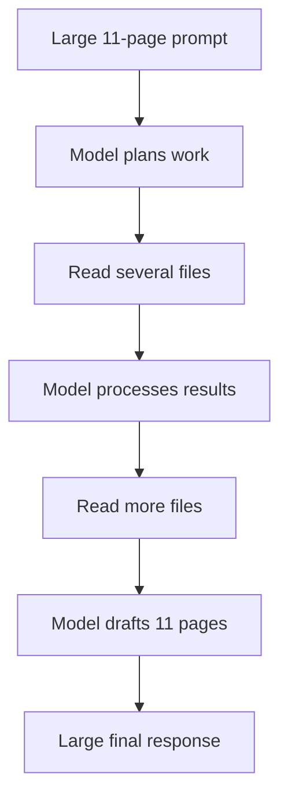
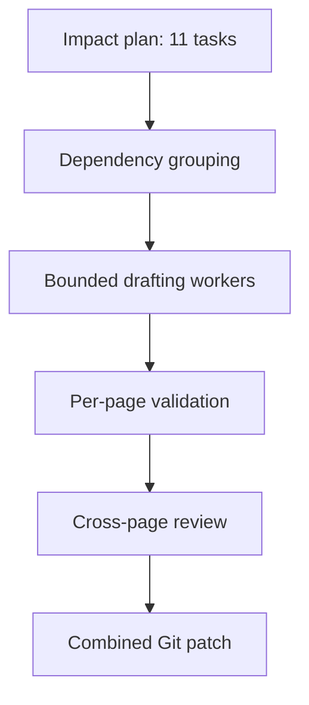

“Do not give all 11 pages to one writer invocation” means Draftly should not ask one writer-agent run to update all ten existing pages and create the new page in a single prompt and conversation.

Instead, impact analysis should turn the documentation work into smaller, independently executable writing tasks.

## The problematic approach

Draftly may currently send the writer something like:

```text
This PR affects the following documentation:

1. docs/oauth.md
2. docs/pkce.md
3. docs/api/tokens.md
4. docs/api/client.md
5. docs/security.md
6. docs/migration.md
7. docs/quickstart.md
8. docs/configuration.md
9. docs/troubleshooting.md
10. docs/sdk/python.md
11. Create docs/token-rotation.md

Analyze all relevant source code and update every page.
```

That is one large invocation:

```python
result = await writer_agent(large_eleven_page_prompt)
```

The writer must then:

1. Understand all eleven page requirements.
2. Retrieve evidence for every page.
3. Read all existing pages.
4. Preserve eleven sets of instructions in context.
5. Generate eleven potentially large outputs.
6. Keep earlier drafts in its message history while producing later ones.
7. Validate cross-page consistency.
8. Return one enormous result.

This creates a large input, large output, many tool calls, and a long-running request with a large failure surface.

## What “one invocation” means

An invocation is one top-level execution of an agent:

```python
result = await writer("Update these documentation pages...")
```

During that invocation, the agent may perform multiple model calls:



So “one invocation” does not necessarily mean one LLM request. One invocation can cause dozens of model and tool calls while retaining an increasingly large conversation.

That accumulated conversation is one of the main problems.

## Why one large invocation becomes slow

### 1. The context grows continuously

Suppose each documentation page requires:

- 2,000 tokens of existing content
- 2,000 tokens of source-code evidence
- 500 tokens of diff and impact explanation
- 1,500 tokens of generated documentation

Across eleven pages, the writer might encounter around:

$$
11 \times (2{,}000 + 2{,}000 + 500 + 1{,}500)
= 66{,}000 \text{ tokens}
$$

There may also be:

- System instructions
- Tool definitions
- Skills
- Repository metadata
- Earlier model reasoning
- Tool-call results
- Review feedback

Each subsequent model call may need to process much of the accumulated history again. Therefore, the cost and latency can grow faster than the number of pages.

### 2. Unrelated evidence competes for attention

The OAuth overview might require evidence from:

```text
src/authly/oauth.py
tests/test_oauth.py
```

The configuration page might require:

```text
src/authly/config.py
src/authly/environment.py
```

The troubleshooting page might require:

```text
src/authly/errors.py
tests/test_errors.py
```

Putting all of this into one context makes it easier for the writer to:

- Use evidence from the wrong feature
- Put information on the wrong page
- Repeat the same explanation
- Contradict an earlier draft
- Miss one of the required updates
- Invent connections between unrelated changes

### 3. Work becomes sequential

A single agent normally works through its task as a sequence:

```text
Read page 1 → draft page 1 → read page 2 → draft page 2 → …
```

Even if several pages are independent, they wait for one another.

If one page takes two minutes, eleven pages can approach 22 minutes, excluding endpoint initialization and review.

### 4. One failure can invalidate everything

If the single invocation:

- Times out
- Exceeds the model context limit
- Hits a rate limit
- Produces invalid structured output
- Loses a connector
- Fails while drafting page ten

Draftly may need to retry the entire eleven-page job.

That means paying again for work that already succeeded.

### 5. Progress is difficult to expose

With one invocation, the frontend may only know:

```text
Writer started
Writer completed
```

With separate tasks, Draftly can report:

```text
1 of 11 pages completed
2 of 11 pages completed
3 of 11 pages completed
```

It can also show exactly which page failed.

# The better approach: one documentation task per page

Impact analysis should return a structured plan rather than a prose list:

```json
{
  "tasks": [
    {
      "id": "update-oauth-overview",
      "path": "docs/oauth.md",
      "action": "update",
      "reason": "PR adds PKCE S256 validation",
      "related_symbols": [
        "OAuthClient.create_authorization_url",
        "validate_code_challenge"
      ],
      "evidence": [
        {
          "path": "src/authly/oauth.py",
          "start_line": 118,
          "end_line": 174
        },
        {
          "path": "tests/test_oauth.py",
          "start_line": 91,
          "end_line": 139
        }
      ],
      "requirements": [
        "State that only S256 is supported",
        "Update the authorization example",
        "Do not document the plain challenge method"
      ]
    },
    {
      "id": "create-token-rotation-guide",
      "path": "docs/guides/token-rotation.md",
      "action": "create",
      "reason": "PR introduces automatic token rotation",
      "related_symbols": ["TokenManager.rotate"],
      "evidence": [
        {
          "path": "src/authly/tokens.py",
          "start_line": 210,
          "end_line": 296
        }
      ],
      "requirements": [
        "Add prerequisites",
        "Provide a Python example",
        "Explain rotation failures"
      ]
    }
  ]
}
```

Draftly then invokes a writer separately for each task:

```python
oauth_result = await oauth_writer(oauth_task_prompt)
token_result = await token_writer(token_task_prompt)
```

Each writer sees only what it needs.

## The resulting workflow



The final output is still one coherent documentation change, but the work that produces it is divided into manageable units.

# Do not create eleven completely uncontrolled agents

Splitting the work does not mean launching eleven simultaneous agents without limits.

That could cause:

- Provider rate limiting
- Excessive token usage
- Connector exhaustion
- Git workspace conflicts
- Multiple agents editing navigation simultaneously
- More cold starts
- Database connection pressure

Use bounded concurrency instead.

For example, allow three writing jobs at once:

```python
import asyncio

writer_slots = asyncio.Semaphore(3)


async def execute_documentation_task(task):
    async with writer_slots:
        writer = create_isolated_writer(task)
        return await writer(render_writer_prompt(task))


results = await asyncio.gather(
    *[
        execute_documentation_task(task)
        for task in documentation_tasks
    ],
    return_exceptions=True,
)
```

For eleven pages, this produces approximately four waves:

```text
Wave 1: pages 1, 2, 3
Wave 2: pages 4, 5, 6
Wave 3: pages 7, 8, 9
Wave 4: pages 10, 11
```

If an average page takes two minutes, bounded concurrency can reduce approximately 22 minutes of sequential writing to roughly eight minutes, subject to provider capacity and page complexity.

# Use isolated writer contexts

Each task needs an isolated agent conversation.

Do not do this concurrently:

```python
shared_writer = Agent(...)

await asyncio.gather(
    shared_writer(task_1),
    shared_writer(task_2),
    shared_writer(task_3),
)
```

The shared agent may have mutable:

- Message history
- Agent state
- Activated skills
- Tool state
- Retry state
- Context-offloading references

Concurrent requests could contaminate one another.

Instead, share immutable infrastructure while isolating agent state:

```python
class WriterFactory:
    def __init__(self, model, tool_factory, plugin_factory):
        self.model = model
        self.tool_factory = tool_factory
        self.plugin_factory = plugin_factory

    def create(self, task):
        return Agent(
            model=self.model,
            system_prompt=build_writer_prompt(task),
            tools=self.tool_factory.create_for(task),
            plugins=self.plugin_factory.create_for(task),
        )
```

This gives every page:

- The same already-resolved model client
- The same documentation standards
- Its own message history
- Its own evidence scope
- Its own validation result

The model connection can be shared or pooled; the agent conversation should not be.

# Not every page must be a separate job

Some pages are tightly connected. Draftly should consider dependencies when building tasks.

For example:

```text
docs/oauth.md
docs/pkce.md
docs/guides/oauth-migration.md
```

These pages may share terminology, examples, and navigation. Updating them independently could produce inconsistencies.

Draftly can group them into a small bundle:

```json
{
  "bundle_id": "oauth-documentation",
  "pages": ["docs/oauth.md", "docs/pkce.md", "docs/guides/oauth-migration.md"],
  "shared_evidence": ["src/authly/oauth.py", "tests/test_oauth.py"]
}
```

A practical grouping rule is:

| Relationship                               | Execution strategy                                  |
| ------------------------------------------ | --------------------------------------------------- |
| Independent page                           | Separate writer job                                 |
| Same API and shared examples               | Bundle two or three pages                           |
| Page depends on another page’s terminology | Put them in the same bundle or execute sequentially |
| Navigation/index page                      | Update after content pages                          |
| Release notes                              | Generate after all page changes are known           |

For your eleven-page example, impact analysis might produce:

```text
Bundle A: OAuth overview + PKCE guide
Bundle B: Token reference + token rotation guide
Task C: Security page
Task D: Quickstart
Task E: Python SDK page
Task F: Configuration page
Task G: Troubleshooting page
Task H: Migration page
Final task: Navigation/index updates
```

This could become eight writer jobs rather than eleven, with the final navigation task dependent on the other seven.

# Prevent concurrent file-edit conflicts

The writer workers should not directly edit the same shared repository checkout concurrently.

Safer options include:

### Option 1: Return structured patches

Each writer returns:

```json
{
  "path": "docs/oauth.md",
  "operation": "update",
  "content": "...",
  "evidence_refs": ["..."],
  "validation": {
    "passed": true
  }
}
```

A deterministic delivery stage applies the results after all jobs finish.

This is the best default for Draftly.

### Option 2: Give each worker a separate workspace

Each worker uses:

- Its own temporary directory
- Its own Git worktree
- Its own E2B sandbox

The delivery stage then collects or cherry-picks changes.

This is more appropriate if writers must run formatting, documentation builds, or code examples.

### Option 3: Assign non-overlapping files

Workers can edit a shared workspace only if Draftly guarantees that no two tasks touch the same file. Even then, shared navigation and generated indexes can create hidden conflicts.

Returning patches is usually simpler and safer.

# Add per-page validation

Each writing job should validate its own output before being marked complete:

```python
async def execute_documentation_task(task):
    draft = await run_writer(task)

    validation = await validate_page(
        task=task,
        draft=draft,
    )

    return DocumentationResult(
        task_id=task.id,
        path=task.path,
        content=draft,
        validation=validation,
    )
```

Per-page checks should include:

- The target file was produced.
- Required concepts are present.
- Unsupported claims are absent.
- Code symbols exist.
- Code fences and frontmatter are valid.
- Links added by the draft have valid targets.
- The output follows the requested action.
- Evidence references are recorded.

Only a failed page needs to be retried.

If page 7 fails, Draftly retries page 7—not pages 1 through 11.

# Perform one global review afterward

Independent writers optimize speed, but Draftly still needs coherence across the documentation set.

The final reviewer should receive compact summaries of the changes:

```json
[
  {
    "path": "docs/oauth.md",
    "change_summary": "Documented S256-only PKCE validation",
    "terms_introduced": ["code verifier", "code challenge"],
    "links_added": ["docs/pkce.md"]
  },
  {
    "path": "docs/pkce.md",
    "change_summary": "Updated Python PKCE example",
    "terms_introduced": ["S256"],
    "links_added": ["docs/oauth.md"]
  }
]
```

The global reviewer checks:

- Terminology consistency
- Contradictions
- Duplicate explanations
- Cross-page links
- Navigation
- Version references
- Code-example consistency
- Whether all impact-plan tasks were completed

It should not redraft all eleven pages from scratch. It should identify targeted corrections that can be sent back to the relevant page writer.

# Recommended Draftly execution model

For your case, the workflow should be:

1. Impact analysis identifies ten updates and one creation.
2. A planner converts them into page-level tasks.
3. Dependency analysis groups closely related pages.
4. A warmup task starts immediately.
5. Draftly builds a small evidence packet for every task.
6. Three isolated writers run concurrently.
7. Each result is validated independently.
8. Failed tasks are retried independently.
9. A reviewer checks cross-page consistency.
10. A delivery stage safely applies all patches.
11. The documentation build runs once against the combined result.
12. Draftly opens one documentation PR or updates the existing PR.

The guiding principle is:

> Treat the eleven-page result as one documentation change set, but treat each page or related page bundle as a separate unit of execution.

That preserves a coherent final PR while avoiding one enormous, slow, fragile writer invocation.

## Status

Implemented as of 2026-09-20 per `docs/superpowers/specs/2026-09-20-writer-fanout-design.md`.
The graph now runs `impact → document (fan-out) → review → evaluate → changelog → deliver`;
writer execution is one isolated Agent per task under bounded concurrency with per-task
retry, and progress streams via `task_progress` envelopes.
